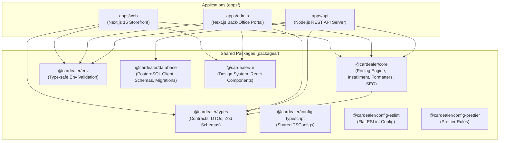

# 🚗 CarDealer Monorepo Architecture

> **Enterprise-Grade Fullstack Monorepo Boilerplate for Automotive Dealerships**  
> Powered by **Turborepo v2**, **pnpm v10**, **Node.js v24**, **Next.js 15+ App Router**, and **TypeScript 5.8**.

---

## 📐 Kiến Trúc Tổng Thể (System Architecture)



---

## 🛠️ Ma Trận Công Nghệ (Tech Stack Matrix)

| Tầng / Thành phần | Công nghệ sử dụng | Phiên bản | Mục đích & Trách nhiệm |
| :--- | :--- | :--- | :--- |
| **Monorepo Engine** | [Turborepo](https://turbo.build/) | `v2.4+` | Pipeline điều phối build song song & Caching thông minh |
| **Package Manager** | [pnpm](https://pnpm.io/) | `v10.5+` | Symlink isolated dependency, cài đặt nhanh, tiết kiệm đĩa |
| **Runtime Environment** | [Node.js](https://nodejs.org/) | `v24.21+` | Môi trường runtime LTS hiện đại nhất |
| **Storefront (Client)** | [Next.js](https://nextjs.org/) App Router | `v15.2+` | SSR, SEO tối ưu, tính giá lăn bánh, trải nghiệm khách hàng |
| **Backend Service** | Node.js + TypeScript REST | `v24.x` | Xử lý CRM Lead, webhook, phân luồng dữ liệu & AI Engine |
| **Admin Portal** | Next.js App Router | `v15.2+` | Dashboard quản trị bảng giá, quản lý bài viết và đơn hàng |
| **Shared Core Engine** | TypeScript Pure Functions | `v5.8+` | Logic tính thuế phí lăn bánh, tính tiền trả góp, format VNĐ |
| **Testing** | [Vitest](https://vitest.dev/) | `v3.0+` | Unit testing tốc độ cao cho tầng logic nghiệp vụ |
| **Data Persistence & ORM** | PostgreSQL 16 + [Drizzle ORM](https://orm.drizzle.team/) | `v0.38+` | Cơ sở dữ liệu quan hệ, type-safe schema, migrations & seeders |

---

## 🗺️ Trạng Thái Tiến Độ Dự Án (Phased Roadmap Status)

Dự án được phân rã và quản lý theo **Universal Agentic Workflow (v2.2)** qua 7 giai đoạn độc lập:

| Giai đoạn | Tên Phân Hệ (Epic) | Phạm Vi | Trạng Thái | Deliverables Đã Chuyển Giao |
| :---: | :--- | :---: | :---: | :--- |
| **Phase 1** | **Core Data Layer & Car Catalog** | Backend + Admin | ✅ **100% Hoàn Thành** | • PostgreSQL Schemas & Migrations (`packages/database`)<br/>• REST APIs: Auth, Catalog, Admin CRUD (`apps/api`)<br/>• Admin Portal: Login, Cars, Colors, Settings (`apps/admin`)<br/>• Design System & Skeleton Shimmer UI (`packages/ui`)<br/>• Seed Data 4 dòng xe, 5 màu sơn & tài khoản Admin |
| **Phase 2** | **Admin User & RBAC Management** | Full-stack | ⏳ **Kế Tiếp (Next)** | Quản lý nhân viên, phân quyền đa cấp, Security Audit Trail |
| **Phase 3** | **Pricing & Lead Engine** | Full-stack | ⏳ Sắp tới | Thuật toán tính lăn bánh, trả góp ngân hàng, Lead Gate 2 bước |
| **Phase 4** | **Storefront & Car Experience** | Frontend | ⏳ Sắp tới | Trang chủ 6 phân khu, `/xe/[slug]` đổi màu qua query URL |
| **Phase 5** | **Content & Lexical Blocks** | Full-stack | ⏳ Sắp tới | 15 Content Blocks, TikTok Embed không cuộn, FAQ Accordion |
| **Phase 6** | **Technical SEO & Indexing** | Full-stack | ⏳ Sắp tới | 7 Schema JSON-LD, Dynamic Sitemap, Google Indexing API v3 |
| **Phase 7** | **AI-Powered Automation** | AI + Workers | ⏳ Sắp tới | AI sinh bài giá xe hàng tháng, FAQ Schema, Chatbot Showroom |

> Chi tiết kế hoạch kỹ thuật xem tại: [06-PHASED-IMPLEMENTATION-ROADMAP.md](./docs/06-PHASED-IMPLEMENTATION-ROADMAP.md)

---

## 🚀 Khởi Động Nhanh Trong 3 Bước (Quick Start)

### 1. Yêu cầu tiên quyết (Prerequisites)
Đảm bảo máy tính của bạn đã kích hoạt Node.js v24 và pnpm v10:
```bash
nvm use v24.21.0
pnpm --version  # Yêu cầu >= 10.0.0
```

### 2. Cài đặt toàn bộ dependencies
Chạy từ thư mục gốc của monorepo:
```bash
pnpm install
```

### 3. Thiết lập biến môi trường & Khởi chạy Dev Server
Tạo file `.env` từ file mẫu:
```bash
cp .env.example .env
```

Khởi chạy đồng thời toàn bộ 3 ứng dụng (`web`, `api`, `admin`):
```bash
./start-dev.sh
# Hoặc chạy lệnh qua Turborepo trực tiếp:
pnpm dev
```

Truy cập các cổng dịch vụ cục bộ:
* 🌐 **Khách hàng (Storefront):** `http://localhost:3000`
* 🛠️ **Cổng Quản Trị (Admin Portal):** `http://localhost:3001`
  * *Tài khoản quản trị viên mặc định (Seed Data):* `admin@xehyundaivinh.com` / `admin123`
* ⚡ **Backend API Server:** `http://localhost:4000` (Healthcheck: `http://localhost:4000/api/health`)
* 🗄️ **Adminer Database UI (nếu bật docker):** `http://localhost:8080`

---

## 📁 Bản Đồ Thư Mục (Workspace Directory Guide)

### 1. Thư mục Ứng dụng (`apps/`)
* **`apps/web` (`@cardealer/web`):** Trang web chính cho người dùng tìm kiếm xe, xem bảng màu ngoại thất trực quan, tính dự toán lăn bánh theo từng tỉnh thành, và gửi yêu cầu tư vấn.
* **`apps/api` (`@cardealer/api`):** Dịch vụ Backend chịu trách nhiệm nhận Lead, gửi thông báo Telegram/Zalo, cung cấp REST API cho hệ thống và đóng vai trò cầu nối với các mô hình AI.
* **`apps/admin` (`@cardealer/admin`):** Cổng quản lý nội bộ dành cho nhân viên bán hàng và ban biên tập nội dung.

### 2. Thư mục Thư viện Dùng Chung (`packages/`)
* **`packages/core` (`@cardealer/core`):** Tầng trung tâm chứa toàn bộ thuật toán nghiệp vụ thuần túy:
  * `pricing/calculate-rolling-cost.ts`: Tính phí trước bạ, biển số, bảo hiểm lăn bánh.
  * `pricing/calculate-installment.ts`: Bảng tính lãi suất vay mua xe trả góp theo tháng.
  * `formatters/currency.ts`: Format tiền VNĐ chuẩn mực (`1.250.000.000 ₫` hoặc `1 tỷ 250 triệu`).
  * `seo/json-ld.ts`: Trình tạo tự động dữ liệu có cấu trúc Google Schema (`Product`, `Car`, `FAQPage`).
* **`packages/types` (`@cardealer/types`):** Single Source of Truth chứa TypeScript Interfaces và Zod Schemas (`Car`, `CarVersion`, `Lead`, `QuoteRequest`).
* **`packages/env` (`@cardealer/env`):** Kiểm tra tính hợp lệ của biến môi trường ngay lúc build và runtime bằng Zod, ngăn ngừa lỗi thiếu config khi deploy.
* **`packages/database` (`@cardealer/database`):** Tầng kết nối cơ sở dữ liệu PostgreSQL (Drizzle ORM).
* **`packages/ui` (`@cardealer/ui`):** Design System chứa các component tái sử dụng (Button, Modal, Card, Skeleton Shimmer...).
* **`packages/config-*`:** Cấu hình chuẩn hóa dùng chung cho TypeScript, ESLint và Prettier.

---

## 🧰 Các Lệnh Thao Tác Thường Dùng (CLI Scripts)

| Lệnh thực thi | Mô tả hành vi |
| :--- | :--- |
| `pnpm dev` | Chạy dev server song song cho tất cả các apps với Turborepo |
| `pnpm build` | Build production toàn bộ workspace theo đúng thứ tự phụ thuộc |
| `pnpm test` | Chạy bộ kiểm thử tự động với Vitest (`packages/core`) |
| `pnpm check-types` | Kiểm tra tính đúng đắn của kiểu dữ liệu TypeScript toàn repo |
| `pnpm lint` | Quét và kiểm tra lỗi cú pháp/quy chuẩn code với ESLint |
| `pnpm format` | Tự động format lại code toàn bộ repo bằng Prettier |
| `pnpm clean` | Dọn dẹp các thư mục build cache `.turbo`, `.next` và `dist` |

---

## ➕ Hướng Dẫn Mở Rộng Codebase (Extending the Monorepo)

### 1. Thêm một Package nội bộ mới
1. Tạo thư mục mới tại `packages/<package-name>`.
2. Tạo file `package.json` với tên theo chuẩn namespace: `"name": "@cardealer/<package-name>"`.
3. Kế thừa cấu hình TypeScript bằng cách thêm `tsconfig.json`:
   ```json
   {
     "extends": "@cardealer/config-typescript/base.json",
     "compilerOptions": { "outDir": "dist" },
     "include": ["src"]
   }
   ```
4. Để sử dụng package này trong `apps/web` hoặc `apps/api`, chỉ cần khai báo trong `package.json` của app đó:
   ```json
   "dependencies": {
     "@cardealer/<package-name>": "workspace:*"
   }
   ```

---

## 📚 Tài Liệu Kỹ Thuật Chi Tiết (Architecture Docs)

Hệ thống đi kèm bộ tài liệu chuyên sâu được lưu trữ tại thư mục [`docs/`](./docs/):
* 🗺️ [06. Lộ Trình Triển Khai Phân Tầng 7 Giai Đoạn (Phased Roadmap v2.2)](./docs/06-PHASED-IMPLEMENTATION-ROADMAP.md)
* 🧭 [Bản Đồ Kiến Trúc Hệ Thống & Tọa Độ Module (System Map)](./docs/SYSTEM_MAP.md)
* 📁 [Hồ Sơ Chuyển Giao & Nghiệm Thu Phase 1 (Core Data Layer & Catalog Engine)](./docs/features/PHASE-1-CATALOG-DATA/)
* 📖 [02. Thiết Kế Cơ Sở Dữ Liệu & Entity Schemas](./docs/02-DATABASE-SCHEMA-PAYLOAD-CMS.md)
* 🎨 [03. Hệ Thống 15 Content Blocks Biên Tập Nội Dung](./docs/03-HE-THONG-CONTENT-BLOCKS-LEXICAL.md)
* 📱 [04. Tính Năng Frontend & Trải Nghiệm Khách Hàng (UI/UX)](./docs/04-TINH-NANG-FRONTEND-VA-TRAI-NGHIEM-UI-UX.md)
* 🔍 [05. Technical SEO & Tự Động Hóa Schema JSON-LD](./docs/05-TECHNICAL-SEO-VA-SCHEMA-JSONLD.md)

---
© 2026 CarDealer Platform. Built with clean architecture principles.
