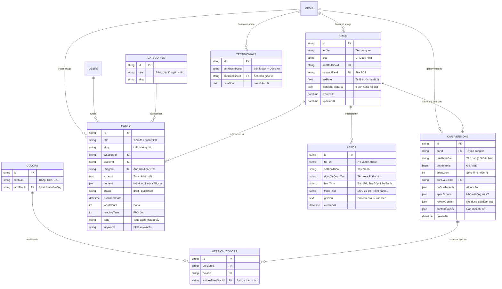

# PHẦN 2: THIẾT KẾ CƠ SỞ DỮ LIỆU, MÔ HÌNH THỰC THỂ (ERD) & QUY TRÌNH NGHIỆP VỤ

> **Mục tiêu tài liệu**: Đặc tả toàn diện mô hình dữ liệu (Data Models), sơ đồ thực thể liên kết (ERD), các quy tắc nghiệp vụ (Business Rules), ràng buộc toàn vẹn và **quy trình thao tác sử dụng thực tế**.
> 
> **Độc lập nền tảng**: Tài liệu cung cấp cả thiết kế quan hệ chuẩn hóa (chuẩn SQL/Prisma/Drizzle) để bạn có thể **thiết kế lại Database mới** mà không phụ thuộc vào PayloadCMS nếu muốn sử dụng kiến trúc ORM/Backend khác.

---

## 1. Sơ Đồ Quan Hệ Thực Thể (ERD - Entity Relationship Diagram)

---

## 2. Đặc Tả Chi Tiết 10 Thực Thể (Entities) & Bảng Dữ Liệu

### 2.1. Thực thể Dòng Xe (`Cars`)
* **Mục đích**: Đại diện cho một mẫu xe lớn (Creta, Tucson, Santa Fe...).
* **Các trường & Kiểu dữ liệu**:
  | Trường | Kiểu dữ liệu | Ràng buộc | Mô tả & Ý nghĩa nghiệp vụ |
  | :--- | :--- | :--- | :--- |
  | `id` | `UUID / CUID / Int` | Primary Key | Định danh duy nhất |
  | `tenXe` | `VARCHAR(150)` | Required, Index | Tên dòng xe ("Hyundai Tucson 2025") |
  | `slug` | `VARCHAR(150)` | Required, Unique | Đường dẫn URL (`tucson`, `santa-fe`) |
  | `anhDaiDienDongXe` | `Relationship -> Media` | Required | Ảnh chụp xe góc 3/4 chất lượng cao |
  | `catalogFile` | `Relationship -> Media` | Optional | File PDF Catalog chính hãng cho khách download |
  | `taxRate` | `DECIMAL(4,2)` | Default: 0.10 | Tỷ lệ phí trước bạ (0.10 = 10% tại Nghệ An) |
  | `highlightFeatures` | `JSON / Subtable` | Array (6 items) | 6 tính năng ăn điểm nhất (Icon, Title, Value) |
  | `moTaChung` | `TEXT` | Optional | Đoạn mô tả khái quát (dùng làm SEO fallback) |

---

### 2.2. Thực thể Phiên Bản Xe (`CarVersions`)
* **Mục đích**: Quản lý từng phiên bản trang bị và động cơ cụ thể của dòng xe.
* **Các trường & Kiểu dữ liệu**:
  | Trường | Kiểu dữ liệu | Ràng buộc | Mô tả & Ý nghĩa nghiệp vụ |
  | :--- | :--- | :--- | :--- |
  | `id` | `UUID / CUID / Int` | Primary Key | Định danh phiên bản |
  | `thuocDongXeId` | `ForeignKey -> Cars` | Required, Index | Thuộc dòng xe nào (Creta hay Tucson...) |
  | `tenPhienBan` | `VARCHAR(150)` | Required | Tên phiên bản ("1.5 Tiêu Chuẩn", "1.6 Turbo H-Trac") |
  | `giaNiemYet` | `BIGINT` | Required, >= 0 | Giá bán công bố chính hãng (VNĐ) |
  | `seatCount` | `INT` | Default: 5 | Số chỗ ngồi (ảnh hưởng đến phí BH TNDS) |
  | `anhDaiDienPhienBan`| `Relationship -> Media` | Required | Ảnh đại diện đặc thù của phiên bản |
  | `boSuuTapAnh` | `JSON / Subtable` | Array Media | Album ảnh chi tiết khoang lái và ngoại thất |
  | `specGroups` | `JSON / Subtable` | Array Groups | Thông số KT có cấu trúc để so sánh bảng |
  | `reviewContent` | `RichText / JSON / MDX` | Optional | Bài viết đánh giá chuyên sâu sinh mục lục (TOC) |
  | `contentBlocks` | `JSON / Subtable` | Optional | Dàn trang chi tiết theo tab (Ngoại thất, Nội thất...) |

---

### 2.3. Bảng Phối Màu Phiên Bản (`VersionColors`)
* **Mục đích**: Quan hệ nhiều - nhiều giữa `CarVersions` và `Colors`, quản lý các tùy chọn màu sơn có sẵn cho phiên bản đó và lưu ảnh xe chụp đúng màu. (Xe Hyundai phân phối tại Việt Nam đồng giá mọi màu sơn, không phát sinh phụ phí màu).
  | Trường | Kiểu dữ liệu | Ràng buộc | Ý nghĩa |
  | :--- | :--- | :--- | :--- |
  | `id` | `UUID / PK` | Primary Key | |
  | `versionId` | `FK -> CarVersions` | Required | Thuộc phiên bản nào |
  | `colorId` | `FK -> Colors` | Required | Màu sắc tương ứng |
  | `anhMinhHoa` | `FK -> Media` | Optional | Ảnh xe thật chụp đúng màu sơn này |

---

### 2.4. Thực thể Khách Hàng Tiềm Năng (`Leads`)
* **Mục đích**: Thu thập thông tin khách hàng từ tất cả các form và công cụ tính toán.
  | Trường | Kiểu dữ liệu | Ràng buộc | Ý nghĩa |
  | :--- | :--- | :--- | :--- |
  | `id` | `UUID / PK` | Primary Key | |
  | `hoTen` | `VARCHAR(100)` | Required | Họ và tên khách hàng |
  | `soDienThoai` | `VARCHAR(20)` | Required, Index | Số điện thoại liên hệ (10 số chuẩn VN) |
  | `dongXeQuanTam` | `VARCHAR(255)` | Optional | Tên xe + phiên bản + yêu cầu gói vay nếu có |
  | `hinhThuc` | `VARCHAR(100)` | Required | Phân loại: "Báo Giá", "Trả Góp", "Giá Lăn Bánh", "Lái Thử"... |
  | `trangThai` | `ENUM` | Default: 'Mới' | `Mới`, `Đã liên hệ`, `Tiềm năng`, `Đã chốt`, `Hủy` |
  | `ghiChu` | `TEXT` | Optional | Nhân viên kinh doanh ghi nhận tình trạng chăm sóc |
  | `createdAt` | `TIMESTAMP` | Default: NOW() | Thời điểm khách gửi form |

---

### 2.5. Thực thể Bài Viết (`Posts`) & Danh Mục (`Categories`)
* **Posts**: Quản lý tin tức, giá xe, khuyến mãi, kinh nghiệm.
  * Hỗ trợ lưu bản nháp (`status: draft / published`).
  * Tự động sinh `slug` tiếng Việt không dấu: `"Giá xe Hyundai Creta 2025 lăn bánh"` -> `gia-xe-hyundai-creta-2025-lan-banh`.
  * Tự động tính toán số từ (`wordCount`) và số phút đọc (`readingTime = Math.ceil(wordCount / 200)`).
* **Categories**: Phân loại tin tức: "Bảng Giá Xe", "Khuyến Mãi", "Sự Kiện", "Hướng Dẫn Thủ Tục".

---

## 3. Cấu Hình Toàn Cục (Global Settings)

Nếu bạn thiết kế lại Database không dùng CMS, 7 Globals này có thể gom thành 1 bảng `system_settings` dạng key-value JSON hoặc tách thành các bảng cấu hình riêng biệt:

1. **`SiteSettings`**:
   * Thông tin SEO mặc định: `siteTitle`, `titleSuffix`, `defaultDescription`, `defaultImage`, `favicon`.
   * Khai báo mã xác minh: `gaId` (GA4), `gtmId` (Google Tag Manager), `verificationCode` (Search Console).
   * Dữ liệu doanh nghiệp cho Google Local SEO: `businessName`, `address`, `phone`, `mapLatitude`, `mapLongitude`.
   * Cấu hình hiển thị trang chủ: `featuredCars` (mảng ID dòng xe nổi bật).
2. **`Navigation`**: Mảng menu đa cấp (`headerLinks`) có label, url, newTab, subLinks; Cột Footer Sản phẩm & Dịch vụ.
3. **`ContactSettings`**: Thông tin người bán, Showroom & Pháp lý hiển thị toàn trang (Header, Footer, Floating Buttons, Card tư vấn):
   * `sellerName`: Tên Người Bán (VD: `Tuấn Hyundai`).
   * `sellerPhone`: Số Điện Thoại Hotline.
   * `sellerZalo`: Link Zalo.
   * `facebookLink`: Link Facebook (Link Facebook page hoặc profile).
   * `sellerEmail`: Email liên hệ.
   * `sellerAddress`: Địa chỉ Showroom.
   * `sellerAvatar`: Ảnh Chân dung (Quan trọng - upload ảnh chân dung chuyên viên tư vấn).
   * `googleMapEmbed`: Mã nhúng Google Map Iframe (Dán mã iframe từ Google Maps).
   * `workingHours`: Giờ làm việc (VD: `8:00 - 20:00 (T2 - CN)`).
   * **Mạng Xã Hội (`socialMedia`)**:
     * `facebookUrl`: Link Facebook (URL Facebook page hoặc profile).
     * `youtubeUrl`: Link YouTube (URL YouTube channel).
     * `tiktokUrl`: Link TikTok (URL TikTok profile).
     * `zaloUrl`: Link Zalo (URL Zalo OA hoặc profile).
   * **Pháp lý (`legal`)**:
     * `businessName`: Tên Doanh Nghiệp trên GPKD (Tên đầy đủ doanh nghiệp trên Giấy phép kinh doanh).
     * `copyrightText`: Bản quyền (Text hiển thị ở footer, VD: `© 2025 XeHyundaiVinh. All rights reserved.`).
4. **`EventBanner`**: Quản lý Banner chiến dịch sự kiện / khuyến mãi nổi bật (Home / Landing):
   * `enableBanner`: Bật / Tắt Banner Sự Kiện.
   * `mediaType`: Loại Media (`image` - Ảnh, `video` - Video nền).
   * `bannerImage`: Upload ảnh nền banner (dùng khi chọn `image`).
   * `videoUrl`: URL Video (YouTube, Vimeo, hoặc direct link MP4/WebM).
   * `title`: Tiêu đề Banner.
   * `subtitle`: Mô tả chi tiết banner.
   * `showTitle`: Checkbox hiển thị Tiêu đề hay không (mặc định: Bật).
   * `showSubtitle`: Checkbox hiển thị Mô tả hay không (mặc định: Bật).
   * `eventBannerType`: Loại hành động tương tác:
     * `form` (Thu thập SĐT / Hiện Form đăng ký).
     * `link` (Điều hướng Link / Hiện Nút bấm).
   * **Cài đặt (Nếu chọn Form - `formSettings`)**:
     * `formLeadType`: Tag cho Lead gửi về hệ thống (mặc định: `Event Lead`).
     * `formCtaText`: Chữ trên nút bấm (mặc định: `Đăng Ký Ngay`).
   * **Cài đặt (Nếu chọn Link - `linkSettings`)**:
     * `linkUrl`: Đường dẫn điều hướng (mặc định: `/xe`).
     * `linkCtaText`: Chữ trên nút bấm (mặc định: `Tìm Hiểu Ngay`).
   * **Vị trí Nội dung (Chữ - `contentPosition`)**:
     * Căn Giữa (`center-center`)
     * Căn Trái (`center-left`)
     * Căn Phải (`center-right`)
     * Góc Trên-Trái (`top-left`)
     * Góc Dưới-Trái (`bottom-left`)
     * Góc Trên-Phải (`top-right`)
     * Góc Dưới-Phải (`bottom-right`)
   * **Màu Chữ (`textColor` - Chọn theo độ sáng của ảnh nền)**:
     * Chữ Trắng (Cho nền tối - `light`)
     * Chữ Đen (Cho nền sáng - `dark`)
   * `showCountdown`: Hiển thị Đếm Ngược (Bật / Tắt).
   * `countdownEndTime`: Thời gian Kết thúc Ưu đãi (Date & Time picker).
   * `slotsLeft`: Số Suất Còn Lại (tạo hiệu ứng FOMO số lượng giới hạn, ví dụ: 5).
5. **`QuoteSettings`**: Cấu hình các định mức chi phí lăn bánh:
   * `phiDangKi`: Tiền biển số theo vùng.
   * `phiDangKiem`: Lệ phí kiểm định (140.000đ).
   * `phiBaoTriDuongBo`: Phí bảo trì đường bộ 12 tháng (1.560.000đ).
   * `phiDichVu`: Phí dịch vụ cà số khung, đăng ký đăng kiểm (2.000.000đ - 3.000.000đ).
   * `tyLeBaoHiemThanVo`: Tỷ lệ phần trăm bảo hiểm 2 chiều (1.3% - 1.5% giá xe).
   * `phiTNDS_duoi_6_cho` (480.000đ) & `phiTNDS_tren_6_cho` (873.000đ).
6. **`VipSection`**: Cấu hình khối dịch vụ VIP Showroom trên Home: Tiêu đề, quyền lợi, ảnh, nút bấm.

---

## 4. Hướng Dẫn Quy Trình Sử Dụng & Vận Hành Thực Tế (How-To-Use)

### 4.1. Quy trình Quản trị viên nhập liệu một Dòng Xe Mới hoàn chỉnh
1. **Bước 1: Tạo Bảng Màu Ngoại Thất**:
   * Vào mục `Colors` -> Tạo các màu: "Trắng Ngọc Trai", "Đen", "Đỏ", "Xanh Dương" kèm ảnh mẫu tròn/vuông (Swatch).
2. **Bước 2: Tạo Dòng Xe (`Cars`)**:
   * Điền tên xe ("Hyundai Tucson 2025"), hệ thống tự điền slug `tucson`.
   * Upload ảnh đại diện xe chụp góc 3/4 nền trong suốt hoặc showroom.
   * Nhập 6 thông số nổi bật (`highlightFeatures`): Chọn icon động cơ, nhập "CÔNG SUẤT", giá trị "156 Hp"...
   * Upload file PDF catalog thông số kỹ thuật.
3. **Bước 3: Tạo Các Phiên Bản Xe (`CarVersions`)**:
   * Tạo phiên bản 1: "2.0 Xăng Tiêu Chuẩn" -> Nhập giá 769.000.000đ -> Chọn `Cars = Tucson`.
   * Gán bảng màu: Chọn các màu ngoại thất có sẵn (Trắng, Đỏ, Đen...) và upload ảnh chụp xe theo từng màu tương ứng.
   * Điền nhóm thông số kỹ thuật: "Động cơ: SmartStream G2.0", "Hộp số: 6 AT"...
   * Viết bài đánh giá chi tiết với các tiêu đề H2 ("Ngoại thất cơ bắp"), H3 ("Cụm đèn Parametric Hidden Lights").
4. **Bước 4: Kiểm tra & Đồng bộ**:
   * Hệ thống tự động kích hoạt hook `indexOnPublish` gửi URL `/xe/tucson` lên Google Indexing API.

### 4.2. Quy trình Biên tập viên Xuất bản Tin tức / Đánh giá xe
1. Vào `Posts` -> Bấm "Tạo mới".
2. Nhập tiêu đề -> Hệ thống tự động tạo URL slug không dấu.
3. Chọn chuyên mục ("Khuyến Mãi" hoặc "Bảng Giá Xe").
4. Viết nội dung trong Editor:
   * Chèn khối **TikTok Embed** bằng cách dán link TikTok và upload ảnh poster.
   * Chèn khối **FAQBlock** với các câu hỏi thường gặp về giá lăn bánh và thủ tục trả góp.
   * Chèn khối **Callout** nhấn mạnh chương trình tặng phụ kiện chính hãng.
5. Xem trước bài viết qua nút **Live Preview**.
6. Bấm **Publish**:
   * Frontend nhận tín hiệu ISR cập nhật bài viết mới trong 60 giây.
   * Hook chạy ngầm gửi URL bài viết trực tiếp đến Google Indexing API.

### 4.3. Quy trình Tiếp nhận & Chăm sóc Khách Hàng Tiềm Năng (Leads)
1. **Khách hàng** truy cập công cụ tính giá lăn bánh tại `/gia-lan-banh`, chọn xe Tucson và bấm "Xem dự toán".
2. Khách điền Tên: "Nguyễn Văn A", SĐT: "0912345678" -> Bấm "Mở khóa bảng tính".
3. **Phía sau hậu trường**:
   * Server Action `submitLeadAction()` ghi một bản ghi vào bảng `Leads` với trạng thái `Mới`, hình thức `Giá Lăn Bánh`.
   * (Mở rộng): Bắn thông báo tức thì qua Telegram Bot / Zalo OA cho Trưởng phòng kinh doanh.
4. **Nhân viên kinh doanh**:
   * Mở bảng quản trị `Leads` -> Thấy thông tin xe khách muốn mua và tỉnh đăng ký.
   * Nhấc máy gọi điện tư vấn và chuyển trạng thái sang `Đã liên hệ` hoặc `Tiềm năng`, nhập ghi chú: "Khách đang cân nhắc bản Đặc biệt màu trắng".

---
