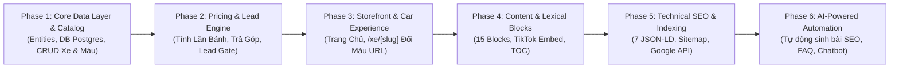

# 🗺️ LỘ TRÌNH TRIỂN KHAI PHÂN TẦNG 6 GIAI ĐOẠN (PHASED ROADMAP)
## CHIẾN LƯỢC PHÁT TRIỂN & CHUYỂN GIAO NỀN TẢNG CARDEALER THEO CHUẨN UNIVERSAL AGENTIC WORKFLOW (v2.1)

> **Mục tiêu tài liệu**: Phân rã toàn bộ khối lượng kỹ thuật từ các tài liệu đặc tả ([`02`](./02-DATABASE-SCHEMA-PAYLOAD-CMS.md), [`03`](./03-HE-THONG-CONTENT-BLOCKS-LEXICAL.md), [`04`](./04-TINH-NANG-FRONTEND-VA-TRAI-NGHIEM-UI-UX.md), [`05`](./05-TECHNICAL-SEO-VA-SCHEMA-JSONLD.md)) thành **6 Phases độc lập, có tính kế thừa và chuyển giao nguyên tử**. Mỗi Phase vận hành trọn vẹn chu trình 5 Gates (Phân tích ➡️ Thiết kế ➡️ Audit Rủi ro ➡️ Code & Test ➡️ Review Độc lập) nhằm đảm bảo hệ thống có thể chạy thử và nghiệm thu từng bước.

---

## 🧭 Tổng Quan Lộ Trình 6 Giai Đoạn

| Giai đoạn | Tên Phân Hệ (Epic) | Trọng Tâm Kỹ Thuật | Phạm Vi Nền Tảng | Deliverables Chính |
| :---: | :--- | :--- | :---: | :--- |
| **Phase 1** | **Core Data Layer & Catalog** | Thiết kế DB PostgreSQL, 10 Core Entities, 7 Globals, Seeders & CRUD API | Backend + Admin | `packages/database`, `packages/types`, `apps/api`, `apps/admin` |
| **Phase 2** | **Pricing & Lead Engine** | Thuật toán tính lăn bánh địa phương, trả góp ngân hàng, Lead Gate 2 bước | Full-stack | `packages/core/src/pricing/`, `apps/api/src/routes/quote`, Web Calculators |
| **Phase 3** | **Storefront & Car Experience** | Trang chủ 6 phân khu, `/xe/[slug]` đổi màu qua query URL, Sticky CTA Bar | Frontend | `apps/web/app/`, `packages/ui` |
| **Phase 4** | **Content & Lexical Blocks** | 15 Content Blocks, TikTok Embed không cuộn, FAQ Accordion, Sticky TOC | Full-stack | `packages/ui/blocks`, `apps/web/app/tin-tuc/`, `apps/admin` |
| **Phase 5** | **Technical SEO & Indexing** | 7 Cấu trúc Schema JSON-LD, Dynamic Sitemap, Google Indexing API v3 | Full-stack | `packages/core/src/seo/`, `apps/web/app/sitemap.ts`, Google Indexing Hook |
| **Phase 6** | **AI-Powered Automation** | AI sinh bài viết bảng giá xe hàng tháng, AI sinh FAQ Schema, AI Chatbot | AI Engine + Cron | `packages/ai-engine`, Background Workers |

---

## 📋 Chi Tiết Từng Giai Đoạn Triển Khai

### 📦 Phase 1: Nền Tảng Dữ Liệu & Quản Trị Danh Mục Xe (Core Data Layer & Catalog Engine)
> **Tài liệu đặc tả nguồn:** [`02-DATABASE-SCHEMA-PAYLOAD-CMS.md`](./02-DATABASE-SCHEMA-PAYLOAD-CMS.md)  
> **Mã Epic:** `EPIC-PHASE-1-CATALOG-DATA`

#### 1. Mục tiêu & Giá trị chuyển giao
* Xây dựng "trái tim" dữ liệu vững chắc cho toàn bộ nền tảng CarDealer trên PostgreSQL.
* Quản lý trọn vẹn danh mục Dòng xe (`Cars`), Phiên bản (`CarVersions`), Bảng màu ngoại thất (`Colors`), và quan hệ đa hình (`VersionColors`).
* Xây dựng hệ thống Xác thực & Phân quyền Admin (`Admin Authentication & RBAC`): Đăng nhập an toàn, bảo vệ các trang quản trị và cấp quyền nhân viên.
* Cung cấp REST API và giao diện Admin cơ bản để thêm, sửa, xóa và xem danh sách xe.

#### 2. Nghiệp vụ chi tiết cần hoàn thành
* **Thiết kế Schema Database:**
  * 10 Thực thể cốt lõi: `Cars`, `CarVersions`, `Colors`, `VersionColors`, `Posts`, `Categories`, `Leads`, `Testimonials`, `Media`, `Users` (email, password_hash, role: 'admin' | 'editor').
  * 7 Cấu hình toàn cục (Globals): `SiteSettings`, `Navigation`, `ContactSettings`, `EventBanner` (đầy đủ cài đặt form/link, vị trí, màu chữ, đếm ngược), `QuoteSettings`, `QuoteTool`, `VipSection`.
* **Hệ thống Xác thực Admin (Authentication & Session):**
  * Mã hóa mật khẩu bằng thuật toán an toàn (`bcrypt` / `argon2`).
  * Cơ chế phiên làm việc bằng HTTP-Only Secure Cookie / JWT chống tấn công XSS.
  * API Auth: `POST /api/auth/login`, `GET /api/auth/me`, `POST /api/auth/logout`.
  * Trang đăng nhập Admin (`/admin/login`) và Middleware chặn người dùng chưa xác thực (Protected Routes).
* **Cơ chế Dữ liệu mẫu (Database Seeding):**
  * Seed tài khoản Quản trị viên mặc định (`admin@xehyundaivinh.com`).
  * Seed sẵn 4 dòng xe tiêu biểu: *Hyundai Santa Fe, Hyundai Tucson, Hyundai Creta, Hyundai Grand i10* kèm thông số kỹ thuật và swatch màu thực tế.
* **Backend REST API (`apps/api`):**
  * `GET /api/cars`: Lấy danh sách xe kèm phiên bản và màu sắc.
  * `GET /api/cars/:slug`: Chi tiết dòng xe theo slug tiếng Việt chuẩn.
  * `GET /api/colors`: Danh mục bảng màu ngoại thất.
* **Giao diện Quản trị (`apps/admin`):**
  * Trang đăng nhập (`/admin/login`) có form xác thực và ghi nhớ phiên.
  * Màn hình danh sách xe, form thêm mới xe và gán bảng màu ngoại thất (yêu cầu đăng nhập).

#### 3. Tiêu chí nghiệm thu (DoD - Definition of Done)
* Chạy migration và seed dữ liệu PostgreSQL (kèm tài khoản Admin mặc định) thành công 100%.
* Đăng nhập Admin với email/password đúng -> cấp cookie phiên và chuyển hướng vào Dashboard; nhập sai -> báo lỗi thân thiện.
* Người dùng chưa đăng nhập truy cập `/admin` tự động bị chuyển hướng về `/admin/login`.
* Gọi API `GET /api/cars` trả về JSON đúng Zod Schema từ `@cardealer/types`.

---

### 💰 Phase 2: Bộ Công Cụ Tài Chính & Phễu Thu Thập Khách Hàng (Pricing & Lead Engine)
> **Tài liệu đặc tả nguồn:** [`04-TINH-NANG-FRONTEND-VA-TRAI-NGHIEM-UI-UX.md` (Mục 5 & 6)](./04-TINH-NANG-FRONTEND-VA-TRAI-NGHIEM-UI-UX.md)  
> **Mã Epic:** `EPIC-PHASE-2-PRICING-LEAD`

#### 1. Mục tiêu & Giá trị chuyển giao
* Tự động hóa 100% các công thức tài chính phức tạp (lăn bánh, lãi suất vay) với tốc độ phản hồi tức thì.
* Xây dựng phễu hứng khách hàng thông minh (Lead Funnel 2 bước) chống lộ giá hời và chống spam.

#### 2. Nghiệp vụ chi tiết cần hoàn thành
* **Thuật toán Dự Toán Lăn Bánh (`calculateRollingCost`):**
  * Biểu phí trước bạ theo tỉnh thành (Hà Nội 12%, TP. Vinh / Nghệ An / Hà Tĩnh 10%).
  * Biển số: Vùng 1 (Hà Nội, TP.HCM 20tr) vs Vùng 2 (Nghệ An 1tr).
  * Phí đăng kiểm (140k), bảo trì đường bộ (1.560k), bảo hiểm TNDS (480k / 873k), bảo hiểm thân vỏ 2 chiều (1.3% giá xe), phí dịch vụ đăng ký (2tr).
* **Thuật toán Trả Góp Ngân Hàng (`calculateInstallment`):**
  * Phương thức Dư Nợ Giảm Dần: Tính số tiền vay (10%-85%), tiền gốc cố định hàng tháng, lãi suất tháng đầu tiên và tổng thanh toán ban đầu.
* **Phễu Chuyển Đổi SmartCalculator (Gated Lead Funnel):**
  * Bước 1: Cho khách hàng tự do chọn xe, phiên bản, tỉnh thành.
  * Bước 2: Khóa bảng chi tiết và kích hoạt Modal yêu cầu nhập Tên + Số điện thoại để gửi bảng dự toán qua Zalo/SMS.
* **Xử lý Lead & Notification Backend:**
  * `POST /api/leads`: Validate số điện thoại Việt Nam hợp lệ, chống spam double-submit bằng Idempotency.
  * Phân loại tag tự động: `Báo Giá`, `Trả Góp`, `Giá Lăn Bánh`, `Event Lead`.

#### 3. Tiêu chí nghiệm thu (DoD)
* Unit tests của `packages/core` pass 100% các case tính tiền lăn bánh và trả góp với sai số 0 đồng.
* Khách submit form lead nhận mã phản hồi thành công và bản ghi được lưu vào DB.

---

### 🚗 Phase 3: Giao Diện Khách Hàng & Trải Nghiệm Xem Xe (Storefront & Dynamic Car Experience)
> **Tài liệu đặc tả nguồn:** [`04-TINH-NANG-FRONTEND-VA-TRAI-NGHIEM-UI-UX.md`](./04-TINH-NANG-FRONTEND-VA-TRAI-NGHIEM-UI-UX.md)  
> **Mã Epic:** `EPIC-PHASE-3-STOREFRONT-EXPERIENCE`

#### 1. Mục tiêu & Giá trị chuyển giao
* Mang lại trải nghiệm người dùng hiện đại, thẩm mỹ cao, chuẩn nhận diện showroom ủy quyền.
* Tối ưu hóa chuyển đổi mua hàng thông qua điều hướng mượt mà và các điểm chạm tương tác liên tục.

#### 2. Nghiệp vụ chi tiết cần hoàn thành
* **Trang chủ Phễu Chuyển Đổi 6 Phân Khu (`/`):**
  1. *Hero Event Banner:* Trình phát video nền, bộ đếm ngược ưu đãi (Countdown Timer), hiển thị số suất còn lại.
  2. *Lead Magnet Hub:* Thanh tìm kiếm & chọn dòng xe nhanh theo tầm giá.
  3. *VIP Showroom Section:* Giới thiệu không gian trải nghiệm và tiêu chuẩn bàn giao xe.
  4. *Featured Cars Showcase:* Lưới danh mục xe nổi bật kèm giá niêm yết và nhãn ưu đãi.
  5. *Testimonials & Delivery:* Bằng chứng xã hội hình ảnh khách hàng nhận xe tại showroom.
  6. *Latest News & Promotions:* Khối tin tức khuyến mãi mới nhất.
* **Trang Chi Tiết Dòng Xe Chuẩn Hóa (`/xe/[carSlug]`):**
  * Hợp nhất toàn bộ phiên bản và màu sắc trên một URL duy nhất.
  * Cơ chế đồng bộ URL query params: `?phien-ban=tucson-xang-tieu-chuan&mau=trang-ngoc-trai` giúp khách hàng chia sẻ link chuẩn xác mà không cần reload trang.
  * Bảng màu ngoại thất tương tác (Interactive Color Swatches): Bấm đổi màu đổi ngay góc ảnh xe thực tế.
  * Thanh chốt đơn cố định đáy màn hình (`ProductStickyBar`): Luôn hiển thị giá, tên xe và 2 nút "Nhận Báo Giá" + "Gọi Hotline".
  * Widget chuyên viên tư vấn nổi (`FloatingSeller`): Avatar chuyên viên, số Hotline, nút chat Zalo mở tức thì.

#### 3. Tiêu chí nghiệm thu (DoD)
* Giao diện responsive 100% trên Mobile (375px), Tablet (768px) và Desktop (1440px).
* Tốc độ tải trang First Contentful Paint (FCP) dưới 1 giây.

---

### 📝 Phase 4: Hệ Thống 15 Content Blocks & Soạn Thảo Độc Quyền (Rich Content & Lexical)
> **Tài liệu đặc tả nguồn:** [`03-HE-THONG-CONTENT-BLOCKS-LEXICAL.md`](./03-HE-THONG-CONTENT-BLOCKS-LEXICAL.md)  
> **Mã Epic:** `EPIC-PHASE-4-CONTENT-BLOCKS`

#### 1. Mục tiêu & Giá trị chuyển giao
* Trao quyền tối đa cho ban biên tập nội dung tạo ra các bài đánh giá xe chuyên sâu, cẩm nang lăn bánh và landing page chiến dịch sinh động.

#### 2. Nghiệp vụ chi tiết cần hoàn thành
* **15 Khối Nội Dung (Content Blocks):**
  * *Chuyển đổi cao cấp:*
    * `TikTokBlock`: Trình phát video ngắn độc quyền, tự động ép tỉ lệ 9:16, khử thanh cuộn, autoplay lặp lại và tự sinh Schema `VideoObject`.
    * `FAQBlock`: Accordion hỏi đáp thường gặp, tự động sinh Schema `FAQPage`.
    * `AdvancedTableBlock`: Bảng thông số kỹ thuật nâng cao hỗ trợ Tìm kiếm, Sắp xếp cột và Xuất file CSV.
  * *Truyền thông & Bán hàng:* `YoutubeBlock`, `GalleryBlock`, `PriceTableBlock`, `RelatedCarBlock`, `CallToActionBlock` (CTA), `FeatureGridBlock`, `TabHeroBlock`.
  * *Văn bản & Ghi chú:* `TextBlock`, `CalloutBlock`, `TwoColumnBlock`, `SpacerBlock`.
* **Mục Lục Bài Viết Thông Minh (Sticky Table of Contents):**
  * Thuật toán tự động quét toàn bộ thẻ H2, H3 trong bài viết để dựng cây mục lục.
  * Scrollspy: Tự động highlight mục tương ứng khi người dùng cuộn trang.

#### 3. Tiêu chí nghiệm thu (DoD)
* Bài viết render chuẩn xác toàn bộ 15 blocks mà không vỡ layout trên thiết bị di động.
* Video TikTok và YouTube nhúng hoạt động mượt mà, không giật lag.

---

### 🔍 Phase 5: Tự Động Hóa Technical SEO & Google Indexing API (SEO & Discovery)
> **Tài liệu đặc tả nguồn:** [`05-TECHNICAL-SEO-VA-SCHEMA-JSONLD.md`](./05-TECHNICAL-SEO-VA-SCHEMA-JSONLD.md)  
> **Mã Epic:** `EPIC-PHASE-5-TECHNICAL-SEO`

#### 1. Mục tiêu & Giá trị chuyển giao
* Đưa website lên top tìm kiếm Google tự nhiên với thứ hạng cao nhất trong khu vực (Local SEO Nghệ An, Hà Tĩnh).
* Rút ngắn thời gian lập chỉ mục bài viết từ vài ngày xuống còn vài phút.

#### 2. Nghiệp vụ chi tiết cần hoàn thành
* **7 Cấu Trúc Schema JSON-LD Tự Động:**
  1. `Product` & `ItemList`: Giá xe có hạn chót cuối tháng (`priceValidUntil`), đổi trả 7 ngày (`hasMerchantReturnPolicy`), miễn phí giao xe (`shippingDetails`), bảo hành 5 năm (`warranty`).
  2. `AutoDealer`: Khai báo doanh nghiệp đại lý ủy quyền kèm tọa độ Google Maps.
  3. `FAQPage`: Bóc tách tự động từ `FAQBlock`.
  4. `VideoObject`: Bóc tách từ `TikTokBlock` và `YoutubeBlock`.
  5. `NewsArticle`: Khai báo bài viết chuẩn SEO báo chí.
  6. `SoftwareApplication`: Khai báo trang tính giá lăn bánh là ứng dụng tài chính miễn phí.
  7. `BreadcrumbList`: Cấu trúc đường dẫn phân cấp điều hướng.
* **Dynamic Sitemap (`sitemap.ts`):**
  * Cơ chế phân cấp mức ưu tiên: Trang chủ (`1.0`), Trang xe (`0.9`), Bài viết bán hàng `gia-lan-banh`, `khuyen-mai` (`0.9`, daily), Tin tức chung (`0.7`).
* **Tích hợp Google Indexing API v3:**
  * Hook tự động gửi thông báo `URL_UPDATED` tới Google Service Account ngay khi bấm Publish bài viết/dòng xe.
  * Công cụ gửi hàng loạt trong Admin Panel (`/admin/google-indexing`).

#### 3. Tiêu chí nghiệm thu (DoD)
* Kiểm tra qua công cụ Google Rich Results Test đạt 100% hợp lệ không có cảnh báo.
* Gửi URL thử nghiệm qua Google Indexing API trả về mã thành công HTTP 200.

---

### 🤖 Phase 6: Trí Tuệ Nhân Tạo Tự Động Hóa (AI-Powered Content & Lead Gen)
> **Mã Epic:** `EPIC-PHASE-6-AI-AUTOMATION`

#### 1. Mục tiêu & Giá trị chuyển giao
* Tự động hóa sản xuất nội dung quy mô lớn và tư vấn khách hàng tự động 24/7.

#### 2. Nghiệp vụ chi tiết cần hoàn thành
* **Tự Động Sinh Bài Viết Giá Lăn Bánh Hàng Tháng:**
  * AI đọc dữ liệu giá niêm yết và biểu phí lăn bánh từ Database -> Tự động sinh dự thảo bài viết chuẩn SEO theo từng địa phương dạng `status: draft`.
* **AI Sinh Meta Tags & FAQ:** Tự động sinh `metaTitle`, `metaDescription` và bộ câu hỏi đáp FAQ từ thông số xe.
* **AI Chatbot Tư Vấn Lăn Bánh & Thu Thập Lead:** Trả lời tự động các câu hỏi về thủ tục vay mua xe và thu thập SĐT khách hàng đẩy về CRM.

---

## 🚀 Kế Hoạch Bắt Đầu: Khởi Động Phase 1

Để bắt đầu chu trình, hệ thống sẽ kích hoạt **Universal Agentic Workflow (v2.1)** cho phân hệ đầu tiên:
📁 Thư mục triển khai: `docs/features/PHASE-1-CATALOG-DATA/`
* **Giai đoạn 1:** Phân tích Backlog & Lập kế hoạch hành động.
* **Giai đoạn 2 (Bước 2.1):** Lập phương án kiến trúc Database & Backend (`SOLUTION_OPTIONS.md`).
* **Giai đoạn 2 (Bước 2.2):** Thiết kế chi tiết ERD, State Matrix và API Spec.
* **Giai đoạn 3:** Audit rủi ro an ninh & Test Plan.
* **Giai đoạn 4:** Lập trình mã nguồn và chạy kiểm thử máy tự động (`exit 0`).
* **Giai đoạn 5:** Review độc lập toàn diện trước khi bàn giao.
