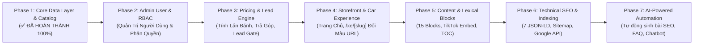

# 🗺️ LỘ TRÌNH TRIỂN KHAI PHÂN TẦNG 7 GIAI ĐOẠN (PHASED ROADMAP)
## CHIẾN LƯỢC PHÁT TRIỂN & CHUYỂN GIAO NỀN TẢNG CARDEALER THEO CHUẨN UNIVERSAL AGENTIC WORKFLOW (v2.2)

> **Mục tiêu tài liệu**: Phân rã toàn bộ khối lượng kỹ thuật từ các tài liệu đặc tả ([`02`](./02-DATABASE-SCHEMA-PAYLOAD-CMS.md), [`03`](./03-HE-THONG-CONTENT-BLOCKS-LEXICAL.md), [`04`](./04-TINH-NANG-FRONTEND-VA-TRAI-NGHIEM-UI-UX.md), [`05`](./05-TECHNICAL-SEO-VA-SCHEMA-JSONLD.md)) thành **7 Phases độc lập, có tính kế thừa và chuyển giao nguyên tử**. Mỗi Phase vận hành trọn vẹn chu trình 5 Gates (Phân tích ➡️ Thiết kế ➡️ Audit Rủi ro ➡️ Code & Test ➡️ Review Độc lập) nhằm đảm bảo hệ thống có thể chạy thử và nghiệm thu từng bước.

---

## 🧭 Tổng Quan Lộ Trình 7 Giai Đoạn

| Giai đoạn | Tên Phân Hệ (Epic) | Trọng Tâm Kỹ Thuật | Phạm Vi Nền Tảng | Trạng Thái / Deliverables |
| :---: | :--- | :--- | :---: | :--- |
| **Phase 1** | **Core Data Layer & Catalog** | Thiết kế DB PostgreSQL, 10 Core Entities, 7 Globals, Seeders & CRUD API | Backend + Admin | ✅ **ĐÃ HOÀN THÀNH (100% - Ready)** • `packages/database` (Drizzle Schemas, Migrations, Seed) • `packages/types` (Car, Auth, Settings contracts) • `apps/api` (REST APIs Auth, Catalog, Admin CRUD) • `apps/admin` (Dashboard, Login, Cars, Colors, Settings, Skeleton Zero-CLS) |
| **Phase 2** | **Admin User & RBAC Management** | Quản trị tài khoản nhân viên showroom, phân quyền đa tầng (Admin, Manager, Editor, Sales), Audit Logs | Full-stack | ⏳ **TIẾP THEO (Next Epic)** • `packages/database/src/schema/users.ts` • `apps/api/src/routes/admin/users.ts` • `apps/admin/app/users/`, `/admin/profile` |
| **Phase 3** | **Pricing & Lead Engine** | Thuật toán tính lăn bánh địa phương, trả góp ngân hàng, Lead Gate 2 bước | Full-stack | `packages/core/src/pricing/`, `apps/api/src/routes/quote`, Web Calculators |
| **Phase 4** | **Storefront & Car Experience** | Phân rã 4 sub-phases: 4.1 Shell & Widgets, 4.2 Trang chủ 6 phân khu, 4.3 Catalog /xe, 4.4 Chi tiết xe /xe/[slug] đổi màu động | Frontend | `apps/web/app/`, `packages/ui` |
| **Phase 5** | **Content & Lexical Blocks** | 15 Content Blocks, TikTok Embed không cuộn, FAQ Accordion, Sticky TOC | Full-stack | `packages/ui/blocks`, `apps/web/app/tin-tuc/`, `apps/admin` |
| **Phase 6** | **Technical SEO & Indexing** | 7 Cấu trúc Schema JSON-LD, Dynamic Sitemap, Google Indexing API v3 | Full-stack | `packages/core/src/seo/`, `apps/web/app/sitemap.ts`, Google Indexing Hook |
| **Phase 7** | **AI-Powered Automation** | AI sinh bài viết bảng giá xe hàng tháng, AI sinh FAQ Schema, AI Chatbot | AI Engine + Cron | `packages/ai-engine`, Background Workers |

---

## 📋 Chi Tiết Từng Giai Đoạn Triển Khai

### 📦 Phase 1: Nền Tảng Dữ Liệu & Quản Trị Danh Mục Xe (Core Data Layer & Catalog Engine)
> **Tài liệu đặc tả nguồn:** [`02-DATABASE-SCHEMA-PAYLOAD-CMS.md`](./02-DATABASE-SCHEMA-PAYLOAD-CMS.md)  
> **Mã Epic:** `EPIC-PHASE-1-CATALOG-DATA`  
> **Trạng thái thực thi:** ✅ **ĐÃ HOÀN THÀNH & NGHIỆM THU 100% (Delivered to Main)**  
> **Tài liệu thực thi chi tiết:** [`docs/features/PHASE-1-CATALOG-DATA/`](./features/PHASE-1-CATALOG-DATA/)

#### 1. Mục tiêu & Giá trị chuyển giao
* Xây dựng "trái tim" dữ liệu vững chắc cho toàn bộ nền tảng CarDealer trên PostgreSQL.
* Quản lý trọn vẹn danh mục Dòng xe (`Cars`), Phiên bản (`CarVersions`), Bảng màu ngoại thất (`Colors`), và quan hệ đa hình (`VersionColors`).
* Xây dựng hệ thống Xác thực & Phân quyền Admin (`Admin Authentication & RBAC`): Đăng nhập an toàn, bảo vệ các trang quản trị và cấp quyền nhân viên.
* Cung cấp REST API và giao diện Admin cơ bản để thêm, sửa, xóa và xem danh sách xe.

#### 2. Nghiệp vụ chi tiết cần hoàn thành
* **Thiết kế Schema Database:**
  * 10 Thực thể cốt lõi: `Cars`, `CarVersions`, `Colors`, `VersionColors`, `Posts`, `Categories`, `Leads`, `Testimonials`, `Media`, `Users` (email, password_hash, role: 'admin' | 'editor').
  * 7 Cấu hình toàn cục (Globals): `SiteSettings`, `Navigation`, `ContactSettings`, `EventBanner` (đầy đủ cài đặt form/link, vị trí, màu chữ, đếm ngược), `QuoteSettings`, `QuoteTool`, `VipSection`.
* **Hệ thống Xác thực Admin (Authentication & Session):**
  * Mã hóa mật khẩu bằng thuật toán an toàn (`bcrypt` / `argon2`).
  * Cơ chế phiên làm việc bằng HTTP-Only Secure Cookie / JWT chống tấn công XSS.
  * API Auth: `POST /api/auth/login`, `GET /api/auth/me`, `POST /api/auth/logout`.
  * Trang đăng nhập Admin (`/admin/login`) và Middleware chặn người dùng chưa xác thực (Protected Routes).
* **Cơ chế Dữ liệu mẫu (Database Seeding):**
  * Seed tài khoản Quản trị viên mặc định (`admin@xehyundaivinh.com`).
  * Seed sẵn 4 dòng xe tiêu biểu: *Hyundai Santa Fe, Hyundai Tucson, Hyundai Creta, Hyundai Grand i10* kèm thông số kỹ thuật và swatch màu thực tế.
* **Backend REST API (`apps/api`):**
  * `GET /api/cars`: Lấy danh sách xe kèm phiên bản và màu sắc.
  * `GET /api/cars/:slug`: Chi tiết dòng xe theo slug tiếng Việt chuẩn.
  * `GET /api/colors`: Danh mục bảng màu ngoại thất.
* **Giao diện Quản trị (`apps/admin`):**
  * Trang đăng nhập (`/admin/login`) có form xác thực và ghi nhớ phiên.
  * Màn hình danh sách xe, form thêm mới xe và gán bảng màu ngoại thất (yêu cầu đăng nhập).

#### 3. Tiêu chí nghiệm thu (DoD - Definition of Done)
- [x] Chạy migration và seed dữ liệu PostgreSQL (kèm tài khoản Admin mặc định) thành công 100%.
- [x] Đăng nhập Admin với email/password đúng -> cấp cookie phiên và chuyển hướng vào Dashboard; nhập sai -> báo lỗi thân thiện.
- [x] Người dùng chưa đăng nhập truy cập `/admin` tự động bị chuyển hướng về `/admin/login` qua Middleware.
- [x] Gọi API `GET /api/cars` và `GET /api/admin/*` trả về JSON đúng Zod Schema từ `@cardealer/types`.
- [x] Giao diện Admin quản trị Dòng xe (`/cars`), Chi tiết xe (`/cars/[slug]`), Bảng màu (`/colors`), Cấu hình Showroom (`/settings`) hoạt động trơn tru với Optimistic UI, Quick Status Toggle và Skeleton Shimmer Loading (Zero-CLS).
- [x] Vượt qua kiểm tra Type-Safety monorepo (`pnpm check-types`) với 8/8 packages đạt 0 lỗi TypeScript.

---

### 👥 Phase 2: Quản Trị Người Dùng & Phân Quyền Hệ Thống (Admin User & RBAC Management)
> **Tài liệu đặc tả nguồn:** [`02-DATABASE-SCHEMA-PAYLOAD-CMS.md` (Mục Users & Roles)](./02-DATABASE-SCHEMA-PAYLOAD-CMS.md)  
> **Mã Epic:** `EPIC-PHASE-2-ADMIN-USER-RBAC`  
> **Trạng thái:** ⏳ **SẴN SÀNG KHỞI ĐỘNG (Ready to Kickoff)**

#### 1. Mục tiêu & Giá trị chuyển giao
* Xây dựng phân hệ quản lý người dùng nội bộ hoàn chỉnh cho Showroom và Đại lý ô tô (`Admin Portal User Management`).
* Cung cấp cơ chế Phân quyền dựa trên vai trò (RBAC - Role-Based Access Control) 4 cấp độ: `admin`, `manager`, `editor`, `sales`.
* Bảo vệ an toàn tài khoản với các chính sách bảo mật: Khóa/Mở khóa tài khoản, Đổi mật khẩu định kỳ, Thu hồi phiên làm việc (Revoke session / Force logout), và Ghi nhật ký kiểm toán hành động (Security Audit Trail).
* Trang cá nhân (`/admin/profile`) cho phép từng nhân viên cập nhật thông tin cá nhân, avatar, số điện thoại hotline tư vấn và đổi mật khẩu an toàn.

#### 2. Nghiệp vụ chi tiết cần hoàn thành
* **Mở rộng Schema & Database (`packages/database`):**
  * Nâng cấp bảng `users`: Thêm `fullName`, `phone`, `avatarUrl`, `role` (`'admin' | 'manager' | 'editor' | 'sales'`), `status` (`'active' | 'suspended' | 'pending'`), `lastLoginAt`, `lastLoginIp`.
  * Tạo bảng `audit_logs`: Ghi nhận `userId`, `action` (`CREATE_CAR`, `DELETE_CAR`, `CHANGE_STATUS`, `UPDATE_PRICE`, `LOGIN_FAILED`), `targetResource`, `ipAddress`, `userAgent`, `createdAt`.
* **RBAC Middleware & Route Guards (`apps/api` & `apps/admin`):**
  * Định nghĩa ma trận quyền hạn chi tiết (Permission Matrix):
    * `admin`: Toàn quyền hệ thống, quản lý tài khoản, cấu hình showroom, xóa vĩnh viễn dữ liệu.
    * `manager`: Quản lý xe, duyệt giá niêm yết, phân công Lead khách hàng, xem báo cáo KPI.
    * `editor`: Quản lý bài viết tin tức, nội dung xe, tải lên media hình ảnh.
    * `sales`: Tiếp nhận và xử lý danh sách Lead khách hàng được phân công, không được sửa cấu hình hệ thống hay bảng giá.
  * Phân quyền tại tầng API qua middleware `requireRole(['admin'])` và `requirePermission(...)`.
  * Phân quyền tại giao diện Admin: Ẩn/hiện menu điều hướng và các nút thao tác xóa/sửa dựa theo vai trò của người dùng hiện tại.
* **REST APIs Quản Lý User (`apps/api/src/routes/admin/users.ts`):**
  * `GET /api/admin/users`: Danh sách nhân viên với phân trang, lọc theo vai trò và tìm kiếm theo họ tên/email.
  * `POST /api/admin/users`: Thêm mới nhân viên, tự động sinh mật khẩu tạm thời hoặc mã kích hoạt.
  * `GET /api/admin/users/:id`: Xem chi tiết thông tin và lịch sử thao tác của nhân viên.
  * `PUT /api/admin/users/:id`: Cập nhật thông tin, thay đổi vai trò hoặc chuyển trạng thái (Khóa / Kích hoạt).
  * `POST /api/admin/users/:id/reset-password`: Đặt lại mật khẩu tài khoản cấp quản trị.
  * `DELETE /api/admin/users/:id`: Xóa mềm hoặc vô hiệu hóa tài khoản (chặn tự xóa chính mình).
  * `GET /api/admin/profile` & `PUT /api/admin/profile`: Quản lý trang hồ sơ cá nhân của người dùng đang đăng nhập.
  * `PUT /api/admin/profile/change-password`: Đổi mật khẩu cá nhân (yêu cầu xác thực mật khẩu cũ).
* **Giao diện Quản trị Người dùng (`apps/admin`):**
  * Màn hình Danh sách nhân viên (`/admin/users`): Data table, filter theo vai trò (`Admin`, `Manager`, `Editor`, `Sales`), trạng thái hoạt động (`Đang hoạt động`, `Đã khóa`), nút khóa nhanh và đặt lại mật khẩu.
  * Modal Thêm / Chỉnh sửa nhân viên: Form chuẩn `react-hook-form` + `zod` với các trường họ tên, email, chức vụ, vai trò, số điện thoại và phân công phụ trách.
  * Màn hình Hồ sơ cá nhân (`/admin/profile`): Xem thông tin cá nhân, cập nhật thông tin liên hệ và form đổi mật khẩu an toàn.
  * Trang Nhật ký hoạt động (`/admin/audit-logs`): Xem lịch sử thao tác của nhân viên để truy vết trách nhiệm.

#### 3. Tiêu chí nghiệm thu (DoD - Definition of Done)
- [ ] Mở rộng bảng `users`, tạo bảng `audit_logs` và chạy migration PostgreSQL thành công.
- [ ] Tài khoản vai trò `sales` hoặc `editor` khi đăng nhập không thể truy cập vào `/admin/users` hay `/admin/settings` (bị từ chối quyền 403 Forbidden).
- [ ] Admin có thể tạo tài khoản mới, phân vai trò, khóa hoặc mở khóa nhân viên tức thì.
- [ ] Chặn triệt để lỗi tự xóa chính mình hoặc tự hạ quyền Admin cuối cùng trong hệ thống (Self-locking prevention).
- [ ] Trang cá nhân cho phép nhân viên đổi mật khẩu thành công và bắt buộc đăng xuất nếu đổi mật khẩu.
- [ ] Toàn bộ API và màn hình tuân thủ Clean Architecture, Zod validation, và Skeleton Shimmer Loading (Zero-CLS).

---

### 💰 Phase 3: Bộ Công Cụ Tài Chính & Phễu Thu Thập Khách Hàng (Pricing & Lead Engine)
> **Tài liệu đặc tả nguồn:** [`04-TINH-NANG-FRONTEND-VA-TRAI-NGHIEM-UI-UX.md` (Mục 5 & 6)](./04-TINH-NANG-FRONTEND-VA-TRAI-NGHIEM-UI-UX.md)  
> **Mã Epic:** `EPIC-PHASE-3-PRICING-LEAD`

#### 1. Mục tiêu & Giá trị chuyển giao
* Tự động hóa 100% các công thức tài chính phức tạp (lăn bánh, lãi suất vay) với tốc độ phản hồi tức thì.
* Xây dựng phễu hứng khách hàng thông minh (Lead Funnel 2 bước) chống lộ giá hời và chống spam.

#### 2. Nghiệp vụ chi tiết cần hoàn thành
* **Thuật toán Dự Toán Lăn Bánh (`calculateRollingCost`):**
  * Biểu phí trước bạ theo tỉnh thành (Hà Nội 12%, TP. Vinh / Nghệ An / Hà Tĩnh 10%).
  * Biển số: Vùng 1 (Hà Nội, TP.HCM 20tr) vs Vùng 2 (Nghệ An 1tr).
  * Phí đăng kiểm (140k), bảo trì đường bộ (1.560k), bảo hiểm TNDS (480k / 873k), bảo hiểm thân vỏ 2 chiều (1.3% giá xe), phí dịch vụ đăng ký (2tr).
* **Thuật toán Trả Góp Ngân Hàng (`calculateInstallment`):**
  * Phương thức Dư Nợ Giảm Dần: Tính số tiền vay (10%-85%), tiền gốc cố định hàng tháng, lãi suất tháng đầu tiên và tổng thanh toán ban đầu.
* **Phễu Chuyển Đổi SmartCalculator (Gated Lead Funnel):**
  * Bước 1: Cho khách hàng tự do chọn xe, phiên bản, tỉnh thành.
  * Bước 2: Khóa bảng chi tiết và kích hoạt Modal yêu cầu nhập Tên + Số điện thoại để gửi bảng dự toán qua Zalo/SMS.
* **Xử lý Lead & Notification Backend:**
  * `POST /api/leads`: Validate số điện thoại Việt Nam hợp lệ, chống spam double-submit bằng Idempotency.
  * Phân loại tag tự động: `Báo Giá`, `Trả Góp`, `Giá Lăn Bánh`, `Event Lead`.

#### 3. Tiêu chí nghiệm thu (DoD)
* Unit tests của `packages/core` pass 100% các case tính tiền lăn bánh và trả góp với sai số 0 đồng.
* Khách submit form lead nhận mã phản hồi thành công và bản ghi được lưu vào DB.

---

### 🚗 Phase 4: Giao Diện Khách Hàng & Trải Nghiệm Xem Xe (Storefront & Dynamic Car Experience)
> **Tài liệu đặc tả nguồn:** [`04-TINH-NANG-FRONTEND-VA-TRAI-NGHIEM-UI-UX.md`](./04-TINH-NANG-FRONTEND-VA-TRAI-NGHIEM-UI-UX.md)  
> **Mã Epic Tổng:** `EPIC-PHASE-4-STOREFRONT-EXPERIENCE`

Nhằm đảm bảo tiến độ triển khai nhanh, kiểm thử độc lập và bàn giao liên tục (CI/CD), Phase 4 được chia thành 4 Phase nhỏ chuyên biệt:

---

#### 🚗 Phase 4.1: Khung Nền Tảng Storefront & Tiện Ích Chuyển Đổi Toàn Cục (Global Shell & Conversion Widgets)
> **Mã Epic:** `EPIC-PHASE-4.1-STOREFRONT-SHELL-WIDGETS`

* **1. Mục tiêu & Giá trị:** Thiết lập khung sườn Layout chuẩn thương hiệu Hyundai toàn trang (Desktop/Mobile), đảm bảo mọi điểm chạm đều sẵn sàng kích hoạt hành vi liên hệ tư vấn. Toàn bộ thông tin cấu hình, nội dung liên hệ và tiện ích chuyển đổi đều có thể **quản trị và chỉnh sửa 100% linh hoạt từ Admin CMS**.
* **2. Nghiệp vụ chi tiết (Toàn bộ hỗ trợ Dynamic Editing từ Admin):**
  * **Header/Navbar Showroom:** Logo thương hiệu, Menu điều hướng đa cấp (`Navigation`), Hotline bán hàng 24/7 và nút CTA "Nhận Báo Giá" — tất cả đều cấu hình và cập nhật trực tiếp từ Admin (`Navigation`, `ContactSettings`, `SiteSettings`).
  * **Mobile Navigation Drawer:** Menu trượt mượt mà trên Mobile với các nút liên hệ nhanh một chạm (Gọi điện, Chat Zalo), đồng bộ tự động từ cài đặt menu và hotline trong Admin.
  * **Thanh chốt đơn cố định đáy màn hình (`ProductStickyBar`):** Ghim cố định ở chân màn hình trên cả Mobile & Desktop, hiển thị tên xe, giá khởi điểm; các nút "GỌI NGAY" (`tel:`), "NHẬN BÁO GIÁ", hotline liên kết và trạng thái bật/tắt đều có thể tùy chỉnh từ Admin.
  * **Widget Chuyên Viên Nổi (`FloatingSeller`):** Quản trị viên tùy biến hoàn toàn từ Admin (`ContactSettings`): Avatar nhân viên tư vấn, tên hiển thị, trạng thái "Đang trực tuyến", số Hotline kích hoạt cuộc gọi, link chat Zalo OA/cá nhân và link Messenger Facebook.
  * **Footer Đại Lý 3S:** Toàn bộ nội dung quản lý qua Admin: Giới thiệu showroom, địa chỉ, mã nhúng bản đồ Google Maps iframe, giờ mở cửa làm việc, hotline, email, hệ thống liên kết mạng xã hội (Facebook, YouTube, TikTok, Zalo), chính sách bảo hành/bảo mật, thông tin pháp lý/GPKD, copyright và biểu tượng Bộ Công Thương.
  * **Đồng bộ Cấu hình Toàn cục (Global Settings Sync):** Kết nối trực tiếp với các API Globals (`SiteSettings`, `Navigation`, `ContactSettings`) từ Admin Portal, cho phép thay đổi tức thì trên Storefront mà không cần can thiệp code hay deploy lại.
* **3. Tiêu chí nghiệm thu (DoD):**
  * Layout không bị nhảy CLS (Cumulative Layout Shift = 0) khi cuộn trang.
  * Widget gọi điện và chat Zalo hoạt động chính xác 100% trên cả Android và iOS.
  * 100% nội dung và cấu hình của Header, Menu, Footer, Floating Seller, Sticky Bar cập nhật thành công và phản hồi ngay lập tức trên Storefront khi chỉnh sửa từ Admin Portal.

---

#### 🚗 Phase 4.2: Trang Chủ Phễu Chuyển Đổi 6 Phân Khu (Homepage Conversion Funnel - `/`)
> **Mã Epic:** `EPIC-PHASE-4.2-HOMEPAGE-FUNNEL`

* **1. Mục tiêu & Giá trị:** Tối ưu hóa tỷ lệ chuyển đổi khách hàng vãng lai ngay từ trang chủ bằng phễu 6 phân khu tâm lý mua sắm xe ô tô.
* **2. Nghiệp vụ chi tiết:**
  * **Khu 1 - Hero Event Banner:** Trình phát video/banner khuyến mại lớn trong tháng, bộ đếm ngược ưu đãi (Countdown Timer) tạo tính cấp bách, hiển thị số suất ưu đãi còn lại theo thời gian thực.
  * **Khu 2 - Lead Magnet Hub (Bộ Lọc Nhanh):** Thanh tìm kiếm nhanh dòng xe theo mức ngân sách (Dưới 500tr, 500tr - 800tr, Trên 800tr) và kiểu dáng xe (Sedan, SUV, MPV).
  * **Khu 3 - VIP Showroom Section:** Giới thiệu cơ sở vật chất xưởng dịch vụ 3S, phòng chờ khách hàng chuẩn châu Âu và quy trình bàn giao xe chuyên nghiệp.
  * **Khu 4 - Featured Cars Showcase:** Lưới danh mục các dòng xe bán chạy nhất (Accent, Tucson, Santa Fe, Creta) kèm giá niêm yết, mức trả trước chỉ từ X triệu và huy hiệu khuyến mãi.
  * **Khu 5 - Testimonials & Delivery Stories:** Bằng chứng xã hội (Social Proof) dạng Slider/Gallery hình ảnh khách hàng nhận xe thực tế tại Showroom Hyundai Vinh.
  * **Khu 6 - Latest News & Special Promotions:** Khối hiển thị 3 - 4 bài viết khuyến mãi và tin tức đại lý mới nhất.
* **3. Tiêu chí nghiệm thu (DoD):**
  * Tốc độ tải trang trang chủ đạt chuẩn Core Web Vitals (FCP < 1.0s, LCP < 2.0s).
  * Bộ đếm ngược Countdown hoạt động mượt mà, tự động cập nhật không bị lỗi lệch múi giờ.

---

#### 🚗 Phase 4.3: Trang Danh Mục Dòng Xe & Bộ Lọc Đa Chiều (Catalog & Filter Grid - `/xe`)
> **Mã Epic:** `EPIC-PHASE-4.3-CATALOG-FILTER`

* **1. Mục tiêu & Giá trị:** Giúp khách hàng dễ dàng so sánh, tìm kiếm dòng xe phù hợp với nhu cầu và khả năng tài chính.
* **2. Nghiệp vụ chi tiết:**
  * **Tabs Lọc Phân Khúc Xe:** Phân loại mượt mà theo `Tất cả`, `Sedan`, `SUV`, `MPV`, `Hatchback`, `Xe Điện (EV)`.
  * **Bộ Lọc Theo Mức Giá:** Slider hoặc các mốc bấm nhanh (Dưới 500tr, 500 - 700tr, 700 - 1 tỷ, Trên 1 tỷ).
  * **Car Card Component Thông Minh:**
    * Ảnh đại diện xe chụp góc chuẩn showroom.
    * Tên xe, phân khúc, số chỗ ngồi và loại nhiên liệu.
    * Khoảng giá (`minPrice` - `maxPrice`) tính từ các phiên bản đang bán.
    * Mức trả trước tối thiểu ("Trả trước từ X triệu").
    * 2 nút hành động: "Xem Chi Tiết" (trỏ tới `/xe/[slug]`) và "Dự Toán Lăn Bánh" (trỏ tới `/gia-lan-banh?xe=[slug]`).
  * **SEO Schema:** Nhúng JSON-LD Schema `ItemList` và `AggregateOffer` cho toàn bộ danh mục xe.
* **3. Tiêu chí nghiệm thu (DoD):**
  * Bộ lọc lọc tức thì (< 50ms) không cần tải lại trang.
  * Khi thay đổi bộ lọc, trạng thái được lưu vào URL query params để tiện chia sẻ.

---

#### 🚗 Phase 4.4: Trang Chi Tiết Dòng Xe Chuẩn Hóa & Đổi Màu Động (Dynamic Car Experience & Deep Linking - `/xe/[carSlug]`)
> **Mã Epic:** `EPIC-PHASE-4.4-CAR-DETAIL-EXPERIENCE`

* **1. Mục tiêu & Giá trị:** Trải nghiệm xem xe tương tác cao cấp nhất, hợp nhất tất cả phiên bản và màu sắc trên 1 URL duy nhất, tăng tối đa thời gian trên trang và chuyển đổi đơn hàng.
* **2. Nghiệp vụ chi tiết:**
  * **Hợp Nhất URL & Deep Linking 2 Chiều:**
    * Định dạng URL chuẩn: `/xe/[carSlug]?phien-ban=[versionSlug]&mau=[colorSlug]`.
    * Chia sẻ link mở đúng chính xác phiên bản và màu sơn ngoại thất đã chọn.
    * Cập nhật URL tức thì qua `window.history.replaceState` không reload trang.
  * **Bảng Chọn Màu Tương Tác (Interactive Color Swatches):**
    * Hiển thị các chấm tròn màu ngoại thất thực tế (Trắng, Đỏ, Đen, Xanh Rêu, Bạc...).
    * Click đổi màu xe: Ảnh xe góc lớn lập tức chuyển sang ảnh thực tế của màu đó với hiệu ứng fade nhẹ mượt mà.
  * **Selector Chọn Phiên Bản:** Bấm chọn giữa các phiên bản (Tiêu chuẩn, Đặc biệt, Cao cấp) tự động cập nhật lại bảng thông số kỹ thuật, giá niêm yết và danh sách màu tương ứng của phiên bản đó.
  * **Bảng So Sánh & Thông Số Kỹ Thuật Động:** Động cơ, công suất, hộp số, số chỗ ngồi, gói trang bị an toàn Hyundai SmartSense.
  * **Thư Viện Ảnh (Photo Gallery & Lightbox):** Xem ảnh chi tiết ngoại thất/nội thất dạng grid kèm chế độ zoom toàn màn hình.
  * **Tích hợp liền mạch Form Dự toán & Trả góp:** Nút "Tính Giá Lăn Bánh Xe Này" dẫn trực tiếp đến `/gia-lan-banh` với tham số xe được chọn sẵn.
* **3. Tiêu chí nghiệm thu (DoD):**
  * Chuyển đổi màu xe và phiên bản mượt mà, phản hồi tức thì dưới 100ms.
  * Thẻ `canonical` luôn trỏ về URL gốc `/xe/[carSlug]` tránh lỗi trùng lặp nội dung SEO (Duplicate Content).

---

### 📝 Phase 5: Hệ Thống 15 Content Blocks & Soạn Thảo Độc Quyền (Rich Content & Lexical)
> **Tài liệu đặc tả nguồn:** [`03-HE-THONG-CONTENT-BLOCKS-LEXICAL.md`](./03-HE-THONG-CONTENT-BLOCKS-LEXICAL.md)  
> **Mã Epic:** `EPIC-PHASE-5-CONTENT-BLOCKS`

#### 1. Mục tiêu & Giá trị chuyển giao
* Trao quyền tối đa cho ban biên tập nội dung tạo ra các bài đánh giá xe chuyên sâu, cẩm nang lăn bánh và landing page chiến dịch sinh động.

#### 2. Nghiệp vụ chi tiết cần hoàn thành
* **15 Khối Nội Dung (Content Blocks):**
  * *Chuyển đổi cao cấp:*
    * `TikTokBlock`: Trình phát video ngắn độc quyền, tự động ép tỉ lệ 9:16, khử thanh cuộn, autoplay lặp lại và tự sinh Schema `VideoObject`.
    * `FAQBlock`: Accordion hỏi đáp thường gặp, tự động sinh Schema `FAQPage`.
    * `AdvancedTableBlock`: Bảng thông số kỹ thuật nâng cao hỗ trợ Tìm kiếm, Sắp xếp cột và Xuất file CSV.
  * *Truyền thông & Bán hàng:* `YoutubeBlock`, `GalleryBlock`, `PriceTableBlock`, `RelatedCarBlock`, `CallToActionBlock` (CTA), `FeatureGridBlock`, `TabHeroBlock`.
  * *Văn bản & Ghi chú:* `TextBlock`, `CalloutBlock`, `TwoColumnBlock`, `SpacerBlock`.
* **Mục Lục Bài Viết Thông Minh (Sticky Table of Contents):**
  * Thuật toán tự động quét toàn bộ thẻ H2, H3 trong bài viết để dựng cây mục lục.
  * Scrollspy: Tự động highlight mục tương ứng khi người dùng cuộn trang.

#### 3. Tiêu chí nghiệm thu (DoD)
* Bài viết render chuẩn xác toàn bộ 15 blocks mà không vỡ layout trên thiết bị di động.
* Video TikTok và YouTube nhúng hoạt động mượt mà, không giật lag.

---

### 🔍 Phase 6: Tự Động Hóa Technical SEO & Google Indexing API (SEO & Discovery)
> **Tài liệu đặc tả nguồn:** [`05-TECHNICAL-SEO-VA-SCHEMA-JSONLD.md`](./05-TECHNICAL-SEO-VA-SCHEMA-JSONLD.md)  
> **Mã Epic:** `EPIC-PHASE-6-TECHNICAL-SEO`

#### 1. Mục tiêu & Giá trị chuyển giao
* Đưa website lên top tìm kiếm Google tự nhiên với thứ hạng cao nhất trong khu vực (Local SEO Nghệ An, Hà Tĩnh).
* Rút ngắn thời gian lập chỉ mục bài viết từ vài ngày xuống còn vài phút.

#### 2. Nghiệp vụ chi tiết cần hoàn thành
* **7 Cấu Trúc Schema JSON-LD Tự Động:**
  1. `Product` & `ItemList`: Giá xe có hạn chót cuối tháng (`priceValidUntil`), đổi trả 7 ngày (`hasMerchantReturnPolicy`), miễn phí giao xe (`shippingDetails`), bảo hành 5 năm (`warranty`).
  2. `AutoDealer`: Khai báo doanh nghiệp đại lý ủy quyền kèm tọa độ Google Maps.
  3. `FAQPage`: Bóc tách tự động từ `FAQBlock`.
  4. `VideoObject`: Bóc tách từ `TikTokBlock` và `YoutubeBlock`.
  5. `NewsArticle`: Khai báo bài viết chuẩn SEO báo chí.
  6. `SoftwareApplication`: Khai báo trang tính giá lăn bánh là ứng dụng tài chính miễn phí.
  7. `BreadcrumbList`: Cấu trúc đường dẫn phân cấp điều hướng.
* **Dynamic Sitemap (`sitemap.ts`):**
  * Cơ chế phân cấp mức ưu tiên: Trang chủ (`1.0`), Trang xe (`0.9`), Bài viết bán hàng `gia-lan-banh`, `khuyen-mai` (`0.9`, daily), Tin tức chung (`0.7`).
* **Tích hợp Google Indexing API v3:**
  * Hook tự động gửi thông báo `URL_UPDATED` tới Google Service Account ngay khi bấm Publish bài viết/dòng xe.
  * Công cụ gửi hàng loạt trong Admin Panel (`/admin/google-indexing`).

#### 3. Tiêu chí nghiệm thu (DoD)
* Kiểm tra qua công cụ Google Rich Results Test đạt 100% hợp lệ không có cảnh báo.
* Gửi URL thử nghiệm qua Google Indexing API trả về mã thành công HTTP 200.

---

### 🤖 Phase 7: Trí Tuệ Nhân Tạo Tự Động Hóa (AI-Powered Content & Lead Gen)
> **Tài liệu đặc tả nguồn:** Đặc tả nghiệp vụ AI tự động hóa  
> **Mã Epic:** `EPIC-PHASE-7-AI-AUTOMATION`

#### 1. Mục tiêu & Giá trị chuyển giao
* Tự động hóa sản xuất nội dung quy mô lớn và tư vấn khách hàng tự động 24/7.

#### 2. Nghiệp vụ chi tiết cần hoàn thành
* **Tự Động Sinh Bài Viết Giá Lăn Bánh Hàng Tháng:**
  * AI đọc dữ liệu giá niêm yết và biểu phí lăn bánh từ Database -> Tự động sinh dự thảo bài viết chuẩn SEO theo từng địa phương dạng `status: draft`.
* **AI Sinh Meta Tags & FAQ:** Tự động sinh `metaTitle`, `metaDescription` và bộ câu hỏi đáp FAQ từ thông số xe.
* **AI Chatbot Tư Vấn Lăn Bánh & Thu Thập Lead:** Trả lời tự động các câu hỏi về thủ tục vay mua xe và thu thập SĐT khách hàng đẩy về CRM.

---

## 🚀 Kế Hoạch Bắt Đầu: Khởi Động Phase 1

Để bắt đầu chu trình, hệ thống sẽ kích hoạt **Universal Agentic Workflow (v2.1)** cho phân hệ đầu tiên:
📁 Thư mục triển khai: `docs/features/PHASE-1-CATALOG-DATA/`
* **Giai đoạn 1:** Phân tích Backlog & Lập kế hoạch hành động.
* **Giai đoạn 2 (Bước 2.1):** Lập phương án kiến trúc Database & Backend (`SOLUTION_OPTIONS.md`).
* **Giai đoạn 2 (Bước 2.2):** Thiết kế chi tiết ERD, State Matrix và API Spec.
* **Giai đoạn 3:** Audit rủi ro an ninh & Test Plan.
* **Giai đoạn 4:** Lập trình mã nguồn và chạy kiểm thử máy tự động (`exit 0`).
* **Giai đoạn 5:** Review độc lập toàn diện trước khi bàn giao.
