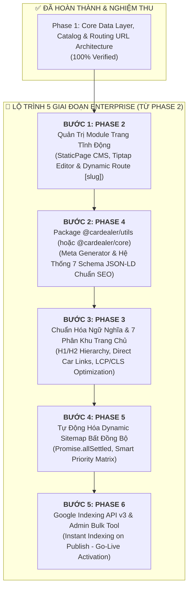
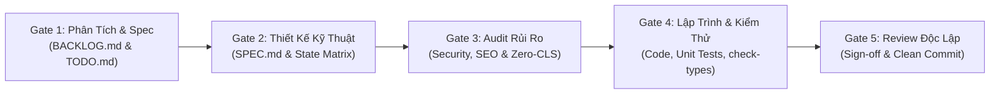

# 🗺️ MASTER PLAN & LỘ TRÌNH PHÁT TRIỂN KỸ THUẬT: CARDEALER CMS & TECHNICAL SEO ENTERPRISE

> **Chuẩn vận hành**: Universal Agentic Workflow (v2.2)  
> **Dự án**: Nền Tảng Showroom Ô Tô & Đại Lý Ủy Quyền Chính Hãng (CarDealer)  
> **Cập nhật gần nhất**: 2026-10-01  
> **Trạng thái tổng thể**: Phase 1 & Nền Tảng Routing URL đã hoàn thành (100% DONE). Đang kích hoạt lộ trình 5 giai đoạn Master Plan từ **Phase 2**.

---

## 🏛️ Quản Trị Môi Trường (Environment Governance)

```xml
<environment_governance>
  <environment id="case_a" mode="SANDBOX_GREENFIELD">
    <condition>Giai đoạn phát triển / Dev Sandbox / Chưa Live Production</condition>
    <behavior>Tối ưu tốc độ lặp, quản trị toàn bộ trang tĩnh từ CMS Admin; hoãn ping API bên ngoài (Google Indexing) cho đến giai đoạn kiểm thử cuối.</behavior>
  </environment>
</environment_governance>
```

---

## 🧭 Sơ Đồ Tổng Quan Lộ Trình Triển Khai (Phased Roadmap)


```mermaid
graph TD
    subgraph COMPLETED ["✅ ĐÃ HOÀN THÀNH & NGHIỆM THU"]
        P1["Phase 1: Core Data Layer, Catalog & Routing URL Architecture<br/>(100% Verified)"]
    end

    subgraph MASTER_PLAN ["🚀 LỘ TRÌNH 5 GIAI ĐOẠN ENTERPRISE (TỪ PHASE 2)"]
        direction TB
        STEP1["<b>BƯỚC 1: PHASE 2</b><br/>Quản Trị Module Trang Tĩnh Động<br/>(StaticPage CMS, Tiptap Editor & Dynamic Route [slug])"]
        STEP2["<b>BƯỚC 2: PHASE 4</b><br/>Package @cardealer/utils (hoặc @cardealer/core)<br/>(Meta Generator & Hệ Thống 7 Schema JSON-LD Chuẩn SEO)"]
        STEP3["<b>BƯỚC 3: PHASE 3</b><br/>Chuẩn Hóa Ngữ Nghĩa & 7 Phân Khu Trang Chủ<br/>(H1/H2 Hierarchy, Direct Car Links, LCP/CLS Optimization)"]
        STEP4["<b>BƯỚC 4: PHASE 5</b><br/>Tự Động Hóa Dynamic Sitemap Bất Đồng Bộ<br/>(Promise.allSettled, Smart Priority Matrix)"]
        STEP5["<b>BƯỚC 5: PHASE 6</b><br/>Google Indexing API v3 & Admin Bulk Tool<br/>(Instant Indexing on Publish - Go-Live Activation)"]

        STEP1 --> STEP2
        STEP2 --> STEP3
        STEP3 --> STEP4
        STEP4 --> STEP5
    end

    P1 --> STEP1
```

---

## 📊 Bảng Ma Trận Tổng Quan Các Giai Đoạn (Execution Matrix)

| Bước | Giai Đoạn | Tên Phân Hệ (Epic) | Trọng Tâm Kỹ Thuật | Phạm Vi Tệp Tin Tác Động | Trạng Thái / Ưu Tiên |
| :---: | :---: | :--- | :--- | :--- | :---: |
| **0** | **Phase 1** | **Core Data Layer, Catalog & Routing** | 10 thực thể PostgreSQL, CRUD API, Admin Skeleton Zero-CLS, SSG Routing (`/dong-xe/[segment]`, `/xe/[carSlug]`) | `packages/database`, `packages/types`, `apps/api`, `apps/admin`, `apps/web` | ✅ **HOÀN THÀNH (100%)** |
| **1** | **Phase 2** | **Quản Trị Trang Tĩnh Động (E-E-A-T)** | Bảng `StaticPage`, CMS Editor 2 cột (Tiptap + SEO Sidebar), dynamic catch-all route `[slug]` với 4 layout templates | `packages/database/src/schema/static-pages.ts`<br/>`apps/admin/app/pages/`<br/>`apps/web/app/[slug]/page.tsx` | ⏳ **TIẾP THEO (Bước 1)** |
| **2** | **Phase 4** | **Package Utils: Meta & 7 Schema JSON-LD** | Đóng gói SEO technical, `generatePageMetadata()`, Canonical dọn query params, 7 Schemas (Car, AutoDealer, News, FAQ, FinanceApp, Video, Breadcrumb) | `packages/utils/src/seo/metadata.ts`<br/>`packages/utils/src/seo/schemas.ts`<br/>`packages/utils/src/index.ts` | 📌 **Bước 2** |
| **3** | **Phase 3** | **Chuẩn Hóa Ngữ Nghĩa 7 Block Trang Chủ** | H1 duy nhất, banner WebP/AVIF priority LCP, liên kết nội bộ trực tiếp `/xe/[carSlug]`, alt Local SEO Nghệ An, Freshness news | `apps/web/app/page.tsx`<br/>`apps/web/components/home/*` | 📌 **Bước 3** |
| **4** | **Phase 5** | **Dynamic Sitemap Bất Đồng Bộ** | `sitemap.ts` dùng `Promise.allSettled`, phân bổ priority tự động: 1.0 (Trang chủ), 0.9 (Dòng xe lẻ & Bài viết bán hàng), 0.8 (Static pages & /xe), 0.7 (Tin tức) | `apps/web/app/sitemap.ts` | 📌 **Bước 4** |
| **5** | **Phase 6** | **Google Indexing API v3 & Admin Bulk Tool** | Service Account JWT auth, hook `indexOnPublish`, giao diện Admin submit hàng loạt URL và bảng theo dõi logs | `packages/utils/src/google/indexing.ts`<br/>`apps/admin/app/api/indexing/`<br/>`apps/admin/app/google-indexing/` | 📌 **Bước 5 (Go-Live)** |

---

## 📋 Chi Tiết Từng Giai Đoạn Triển Khai (Detail Specifications)

### 📦 Phase 1: Core Data Layer, Catalog & Routing URL Architecture (ĐÃ HOÀN THÀNH)
> **Trạng thái thực thi**: ✅ **ĐÃ HOÀN THÀNH & NGHIỆM THU 100% (Delivered to Main)**  
> **Tài liệu tham chiếu**: [`docs/features/PHASE-1-CATALOG-DATA/`](./features/PHASE-1-CATALOG-DATA/), [`docs/features/ROUTING-URL-ARCHITECTURE/`](./features/ROUTING-URL-ARCHITECTURE/)

* **Thành quả cốt lõi:**
  * Cơ sở dữ liệu PostgreSQL chuẩn hóa với Drizzle ORM: Bảng `cars`, `car_versions`, `colors`, `version_colors`, `posts`, `categories`, `leads`, `system_settings`, `users`, `audit_logs`.
  * Bộ APIs xác thực JWT an toàn (`/api/auth/login`, `/api/auth/me`, `/api/auth/logout`), RBAC Middleware và Protected Routes.
  * Giao diện Admin quản trị danh mục xe (`/cars`), chi tiết xe (`/cars/[slug]`), bảng màu ngoại thất (`/colors`), cấu hình toàn cục (`/settings`) với Skeleton Shimmer Loading (Zero-CLS).
  * Kiến trúc Routing URL chuẩn SEO:
    * Tuyến cố định phân khúc xe: `/dong-xe/sedan`, `/dong-xe/suv`, `/dong-xe/mpv` (Static Site Generation 100%).
    * Tuyến chi tiết xe kết hợp tham số: `/xe/[carSlug]?phien-ban=[versionSlug]&mau=[colorSlug]`.
    * Bộ lọc danh mục `/xe` lọc tức thì bằng query parameters.
    * 127/127 unit tests pass, type-check monorepo 0 errors.

---

### 📄 PHASE 2: Quản Trị Module Trang Tĩnh Động (E-E-A-T & Custom SEO Management)
> **Mã Epic**: `EPIC-PHASE-2-STATIC-PAGES-CMS`  
> **Trọng tâm**: Quản trị trang tĩnh chuẩn E-E-A-T từ Admin & Render động qua Server Component tại Web Client  
> **Trạng thái**: ⏳ **SẴN SÀNG KHỞI ĐỘNG (BƯỚC 1)**

#### 1. Mục tiêu & Giá trị
Xây dựng module Static Pages hoàn chỉnh trong CMS Admin cho phép ban biên tập và chuyên viên marketing tạo/sửa các trang tĩnh quan trọng (`/gioi-thieu`, `/chinh-sach-bao-mat`, `/quy-trinh-mua-xe`, `/tra-gop`...) với bộ cấu hình SEO riêng biệt từng trang và render động mượt mà qua một catch-all route duy nhất ở web client.

#### 2. Tệp tin tác động
* **Database & Contracts:**
  * `packages/database/src/schema/static-pages.ts` (Drizzle Schema) hoặc `packages/database/prisma/schema.prisma`
  * `packages/types/src/static-pages.ts`
  * `packages/database/src/schema/index.ts`
* **Admin CMS (`apps/admin`):**
  * `apps/admin/app/pages/page.tsx` *(Danh sách trang tĩnh, tìm kiếm, lọc trạng thái, thao tác nhanh)*
  * `apps/admin/app/pages/[id]/page.tsx` *(Editor soạn thảo 2 cột: Content + SEO Sidebar)*
  * `apps/admin/app/pages/new/page.tsx` *(Tạo trang tĩnh mới)*
  * `apps/admin/components/pages/page-form.tsx`
  * `apps/admin/components/pages/serp-preview.tsx`
* **API Route (`apps/api`):**
  * `apps/api/src/routes/admin/pages.ts` *(CRUD APIs)*
  * `apps/api/src/routes/public/pages.ts` *(Public API fetch trang tĩnh theo slug)*
* **Web Client (`apps/web`):**
  * `apps/web/app/[slug]/page.tsx` *(Server Component render động phía client)*
  * `apps/web/components/pages/templates/profile-showroom.tsx`
  * `apps/web/components/pages/templates/default-legal.tsx`
  * `apps/web/components/pages/templates/timeline-process.tsx`
  * `apps/web/components/pages/templates/finance-calc.tsx`

#### 3. Nhiệm vụ kỹ thuật chi tiết
1. **Thiết kế Schema Database (`StaticPage`):**
   * *Trường nội dung*:
     * `id`: UUID Primary Key.
     * `title`: Tiêu đề trang (ví dụ: "Giới thiệu Hyundai Vinh").
     * `slug`: Đường dẫn URL duy nhất (Unique), tự động slugify từ title (`gioi-thieu`, `chinh-sach-bao-mat`...).
     * `content`: Dữ liệu Rich-text JSON của Tiptap Editor.
     * `templateType`: Kiểu mẫu hiển thị (`DEFAULT`, `PROFILE_SHOWROOM`, `TIMELINE`, `FINANCE`).
     * `isPublished`: Trạng thái xuất bản (boolean).
     * `createdAt`, `updatedAt`: Timestamps.
   * *Trường SEO chuyên biệt (Custom SEO fields)*:
     * `metaTitle`: Tiêu đề hiển thị trên Google SERP (50-60 ký tự).
     * `metaDescription`: Mô tả tóm tắt chuẩn SEO (150-160 ký tự).
     * `canonicalUrl`: URL chuẩn hóa (nếu muốn override).
     * `ogImage`: Ảnh chia sẻ mạng xã hội (OpenGraph / Zalo / Facebook).
     * `noIndex`: Cờ chặn bot Google thu thập thông tin (boolean).
     * `schemaType`: Loại Schema JSON-LD tương ứng (`AboutPage`, `HowTo`, `WebPage`).

2. **Giao diện CMS Admin (`apps/admin`):**
   * **Bố cục 2 khu vực chuyên nghiệp**:
     * **Khu vực nội dung (Chính - 70% width):** Ô nhập Tiêu đề, Slug (kèm nút tạo tự động), bộ soạn thảo Rich-text Tiptap (hỗ trợ chèn Callout Box, Image upload, Table, FAQ Accordion).
     * **Khu vực Sidebar SEO (Phải - 30% width):**
       * Khung xem trước kết quả tìm kiếm Google (SERP Preview) mô phỏng chính xác giao diện tìm kiếm Mobile & Desktop.
       * Ô nhập `Meta Title` và `Meta Description` kèm thanh đo độ dài ký tự tối ưu (Progress Bar màu xanh/vàng/đỏ).
       * Ô tải ảnh đại diện `OG:Image` (tích hợp Media Library).
       * Toggle chuyển đổi `noIndex` (Bật để ngăn index trang nháp hoặc chính sách nội bộ).
       * Dropdown chọn `templateType` và `schemaType`.

3. **Server Component động tại Web Client (`apps/web/app/[slug]/page.tsx`):**
   * **Hàm `generateMetadata({ params })`**:
     * Truy vấn bản ghi `StaticPage` theo `params.slug`.
     * Tự động inject `title`, `description`, `openGraph`, `canonicalUrl`, và `robots` (`index: !page.noIndex, follow: !page.noIndex`) vào thẻ `<head>` của Next.js.
     * Trả về `notFound()` nếu trang không tồn tại hoặc `isPublished === false` (ở môi trường người dùng).
   * **Render layout linh hoạt theo `templateType`**:
     * `PROFILE_SHOWROOM` (`/gioi-thieu`): Bố cục hồ sơ Saler/Đại lý (ảnh đại diện chuyên nghiệp, chứng nhận hãng Hyundai Thành Công, số năm kinh nghiệm, 4 cam kết vàng) kết hợp thông tin quy mô showroom 3S và Google Maps nhúng.
     * `DEFAULT` (`/chinh-sach-bao-mat`, `/dieu-khoan-su-dung`): Trình bày văn bản pháp lý mạch lạc, typography thoáng đãng, cam kết bảo mật số điện thoại và thông tin liên hệ Zalo của khách.
     * `TIMELINE` (`/quy-trinh-mua-xe`): Trình bày quy trình 5 bước mua xe đồ họa sinh động (Đặt cọc ➡️ Hoàn tất hồ sơ ngân hàng ➡️ Đăng ký biển số ➡️ Kiểm tra PDI ➡️ Bàn giao xe).
     * `FINANCE` (`/tra-gop`): Tích hợp bảng kiểm tra điều kiện vay vốn ngân hàng, lãi suất ưu đãi đại lý và công cụ tính nhẩm dư nợ trả góp hàng tháng.

#### 4. Tiêu chí nghiệm thu (DoD)
- [ ] Chạy migration bảng `static_pages` thành công vào database PostgreSQL.
- [ ] Admin CRUD trang tĩnh hoạt động 100%: Tạo mới, sửa nội dung Tiptap, chỉnh sửa meta SEO, bật/tắt xuất bản.
- [ ] SERP Preview trong Admin cập nhật thời gian thực khi gõ Meta Title và Meta Description.
- [ ] Route web client `/[slug]` render chính xác 4 loại template và tự động inject meta tags vào `<head>`.
- [ ] Thử nghiệm với các trang cốt lõi: `/gioi-thieu` (PROFILE_SHOWROOM), `/chinh-sach-bao-mat` (DEFAULT), `/quy-trinh-mua-xe` (TIMELINE) hiển thị chuẩn mực và không lỗi layout.
- [ ] `check-types` monorepo 0 errors, unit test cho service StaticPage pass 100%.

---

### 📦 PHASE 4: Xây Dựng Package `@cardealer/utils` — Meta & Hệ Thống 7 Schema JSON-LD
> **Mã Epic**: `EPIC-PHASE-4-SEO-SCHEMAS-UTILS`  
> **Trọng tâm**: Đóng gói toàn bộ logic SEO kỹ thuật vào Monorepo Package tái sử dụng, render dữ liệu có cấu trúc SSR chuẩn xác 100%  
> **Trạng thái**: 📌 **BƯỚC 2 (Khuyến nghị thực hiện sau Phase 2 để chuẩn hóa schema cho toàn hệ thống)**

#### 1. Mục tiêu & Giá trị
Xây dựng package `@cardealer/utils` (hoặc mở rộng module SEO trong `@cardealer/core`) cung cấp thư viện utilities dùng chung cho cả Web Client và API: sinh meta tags chuẩn hóa, làm sạch canonical URL và render tự động 7 loại Schema JSON-LD chuẩn Google Rich Results.

#### 2. Tệp tin tác động
* `packages/utils/src/seo/metadata.ts` (hoặc `packages/core/src/seo/metadata.ts`)
* `packages/utils/src/seo/schemas.ts` (hoặc `packages/core/src/seo/schemas.ts`)
* `packages/utils/src/seo/types.ts`
* `packages/utils/src/index.ts`
* `packages/utils/package.json`

#### 3. Nhiệm vụ kỹ thuật chi tiết
1. **`metadata.ts` (Trình sinh Metadata tự động):**
   * Xây dựng hàm `generatePageMetadata(options)`:
     * Định dạng title template: `%s | Đại lý ủy quyền chính hãng`.
     * Tự động làm sạch URL: Loại bỏ toàn bộ query parameters tracking và rác (`fbclid`, `utm_*`, `gclid`, `phien-ban`, `mau`) để sinh thẻ `canonical` trỏ về URL gốc duy nhất (ví dụ: truy cập `https://xehyundaivinh.com/xe/custin?fbclid=xyz&phien-ban=dac-biet` ➡️ canonical luôn là `https://xehyundaivinh.com/xe/custin`).
     * Cấu hình thẻ robots tối ưu cho crawler: `index: true, follow: true, max-image-preview: 'large', max-snippet: -1, max-video-preview: -1`.
     * Cấu hình OpenGraph & Twitter Card chuẩn tỷ lệ 1200x630.

2. **`schemas.ts` (Lập trình 7 cấu trúc Schema JSON-LD):**
   * **1. Schema Xe Ô Tô (`Car` & `Product`):**
     * Áp dụng tại `/xe/[carSlug]`.
     * Tích hợp FOMO `priceValidUntil`: Tự động tính ngày cuối cùng của tháng hiện tại lúc 23:59:59 để kích thích khách hàng liên hệ trước đợt tăng giá.
     * Chính sách hoàn trả `hasMerchantReturnPolicy`: 7 ngày đổi trả nếu phát hiện lỗi kỹ thuật từ nhà sản xuất.
     * Miễn phí vận chuyển `shippingDetails`: 0 VNĐ, thời gian giao xe 0-3 ngày tại showroom hoặc tận nhà.
     * Gói bảo hành chính hãng `warranty`: 5 năm hoặc 100.000 km theo tiêu chuẩn hãng.
   * **2. Schema Doanh nghiệp địa phương (`AutoDealer`):**
     * Render tại trang chủ (`/`) với tên đại lý showroom, địa chỉ đầy đủ, hotline 24/7, tọa độ vệ tinh GPS Google Maps, khoảng giá `$$$`, giờ mở cửa 07:30 - 18:00.
   * **3. Schema Bài viết (`NewsArticle`):**
     * Render tại `/tin-tuc/[slug]` gồm tiêu đề bài viết, ngày đăng (`datePublished`), ngày sửa đổi (`dateModified`), tác giả (`author`: Chuyên viên tư vấn), nhà xuất bản (`publisher`: Hyundai Vinh kèm logo).
   * **4. Schema Hỏi đáp (`FAQPage`):**
     * Tự động bóc tách từ các block Accordion FAQ trong bài viết hoặc trang tĩnh ra định dạng hỏi-đáp trên SERP Google (`mainEntity: [{ @type: 'Question', name, acceptedAnswer }]`).
   * **5. Schema Công cụ tài chính (`SoftwareApplication`):**
     * Render tại `/gia-lan-banh` và `/tra-gop` với `applicationCategory: "FinanceApplication"`, `operatingSystem: "All"`, `offers: { price: '0', priceCurrency: 'VND' }`.
   * **6. Schema Video (`VideoObject`):**
     * Tự động trích xuất thông tin video khi bài viết có chứa khối YouTube hoặc Media, sinh thumbnail, ngày tải lên và mô tả.
   * **7. Schema Điều hướng phân cấp (`BreadcrumbList`):**
     * Render cho tất cả các trang chi tiết xe (`Trang chủ > Dòng xe [Phân khúc] > [Tên Xe]`), bài viết tin tức và các trang tĩnh.

#### 4. Tiêu chí nghiệm thu (DoD)
- [ ] Package build thành công ra định dạng ESM/CJS và export đầy đủ types.
- [ ] Unit test pass 100% cho `generatePageMetadata`: Kiểm tra đúng title template, lọc sạch toàn bộ query tracking khỏi canonical.
- [ ] 7 hàm schema trả về JSON-LD hợp lệ 100% khi kiểm thử với validator của Schema.org.
- [ ] Tích hợp thử nghiệm trên một trang mẫu và verify qua Google Rich Results Test đạt 0 cảnh báo.

---

### 🏠 PHASE 3: Chuẩn Hóa Ngữ Nghĩa & Tối Ưu 7 Block Trang Chủ
> **Mã Epic**: `EPIC-PHASE-3-HOMEPAGE-SEMANTICS-OPTIMIZATION`  
> **Trọng tâm**: Phân cấp Heading (H1-H2), liên kết nội bộ trực tiếp về từng xe (`/xe/[carSlug]`) & Tối ưu Core Web Vitals (LCP, CLS)  
> **Trạng thái**: 📌 **BƯỚC 3**

#### 1. Mục tiêu & Giá trị
Tái cấu trúc và nâng cấp toàn diện trang chủ thành một cỗ máy SEO và chuyển đổi hoàn hảo: phân cấp ngữ nghĩa chuẩn mực cho Google Crawler, liên kết nội bộ dày đặc trỏ thẳng về từng mẫu xe và tối ưu hiệu suất tải trang đạt điểm Core Web Vitals cao nhất.

#### 2. Tệp tin tác động
* `apps/web/app/page.tsx`
* `apps/web/components/home/hero-banner.tsx` (Khu 1)
* `apps/web/components/home/quick-filter.tsx` (Khu 2)
* `apps/web/components/home/featured-cars.tsx` (Khu 3)
* `apps/web/components/home/pricing-cta.tsx` (Khu 4)
* `apps/web/components/home/vip-showroom.tsx` (Khu 5)
* `apps/web/components/home/social-proof-delivery.tsx` (Khu 6)
* `apps/web/components/home/latest-promotions.tsx` (Khu 7)

#### 3. Nhiệm vụ kỹ thuật chi tiết theo 7 Phân Khu
* **Khu 1 (Hero Event Banner & Countdown):**
  * Khai báo duy nhất **1 thẻ `<h1>`** cho toàn bộ trang chủ: Tiêu đề chứa từ khóa trọng tâm địa phương (ví dụ: *"Đại Lý Ủy Quyền Xe Hyundai Chính Hãng Tại Nghệ An & Hà Tĩnh"*).
  * Banner sự kiện định dạng WebP/AVIF tối ưu dung lượng, đi kèm thuộc tính `priority={true}` và `fetchPriority="high"` để đạt điểm LCP < 1.5s.
  * Bộ đếm ngược Countdown sử dụng SSR-friendly markup để tránh chớp giật layout (CLS = 0).
* **Khu 2 (Lead Magnet Hub - Bộ lọc nhanh):**
  * Thanh chọn ngân sách (Dưới 500tr, 500-800tr, Trên 800tr) và kiểu dáng xe (Sedan, SUV, MPV).
  * Các nút kết quả lọc chứa thẻ `<Link href="/xe/[carSlug]">` trỏ thẳng về các mẫu xe tương ứng để bot tìm kiếm cào được liên kết thật (crawleable internal links) thay vì chỉ gắn event JavaScript onClick.
* **Khu 3 (Dòng Xe Bán Chạy):**
  * Gắn thẻ `<h2>` nhắm từ khóa phân khúc xe bán chạy (ví dụ: *"Bảng Giá & Các Dòng Xe Hyundai Đang Ưu Đãi"*).
  * Thẻ Card sản phẩm chuẩn ngữ nghĩa semantic HTML (`<article>`), dẫn link nội bộ trực tiếp về `/xe/[carSlug]`.
  * Hiển thị giá niêm yết chuẩn, mức trả trước gợi ý từ X triệu và huy hiệu ưu đãi trong tháng.
* **Khu 4 (Banner Mồi Câu Tính Giá):**
  * Tiêu đề `<h2>` nhắm từ khóa: *"Dự toán lăn bánh & Nhận báo giá đại lý tốt nhất"*.
  * Nút bấm Call-To-Action dẫn thẳng vào `/gia-lan-banh` kèm query params xe gợi ý.
* **Khu 5 (VIP Showroom / Hồ Sơ Saler Uy Tín):**
  * Tiêu đề `<h2>`: *"Showroom Chuẩn 3S & Hồ Sơ Năng Lực Đại Lý"*.
  * Khai báo địa chỉ chi tiết, hotline bán hàng 24/7, nhúng bản đồ Google Maps tương tác và hiển thị chứng nhận đại lý ủy quyền 3S chính hãng.
* **Khu 6 (Bàn Giao Xe Thực Tế - Social Proof):**
  * Tiêu đề `<h2>`: *"Hình Ảnh Bàn Giao Xe Thực Tế Cho Khách Hàng"*.
  * Toàn bộ ảnh bàn giao xe thật phải có thuộc tính `alt` chuẩn Local SEO: *"Bàn giao xe Hyundai [Tên xe] cho khách hàng [Tên khách] tại [Địa phương - Nghệ An/Hà Tĩnh]"*.
  * Tích hợp responsive image loading với `loading="lazy"`.
* **Khu 7 (Tin Tức Khuyến Mại & Sự Kiện):**
  * Tiêu đề `<h2>`: *"Tin Tức Ưu Đãi & Cẩm Nang Lăn Bánh Xe Ô Tô"*.
  * Tự động query 3-4 bài viết ưu đãi mới nhất từ database (`isPublished: true`) để duy trì độ tươi mới (Freshness) liên tục cho trang chủ.

#### 4. Tiêu chí nghiệm thu (DoD)
- [ ] Kiểm tra DOM trang chủ: Duy nhất 1 thẻ `<h1>`, các phân khu 2-7 sử dụng thẻ `<h2>` chuẩn phân cấp.
- [ ] 100% liên kết đến từng mẫu xe dùng thẻ `<Link href="/xe/[carSlug]">`, bot tìm kiếm cào được liên kết nội bộ tự nhiên.
- [ ] Tất cả hình ảnh có đầy đủ `alt`, `width`, `height`, banner chính có `priority={true}`.
- [ ] Điểm số Lighthouse / PageSpeed Insights trang chủ: Performance >= 90, SEO = 100, LCP < 2.0s, CLS = 0.

---

### 🗺️ PHASE 5: Tự Động Hóa Dynamic Sitemap Bất Đồng Bộ (`sitemap.ts`)
> **Mã Epic**: `EPIC-PHASE-5-DYNAMIC-SITEMAP`  
> **Trọng tâm**: Thu thập toàn bộ URL từ DB và Static Pages, phân cấp độ ưu tiên thông minh  
> **Trạng thái**: 📌 **BƯỚC 4**

#### 1. Mục tiêu & Giá trị
Tự động hóa hoàn toàn file XML Sitemap phục vụ bot Google, thu thập đa luồng không tắc nghẽn toàn bộ URL xe, bài viết và các trang tĩnh mới tạo từ CMS Phase 2, phân cấp mức độ ưu tiên khoa học theo tỷ lệ chuyển đổi bán hàng.

#### 2. Tệp tin tác động
* `apps/web/app/sitemap.ts`
* `packages/core/src/sitemap/` (hoặc `packages/utils/src/sitemap/`)

#### 3. Nhiệm vụ kỹ thuật chi tiết
1. **Truy vấn bất đồng bộ đa luồng (`Promise.allSettled`):**
   * Fetch song song 4 luồng dữ liệu độc lập:
     * Danh sách dòng xe đang hoạt động (`/xe/[carSlug]`).
     * Danh sách bài viết tin tức đã xuất bản (`/tin-tuc/[slug]`).
     * Danh sách trang tĩnh từ bảng `StaticPage` (`isPublished === true` và `noIndex === false`).
     * Danh sách phân khúc xe cố định (`/dong-xe/sedan`, `/dong-xe/suv`, `/dong-xe/mpv`).
   * Sử dụng `Promise.allSettled` đảm bảo nếu một truy vấn database bị timeout hoặc lỗi nhẹ, sitemap vẫn sinh thành công các URL còn lại mà không làm gãy toàn trang.

2. **Quy tắc phân cấp Priority & Change Frequency thông minh:**
   * `priority: 1.0` (`changefreq: 'daily'`): Trang chủ (`/`).
   * `priority: 0.9` (`changefreq: 'daily'`): Toàn bộ các trang dòng xe lẻ (`/xe/accent`, `/xe/creta`, `/xe/santa-fe`, `/xe/tucson`...) — đây là các trang bán hàng trực tiếp cần được crawler ghé thăm mỗi ngày.
   * `priority: 0.9` (`changefreq: 'daily'`): Các bài viết tin tức có slug chứa từ khóa bán hàng chuyển đổi cao: `gia-lan-banh`, `khuyen-mai`, `uu-dai`.
   * `priority: 0.8` (`changefreq: 'weekly'`):
     * Trang tổng hợp danh sách xe (`/xe`).
     * Các trang phân khúc (`/dong-xe/sedan`, `/dong-xe/suv`, `/dong-xe/mpv`).
     * Trang công cụ lăn bánh (`/gia-lan-banh`) và trả góp (`/tra-gop`).
     * Toàn bộ các trang tĩnh lấy từ bảng `StaticPage` (`isPublished === true` và `noIndex === false`, ví dụ: `/gioi-thieu`, `/quy-trinh-mua-xe`).
   * `priority: 0.7` (`changefreq: 'weekly'`): Các bài viết tin tức phân tích kỹ thuật, cẩm nang lái xe thông thường.
   * **Loại trừ tuyệt đối**: Không đưa vào sitemap các URL có `noIndex: true`, các trang admin, trang cảm ơn hoặc đường dẫn chứa query parameters rác.

#### 4. Tiêu chí nghiệm thu (DoD)
- [ ] Truy cập `/sitemap.xml` trả về XML chuẩn giao thức sitemap của Google.
- [ ] Thời gian sinh sitemap < 500ms nhờ `Promise.allSettled` và caching hợp lý.
- [ ] Kiểm tra đầy đủ URL của các trang tĩnh vừa tạo trong Admin Phase 2 xuất hiện chuẩn xác với priority 0.8.
- [ ] Không có bất kỳ URL trùng lặp hoặc URL 404 nào trong sitemap.

---

### ⚡ PHASE 6: Tích Hợp Google Indexing API v3 & Admin Bulk Tool
> **Mã Epic**: `EPIC-PHASE-6-GOOGLE-INDEXING-API`  
> **Trọng tâm**: Tự động thông báo Google Service Account khi xuất bản & Công cụ gửi hàng loạt URL trong Admin  
> **Trạng thái**: 📌 **BƯỚC 5 (Kích hoạt khi chuẩn bị Go-Live / Deploy Production)**

#### 1. Mục tiêu & Giá trị
Rút ngắn thời gian thu thập và lập chỉ mục của Google bot từ vài ngày/tuần xuống chỉ còn vài phút. Tự động hóa gửi thông báo `URL_UPDATED` ngay khi bài viết hoặc trang xe được bấm xuất bản trong Admin, đi kèm công cụ hỗ trợ Submit hàng loạt danh sách URL linh hoạt.

#### 2. Tệp tin tác động
* `packages/utils/src/google/indexing.ts` (hoặc `packages/core/src/google/indexing.ts`)
* `apps/admin/app/api/indexing/route.ts`
* `apps/admin/app/google-indexing/page.tsx`
* `apps/admin/components/google-indexing/bulk-submit-form.tsx`
* `apps/admin/components/google-indexing/indexing-logs-table.tsx`

#### 3. Nhiệm vụ kỹ thuật chi tiết
1. **Cấu hình Google Service Account:**
   * Khai báo biến môi trường:
     * `GOOGLE_CLIENT_EMAIL`: Email của Google Service Account được cấp quyền Owner trong Google Search Console.
     * `GOOGLE_PRIVATE_KEY`: Private Key chứng thực RSA.
     * `GOOGLE_PROJECT_ID`: ID dự án Google Cloud Platform.
   * Xây dựng module xác thực JWT OAuth2 kết nối trực tiếp đến endpoint `https://indexing.googleapis.com/v3/urlNotifications:publish`.

2. **Hook tự động `indexOnPublish`:**
   * Tự động kích hoạt khi có sự kiện:
     * Tạo mới hoặc cập nhật một dòng xe sang trạng thái công khai (`/xe/[carSlug]`).
     * Xuất bản bài viết tin tức mới (`/tin-tuc/[slug]`).
     * Xuất bản trang tĩnh từ bảng `StaticPage` (`/[slug]`).
   * Gửi request `type: "URL_UPDATED"` kèm URL tuyệt đối của trang.
   * Ghi log kết quả (Status code, timestamp, message) vào bảng `audit_logs` để dễ dàng tra cứu.

3. **Giao diện Quản trị `/admin/google-indexing`:**
   * **Công cụ Bulk Submit**:
     * Khung Textarea cho phép dán danh sách hàng chục URL cần index (mỗi URL một dòng).
     * Nút "Gửi Indexing Lập Tức" kèm thanh tiến trình gửi tuần tự (rate-limit 5 requests/giây để tránh vượt quota Google).
     * Nút chọn nhanh: "Gửi toàn bộ URL xe", "Gửi toàn bộ URL trang tĩnh", "Gửi Sitemap URL".
   * **Bảng Lịch Sử & Nhật Ký Indexing (Logs Table)**:
     * Hiển thị danh sách các URL đã gửi, thời gian gửi, trạng thái phản hồi (HTTP 200 OK / 429 Quota Exceeded / Error), và người thực hiện.

#### 4. Tiêu chí nghiệm thu (DoD)
- [ ] Gửi thử nghiệm một URL hợp lệ qua Google Indexing API nhận mã phản hồi HTTP 200 từ máy chủ Google.
- [ ] Thao tác đổi trạng thái bài viết/trang tĩnh sang "Published" trong Admin tự động kích hoạt ping API không làm đơ giao diện (chạy nền asynchronous).
- [ ] Giao diện `/admin/google-indexing` hoạt động trơn tru: parse danh sách URL, hiển thị toast thông báo thành công và lưu log vào hệ thống.

---

## 🚦 Quy Trình Vận Hành 5 Gates Cho Từng Phase (Universal Agentic Workflow v2.2)

Để đảm bảo tính kỷ luật và chất lượng kỹ thuật cao nhất, mỗi Phase từ Phase 2 đến Phase 6 đều phải tuân thủ nghiêm ngặt chu trình 5 Gates:


```mermaid
graph LR
    G1["Gate 1: Phân Tích & Spec<br/>(BACKLOG.md & TODO.md)"] --> G2["Gate 2: Thiết Kế Kỹ Thuật<br/>(SPEC.md & State Matrix)"]
    G2 --> G3["Gate 3: Audit Rủi Ro<br/>(Security, SEO & Zero-CLS)"]
    G3 --> G4["Gate 4: Lập Trình & Kiểm Thử<br/>(Code, Unit Tests, check-types)"]
    G4 --> G5["Gate 5: Review Độc Lập<br/>(Sign-off & Clean Commit)"]
```

1. **Gate 1 - Strategic Analysis**: Khởi tạo thư mục tính năng trong `docs/features/PHASE-X-.../`, lập `BACKLOG.md` và `TODO.md` chi tiết.
2. **Gate 2 - Technical Design**: Xác lập schema, API contract, flow trạng thái và phương án tối ưu trải nghiệm người dùng.
3. **Gate 3 - Risk Audit**: Rà soát rủi ro xung đột route, trùng lặp SEO canonical, CLS trên thiết bị di động và phân quyền dữ liệu.
4. **Gate 4 - Execution & Testing**: Triển khai mã nguồn chuẩn TypeScript, chạy unit tests và xác nhận không có lỗi linter/typecheck.
5. **Gate 5 - Independent Review**: Đối chiếu nghiệm thu toàn diện theo DoD, cập nhật checklist và commit git chuẩn Conventional Commits.

---

## 🏁 Trình Tự Thực Thi Khuyến Nghị Cho Môi Trường Sandbox

Dựa trên nguyên tắc tối ưu tốc độ lặp trong môi trường `SANDBOX_GREENFIELD`:
1. **Bước 1**: Bắt đầu triển khai ngay **PHASE 2** (Module quản trị `StaticPage` trong Admin + Dynamic route `[slug]` ở Client).
2. **Bước 2**: Chạy **PHASE 4** (Khởi tạo package `@cardealer/utils`, đóng gói Meta & 7 Schema JSON-LD).
3. **Bước 3**: Chạy **PHASE 3** (Chuẩn hóa ngữ nghĩa 7 khu vực Trang chủ trỏ link trực tiếp về từng xe).
4. **Bước 4**: Chạy **PHASE 5** (Hoàn thiện Dynamic `sitemap.ts` kết nối với DB `StaticPage` vừa tạo).
5. **Bước 5**: Chạy **PHASE 6** (Cấu hình Google Indexing API khi hoàn thành toàn bộ nội dung mẫu và chuẩn bị deploy).
