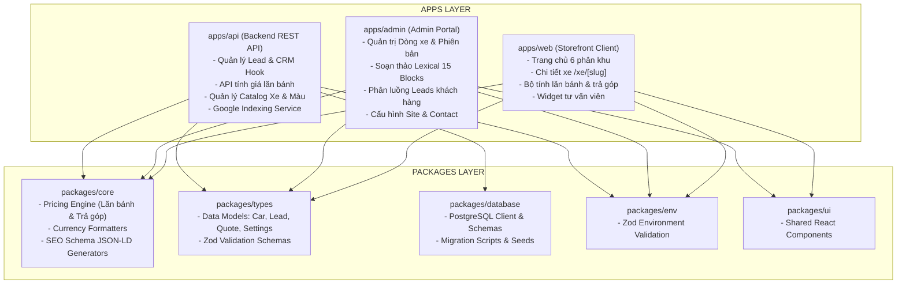

# 🗺️ SYSTEM MAP: CARDEALER PLATFORM ARCHITECTURE

Bản đồ kiến trúc tổng thể toàn hệ thống phân vùng các module của nền tảng CarDealer (Monorepo):

## 📍 Tọa Độ Phân Vùng Module & Tiến Độ

| Phân Vùng | Đường Dẫn Codebase | Trách Nhiệm & Nghiệp Vụ | Trạng Thái |
| :--- | :--- | :--- | :---: |
| **Catalog & Product** | `packages/database`, `packages/types/src/car.ts`, `apps/api`, `apps/admin` | Quản lý Core Entities (`Cars`, `CarVersions`, `Colors`, `VersionColors`...) | ✅ **Phase 1 (100%)** |
| **Global Settings** | `packages/database`, `apps/admin`, `apps/api` | Cấu hình Showroom (`showroomName`, `diaChi`, `hotline`, `zalo`, `social`...) | ✅ **Phase 1 (100%)** |
| **Admin User & RBAC** | `packages/database/src/schema/users.ts`, `apps/api`, `apps/admin` | Quản trị tài khoản nhân viên, phân quyền đa tầng (Admin, Manager, Editor, Sales), Audit Logs | ⏳ **Phase 2 (Next)** |
| **Financial Engine** | `packages/core/src/pricing/`, `apps/api/src/routes/quote.ts` | Thuật toán tính thuế trước bạ, biển số, bảo hiểm, lãi suất trả góp ngân hàng | ⏳ **Phase 3** |
| **Lead & CRM Funnel** | `packages/types/src/lead.ts`, `apps/api`, `apps/web` | Thu thập form, gắn tag Lead (`Event Lead`, `Báo Giá`), gửi thông báo | ⏳ **Phase 3** |
| **Storefront Experience** | `apps/web/app/`, `packages/ui` | 4.1 Shell & Widgets (✅ 100%), 4.2 Trang chủ 6 phân khu (✅ 100%), 4.3 Catalog /xe (✅ 100%), 4.4 /xe/[slug] (✅ 100% Hoàn Thành) | ✅ **Phase 4.4 (100%)** |
| **Content & Lexical** | `apps/admin`, `apps/web`, `packages/ui` | Trình soạn thảo 15 Content Blocks, nhúng TikTok không cuộn, FAQ accordion | ⏳ **Phase 5** |
| **SEO & Indexing** | `packages/core/src/seo/`, `apps/web`, `apps/api` | 7 Schema JSON-LD, Dynamic Sitemap, Google Indexing API v3 | ⏳ **Phase 6** |
| **AI Automation** | `packages/ai-engine`, `apps/api` | AI sinh bài SEO hàng tháng, FAQ Schema, Chatbot tư vấn showroom | ⏳ **Phase 7** |

---

## 🗺️ Lộ Trình Triển Khai Chi Tiết
Xem toàn bộ chiến lược phân rã 7 giai đoạn phát triển tại:
👉 [06. Lộ Trình Triển Khai Phân Tầng 7 Giai Đoạn](./06-PHASED-IMPLEMENTATION-ROADMAP.md)
