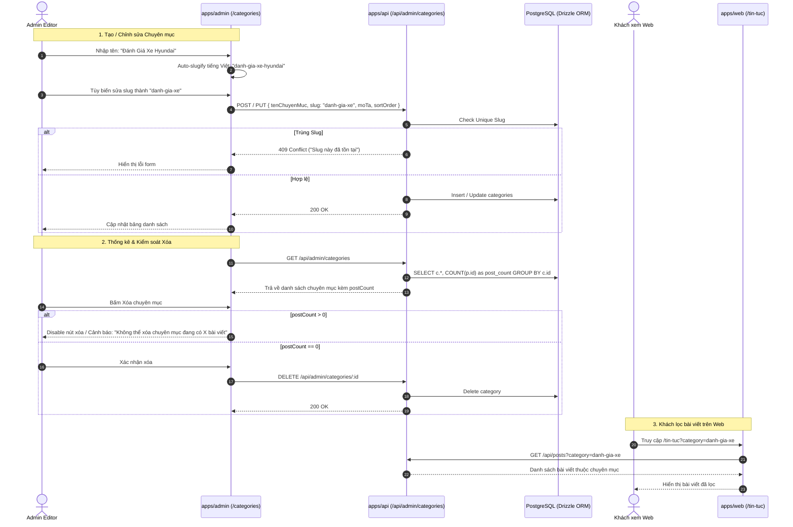

# 🎯 Feature Backlog: Quản Trị Chuyên Mục Bài Viết (Admin Categories Management)

## 1. Thông tin Tổng quan
* **Mã Feature:** `ADMIN-CATEGORIES-MANAGEMENT`
* **Dự án:** CarDealer Monorepo (`/Users/nhatphan/Code/CarDealer/cardealer`)
* **Mục tiêu Chiến lược:** Xây dựng module Quản trị Chuyên mục Bài viết (`/categories`) hoàn chỉnh trong `apps/admin`, nâng cấp API backend (`apps/api`) hỗ trợ đầy đủ CRUD chuyên mục kèm thống kê số bài viết (`postCount`), kiểm soát xóa an toàn (Restrict Delete Guard), tự động sinh slug tiếng Việt chuẩn SEO (hỗ trợ Admin tùy biến sửa tay), bắt buộc Unique Slug tuyệt đối, và đồng bộ query param `/tin-tuc?category={slug}` trên Storefront (`apps/web`).
* **Phạm vi Nền tảng:** Full-stack Monorepo:
  - Database: `packages/database` (Drizzle ORM, schema `categories` & `posts`)
  - Types: `packages/types` (Zod schemas, DTOs & Contracts)
  - Backend API: `apps/api` (REST endpoints `/api/admin/categories/*`)
  - Admin Portal: `apps/admin` (Trang quản trị `/categories`, Modal thêm/sửa, Delete Confirmation, Navigation Sidebar)
  - Storefront: `apps/web` (Bộ lọc `/tin-tuc?category={slug}`)
* **Cấp độ Thực thi:** **Tier 2 (Medium-Risk / Sub-feature & Admin Portal Extension)**
* **Trạng thái Môi trường:** 🟢 **Pure Development (Sandbox)**
* **Số lượng Lát cắt Dọc (Vertical Feature Slices):** 3 Slices (~7-8 files).

---

## 2. Ma trận Trạng thái Lát cắt Tính năng (Vertical Feature Slices Matrix)

| ID | User Story / Phân vùng Nghiệp vụ | Tầng Nền tảng | File Mục tiêu Dự kiến | Phương pháp Kiểm thử / Verification | Trạng thái |
| :--- | :--- | :--- | :--- | :--- | :--- |
| **US-01** | **Backend API & Data Contracts Enhancement** - Cập nhật DTOs & Zod schemas cho Category (`packages/types`) - Bổ sung đầy đủ REST endpoints: `GET /api/admin/categories` (kèm `postCount`), `POST /api/admin/categories`, `PUT /api/admin/categories/:id`, `DELETE /api/admin/categories/:id` - Slug Auto-generation & Strict Unique Validation: Báo lỗi `409 CONFLICT` nếu trùng slug - Restrict Delete Guard: Chặn xóa nếu `postCount > 0` (báo lỗi `400 BAD_REQUEST: Không thể xóa chuyên mục đang chứa bài viết`) | Backend (`apps/api` & `packages/types`) | • `packages/types/src/post.ts` (hoặc `category.ts`) • `apps/api/src/routes/posts.ts` (hoặc tách `routes/admin/categories.ts`) | Unit test API endpoints via `vitest` / curl (`exit 0`) | 🔄 IN PROGRESS |
| **US-02** | **Admin Categories Management Portal** - Xây dựng trang `/categories` trong `apps/admin` - Bảng dữ liệu 4-State UI Matrix (Loading Shimmer, Empty, Error, Data): Tên chuyên mục, Slug, Số bài viết, Thứ tự hiển thị, Ngày tạo, Thao tác - Modal Tạo / Chỉnh sửa Chuyên mục: Tự động sinh slug tiếng Việt chuẩn SEO khi nhập tên, cho phép Admin click sửa tay; validate realtime - Modal Xác nhận Xóa an toàn: Vô hiệu hóa nút xóa hoặc cảnh báo lỗi nếu chuyên mục đang có bài viết liên kết - Tích hợp Navigation: Bổ sung mục "Chuyên Mục Tin Tức" vào `apps/admin/app/components/AdminShell.tsx` | Admin (`apps/admin`) | • `apps/admin/app/categories/page.tsx` • `apps/admin/app/categories/CategoryModal.tsx` • `apps/admin/services/category.service.ts` • `apps/admin/app/components/AdminShell.tsx` | TypeScript project-wide check + ESLint (`exit 0`) | ⏸️ QUEUED |
| **US-03** | **Post Editor & Storefront Query Sync** - Kiểm tra dropdown chọn chuyên mục trong `apps/admin/app/posts/new/page.tsx` và `apps/admin/app/posts/[id]/page.tsx` - Đảm bảo `apps/web/app/tin-tuc/page.tsx` hỗ trợ query param `?category={slug}` đúng theo contract `https://xehyundaivinh.com/tin-tuc?category=danh-gia-xe` | Admin + Storefront (`apps/admin` & `apps/web`) | • `apps/admin/app/posts/new/page.tsx` • `apps/web/app/tin-tuc/page.tsx` | End-to-end integration check (`exit 0`) | ⏸️ QUEUED |

---

## 3. Phân tích Khảo cổ & Ý đồ Nghiệp vụ (Codebase Archeology & Intent)

### 3.1. Hiện trạng Codebase trong Monorepo (`cardealer`)
1. **Database Schema ([`packages/database/src/schema/posts.ts`](file:///Users/nhatphan/Code/CarDealer/cardealer/packages/database/src/schema/posts.ts)):**
   - Đã có bảng `categories`: `id (uuid)`, `tenChuyenMuc`, `slug (unique)`, `moTa`, `sortOrder`, `createdAt`, `updatedAt`.
   - Bảng `posts` đã có khóa ngoại: `categoryId uuid references categories(id) onDelete 'restrict'`. Khóa ngoại ở cấp PostgreSQL đã chặn xóa cascade, điều này rất an toàn!
2. **Backend API ([`apps/api/src/routes/posts.ts`](file:///Users/nhatphan/Code/CarDealer/cardealer/apps/api/src/routes/posts.ts#L174-L226)):**
   - Đã có `GET /api/admin/categories` và `POST /api/admin/categories`, nhưng:
     - Chưa tính `postCount` (số bài viết liên kết).
     - Chưa có endpoint `PUT /api/admin/categories/:id` để sửa chuyên mục.
     - Chưa có endpoint `DELETE /api/admin/categories/:id` để xóa chuyên mục kèm kiểm tra nghiệp vụ và trả về thông báo lỗi rõ ràng cho UI.
3. **Admin Portal ([`apps/admin`](file:///Users/nhatphan/Code/CarDealer/cardealer/apps/admin)):**
   - Chưa có trang `apps/admin/app/categories/page.tsx`.
   - `AdminShell.tsx` chỉ có mục `Bài Viết & Đánh Giá` (`/posts`), chưa có link điều hướng tới Chuyên mục.
4. **Storefront ([`apps/web/app/tin-tuc/page.tsx`](file:///Users/nhatphan/Code/CarDealer/cardealer/apps/web/app/tin-tuc/page.tsx#L304)):**
   - Hiện đang dùng link `?chuyenMuc=${cat.slug}`. Cần chuẩn hóa hoặc hỗ trợ song song `?category=${slug}` để đúng với URL mong muốn: `https://xehyundaivinh.com/tin-tuc?category=danh-gia-xe`.

### 3.2. Sơ đồ Luồng Nghiệp vụ Chuyên Mục Toàn Hệ Thống

### 3.3. Các Điểm Chốt Biên Kỹ Thuật (Architectural Watch-outs)
1. **Đếm `postCount` hiệu năng cao trong Drizzle ORM:**
   - Dùng câu lệnh `leftJoin(posts, eq(posts.categoryId, categories.id))` kết hợp `count(posts.id)` và `groupBy(categories.id)`. Truy vấn đơn giản, hiệu năng cao, zero N+1.
2. **Quy tắc Bắt buộc Unique Slug & Báo lỗi (Strict Unique Slug Validation):**
   - Unique constraint ở Drizzle schema: `slug: varchar('slug', { length: 150 }).notNull().unique()`.
   - API trả về status `409 Conflict` kèm message tiếng Việt rõ ràng: `"Slug này đã tồn tại trên hệ thống, vui lòng chọn một slug khác."` Tuyệt đối không tự ý thêm hậu tố `-1`, `-2`.
3. **Delete Guard 2 lớp (Dual-Layer Guard):**
   - Lớp 1 (UI): Disable nút Xóa hoặc hiển thị tooltip cảnh báo nếu `postCount > 0`.
   - Lớp 2 (API): Kiểm tra đếm số bài viết trước khi delete, ném lỗi `400` nếu còn bài viết; đồng thời DB Foreign Key có `onDelete: 'restrict'` làm chốt chặn cuối cùng.
4. **Hàm Chuyển Đổi Slug Tiếng Việt Chuẩn Xác:**
   - Tạo helper `slugifyVN` trong `@cardealer/core` hoặc shared utils, xử lý toàn bộ bảng mã tiếng Việt có dấu (`đ/Đ`, thanh sắc, huyền, hỏi, ngã, nặng) sang ký tự Latinh ASCII không dấu chuẩn SEO.

---

## 4. Design Stack Kích hoạt cho Giai đoạn 2 & 3
* **Bước 2.1 (Solution Options):** `system-analyst-architect`
* **Bước 2.2 (Detailed Specifications):** `logic-flow-ba`, `db-schema-architect`, `feature-spec-generator`, `tailwind-ui-designer`
* **Giai đoạn 3 (Risk & QA):** `dependency-graph-analyzer`, `qa-test-engineer`
* **Giai đoạn 4 (Implementation):** `fullstack-dev-executor` (tuân thủ quy chuẩn v2.3.0)
