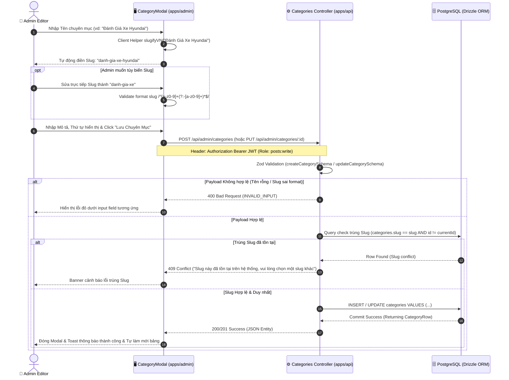
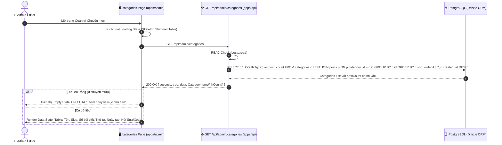
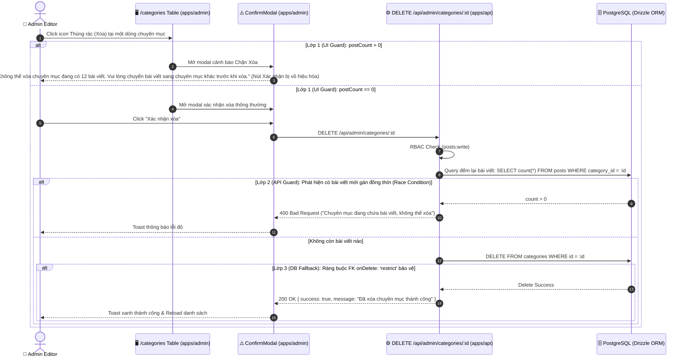
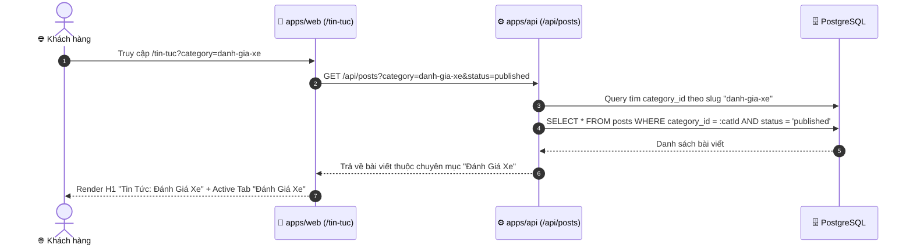
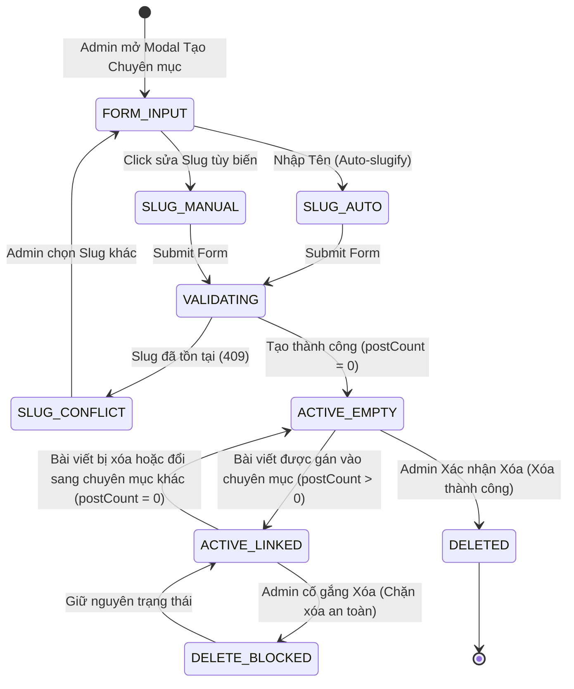

# 🔄 Technical Flow Specification: Quản Trị Chuyên Mục Bài Viết (Admin Categories Management)

## 1. Sequence Diagram Đa Tầng (End-to-End Sequence)

### 1.1. Luồng Tạo / Chỉnh Sửa Chuyên Mục (Auto-slug & Strict Unique Guard)

---

### 1.2. Luồng Lấy Danh Sách Kèm Thống Kê Số Bài Viết (Post Count Aggregate)

---

### 1.3. Luồng Chặn Xóa An Toàn 2 Lớp (Dual-Layer Restrict Delete Guard)

---

### 1.4. Luồng Người Dùng Xem & Lọc Tin Tức Trên Storefront

---

## 2. Sơ đồ Trạng thái Thực thể (State Machine Diagram)

---

## 3. Bảng Giải Phẫu Từng Bước (Step Anatomy Table)

| Bước # | Tác nhân | Hành động | Payload Input | Logic Xử lý & Rules | Output & DB State | Failure Mode & Recovery |
| :---: | :--- | :--- | :--- | :--- | :--- | :--- |
| **1** | Admin | Nhập tên chuyên mục | `tenChuyenMuc: "Tin Khuyến Mãi"` | Client helper tự sinh slug tiếng Việt không dấu | `slug: "tin-khuyen-mai"` | Ký tự lạ ➡️ Tự động khử ký tự đặc biệt |
| **2** | Admin | Submit Form | `{ tenChuyenMuc, slug, moTa, sortOrder }` | Client Zod validate format | Chuyển sang HTTP Request | Form hiển thị validation error vi mô |
| **3** | Backend | Xác thực Unique Slug | `slug: "tin-khuyen-mai"` | Query `categories.slug == slug` (loại trừ `id` nếu là update) | `existing: null` ➡️ Hợp lệ | Trùng slug ➡️ Trả về `409 Conflict`, không tạo |
| **4** | Backend | Lưu vào DB | DTO đã sanitize | Drizzle insert/update vào bảng `categories` | Row mới được tạo với UUID v4 | Lỗi DB ➡️ Trả về `500 DB_ERROR` |
| **5** | Admin | Xem bảng Chuyên mục | Truy cập `/categories` | Query Drizzle `LEFT JOIN posts GROUP BY categories.id` | Trả về mảng kèm `postCount: integer` | Lỗi mạng ➡️ Giao diện hiển thị Error State + Nút Retry |
| **6** | Admin | Thao tác Xóa | Click Xóa ID chuyên mục | Kiểm tra `postCount > 0` | Nếu `postCount > 0`: Chặn xóa ngay tại UI & API | Cố tình bypass API ➡️ DB FK `restrict` chặn |
