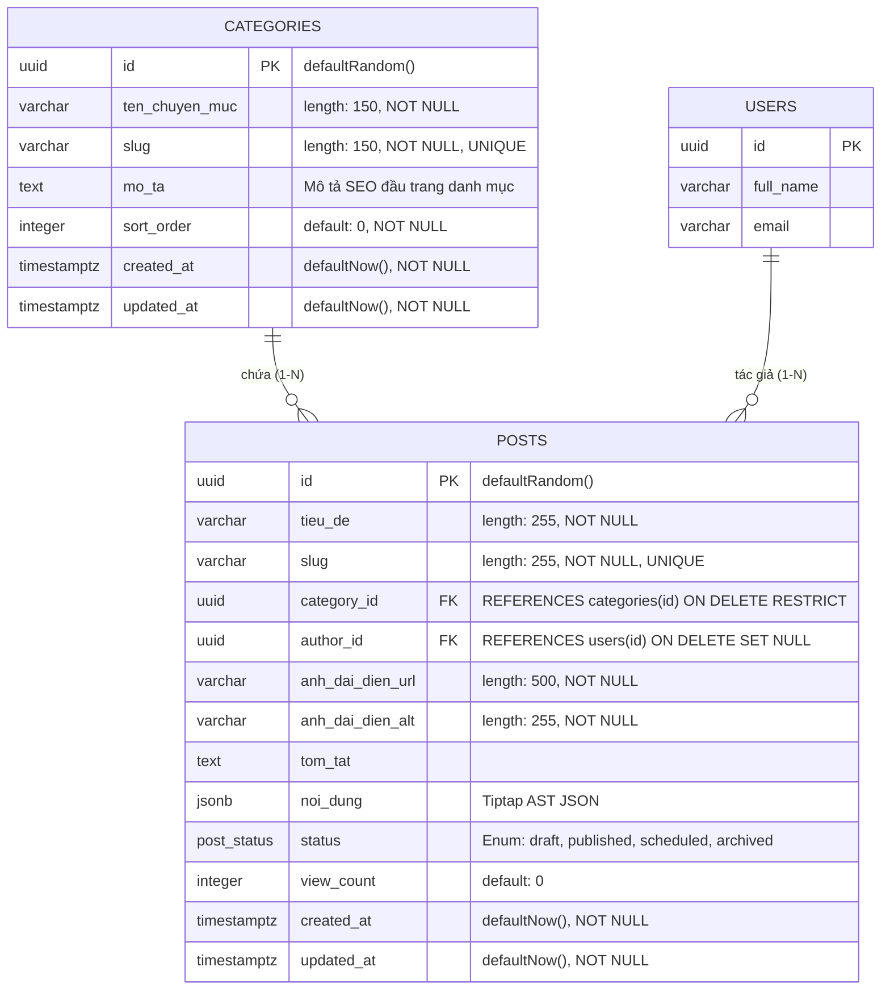

# 🗄️ Database Schema Specification: Quản Trị Chuyên Mục Bài Viết (Admin Categories Management)

## 1. Sơ đồ Thực thể Quan hệ (Entity Relationship Diagram - ERD)



---

## 2. Đặc tả Drizzle ORM Schema Hiện Hữu & Khóa Ngoại Ràng Buộc

Được định nghĩa tại [`packages/database/src/schema/posts.ts`](file:///Users/nhatphan/Code/CarDealer/cardealer/packages/database/src/schema/posts.ts):

```typescript
import { pgTable, uuid, varchar, text, integer, boolean, timestamp, jsonb, pgEnum, index, uniqueIndex } from 'drizzle-orm/pg-core';
import { users } from './users';

// 1. Bảng Chuyên Mục Bài Viết
export const categories = pgTable('categories', {
  id: uuid('id').defaultRandom().primaryKey(),
  tenChuyenMuc: varchar('ten_chuyen_muc', { length: 150 }).notNull(),
  slug: varchar('slug', { length: 150 }).notNull().unique(),
  moTa: text('mo_ta'), // Đoạn giới thiệu giàu từ khóa xuất hiện ở đầu trang danh mục hỗ trợ SEO
  sortOrder: integer('sort_order').default(0).notNull(),
  createdAt: timestamp('created_at', { withTimezone: true }).defaultNow().notNull(),
  updatedAt: timestamp('updated_at', { withTimezone: true }).defaultNow().notNull().$onUpdate(() => new Date()),
}, (table) => [
  index('categories_slug_idx').on(table.slug),
  index('categories_sort_idx').on(table.sortOrder),
]);

// 2. Bảng Bài Viết (Tham chiếu Khóa Ngoại với onDelete: 'restrict')
export const posts = pgTable('posts', {
  id: uuid('id').defaultRandom().primaryKey(),
  tieuDe: varchar('tieu_de', { length: 255 }).notNull(),
  slug: varchar('slug', { length: 255 }).notNull().unique(),
  categoryId: uuid('category_id').notNull().references(() => categories.id, { onDelete: 'restrict' }),
  authorId: uuid('author_id').references(() => users.id, { onDelete: 'set null' }),
  anhDaiDienUrl: varchar('anh_dai_dien_url', { length: 500 }).notNull(),
  anhDaiDienAlt: varchar('anh_dai_dien_alt', { length: 255 }).notNull(),
  tomTat: text('tom_tat'),
  noiDung: jsonb('noi_dung').notNull(),
  status: postStatusEnum('status').default('draft').notNull(),
  createdAt: timestamp('created_at', { withTimezone: true }).defaultNow().notNull(),
  updatedAt: timestamp('updated_at', { withTimezone: true }).defaultNow().notNull().$onUpdate(() => new Date()),
}, (table) => [
  index('posts_slug_idx').on(table.slug),
  index('posts_category_status_idx').on(table.categoryId, table.status),
]);
```

---

## 3. Phân Tích Hiệu Năng & Chỉ Mục (Indexes & Optimization)

1. **`categories_slug_idx` (B-Tree trên `categories.slug`):**
   - Đảm bảo việc tìm kiếm chuyên mục theo slug khi người dùng truy cập Storefront `/tin-tuc?category={slug}` đạt độ phức tạp $O(\log N)$ (~1ms).
2. **`categories_sort_idx` (B-Tree trên `categories.sortOrder`):**
   - Tối ưu việc sắp xếp thứ tự hiển thị của các nút tab trên menu danh mục Storefront và Admin Table.
3. **`posts_category_status_idx` (Composite Index trên `posts(category_id, status)`):**
   - Tối ưu tối đa cho cả câu lệnh tính `postCount` (`LEFT JOIN posts ON posts.category_id = categories.id`) lẫn query lọc bài viết đã xuất bản theo chuyên mục (`WHERE category_id = :id AND status = 'published'`).

---

## 4. Đặc Tả DTOs & TypeScript Types (`packages/types`)

```typescript
// packages/types/src/category.ts
import { z } from 'zod';

export const categorySchema = z.object({
  id: z.string().uuid(),
  tenChuyenMuc: z.string().min(1, 'Tên chuyên mục không được để trống').max(150),
  slug: z.string().min(1, 'Slug không được để trống').max(150).regex(/^[a-z0-9]+(?:-[a-z0-9]+)*$/, 'Slug chỉ gồm chữ thường không dấu, số và gạch ngang'),
  moTa: z.string().nullable().optional(),
  sortOrder: z.number().int().default(0),
  postCount: z.number().int().default(0),
  createdAt: z.string(),
  updatedAt: z.string(),
});

export const createCategorySchema = z.object({
  tenChuyenMuc: z.string().min(1, 'Tên chuyên mục không được để trống').max(150),
  slug: z.string().min(1, 'Slug không được để trống').max(150).regex(/^[a-z0-9]+(?:-[a-z0-9]+)*$/, 'Slug chỉ gồm chữ thường không dấu, số và gạch ngang'),
  moTa: z.string().nullable().optional(),
  sortOrder: z.number().int().default(0),
});

export const updateCategorySchema = createCategorySchema.partial();

export type CategoryDTO = z.infer<typeof categorySchema>;
export type CreateCategoryDTO = z.infer<typeof createCategorySchema>;
export type UpdateCategoryDTO = z.infer<typeof updateCategorySchema>;
```

---

## 5. Kế Hoạch Đảm Bảo Toàn Vẹn Dữ Liệu (Zero Mutation DB Schema)
* Do chọn **Option A (Drizzle SQL Aggregate Query)**: Schema Database hiện tại đã có sẵn đầy đủ các trường, khóa chính UUID, khóa ngoại tham chiếu chặt chẽ `onDelete: 'restrict'` và các index cần thiết.
* **Không cần chạy migration DDL:** Hệ thống giữ nguyên 100% cấu trúc bảng hiện tại, không gây lock bảng và loại trừ hoàn toàn nguy cơ downtime.
