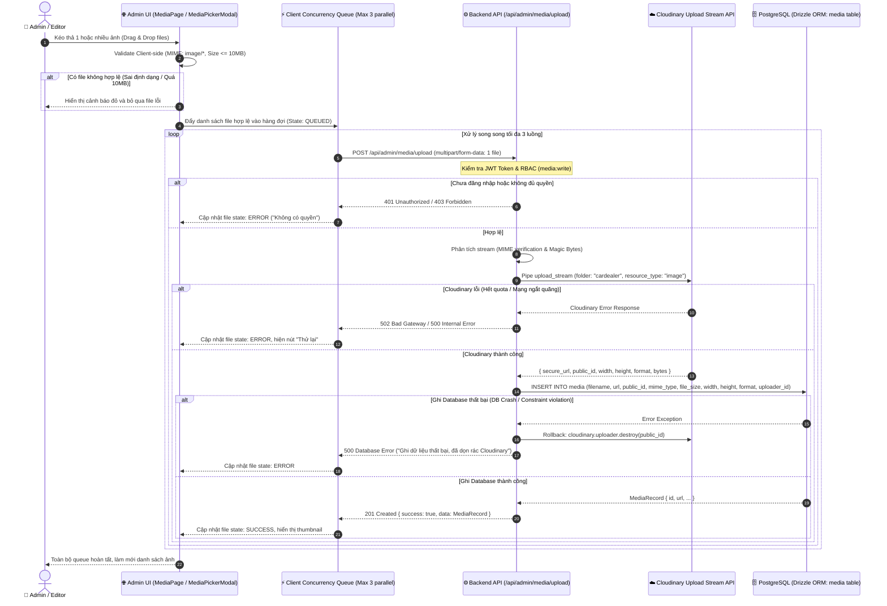
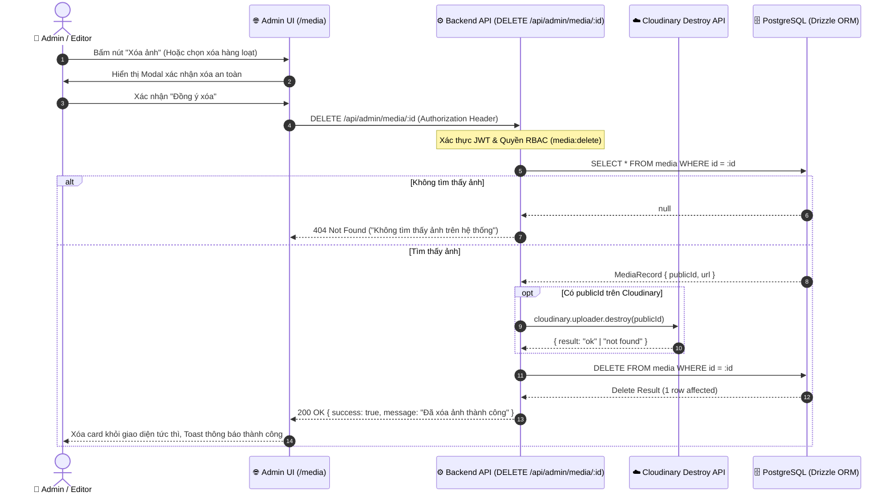
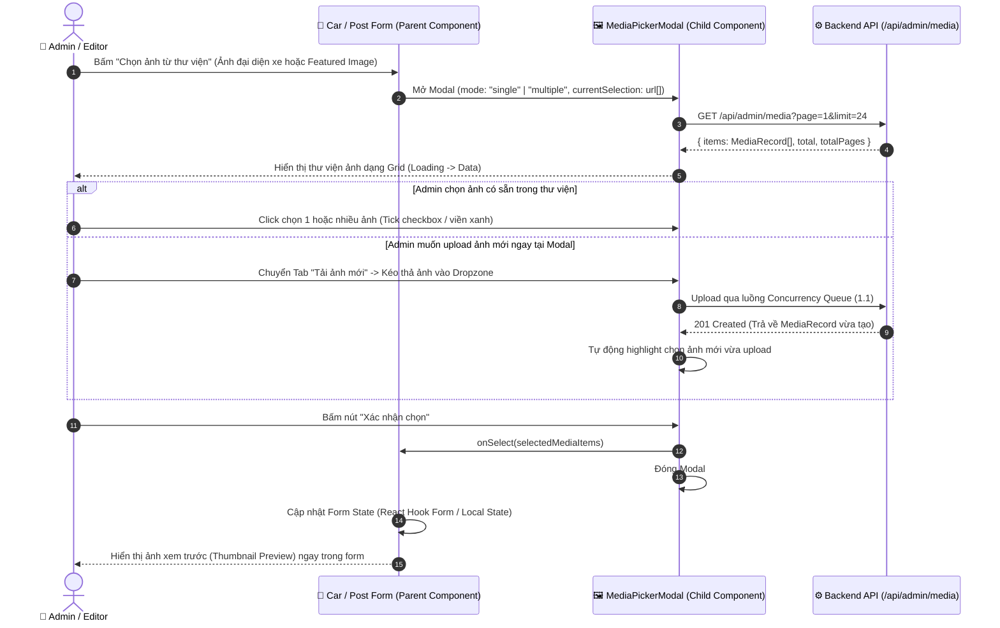
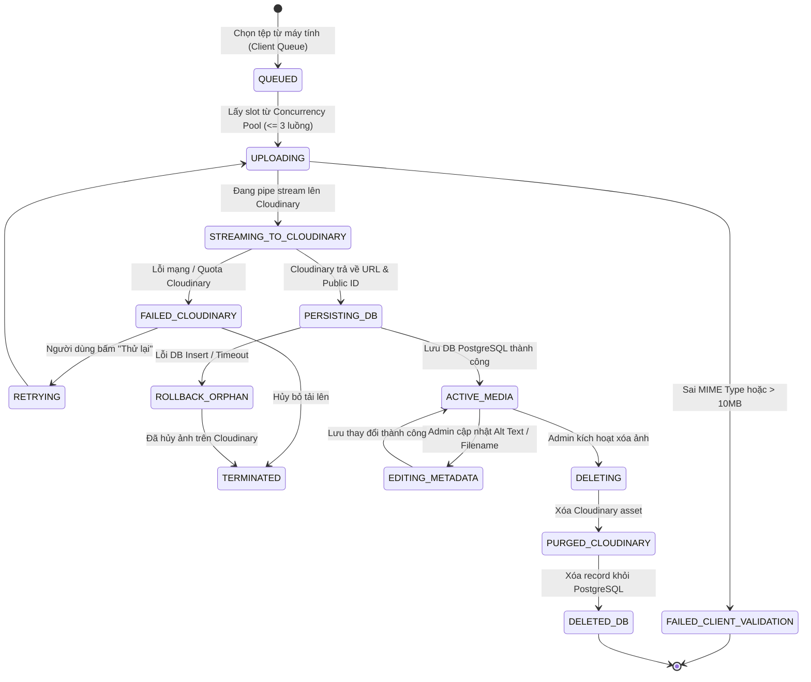

# 🔄 Technical Flow Specification: Thư Viện Ảnh Admin & Tích Hợp Cloudinary (Admin Image Library)

## 1. Sequence Diagram Đa Tầng (End-to-End Sequence Diagrams)

### 1.1. Luồng Tải Lên Ảnh Đơn & Đa Tệp (Concurrent Multi-Upload via Streaming Proxy - US-01 & US-02)

---

### 1.2. Luồng Xóa Ảnh An Toàn & Đồng Bộ (Synchronous Delete & Cloudinary Purge - US-01 & US-02)

---

### 1.3. Luồng Chèn Ảnh Vào Form Car / Post Qua MediaPickerModal (US-03)

---

## 2. Sơ đồ Trạng thái Thực thể (State Machine Diagram)

---

## 3. Bảng Giải Phẫu Từng Bước (Step Anatomy Table)

| Bước # | Lát cắt | Tác nhân | Hành động | Payload Input | Logic Xử lý & Quy tắc Nghiệp vụ | Output & State | Cơ chế Xử lý Lỗi & Phục hồi |
| :---: | :---: | :---: | :---: | :---: | :---: | :---: | :---: |
| **1** | US-02 | Admin | Kéo thả hoặc chọn tệp từ máy | `FileList` (1 hoặc nhiều file) | Kiểm tra `file.size <= 10MB`, MIME type thuộc `['image/jpeg', 'image/png', 'image/webp', 'image/gif', 'image/svg+xml']`. Sinh UUID tạm cho client queue. | Queue State: `QUEUED`. Hiển thị danh sách card hàng đợi kèm thanh progress 0%. | Báo lỗi ngay trên từng card nếu vi phạm; loại khỏi hàng đợi tải lên. |
| **2** | US-01 | Client Queue | Dispatch request upload | `FormData { file }` | Concurrency Controller giới hạn tối đa 3 request chạy đồng thời. Khởi tạo XMLHttpRequest / Fetch để lắng nghe tiến trình upload chunk. | Client State: `UPLOADING` (% progress tăng dần 0% ➡️ 100%). | Nếu mạng rớt: Chuyển state `FAILED_NETWORK`, hiển thị icon Retry. |
| **3** | US-01 | API Gateway | Nhận multipart stream | HTTP Request + JWT Cookie/Bearer | Xác thực Auth JWT. Kiểm tra RBAC `checkPermission('media:write')`. Parse multipart stream không ghi đĩa. | Chuyển stream vào Service | Trả về `401 UNAUTHORIZED` hoặc `403 FORBIDDEN` nếu không đủ quyền. |
| **4** | US-01 | Cloudinary Service | Streaming pipe sang Cloudinary | Stream data + folder config | Dùng `cloudinary.v2.uploader.upload_stream({ folder: 'cardealer', resource_type: 'image' })`. Tự động tối ưu định dạng WebP/AVIF. | Cloudinary Response `{ secure_url, public_id, width, height, format, bytes }` | Nếu Cloudinary timeout / fail: Ném lỗi `CLOUDINARY_UPLOAD_FAILED`, trả về HTTP 502. |
| **5** | US-01 | Database Handler | Lưu thông tin media | DTO `{ filename, url, publicId, mimeType, fileSize, width, height, format, uploaderId }` | Thực thi Drizzle `db.insert(schema.media).values(...)`. Ghi log audit hành động của Admin. | Media Entity hoàn chỉnh. State DB: `ACTIVE_MEDIA`. Trả về `201 CREATED`. | **Rollback Guarantee:** Nếu DB lỗi, gọi ngay `cloudinary.uploader.destroy(publicId)` trước khi trả về lỗi 500 cho client. |
| **6** | US-02 | Admin UI | Hiển thị kho ảnh `/media` | Query Params `{ page, limit, search, sortBy }` | Gọi `GET /api/admin/media`. Đọc dữ liệu từ DB, phân trang 24 ảnh/trang. Áp dụng debounce 300ms khi tìm kiếm tên ảnh. | 4-State UI: Shimmer Loading ➡️ Grid Media Cards. | Nếu API sập: Hiển thị Error State kèm nút "Tải lại trang". |
| **7** | US-02 | Admin | Sửa Alt Text SEO | `PUT /api/admin/media/:id { altText }` | Validate độ dài altText <= 255 ký tự. Update trường `altText` và `updatedAt`. | Trả về bản ghi cập nhật. Cập nhật cache UI. | Báo lỗi inline trong Drawer nếu validate thất bại. |
| **8** | US-02 | Admin | Xóa ảnh đơn lẻ hoặc hàng loạt | `DELETE /api/admin/media/:id` | Kiểm tra quyền `media:delete`. Tìm `public_id`, gọi Cloudinary xóa file vật lý, xóa row DB. | Trả về `200 OK`. Xóa card ảnh khỏi giao diện với animation fade-out. | Nếu Cloudinary báo not_found thì vẫn tiếp tục xóa DB để làm sạch dữ liệu. |
| **9** | US-03 | Admin | Nhúng ảnh vào Car/Post form | Click "Chọn ảnh" từ Form | Mở `MediaPickerModal`, chọn ảnh đơn hoặc nhiều ảnh. Bấm "Chèn ảnh". | Form component nhận mảng object `{ id, url, altText, width, height }`. Form state cập nhật. | Đóng modal không lưu nếu Admin bấm Cancel / phím Esc. |
