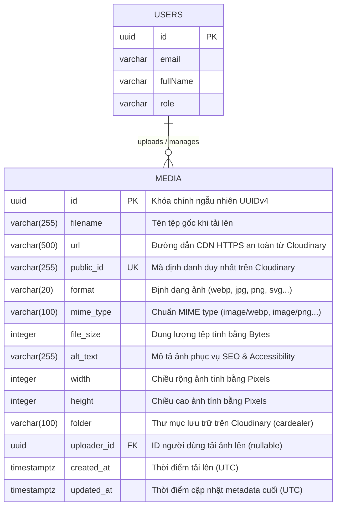

# 🗄️ Database Schema Specification: Thư Viện Ảnh Admin & Tích Hợp Cloudinary (Admin Image Library)

## 1. Sơ đồ Thực thể Quan hệ (Entity Relationship Diagram - ERD)



---

## 2. Đặc tả ORM Schema (Drizzle ORM for PostgreSQL)

Tệp mã nguồn mục tiêu: `packages/database/src/schema/media.ts`

```typescript
import { pgTable, uuid, varchar, integer, timestamp, index } from 'drizzle-orm/pg-core';
import { users } from './users';

export const media = pgTable(
  'media',
  {
    id: uuid('id').defaultRandom().primaryKey(),
    filename: varchar('filename', { length: 255 }).notNull(),
    url: varchar('url', { length: 500 }).notNull(),
    publicId: varchar('public_id', { length: 255 }).notNull().unique(),
    format: varchar('format', { length: 20 }).notNull(),
    mimeType: varchar('mime_type', { length: 100 }).notNull(),
    fileSize: integer('file_size').notNull(),
    altText: varchar('alt_text', { length: 255 }),
    width: integer('width'),
    height: integer('height'),
    folder: varchar('folder', { length: 100 }).default('cardealer'),
    uploaderId: uuid('uploader_id').references(() => users.id, { onDelete: 'set null' }),
    createdAt: timestamp('created_at', { withTimezone: true }).defaultNow().notNull(),
    updatedAt: timestamp('updated_at', { withTimezone: true }).defaultNow().notNull(),
  },
  (table) => ({
    // 🧠 Index tối ưu hóa truy vấn phân trang danh sách ảnh mới nhất
    createdAtIdx: index('media_created_at_idx').on(table.createdAt),
    // 🧠 Index tối ưu hóa tìm kiếm theo tên tệp hoặc alt text
    filenameIdx: index('media_filename_idx').on(table.filename),
    // 🧠 Unique index bảo vệ tính toàn vẹn ID Cloudinary
    publicIdIdx: index('media_public_id_idx').on(table.publicId),
    // 🧠 Index lọc theo người tải lên
    uploaderIdIdx: index('media_uploader_id_idx').on(table.uploaderId),
  })
);

export type MediaRow = typeof media.$inferSelect;
export type NewMediaRow = typeof media.$inferInsert;
```

Cập nhật quan hệ tại: `packages/database/src/schema/relations.ts`

```typescript
import { relations } from 'drizzle-orm';
import { users } from './users';
import { media } from './media';

export const mediaRelations = relations(media, ({ one }) => ({
  uploader: one(users, { fields: [media.uploaderId], references: [users.id] }),
}));

export const usersMediaRelations = relations(users, ({ many }) => ({
  uploadedMedia: many(media),
}));
```

---

## 3. Ma trận Chuyển Trạng thái Thực thể (State Transition Matrix)

| Trạng thái Hiện tại | Trạng thái Kế tiếp Hợp lệ | Sự kiện / Kích hoạt (Trigger) | Quyền hạn (Role Required) | Ràng buộc Nghiệp vụ & Dữ liệu |
| :--- | :--- | :--- | :--- | :--- |
| **NONE (Chưa tồn tại)** | `UPLOADING` | Admin kéo thả tệp tại giao diện | `admin`, `manager`, `editor` | File phải qua kiểm tra client (size <= 10MB, mime thuộc whitelist) |
| **UPLOADING** | `READY (ACTIVE)` | Upload Cloudinary & DB Insert thành công | System / Service Worker | Bản ghi PostgreSQL được tạo với `public_id` và `url` HTTPS hợp lệ |
| **UPLOADING** | `FAILED` | Cloudinary timeout / DB Insert lỗi | System | Tự động kích hoạt Rollback xóa asset rác trên Cloudinary |
| **READY (ACTIVE)** | `METADATA_UPDATED` | Admin cập nhật `altText` hoặc `filename` | `admin`, `manager`, `editor` | Độ dài `altText` <= 255 ký tự, cập nhật `updatedAt = NOW()` |
| **READY (ACTIVE)** | `DELETED` | Admin xác nhận xóa ảnh | `admin`, `manager` (`media:delete`) | Xóa asset trên Cloudinary trước ➡️ Xóa bản ghi trong PostgreSQL |

---

## 4. Kế hoạch Migration Cơ sở Dữ liệu

* **Môi trường hiện tại:** 🟢 **Pure Development (Sandbox)**
* **Chiến lược:** 
  1. Tạo migration SQL mới trong `packages/database/drizzle/` thông qua `drizzle-kit generate`.
  2. Bảng `media` hiện chưa có dữ liệu thật trong môi trường Dev, do đó việc khởi tạo bảng mới hoàn toàn không có rủi ro xung đột dữ liệu cũ.
  3. Cung cấp lệnh an toàn để apply migration:
     ```bash
     cd packages/database && pnpm run db:push
     # Hoặc chạy script migration tự động của monorepo
     ```
