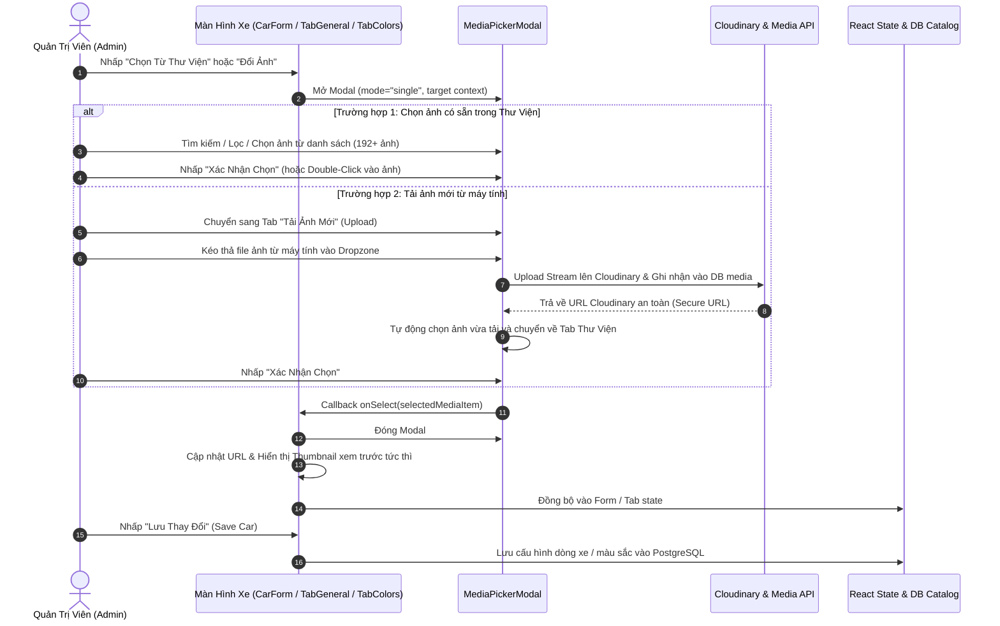

# 🌊 LOGIC FLOW: QUY TRÌNH CHỌN & TẢI ẢNH CHO QUẢN TRỊ DÒNG XE

> **Tuân thủ:** `universal-agentic-workflow.xml` - **Phase 2.2: Logic Flow**  
> **Role / Active Skills:** `logic-flow-ba`  
> **Tài liệu tham chiếu:** [`BACKLOG.md`](./BACKLOG.md), [`SOLUTION_OPTIONS.md`](./SOLUTION_OPTIONS.md)

---

## 1. Sơ Đồ Luồng Tương Tác Nghiệp Vụ (Interactive Flowchart)

---

## 2. Chi Tiết Các Use Cases & Điểm Chạm (Touchpoints)

### 🔹 Điểm chạm 1: Tạo Mới Dòng Xe (`CarFormModal.tsx`)
- **Vị trí:** Trường `Ảnh Đại Diện Xe (URL)`.
- **Hành vi:**
  - Nhấp nút `Button` "Chọn Từ Thư Viện": Mở `MediaPickerModal` với tiêu đề `"Chọn Ảnh Đại Diện Cho Dòng Xe"`.
  - Hỗ trợ chọn từ thư viện hoặc tải ảnh mới.
  - Khi đã có URL: Hiển thị khung xem trước thumbnail bo góc viền kính mờ kèm nút xóa nhanh `X`.
  - Cho phép dán URL thủ công nếu cần.

### 🔹 Điểm chạm 2: Chỉnh Sửa Thông Tin Chung Dòng Xe (`TabGeneralInfo.tsx`)
- **Vị trí:** Trường `Ảnh Đại Diện Xe (URL)`.
- **Hành vi:**
  - Nhãn trường bổ sung nút `Button` "Chọn Từ Thư Viện" nhỏ gọn (`h-7 text-xs`).
  - Ô nhập URL có nút xóa nhanh `X` bằng `Button` ghost icon khi đã có giá trị.
  - Bên dưới ô nhập: Hiển thị khung preview thumbnail lớn với tỉ lệ `16:9` hoặc `4:3`, có huy hiệu "Ảnh đại diện hiện tại" và nút mở xem ảnh gốc.
  - Nhấp chọn ảnh từ modal sẽ lập tức kích hoạt `setAnhDaiDienUrl(url)`.

### 🔹 Điểm chạm 3: Cấu Hình Ảnh Xe Thật Theo Màu Sắc & Mâm Phiên Bản (`TabColors.tsx`)
- **Vị trí:** Khối cấu hình từng màu trong phiên bản đang chọn (`config?.anhXeTheoMauUrl`).
- **Hành vi:**
  - Tiêu đề nhãn: `Đường Dẫn Ảnh Xe Thật Theo Màu & Mâm Bản Này`.
  - Nút bấm `Button` "Chọn Từ Thư Viện" kèm icon hình ảnh `ImageIcon`.
  - Khung preview thumbnail vuông/chữ nhật hiển thị ngay trong Card màu của phiên bản, cho phép xem trước xe đúng màu sơn và mâm xe.
  - Nút xóa nhanh `X` để trả về trống.
  - Khi chọn ảnh từ modal: Gọi hàm `updateColorImage(activeVersionId, color.id, selected[0].url)`.

---

## 3. Xử Lý Các Trường Hợp Biên (Edge Cases)

| Mã | Tình Huống Biên | Giải Pháp Xử Lý |
| :---: | :--- | :--- |
| **EC-01** | Người dùng mở modal nhưng không chọn ảnh mà đóng lại | Giữ nguyên URL cũ, không ghi đè hay làm mất dữ liệu hiện tại. |
| **EC-02** | URL ảnh nhập thủ công bị hỏng hoặc 404 | Khung thumbnail hiển thị fallback icon xe mờ và không gây lỗi crash trang. |
| **EC-03** | Tải ảnh mới có dung lượng lớn (> 10MB) | `MediaDropzone` bên trong modal tự động chặn và hiển thị thông báo lỗi vượt quá dung lượng. |
| **EC-04** | Chuyển đổi giữa các phiên bản xe trong `TabColors` | Modal nhận đúng ngữ cảnh `activeVersionId` và `color.id` hiện tại, đảm bảo không gán nhầm ảnh màu của phiên bản này sang phiên bản khác. |
