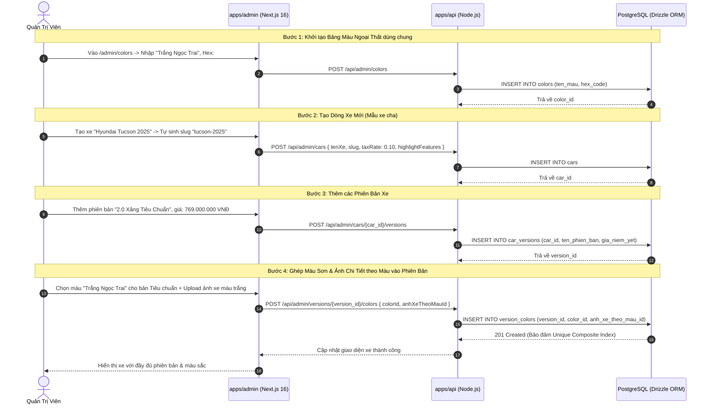
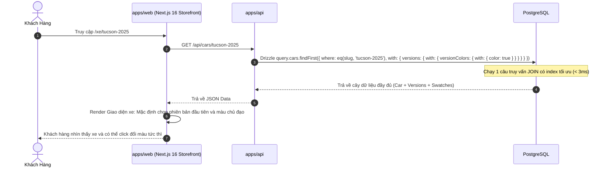

# 🔄 Sơ Đồ Luồng Nghiệp Vụ & Tương Tác Kỹ Thuật (FLOW.md)
## PHASE 1 - CORE DATA LAYER, CAR CATALOG & ADMIN AUTHENTICATION

> **Role:** `logic-flow-ba`  
> **Phạm vi tác động:** `apps/admin` (Next.js 16), `apps/api` (REST Backend), `packages/database` (PostgreSQL)

---

## 1. Luồng 1: Xác Thực Admin & Bảo Vệ Tuyến Đường (Authentication & Route Guard)

Sơ đồ tuần tự xử lý khi người dùng truy cập trang Quản trị viên:

```mermaid
sequenceDiagram
    autonumber
    actor Admin as Quản Trị Viên
    participant Browser as Browser (apps/admin)
    participant Middleware as Next.js 16 Middleware
    participant API as REST API (apps/api)
    participant DB as PostgreSQL (packages/database)

    Admin->>Browser: Truy cập /admin/cars
    Browser->>Middleware: Request GET /admin/cars (kèm Cookies)
    alt Không có Cookie admin_token hoặc Token Hết hạn
        Middleware-->>Browser: Redirect 307 tới /admin/login?redirect=/admin/cars
        Browser-->>Admin: Hiển thị Màn hình Đăng nhập Admin
        Admin->>Browser: Nhập email & mật khẩu -> Bấm "Đăng nhập"
        Browser->>API: POST /api/auth/login { email, password }
        API->>DB: Query users WHERE email = $1
        DB-->>API: Trả về record user (gồm password_hash, token_version)
        API->>API: bcrypt.compare(password, password_hash)
        alt Mật khẩu không khớp
            API-->>Browser: 401 Unauthorized { code: "INVALID_CREDENTIALS" }
            Browser-->>Admin: Hiển thị thông báo "Sai tài khoản hoặc mật khẩu"
        else Mật khẩu hợp lệ
            API->>API: Ký JWT (chứa userId, email, role, token_version)
            API-->>Browser: 200 OK + Set-Cookie: admin_token=<jwt>; HttpOnly; SameSite=Lax
            Browser->>Browser: Chuyển hướng về /admin/cars
        end
    else Có Cookie admin_token hợp lệ
        Middleware->>Middleware: Verify JWT Signature với JWT_SECRET
        Middleware-->>Browser: Cho phép đi tiếp (NextResponse.next())
        Browser->>API: GET /api/cars?status=all (kèm cookie)
        API->>DB: Query danh sách xe
        DB-->>API: Trả về dữ liệu
        API-->>Browser: 200 OK
        Browser-->>Admin: Render Giao diện Bảng Quản trị Dòng xe
    end
```

---

## 2. Luồng 2: Quản Trị Viên Tạo Dòng Xe, Phiên Bản & Gán Màu Ngoại Thất

Quy trình nhập liệu chuẩn xác một dòng xe ô tô theo đúng thứ tự ràng buộc khóa ngoại:



---

## 3. Luồng 3: Khách Hàng Truy Vấn Danh Mục Xe (Storefront Catalog Query)

Quy trình truy vấn dữ liệu tối ưu với 1 câu lệnh Eager Loading:


