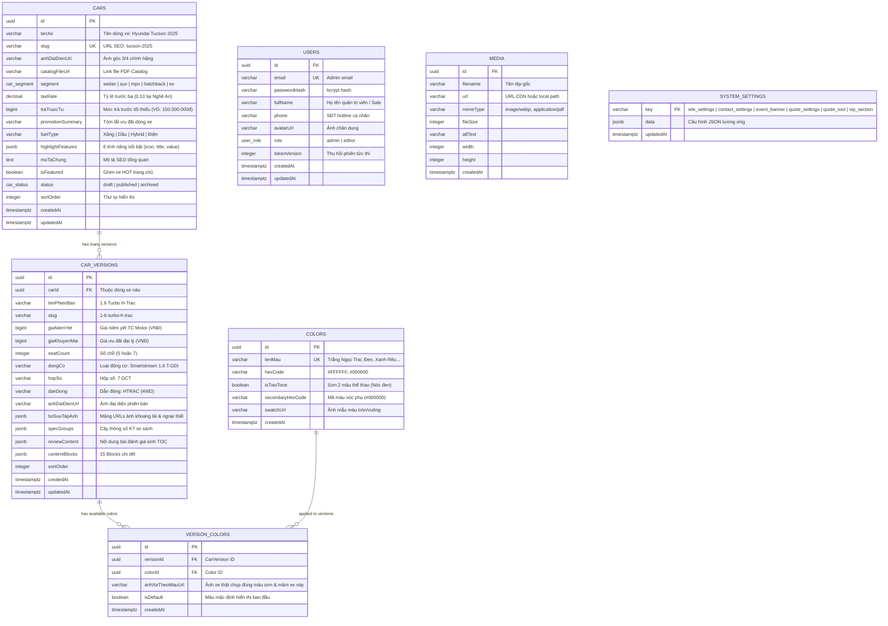

# 🗄️ Thiết Kế Chi Tiết Cơ Sở Dữ Liệu & Entity Schemas (SCHEMA.md)
## PHASE 1 - CORE DATA LAYER, CAR CATALOG & ADMIN AUTHENTICATION

> **Role:** `db-schema-architect`  
> **Database Engine:** PostgreSQL 16+  
> **ORM Framework:** Drizzle ORM (`drizzle-orm` + `postgres` driver + `drizzle-kit`)  
> **Package vị trí:** `@cardealer/database` (`packages/database/src/schema/`)  
> **Phạm vi Phase 1:** Tập trung 100% vào **Admin Authentication & Danh mục Dòng Xe / Phiên Bản / Bảng Màu**

---

## 1. Sơ Đồ Quan Hệ Thực Thể Phase 1 (Entity Relationship Diagram - ERD)



---

## 2. Đặc Tả Chi Tiết Bảng Dữ Liệu Bằng Drizzle ORM (Phase 1)

### 2.1. Quản Lý Người Dùng & Quản Trị Viên (`users`)
```typescript
// packages/database/src/schema/users.ts
import { pgTable, uuid, varchar, integer, timestamp, pgEnum } from 'drizzle-orm/pg-core';

export const userRoleEnum = pgEnum('user_role', ['admin', 'editor']);

export const users = pgTable('users', {
  id: uuid('id').defaultRandom().primaryKey(),
  email: varchar('email', { length: 255 }).notNull().unique(),
  passwordHash: varchar('password_hash', { length: 255 }).notNull(),
  fullName: varchar('full_name', { length: 150 }).notNull(),
  phone: varchar('phone', { length: 20 }), // SĐT Hotline của Sale
  avatarUrl: varchar('avatar_url', { length: 500 }), // Ảnh chân dung tư vấn viên
  role: userRoleEnum('role').default('admin').notNull(),
  tokenVersion: integer('token_version').default(1).notNull(), // Thu hồi token tức thì
  createdAt: timestamp('created_at', { withTimezone: true }).defaultNow().notNull(),
  updatedAt: timestamp('updated_at', { withTimezone: true }).defaultNow().notNull().$onUpdate(() => new Date()),
});
```

### 2.2. Danh Mục Dòng Xe Cốt Lõi (`cars`)
```typescript
// packages/database/src/schema/cars.ts
import { pgTable, uuid, varchar, text, decimal, integer, bigint, boolean, timestamp, pgEnum, jsonb, index } from 'drizzle-orm/pg-core';

export const carStatusEnum = pgEnum('car_status', ['draft', 'published', 'archived']);
export const carSegmentEnum = pgEnum('car_segment', ['sedan', 'suv', 'mpv', 'hatchback', 'ev']);

export const cars = pgTable('cars', {
  id: uuid('id').defaultRandom().primaryKey(),
  tenXe: varchar('ten_xe', { length: 150 }).notNull(),
  slug: varchar('slug', { length: 150 }).notNull().unique(),
  anhDaiDienUrl: varchar('anh_dai_dien_url', { length: 500 }).notNull(), // Lưu link trực tiếp, không join media
  catalogFileUrl: varchar('catalog_file_url', { length: 500 }), // Link file PDF
  segment: carSegmentEnum('segment').default('suv').notNull(),
  taxRate: decimal('tax_rate', { precision: 4, scale: 2 }).default('0.10').notNull(), // 10% tại Nghệ An
  traTruocTu: bigint('tra_truoc_tu', { mode: 'number' }), // Mức trả trước kích cầu (VD: 150.000.000đ)
  promotionSummary: varchar('promotion_summary', { length: 255 }), // Tóm tắt khuyến mại (VD: "Giảm 50% trước bạ")
  fuelType: varchar('fuel_type', { length: 50 }), // "Xăng", "Dầu", "Hybrid"
  highlightFeatures: jsonb('highlight_features').$type<Array<{ icon: string; title: string; value: string }>>(),
  moTaChung: text('mo_ta_chung'),
  isFeatured: boolean('is_featured').default(false).notNull(), // Ghim xe HOT trang chủ
  status: carStatusEnum('status').default('draft').notNull(),
  sortOrder: integer('sort_order').default(0).notNull(),
  createdAt: timestamp('created_at', { withTimezone: true }).defaultNow().notNull(),
  updatedAt: timestamp('updated_at', { withTimezone: true }).defaultNow().notNull().$onUpdate(() => new Date()),
}, (table) => [
  index('cars_slug_idx').on(table.slug),
  index('cars_segment_status_idx').on(table.segment, table.status),
  index('cars_featured_sort_idx').on(table.isFeatured, table.sortOrder),
]);
```

### 2.3. Phiên Bản Xe (`car_versions`)
```typescript
// packages/database/src/schema/car_versions.ts
import { pgTable, uuid, varchar, bigint, integer, timestamp, jsonb, index, uniqueIndex } from 'drizzle-orm/pg-core';
import { cars } from './cars';

export const carVersions = pgTable('car_versions', {
  id: uuid('id').defaultRandom().primaryKey(),
  carId: uuid('car_id').notNull().references(() => cars.id, { onDelete: 'cascade' }),
  tenPhienBan: varchar('ten_phien_ban', { length: 150 }).notNull(),
  slug: varchar('slug', { length: 150 }).notNull(),
  giaNiemYet: bigint('gia_niem_yet', { mode: 'number' }).notNull(), // Giá công bố TC Motor (VNĐ)
  giaKhuyenMai: bigint('gia_khuyen_mai', { mode: 'number' }), // Giá ưu đãi đại lý thực tế (VNĐ)
  seatCount: integer('seat_count').default(5).notNull(),
  dongCo: varchar('dong_co', { length: 100 }), // VD: "Smartstream 1.6 T-GDi"
  hopSo: varchar('hop_so', { length: 100 }), // VD: "7 DCT"
  danDong: varchar('dan_dong', { length: 100 }), // VD: "HTRAC (4WD)"
  anhDaiDienUrl: varchar('anh_dai_dien_url', { length: 500 }),
  boSuuTapAnh: jsonb('bo_suu_tap_anh').$type<string[]>(), // Mảng URLs ảnh ngoại/nội thất
  specGroups: jsonb('spec_groups').$type<Array<{ groupName: string; specs: Array<{ label: string; value: string }> }>>(),
  reviewContent: jsonb('review_content'), // Bài đánh giá chi tiết
  contentBlocks: jsonb('content_blocks'), // 15 Content Blocks
  sortOrder: integer('sort_order').default(0).notNull(),
  createdAt: timestamp('created_at', { withTimezone: true }).defaultNow().notNull(),
  updatedAt: timestamp('updated_at', { withTimezone: true }).defaultNow().notNull().$onUpdate(() => new Date()),
}, (table) => [
  index('car_versions_car_id_idx').on(table.carId),
  uniqueIndex('car_versions_car_slug_idx').on(table.carId, table.slug),
]);
```

### 2.4. Bảng Màu Ngoại Thất & Phối Màu Phiên Bản (`colors` & `version_colors`)
```typescript
// packages/database/src/schema/colors.ts
import { pgTable, uuid, varchar, boolean, timestamp, uniqueIndex, index } from 'drizzle-orm/pg-core';
import { carVersions } from './car_versions';

export const colors = pgTable('colors', {
  id: uuid('id').defaultRandom().primaryKey(),
  tenMau: varchar('ten_mau', { length: 100 }).notNull().unique(),
  hexCode: varchar('hex_code', { length: 20 }).notNull(), // VD: #FFFFFF
  isTwoTone: boolean('is_two_tone').default(false).notNull(), // Sơn 2 màu (nóc đen)
  secondaryHexCode: varchar('secondary_hex_code', { length: 20 }), // Mã màu nóc
  swatchUrl: varchar('swatch_url', { length: 500 }), // Ảnh swatch mẫu màu
  createdAt: timestamp('created_at', { withTimezone: true }).defaultNow().notNull(),
});

export const versionColors = pgTable('version_colors', {
  id: uuid('id').defaultRandom().primaryKey(),
  versionId: uuid('version_id').notNull().references(() => carVersions.id, { onDelete: 'cascade' }),
  colorId: uuid('color_id').notNull().references(() => colors.id, { onDelete: 'cascade' }),
  anhXeTheoMauUrl: varchar('anh_xe_theo_mau_url', { length: 500 }), // Ảnh xe thật của bản đó sơn màu đó
  isDefault: boolean('is_default').default(false).notNull(), // Màu mặc định hiển thị đầu tiên
  createdAt: timestamp('created_at', { withTimezone: true }).defaultNow().notNull(),
}, (table) => [
  uniqueIndex('unique_version_color_idx').on(table.versionId, table.colorId),
  index('version_colors_version_id_idx').on(table.versionId),
]);
```

### 2.5. Thư Viện Tệp Tin (`media`)
```typescript
// packages/database/src/schema/media.ts
import { pgTable, uuid, varchar, integer, timestamp } from 'drizzle-orm/pg-core';

export const media = pgTable('media', {
  id: uuid('id').defaultRandom().primaryKey(),
  filename: varchar('filename', { length: 255 }).notNull(),
  url: varchar('url', { length: 500 }).notNull(),
  mimeType: varchar('mime_type', { length: 100 }).notNull(),
  fileSize: integer('file_size').notNull(), // In bytes
  altText: varchar('alt_text', { length: 255 }),
  width: integer('width'),
  height: integer('height'),
  createdAt: timestamp('created_at', { withTimezone: true }).defaultNow().notNull(),
});
```

### 2.6. Bảng Cấu Hình Toàn Cục (`system_settings`)
```typescript
// packages/database/src/schema/system_settings.ts
import { pgTable, varchar, jsonb, timestamp } from 'drizzle-orm/pg-core';

export const systemSettings = pgTable('system_settings', {
  key: varchar('key', { length: 100 }).primaryKey(), // 'site_settings' | 'contact_settings' | 'event_banner' | 'quote_settings' | 'quote_tool' | 'vip_section'
  data: jsonb('data').notNull(),
  updatedAt: timestamp('updated_at', { withTimezone: true }).defaultNow().notNull().$onUpdate(() => new Date()),
});
```

---

## 3. Drizzle Relations Tối Ưu (Eager Loading < 2ms)

```typescript
// packages/database/src/schema/relations.ts
import { relations } from 'drizzle-orm';
import { cars } from './cars';
import { carVersions } from './car_versions';
import { colors, versionColors } from './colors';

export const carsRelations = relations(cars, ({ many }) => ({
  versions: many(carVersions),
}));

export const carVersionsRelations = relations(carVersions, ({ one, many }) => ({
  car: one(cars, { fields: [carVersions.carId], references: [cars.id] }),
  versionColors: many(versionColors),
}));

export const versionColorsRelations = relations(versionColors, ({ one }) => ({
  version: one(carVersions, { fields: [versionColors.versionId], references: [carVersions.id] }),
  color: one(colors, { fields: [versionColors.colorId], references: [colors.id] }),
}));
```

---

## 4. Lộ Trình Kế Thừa Bảng Dữ Liệu Cho Các Phase Tiếp Theo

Theo đúng triết lý phát triển module độc lập (Atomic Phased Delivery):
* **Phase 2 (Pricing & Lead Engine):** Sẽ bổ sung bảng **`leads`** (Quản lý khách hàng tiềm năng, tỉnh thành, gói vay trả góp, trạng thái chăm sóc).
* **Phase 3 (Storefront & Car Experience):** Sẽ bổ sung bảng **`testimonials`** (Ảnh bàn giao xe thực tế tại đại lý).
* **Phase 4 (Content & Lexical Blocks):** Sẽ bổ sung bảng **`posts`** và **`categories`** (15 blocks Lexical, TikTok embed, mục lục TOC).
* **Phase 5 (Technical SEO):** Tận dụng toàn bộ dữ liệu từ các phase trước để sinh 7 JSON-LD schemas và gọi Google Indexing API.
* **Phase 6 (AI Automation):** Worker tự động sinh bài viết bảng giá xe lưu vào `posts (status: draft)`.
