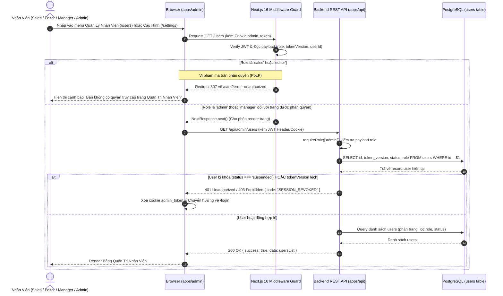
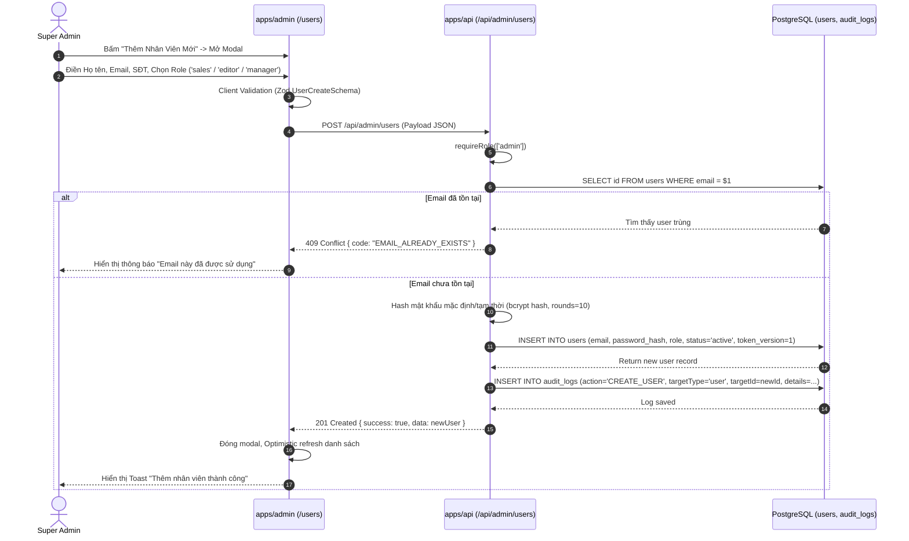
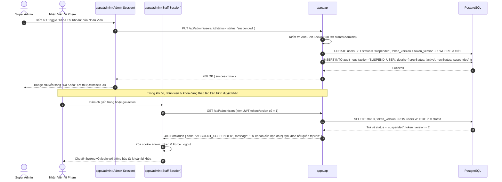
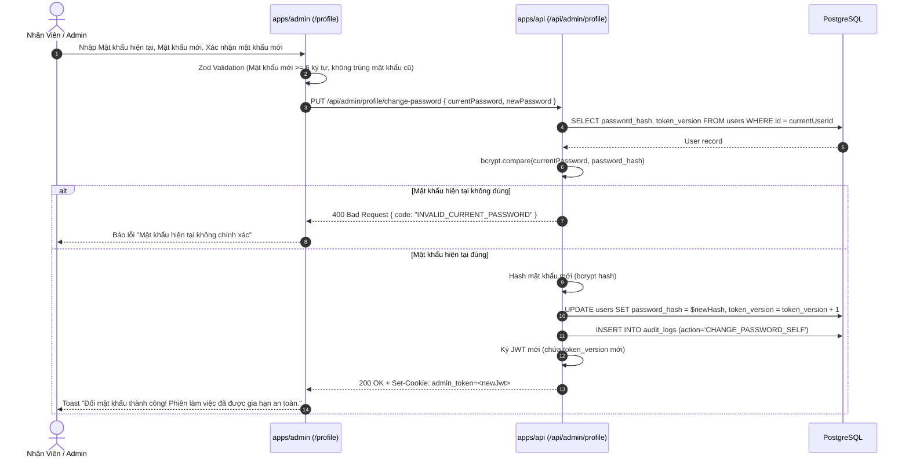
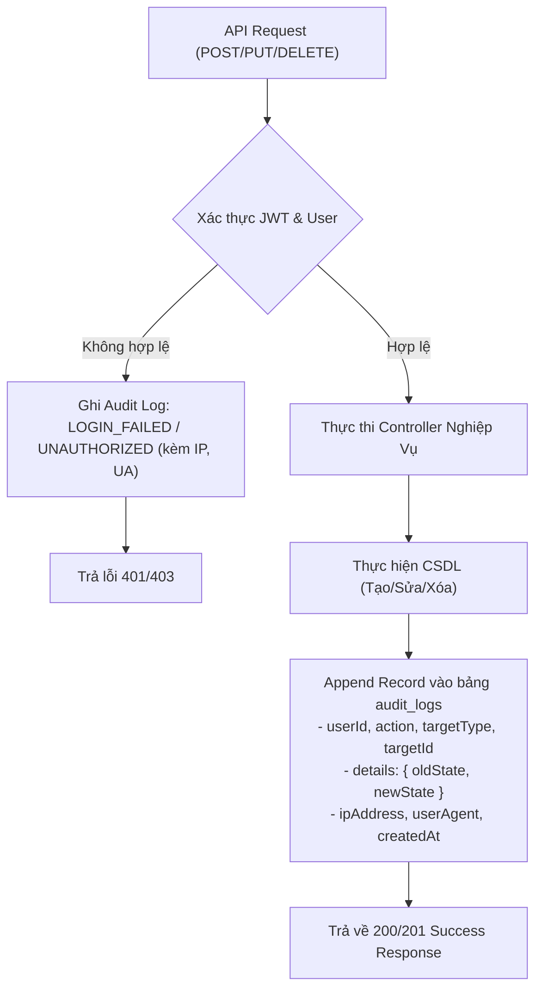

# 🔄 Sơ Đồ Luồng Nghiệp Vụ & Tương Tác Kỹ Thuật (FLOW.md)
## PHASE 2 - ADMIN USER & RBAC MANAGEMENT

> **Role:** `logic-flow-ba`  
> **Tài liệu tham chiếu:** [`BACKLOG.md`](./BACKLOG.md), [`SOLUTION_OPTIONS.md`](./SOLUTION_OPTIONS.md)  
> **Phạm vi tác động:** `apps/admin` (Next.js 16), `apps/api` (REST Backend), `packages/database` (PostgreSQL), `packages/types`

---

## 1. Luồng 1: Phân Quyền Đa Tầng & Chặn Tuyến Đường (RBAC Guard Pipeline)

Sơ đồ tuần tự xử lý khi nhân viên có vai trò khác nhau truy cập vào các phân hệ quản trị nhạy cảm:

---

## 2. Luồng 2: Tạo Mới Nhân Viên & Phòng Ngừa Leo Quyền (Create User & Anti-Privilege Escalation)

Quy trình quản trị viên cấp cao khởi tạo tài khoản nhân viên mới:

---

## 3. Luồng 3: Khóa Tài Khoản & Thu Hồi Phiên Tức Thì (Instant Session Revocation)

Cơ chế State-Machine `tokenVersion` vô hiệu hóa phiên làm việc ngay khi nhân viên bị đình chỉ công tác:

---

## 4. Luồng 4: Đổi Mật Khẩu Cá Nhân & Tự Động Làm Mới Phiên (Profile Password Change)

Nhân viên tự đổi mật khẩu an toàn trong trang `/admin/profile`:

---

## 5. Luồng 5: Cơ Chế Ghi Nhận Kiểm Toán Tự Động (Audit Trail Interceptor)

Pipeline tự động ghi log mọi biến động dữ liệu nhạy cảm mà không làm chậm API:

