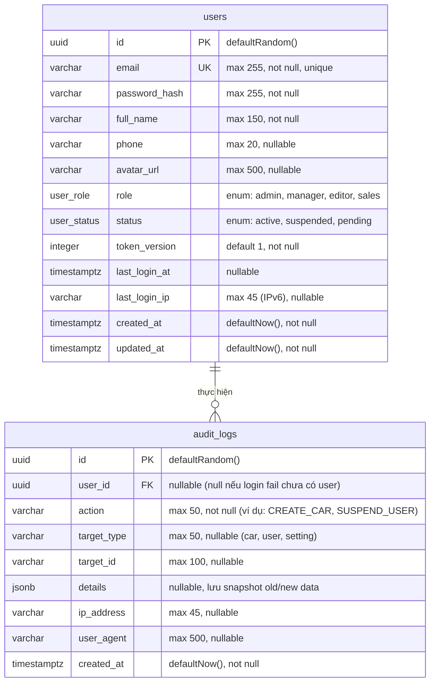
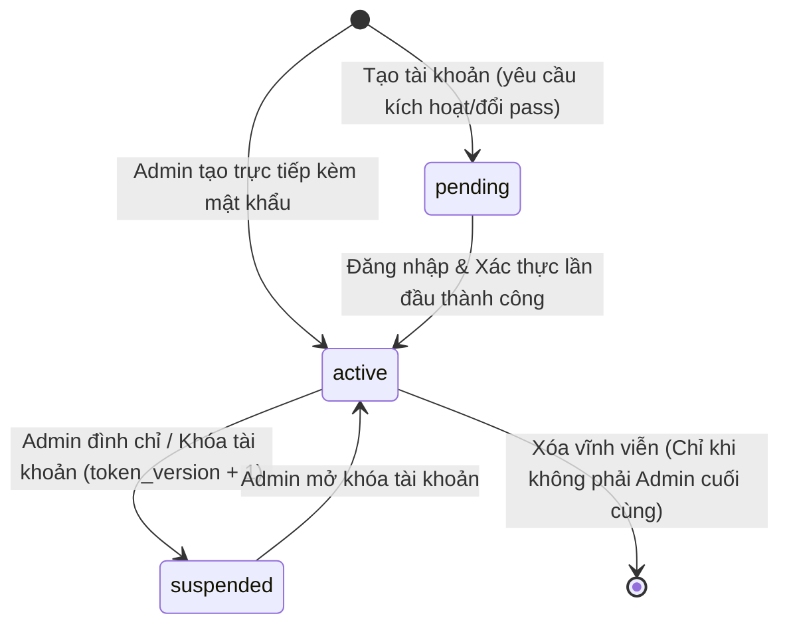

# 🗄️ Thiết Kế Cơ Sở Dữ Liệu & Entity Schemas (SCHEMA.md)
## PHASE 2 - ADMIN USER & RBAC MANAGEMENT

> **Role:** `db-schema-architect`  
> **Tài liệu tham chiếu:** [`BACKLOG.md`](./BACKLOG.md), [`SOLUTION_OPTIONS.md`](./SOLUTION_OPTIONS.md), [`FLOW.md`](./FLOW.md)  
> **Database Engine:** PostgreSQL 16 (Drizzle ORM)

---

## 1. Sơ Đồ Quan Hệ Thực Thể (ERD Diagram)



---

## 2. Đặc Tả Chi Tiết Các Bảng Dữ Liệu

### 2.1. Mở Rộng Bảng `users` ([packages/database/src/schema/users.ts](file:///Users/nhatphan/Code/CarDealer/cardealer/packages/database/src/schema/users.ts))

| Tên Cột | Kiểu Dữ Liệu PostgreSQL | Ràng Buộc | Giá Trị Mặc Định | Ý Nghĩa Nghiệp Vụ |
| :--- | :--- | :--- | :--- | :--- |
| `id` | `UUID` | PRIMARY KEY | `gen_random_uuid()` | Khóa chính định danh người dùng |
| `email` | `VARCHAR(255)` | UNIQUE, NOT NULL | Không có | Email đăng nhập, chuẩn hóa lowercase |
| `password_hash` | `VARCHAR(255)` | NOT NULL | Không có | Mật khẩu băm bằng bcrypt (cost factor = 10) |
| `full_name` | `VARCHAR(150)` | NOT NULL | Không có | Họ và tên hiển thị của nhân viên showroom |
| `phone` | `VARCHAR(20)` | Nullable | `NULL` | Số điện thoại liên hệ / hotline tư vấn |
| `avatar_url` | `VARCHAR(500)` | Nullable | `NULL` | Đường dẫn ảnh đại diện nhân viên |
| `role` | `user_role` (ENUM) | NOT NULL | `'sales'` | Phân quyền 4 cấp: `admin`, `manager`, `editor`, `sales` |
| `status` | `user_status` (ENUM) | NOT NULL | `'active'` | Trạng thái: `active`, `suspended`, `pending` |
| `token_version` | `INTEGER` | NOT NULL | `1` | Bộ đếm thu hồi phiên làm việc tức thì (Force Logout) |
| `last_login_at` | `TIMESTAMPTZ` | Nullable | `NULL` | Thời điểm đăng nhập thành công gần nhất |
| `last_login_ip` | `VARCHAR(45)` | Nullable | `NULL` | Địa chỉ IP đăng nhập gần nhất (hỗ trợ IPv4 & IPv6) |
| `created_at` | `TIMESTAMPTZ` | NOT NULL | `now()` | Thời điểm tạo tài khoản |
| `updated_at` | `TIMESTAMPTZ` | NOT NULL | `now()` | Thời điểm cập nhật thông tin gần nhất |

### 2.2. Bảng Mới `audit_logs` ([packages/database/src/schema/audit_logs.ts](file:///Users/nhatphan/Code/CarDealer/cardealer/packages/database/src/schema/audit_logs.ts))

| Tên Cột | Kiểu Dữ Liệu PostgreSQL | Ràng Buộc | Giá Trị Mặc Định | Ý Nghĩa Nghiệp Vụ |
| :--- | :--- | :--- | :--- | :--- |
| `id` | `UUID` | PRIMARY KEY | `gen_random_uuid()` | Khóa chính định danh dòng log |
| `user_id` | `UUID` | REFERENCES `users(id)` ON DELETE SET NULL | `NULL` | ID của nhân viên thực hiện (null nếu thao tác trước login) |
| `action` | `VARCHAR(50)` | NOT NULL | Không có | Mã định danh hành vi (`CREATE_USER`, `SUSPEND_USER`...) |
| `target_type` | `VARCHAR(50)` | Nullable | `NULL` | Loại tài nguyên bị tác động (`user`, `car`, `setting`) |
| `target_id` | `VARCHAR(100)` | Nullable | `NULL` | ID của tài nguyên bị tác động |
| `details` | `JSONB` | Nullable | `NULL` | Snapshot dữ liệu trước/sau biến động |
| `ip_address` | `VARCHAR(45)` | Nullable | `NULL` | Địa chỉ IP của client gọi request |
| `user_agent` | `VARCHAR(500)` | Nullable | `NULL` | Trình duyệt / thiết bị của client |
| `created_at` | `TIMESTAMPTZ` | NOT NULL | `now()` | Dấu thời gian ghi nhận hành vi (Append-only) |

---

## 3. Máy Trạng Thái Người Dùng (State Machine Matrix)



| Trạng Thái Hiện Tại | Hành Động Kích Hoạt | Trạng Thái Kế Tiếp | Tác Động Hệ Thống & Bảo Mật |
| :--- | :--- | :--- | :--- |
| `active` | Admin nhấn "Khóa tài khoản" | `suspended` | `token_version` tự tăng +1, mọi token cũ bị từ chối ngay lập tức (Force Logout). |
| `suspended` | Admin nhấn "Mở khóa" | `active` | Nhân viên có thể đăng nhập lại bình thường. |
| `active` | Đổi mật khẩu cá nhân | `active` | `token_version` tự tăng +1, cấp token mới duy nhất cho phiên hiện tại. |
| `active` / `suspended` | Admin nhấn "Đặt lại mật khẩu" | `active` | Cấp mật khẩu tạm thời, `token_version` + 1. |

---

## 4. Chiến Lược Chỉ Mục & Tối Ưu Hiệu Năng (Indexing Strategy)

```sql
-- 1. Index tìm kiếm nhanh user theo email và lọc theo role/status
CREATE UNIQUE INDEX IF NOT EXISTS idx_users_email ON users(email);
CREATE INDEX IF NOT EXISTS idx_users_role_status ON users(role, status);

-- 2. Index truy vấn lịch sử kiểm toán an ninh với tốc độ dưới 10ms
CREATE INDEX IF NOT EXISTS idx_audit_logs_created_at ON audit_logs(created_at DESC);
CREATE INDEX IF NOT EXISTS idx_audit_logs_user_id ON audit_logs(user_id);
CREATE INDEX IF NOT EXISTS idx_audit_logs_action ON audit_logs(action);
```

---

## 5. Mã Nguồn Đặc Tả Drizzle ORM Schema (TypeScript Specification)

```typescript
import { pgTable, uuid, varchar, integer, timestamp, pgEnum, jsonb, index } from 'drizzle-orm/pg-core';
import { relations } from 'drizzle-orm';

export const userRoleEnum = pgEnum('user_role', ['admin', 'manager', 'editor', 'sales']);
export const userStatusEnum = pgEnum('user_status', ['active', 'suspended', 'pending']);

export const users = pgTable('users', {
  id: uuid('id').defaultRandom().primaryKey(),
  email: varchar('email', { length: 255 }).notNull().unique(),
  passwordHash: varchar('password_hash', { length: 255 }).notNull(),
  fullName: varchar('full_name', { length: 150 }).notNull(),
  phone: varchar('phone', { length: 20 }),
  avatarUrl: varchar('avatar_url', { length: 500 }),
  role: userRoleEnum('role').default('sales').notNull(),
  status: userStatusEnum('status').default('active').notNull(),
  tokenVersion: integer('token_version').default(1).notNull(),
  lastLoginAt: timestamp('last_login_at', { withTimezone: true }),
  lastLoginIp: varchar('last_login_ip', { length: 45 }),
  createdAt: timestamp('created_at', { withTimezone: true }).defaultNow().notNull(),
  updatedAt: timestamp('updated_at', { withTimezone: true }).defaultNow().notNull().$onUpdate(() => new Date()),
}, (table) => [
  index('idx_users_role_status').on(table.role, table.status),
]);

export const auditLogs = pgTable('audit_logs', {
  id: uuid('id').defaultRandom().primaryKey(),
  userId: uuid('user_id').references(() => users.id, { onDelete: 'set null' }),
  action: varchar('action', { length: 50 }).notNull(),
  targetType: varchar('target_type', { length: 50 }),
  targetId: varchar('target_id', { length: 100 }),
  details: jsonb('details'),
  ipAddress: varchar('ip_address', { length: 45 }),
  userAgent: varchar('user_agent', { length: 500 }),
  createdAt: timestamp('created_at', { withTimezone: true }).defaultNow().notNull(),
}, (table) => [
  index('idx_audit_logs_created_at').on(table.createdAt),
  index('idx_audit_logs_user_id').on(table.userId),
  index('idx_audit_logs_action').on(table.action),
]);

export const usersRelations = relations(users, ({ many }) => ({
  auditLogs: many(auditLogs),
}));

export const auditLogsRelations = relations(auditLogs, ({ one }) => ({
  user: one(users, {
    fields: [auditLogs.userId],
    references: [users.id],
  }),
}));
```
