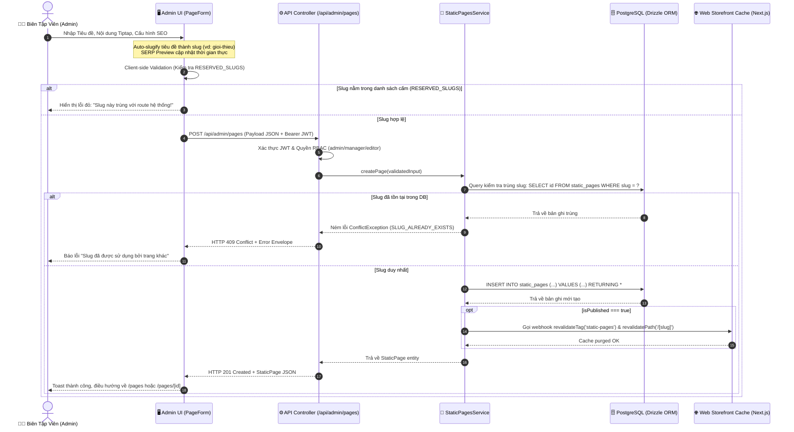
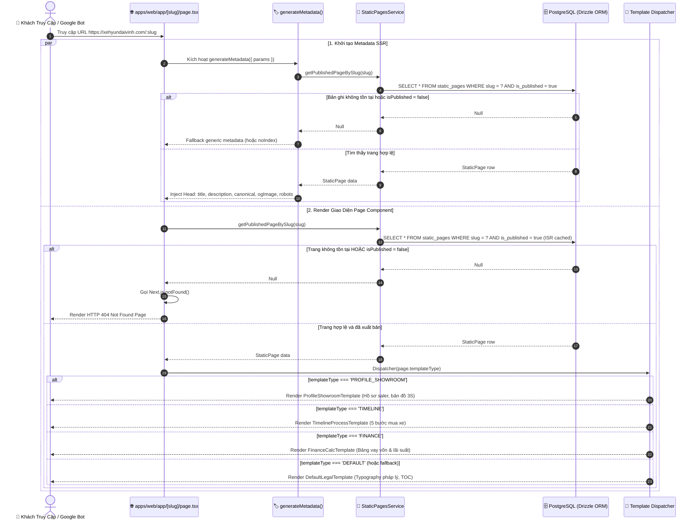
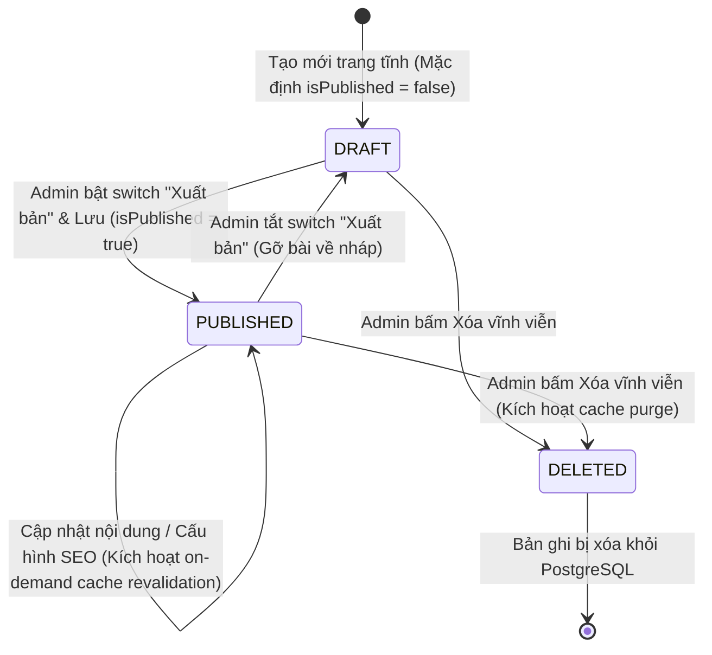

# 🔄 Technical Flow Specification: PHASE 2 - STATIC-PAGES-CMS

> **Mã Epic**: `EPIC-PHASE-2-STATIC-PAGES-CMS`  
> **Dự án**: CarDealer CMS & Storefront  
> **Giai đoạn**: Phase 2 - Step 2.2: Logic Flow  
> **Lead Role**: `logic-flow-ba`  
> **Tiêu chuẩn quy trình**: Universal Agentic Workflow v2.2  

---

## 1. Sequence Diagram Đa Tầng (End-to-End Sequence)

### 1.1 Luồng Quản Trị: Tạo Mới & Xuất Bản Trang Tĩnh (Admin Flow - US-02, US-03)

---

### 1.2 Luồng Khách Truy Cập Ngoài Storefront (Public Catch-all Route - US-04)

---

## 2. Entity State Machine Diagram (Vòng Đời Trang Tĩnh)

* **Trạng thái DRAFT (Bản nháp)**:
  * Hiển thị trong Admin với badge màu vàng `"Bản nháp"`.
  * Tuyệt đối không xuất hiện trên Storefront (khách truy cập nhận mã HTTP 404).
  * Không xuất hiện trong sitemap.xml.
* **Trạng thái PUBLISHED (Đã xuất bản)**:
  * Hiển thị trong Admin với badge màu xanh lá `"Đã xuất bản"`.
  * Render công khai tại URL `https://xehyundaivinh.com/[slug]`.
  * Tự động đưa vào sitemap.xml (nếu `noIndex === false`).
* **Trạng thái DELETED (Đã xóa)**:
  * Xóa vĩnh viễn khỏi DB, xóa sạch cache liên quan.

---

## 3. Bảng Giải Phẫu Từng Bước (Step Anatomy Table)

| Bước # | Lát Cắt | Tác Nhân | Hành Động & Payload | Logic Xử Lý & Ràng Buộc Nghiệp Vụ | Output & State Thay Đổi | Cơ Chế Xử Lý Lỗi / Rollback |
| :---: | :---: | :---: | :--- | :--- | :--- | :--- |
| **01** | `US-01` | System | Drizzle Migration Script | Chạy lệnh DDL tạo bảng `static_pages` kèm unique index trên cột `slug` và composite index `(slug, is_published)`. | Bảng `static_pages` sẵn sàng trong DB. | Rollback migration nếu database lỗi kết nối hoặc cú pháp. |
| **02** | `US-03` | Admin | Nhập tiêu đề trang | Giao diện tự động sinh slug dạng kebab-case không dấu (vd: "Giới thiệu Hyundai" ➡️ `gioi-thieu`). | Input slug được điền giá trị. | Cho phép Admin chỉnh sửa thủ công slug nếu cần tùy biến. |
| **03** | `US-03` | Admin | Chỉnh sửa SEO fields | Gõ `metaTitle` và `metaDescription`. SERP Preview cập nhật text, URL, favicon thời gian thực; thanh đếm ký tự đổi màu: Xanh (50-60/150-160), Vàng, Đỏ. | State form Admin cập nhật. | Giới hạn max-length cứng ngăn chặn nhập tràn bộ nhớ. |
| **04** | `US-02` | Admin | Bấm "Lưu thay đổi" (Submit form) | Validate Zod schema: kiểm tra title không rỗng, slug chuẩn định dạng regex `^[a-z0-9-]+$`, slug không thuộc `RESERVED_SLUGS`. | Gửi request `POST` hoặc `PUT` lên API. | Báo lỗi inline ngay tại input nếu validation client không thỏa mãn. |
| **05** | `US-02` | API | Nhận request từ Admin | Xác thực Bearer JWT token, kiểm tra role `ADMIN` hoặc `MANAGER`. Kiểm tra trùng lặp slug trong DB. | Tạo mới / cập nhật row trong `static_pages`. | Trả HTTP 401 nếu hết hạn phiên đăng nhập; HTTP 409 nếu trùng slug. |
| **06** | `US-02` | Service | Cache Invalidation Hook | Nếu `isPublished === true`, kích hoạt webhook xóa cache Next.js cho tag `static-pages` và path `/[slug]`. | Cache Storefront bị vô hiệu hóa. | Ghi log cảnh báo nếu webhook revalidate thất bại, không làm hỏng transaction DB. |
| **07** | `US-04` | Guest | Truy cập `/[slug]` ngoài Web | Server Component nhận `params.slug`. Query DB tìm kiếm bản ghi với điều kiện `slug = :slug AND is_published = true`. | Render template tương ứng hoặc gọi `notFound()`. | Nếu DB timeout ➡️ Render màn hình Error boundary thân thiện; nếu không có bản ghi ➡️ 404. |
| **08** | `US-04` | Client | Render Template | Template Dispatcher kiểm tra `page.templateType` để render 1 trong 4 giao diện (`PROFILE_SHOWROOM`, `DEFAULT`, `TIMELINE`, `FINANCE`). | Giao diện người dùng hoàn chỉnh. | Fallback về `DefaultLegalTemplate` nếu `templateType` không hợp lệ. |

---

## 4. Kịch Bản Biên & Cơ Chế Khôi Phục (Edge Cases & Resilience)

1. **Trùng lặp Slug với Tĩnh Tuyến Cấp 1 (Reserved Slugs Collision)**:
   * *Rủi ro*: Người dùng đặt slug là `xe`, `dong-xe`, `tin-tuc`, `gia-lan-banh`, `tra-gop`, `admin`, `api`, `login`, `preview`.
   * *Xử lý*: Khai báo danh sách bất biến `RESERVED_SLUGS` trong `@cardealer/core`. API ném lỗi `422 Unprocessable Entity` kèm thông điệp: `"Slug '[slug]' được dành riêng cho hệ thống, vui lòng chọn đường dẫn khác"`.
2. **Khách vãng lai cố tình truy cập trang Bản Nháp (Draft Access Attempt)**:
   * *Rủi ro*: Khách mò ra URL của trang đang soạn thảo chưa công bố.
   * *Xử lý*: Câu lệnh query bắt buộc có mệnh đề `is_published = true`. Nếu bản ghi có `is_published = false`, hàm trả về `null` và kích hoạt `notFound()` ngay lập tức.
3. **Nội dung Tiptap JSON rỗng hoặc sai cấu trúc AST**:
   * *Rủi ro*: Trang mới tạo chưa có nội dung hoặc JSON hỏng.
   * *Xử lý*: Trình Renderer AST kiểm tra: Nếu `!page.content || !page.content.content || page.content.content.length === 0` ➡️ hiển thị fallback empty state nhẹ nhàng thay vì làm crash toàn bộ Server Component.
4. **Trang được đánh dấu `noIndex: true`**:
   * *Rủi ro*: Google bot cào vào trang chính sách nội bộ.
   * *Xử lý*: `generateMetadata()` tự động gán `robots: { index: false, follow: false }`, đồng thời loại bỏ trang khỏi danh sách URL của `sitemap.xml`.
