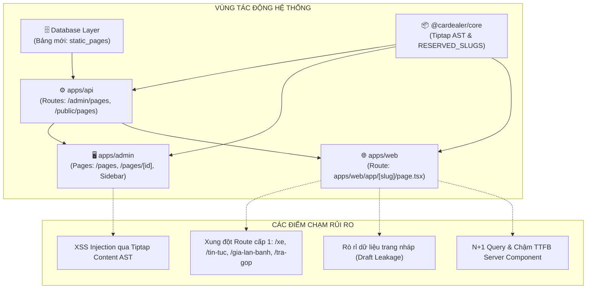

# 🛡️ Risk & Blast Radius Audit: PHASE 2 - STATIC-PAGES-CMS

> **Mã Epic**: `EPIC-PHASE-2-STATIC-PAGES-CMS`  
> **Dự án**: CarDealer Technical Risk Control  
> **Giai đoạn**: Phase 3 - Step 3.1: Risk & Impact Analysis  
> **Lead Role**: `dependency-graph-analyzer`  
> **Tiêu chuẩn quy trình**: Universal Agentic Workflow v2.2  

---

## 1. Bản Đồ Đồ Thị Phụ Thuộc & Bán Kính Tác Động (Blast Radius)



* **Vùng Tác Động Cốt Lõi (Blast Radius Level: LOW-MEDIUM)**:
  * Do bảng `static_pages` là một thực thể hoàn toàn mới (Greenfield Entity), nó **không làm thay đổi cấu trúc bảng nào hiện có** (`cars`, `posts`, `users`, `leads`).
  * Điểm nhạy cảm cao nhất của hệ thống nằm ở **Dynamic Route `apps/web/app/[slug]/page.tsx`**, vì route này hoạt động ở cấp 1 và có thể chặn/ghi đè các route tĩnh nếu không được kiểm soát chặt chẽ.

---

## 2. Ma Trận Phân Loại 17 Nhóm Nguy Cơ (R1 - R17 Taxonomy)

| Mã Rủi Ro | Nhóm Nguy Cơ & Tên Rủi Ro | Mức Độ | Kịch Bản Xuất Hiện Cụ Thể | Giải Pháp Phòng Vệ Kỹ Thuật (Defense Invariant) |
| :---: | :--- | :---: | :--- | :--- |
| **R4** | **Sanitization & XSS Failures** *(CWE-79)* | 🔴 **HIGH** | Người dùng ác ý chèn thẻ `<script>` hoặc thuộc tính `onload/onerror` độc hại vào nội dung Tiptap JSON. | 1. Lưu nội dung dưới dạng JSON AST Tree, tuyệt đối không dùng raw HTML.<br/>2. Phía Web Storefront render an toàn qua React Virtual DOM, không dùng `dangerouslySetInnerHTML`. |
| **R12** | **Convention & Route Collision** *(CWE-400)* | 🔴 **HIGH** | Admin tạo một trang có slug trùng với route tĩnh hệ thống (`/xe`, `/tin-tuc`, `/gia-lan-banh`). | 1. Định nghĩa mảng bất biến `RESERVED_SLUGS` trong `@cardealer/core`.<br/>2. Zod Validator kiểm tra nghiêm ngặt cả ở Form Admin và API Backend.<br/>3. Next.js App Router phân giải route tĩnh trước route động `[slug]`. |
| **R14** | **Draft Leakage & Unauthorized Access** | 🟠 **MEDIUM** | Khách vãng lai mò ra URL của trang tĩnh đang ở trạng thái `isPublished = false` (Bản nháp). | Câu lệnh truy vấn DB tại Storefront bắt buộc có điều kiện `AND is_published = true`. Nếu không thỏa mãn, lập tức gọi Next.js `notFound()`. |
| **R13** | **Concurrency & Slug Race Condition** *(CWE-362)* | 🟠 **MEDIUM** | Hai Admin tạo 2 trang khác nhau nhưng nhập cùng một slug vào cùng một thời điểm. | 1. Đặt ràng buộc `UNIQUE` ở tầng Database PostgreSQL (`uniqueIndex('static_pages_slug_uidx')`).<br/>2. API bắt lỗi mã PostgreSQL `23505` và trả HTTP 409 Conflict rõ ràng. |
| **R1** | **N+1 Queries & TTFB Degradation** *(CWE-400)* | 🟠 **MEDIUM** | Mỗi lượt khách truy cập vào trang tĩnh đều gửi request tới database làm nghẽn kết nối và giảm điểm LCP. | Áp dụng Next.js ISR (Incremental Static Regeneration) với tag revalidation `static-pages`, tốc độ tải trang tĩnh đạt TTFB < 50ms. |
| **R5** | **Broken Object-Level Auth / IDOR** *(CWE-862)* | 🟡 **LOW** | User không có quyền cố gắng gửi request `DELETE /api/admin/pages/:id`. | Bắt buộc middleware xác thực JWT và kiểm tra quyền RBAC (`role === 'ADMIN' || role === 'MANAGER'`) trước mọi thao tác ghi/xóa. |
| **R7** | **Mass Assignment & DTO Pollution** *(CWE-915)* | 🟡 **LOW** | Client cố tình gửi thêm các trường nhạy cảm (`id`, `created_at`, `audit_logs`). | Dùng Zod Schema `createStaticPageSchema` lọc bỏ (strip) toàn bộ các trường không được khai báo. |

---

## 3. Quy Chuẩn Phòng Vệ Kỹ Thuật (Defensive Code Invariants)

1. **Bảo Mật XSS (Tiptap Content Rendering)**:
   ```typescript
   // ❌ CẤM: Render raw HTML bằng dangerouslySetInnerHTML
   <div dangerouslySetInnerHTML={{ __html: page.htmlContent }} />

   // ✅ CHUẨN: Render an toàn qua Tiptap Content Nodes (React Elements)
   <TiptapRenderer doc={page.content} />
   ```
2. **Chống Xung Đột Route (Reserved Slugs Blacklist)**:
   ```typescript
   export const RESERVED_SLUGS = [
     'xe', 'dong-xe', 'tin-tuc', 'gia-lan-banh', 'tra-gop',
     'admin', 'api', 'login', 'preview', 'settings', 'sitemap', 'robots.txt'
   ] as const;
   ```
3. **Bảo Vệ Tính Toàn Vẹn Dữ Liệu Nháp**:
   ```typescript
   // Tại apps/web/app/[slug]/page.tsx
   const page = await getPublishedPage(slug);
   if (!page || !page.isPublished) {
     notFound(); // Trả về 404 cho khách truy cập
   }
   ```

---

## 4. Kế Hoạch Cách Ly & Rollback Sự Cố (Rollback Plan)

* **Trường Hợp 1: Lỗi Migration Database**:
  * Bản ghi lỗi không làm gián đoạn các bảng khác. Chạy lệnh:
    ```sql
    DROP TABLE IF EXISTS static_pages CASCADE;
    ```
* **Trường Hợp 2: Lỗi Xung Đột Route Ngoại Vi Ngoài Storefront**:
  * Xóa bỏ hoặc đổi tên tệp `apps/web/app/[slug]/page.tsx` ➡️ Hệ thống lập tức quay về trạng thái routing tĩnh ban đầu mà không làm crash các trang `/xe`, `/dong-xe`, `/tin-tuc`.
* **Trường Hợp 3: Lỗi Lệch Dữ Liệu Cache ISR**:
  * Gọi endpoint Revalidate API thủ công:
    ```bash
    curl -X POST https://xehyundaivinh.com/api/revalidate?tag=static-pages
    ```
