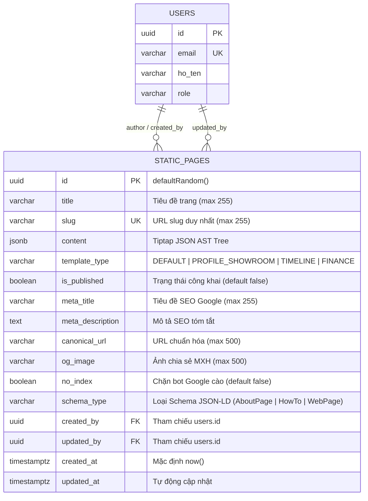

# 🗄️ Database Schema Specification: PHASE 2 - STATIC-PAGES-CMS

> **Mã Epic**: `EPIC-PHASE-2-STATIC-PAGES-CMS`  
> **Dự án**: CarDealer Database Layer  
> **Giai đoạn**: Phase 2 - Step 2.3: Database Schema Design  
> **Lead Role**: `db-schema-architect`  
> **Tiêu chuẩn quy trình**: Universal Agentic Workflow v2.2  

---

## 1. Sơ Đồ Thực Thể Quan Hệ (Entity Relationship Diagram - ERD)



---

## 2. Mã Nguồn Drizzle ORM Schema Hoàn Chỉnh

*Vị trí tệp:* `packages/database/src/schema/static-pages.ts`

```typescript
import { pgTable, uuid, varchar, text, jsonb, boolean, timestamp, index, uniqueIndex } from 'drizzle-orm/pg-core';
import { users } from './users';

/**
 * 📄 BẢNG QUẢN TRỊ TRANG TĨNH ĐỘNG (STATIC_PAGES)
 * Lưu trữ nội dung rich-text và cấu hình Technical SEO cho các trang E-E-A-T
 * (Giới thiệu, Quy trình mua xe, Chính sách bảo mật, Trả góp...)
 */
export const staticPages = pgTable('static_pages', {
  id: uuid('id').defaultRandom().primaryKey(),
  
  // 1. Dữ liệu Nội dung & Hiển thị
  title: varchar('title', { length: 255 }).notNull(),
  slug: varchar('slug', { length: 255 }).notNull().unique(),
  content: jsonb('content').notNull().default({}), // Tiptap JSON AST Tree Node
  templateType: varchar('template_type', { length: 50 }).notNull().default('DEFAULT'), // 'DEFAULT' | 'PROFILE_SHOWROOM' | 'TIMELINE' | 'FINANCE'
  isPublished: boolean('is_published').notNull().default(false),

  // 2. Cấu hình Technical SEO Chuyên Biệt
  metaTitle: varchar('meta_title', { length: 255 }),
  metaDescription: text('meta_description'),
  canonicalUrl: varchar('canonical_url', { length: 500 }),
  ogImage: varchar('og_image', { length: 500 }),
  noIndex: boolean('no_index').notNull().default(false),
  schemaType: varchar('schema_type', { length: 50 }).default('WebPage'), // 'AboutPage' | 'HowTo' | 'WebPage'

  // 3. Quan hệ Quản trị & Audit Trace
  createdBy: uuid('created_by').references(() => users.id, { onDelete: 'set null' }),
  updatedBy: uuid('updated_by').references(() => users.id, { onDelete: 'set null' }),

  // 4. Timestamps chuẩn UTC
  createdAt: timestamp('created_at', { withTimezone: true }).defaultNow().notNull(),
  updatedAt: timestamp('updated_at', { withTimezone: true }).defaultNow().notNull().$onUpdate(() => new Date()),
}, (table) => [
  // Index tìm kiếm theo slug cực nhanh cho Storefront (duy nhất)
  uniqueIndex('static_pages_slug_uidx').on(table.slug),

  // Composite Index hỗ trợ truy vấn lọc trang đã xuất bản ngoài Storefront: SELECT * WHERE slug = ? AND is_published = true
  index('static_pages_slug_published_idx').on(table.slug, table.isPublished),

  // Index hỗ trợ lọc và sắp xếp trong trang danh sách CMS Admin
  index('static_pages_admin_list_idx').on(table.isPublished, table.templateType, table.updatedAt),
  
  // Index khóa ngoại audit trace
  index('static_pages_created_by_idx').on(table.createdBy),
]);

export type StaticPageRow = typeof staticPages.$inferSelect;
export type NewStaticPageRow = typeof staticPages.$inferInsert;
```

---

## 3. TypeScript Contracts & Interfaces

*Vị trí tệp:* `packages/types/src/static-pages.ts`

```typescript
export type StaticPageTemplate = 'DEFAULT' | 'PROFILE_SHOWROOM' | 'TIMELINE' | 'FINANCE';
export type StaticPageSchemaType = 'AboutPage' | 'HowTo' | 'WebPage';

export interface StaticPage {
  id: string;
  title: string;
  slug: string;
  content: Record<string, any>;
  templateType: StaticPageTemplate;
  isPublished: boolean;
  metaTitle: string | null;
  metaDescription: string | null;
  canonicalUrl: string | null;
  ogImage: string | null;
  noIndex: boolean;
  schemaType: StaticPageSchemaType | null;
  createdBy: string | null;
  updatedBy: string | null;
  createdAt: string;
  updatedAt: string;
}

export interface CreateStaticPageDTO {
  title: string;
  slug: string;
  content?: Record<string, any>;
  templateType?: StaticPageTemplate;
  isPublished?: boolean;
  metaTitle?: string | null;
  metaDescription?: string | null;
  canonicalUrl?: string | null;
  ogImage?: string | null;
  noIndex?: boolean;
  schemaType?: StaticPageSchemaType | null;
}

export type UpdateStaticPageDTO = Partial<CreateStaticPageDTO>;
```

---

## 4. Ma Trận Chuyển Trạng Thái (State Transition Matrix)

| Trạng Thái Hiện Tại | Trạng Thái Kế Tiếp Hợp Lệ | Trigger / Event Nghiệp Vụ | Vai Trò Cho Phép (RBAC) | Tác Vụ Đi Kèm (Side Effects) |
| :--- | :--- | :--- | :--- | :--- |
| *(None - Khởi tạo)* | `DRAFT` | Tạo trang mới với `isPublished = false` | ADMIN, MANAGER, EDITOR | Ghi bản ghi vào PostgreSQL, không đẩy vào cache storefront. |
| *(None - Khởi tạo)* | `PUBLISHED` | Tạo trang mới với `isPublished = true` | ADMIN, MANAGER | Ghi DB, kích hoạt revalidation tag `static-pages` và path `/[slug]`. |
| `DRAFT` | `PUBLISHED` | Bật switch "Xuất bản" và Lưu | ADMIN, MANAGER | Cập nhật `isPublished = true`, trigger cache purge trên storefront. |
| `PUBLISHED` | `DRAFT` | Tắt switch "Xuất bản" (Gỡ trang) | ADMIN, MANAGER | Cập nhật `isPublished = false`, trigger revalidate ngay lập tức để storefront trả về 404. |
| `DRAFT` hoặc `PUBLISHED` | `DELETED` | Bấm "Xóa vĩnh viễn" trang | ADMIN | Xóa row khỏi DB, xóa sạch cache ISR của `/[slug]`. |

---

## 5. Kế Hoạch Migration An Toàn (Zero-Downtime Migration Plan)

* **Phân loại**: Thêm mới hoàn toàn (Greenfield Entity) — Bảng mới độc lập, không tác động sửa đổi/khóa các bảng có sẵn (`cars`, `posts`, `users`).
* **Chiến lược Thực hiện**:
  1. Thêm tệp `packages/database/src/schema/static-pages.ts`.
  2. Xuất bản `staticPages` qua `packages/database/src/schema/index.ts`.
  3. Chạy `pnpm --filter @cardealer/database db:push` (trong môi trường Sandbox dev).
  4. Xác nhận bảng `static_pages` được tạo thành công với 3 indexes:
     * `static_pages_slug_uidx`
     * `static_pages_slug_published_idx`
     * `static_pages_admin_list_idx`
* **Phương án Rollback**: Nếu có lỗi phát sinh trong quá trình dev:
  ```sql
  DROP TABLE IF EXISTS static_pages CASCADE;
  ```
