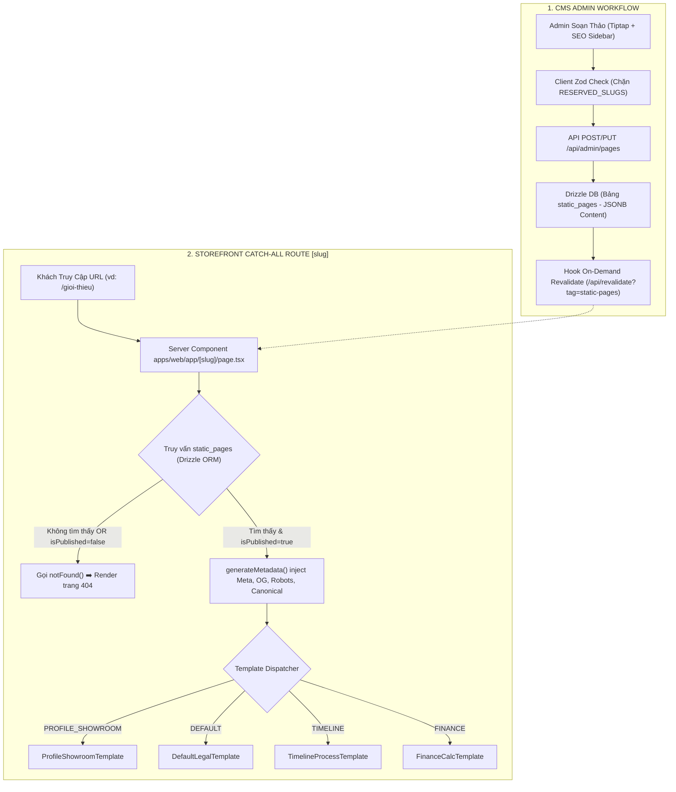

# 🏛️ Architectural Solution Options: PHASE 2 - STATIC-PAGES-CMS

> **Mã Epic**: `EPIC-PHASE-2-STATIC-PAGES-CMS`  
> **Dự án**: CarDealer CMS & Storefront  
> **Giai đoạn**: Phase 2 - Step 2.1: Solution Options  
> **Lead Role**: `system-analyst-architect`  
> **Tiêu chuẩn quy trình**: Universal Agentic Workflow v2.2  

---

## 1. Bối Cảnh và Ràng Buộc Kỹ Thuật (Technical Constraints)

* **Phạm vi Nền tảng:** `[Full-stack]` (Database Drizzle ➡️ API ➡️ Admin CMS ➡️ Web Storefront).
* **Hiện trạng Hệ thống (Tham chiếu `docs/SYSTEM_MAP.md`):**
  * Database sử dụng PostgreSQL với **Drizzle ORM** (`packages/database`).
  * Gói dùng chung `@cardealer/core` đã sở hữu hệ sinh thái chuyển đổi **Tiptap JSON AST Tree** (`TiptapDoc`, `serializeTiptapDoc`, `deserializeTiptapDoc`).
  * Giao diện Admin (`apps/admin`) đã có thiết kế Dashboard, Skeleton Zero-CLS và Media Library.
  * Storefront Web (`apps/web`) có routing cấp 1 phẳng (`/xe`, `/dong-xe`, `/tin-tuc`, `/gia-lan-banh`, `/tra-gop`).
* **Trạng thái Môi trường:** 🟢 `case_a: SANDBOX_GREENFIELD` (Môi trường Sandbox phát triển, chưa Live Production In-Use).
* **Phạm vi Bao quát:** Cung cấp phương án kiến trúc toàn diện cho cả 4 lát cắt:
  * `US-01`: Data Model `static_pages` & Drizzle Schema.
  * `US-02`: REST API Admin CRUD & Public Query.
  * `US-03`: Admin CMS Editor 2 cột (Tiptap + SERP Preview Sidebar).
  * `US-04`: Dynamic Catch-all Route `[slug]` & 4 Layout Templates.

---

## 2. Các Quyết Định Kiến Trúc Trọng Yếu (Architecture Decisions)

---

### 📌 Quyết định 1: Cơ Chế Render & Caching Trang Tĩnh Ngoài Storefront (`apps/web/app/[slug]/page.tsx`)

* **Bối cảnh bài toán:** Các trang tĩnh E-E-A-T (`/gioi-thieu`, `/quy-trinh-mua-xe`, `/chinh-sach-bao-mat`) cần đạt điểm Core Web Vitals tối đa (TTFB < 50ms, LCP < 1.5s để tối ưu SEO Google), đồng thời khi Quản trị viên sửa nội dung trong Admin thì trang ngoài Web phải cập nhật tức thì mà không cần build lại server.

| Tiêu chí So sánh | Option 1.A (Dynamic SSR on every request) | Option 1.B (Incremental Static Regeneration - ISR kèm On-Demand Revalidation) *(Khuyên dùng)* | Option 1.C (Pure SSG Build-time) |
| :--- | :--- | :--- | :--- |
| **Mô hình Kỹ thuật** | Next.js Server Component với `cache: 'no-store'`. Mỗi lượt truy vấn đều gọi DB PostgreSQL. | Next.js Server Component với cơ chế cache có tag `tags: ['static-pages', slug]`, kết hợp hook `revalidateTag(slug)` khi Admin cập nhật. | `generateStaticParams()` build tĩnh HTML 100% tại thời điểm đóng gói dự án. |
| **Ưu điểm** | Dữ liệu luôn luôn mới 100%, không cần xử lý cache invalidation. | Tốc độ tải trang siêu tốc (TTFB < 50ms) như file tĩnh, giảm 95% tải lên Database, nội dung cập nhật ngay khi Admin bấm "Lưu". | Tối ưu tài nguyên server nhất, bảo mật cao. |
| **Nhược điểm / Đánh đổi** | Tăng tải kết nối database, TTFB chậm hơn (200-500ms), không tối ưu SEO Core Web Vitals. | Cần cài đặt hook API revalidation giữa Admin và Web Client. | Mỗi khi tạo trang mới trong Admin thì ngoài Web không hiển thị được, bắt buộc phải Rebuild/Deploy lại toàn bộ dự án. |
| **Tác động Hệ thống** | Ảnh hưởng nhẹ đến hiệu năng DB. | Chuẩn hóa kiến trúc Enterprise Next.js 15, tối ưu tuyệt đối cho SEO. | Gãy trải nghiệm quản trị CMS động. |

👉 **Khuyến nghị cho Quyết định 1:** Chọn **Option 1.B (ISR kèm On-Demand Revalidation)** vì đáp ứng trọn vẹn cả 2 tiêu chí khắt khe: Tốc độ tải trang đạt chuẩn Core Web Vitals cao nhất cho Google Bot và Khả năng biên tập thời gian thực cho phòng Marketing.

---

### 📌 Quyết định 2: Định Dạng Lưu Trữ Nội Dung Rich-Text Biên Tập (`content`)

* **Bối cảnh bài toán:** Cần chọn cấu trúc lưu trữ nội dung do Tiptap Editor sinh ra trong Database để vừa an toàn trước mã độc (XSS), vừa dễ dàng render linh hoạt các components giao diện đặc thù (Callout, FAQ Accordion, Bảng biểu).

| Tiêu chí So sánh | Option 2.A (Raw HTML String) | Option 2.B (JSONB AST Tree kế thừa `@cardealer/core`) *(Khuyên dùng)* | Option 2.C (Markdown Text) |
| :--- | :--- | :--- | :--- |
| **Mô hình Kỹ thuật** | Lưu chuỗi HTML thô (`
`, `<h1>`, `<table>`) dạng `text`. Render bằng `dangerouslySetInnerHTML`. | Lưu cây cú pháp trừu tượng JSON của Tiptap dạng `jsonb`. Tái sử dụng `TiptapDoc` từ `@cardealer/core`. | Lưu văn bản Markdown chuẩn (`##`, `*`, `[]`). Render qua `react-markdown`. |
| **Ưu điểm** | Đơn giản, lưu thẳng HTML không cần qua bước trung gian. | Miễn nhiễm 100% với lỗi XSS; cấu trúc dạng Node dễ phân tích đếm từ, trích xuất Heading H2/H3 để sinh Mục lục tự động (TOC). | Dễ đọc hiểu dưới dạng raw text. |
| **Nhược điểm / Đánh đổi** | Tiềm ẩn rủi ro bảo mật XSS nghiêm trọng; khó can thiệp style hay nhúng React Components tương tác. | Cần bộ AST Renderer component để chuyển các Node JSON thành JSX. | Hạn chế trong việc tạo layout phức tạp (bảng dữ liệu nâng cao, callout box nhiều màu). |
| **Tác động Hệ thống** | Nguy cơ bảo mật và nợ kỹ thuật. | Đồng bộ 100% với kiến trúc module bài viết (`posts`) hiện có của monorepo. | Không tương thích trực tiếp với Tiptap Editor. |

👉 **Khuyến nghị cho Quyết định 2:** Chọn **Option 2.B (JSONB AST Tree)** vì đã có sẵn nền tảng vững chắc trong `@cardealer/core`, bảo mật tối đa và cho phép render các khối tương tác (Accordion, Callout, Table) mượt mà bằng React Server Components.

---

### 📌 Quyết định 3: Kiến Trúc Điều Phối Layout 4 Mẫu Templates (`Template Dispatcher`)

* **Bối cảnh bài toán:** Phân hệ hỗ trợ 4 mẫu giao diện (`DEFAULT`, `PROFILE_SHOWROOM`, `TIMELINE`, `FINANCE`). Cần thiết kế tầng giao diện sao cho sạch sẽ, không biến `[slug]/page.tsx` thành một tệp spaghetti code khổng lồ.

| Tiêu chí So sánh | Option 3.A (Monolithic Conditional JSX) | Option 3.B (Template Registry & Component Dispatcher) *(Khuyên dùng)* | Option 3.C (Route Group Tách Biệt) |
| :--- | :--- | :--- | :--- |
| **Mô hình Kỹ thuật** | Viết toàn bộ mã giao diện của cả 4 mẫu vào một file `apps/web/app/[slug]/page.tsx` duy nhất bằng các khối `if/else` lồng nhau. | `page.tsx` giữ vai trò Controller gọn nhẹ (<50 dòng), nạp bản ghi từ DB và ủy quyền render cho 4 component độc lập tại `apps/web/components/pages/templates/`. | Tạo các sub-routes tĩnh riêng (`/gioi-thieu`, `/chinh-sach`...). |
| **Ưu điểm** | Tất cả code nằm ở 1 file, không cần tạo thêm thư mục con. | Clean Architecture: Tách biệt rõ ràng trách nhiệm; mỗi template có stylesheet và logic riêng; dễ dàng bổ sung mẫu thứ 5, thứ 6 mà không động vào route. | Route tường minh. |
| **Nhược điểm / Đánh đổi** | Tệp tin phình to (>1000 dòng), khó đọc, rủi ro hồi quy cao khi sửa đổi một mẫu giao diện. | Cần tạo thêm 4 file template con và 1 file dispatcher interface. | Mất đi tính năng tạo trang động từ CMS (người dùng không thể tạo thêm trang mới từ Admin). |
| **Tác động Hệ thống** | Nợ kỹ thuật cao, vi phạm nguyên lý Single Responsibility. | Cấu trúc module hóa cao, code dễ test và bảo trì. | Phá vỡ yêu cầu nghiệp vụ Dynamic CMS. |

👉 **Khuyến nghị cho Quyết định 3:** Chọn **Option 3.B (Template Registry & Component Dispatcher)** để giữ mã nguồn tường minh, phân tách ranh giới rõ ràng giữa tầng Routing và tầng Trình bày UI.

---

### 📌 Quyết định 4: Cơ Chế Phòng Chống Xung Đột Định Tuyến (Route Collisions Prevention)

* **Bối cảnh bài toán:** Dynamic catch-all route `apps/web/app/[slug]/page.tsx` bắt tất cả các request cấp 1. Nếu Admin vô tình tạo một trang tĩnh có slug trùng với route cố định (`xe`, `tin-tuc`, `gia-lan-banh`, `tra-gop`, `dong-xe`, `admin`, `api`, `login`), hệ thống có thể bị xung đột hoặc ghi đè hành vi.

| Tiêu chí So sánh | Option 4.A (Phụ thuộc vào Next.js Route Precedence) | Option 4.B (Two-Tier Guard: Blacklist Validation tại API + Next.js Fallback) *(Khuyên dùng)* | Option 4.C (Thêm tiền tố URL, ví dụ: `/p/[slug]`) |
| :--- | :--- | :--- | :--- |
| **Mô hình Kỹ thuật** | Không chặn ở Admin/API, để Next.js tự ưu tiên route tĩnh trước route động `[slug]`. | Thiết lập danh sách hằng số `RESERVED_SLUGS` trong `@cardealer/core`. Chặn tạo/sửa ngay tại API (Zod Validator) và hiển thị cảnh báo đỏ trên form Admin. | Đổi URL thành `/trang/[slug]` hoặc `/p/[slug]`. |
| **Ưu điểm** | Không cần viết thêm validation. | Triệt tiêu 100% rủi ro tạo nhầm dữ liệu rác, người dùng nhận được phản hồi lỗi thân thiện ngay khi nhập slug. | Tuyệt đối không bao giờ trùng route tĩnh. |
| **Nhược điểm / Đánh đổi** | Người dùng vẫn tạo được trang rác trong Admin nhưng ngoài web không bao giờ vào được; gây khó hiểu và nhầm lẫn. | Cần duy trì mảng `RESERVED_SLUGS` đồng bộ giữa các module. | Xấu URL chuẩn SEO (Khách hàng muốn URL đẹp như `xehyundaivinh.com/gioi-thieu`, không muốn tiền tố `/p/gioi-thieu`). |
| **Tác động Hệ thống** | Tiềm ẩn rủi ro logic ngầm. | Bảo vệ toàn vẹn dữ liệu từ gốc. | Ảnh hưởng tiêu cực đến thẩm mỹ URL SEO. |

👉 **Khuyến nghị cho Quyết định 4:** Chọn **Option 4.B (Two-Tier Guard với `RESERVED_SLUGS`)** để bảo vệ dữ liệu sạch từ gốc, giữ nguyên URL chuẩn SEO cấp 1 cho thương hiệu.

---

## 3. Tổng Kết Đề Xuất Kiến Trúc Toàn Diện

---

### 🚦 TRẠNG THÁI CHỐT CHẶN BƯỚC 2.1 (STEP 2.1 STATUS BLOCK)

* **Bộ Giải Pháp Kiến Trúc Đề Xuất**:
  1. **Render & Cache**: `Option 1.B` — Next.js ISR kết hợp On-Demand Tag Revalidation.
  2. **Content Storage**: `Option 2.B` — JSONB AST Tree kế thừa `@cardealer/core`.
  3. **UI Dispatcher**: `Option 3.B` — Template Registry & Component Dispatcher 4 mẫu.
  4. **Route Safety**: `Option 4.B` — Two-Tier Guard với `RESERVED_SLUGS` blacklist.
* **Tài liệu Bàn giao**: [SOLUTION_OPTIONS.md](file:///Users/nhatphan/Code/CarDealer/cardealer/docs/features/PHASE-2-STATIC-PAGES-CMS/SOLUTION_OPTIONS.md)
* **Trạng thái Chốt chặn**: 🔒 **ĐANG KHÓA (LOCKED)** — Tạm dừng chờ Developer xem xét và chốt phương án kiến trúc.
* **Lệnh thông quan**: `"Confirm Step 2.1: Chốt Kiến Trúc"` *(hoặc yêu cầu điều chỉnh bất kỳ Option nào)*.
* **Kế hoạch Tiếp theo**: Chuyển giao sang Step 2.2 (`logic-flow-ba` vẽ `FLOW.md`, `db-schema-architect` lập `SCHEMA.md`, `feature-spec-generator` lập `API_SPEC.md`, `tailwind-ui-designer` lập `FE_INTEGRATION_GUIDE.md`).
