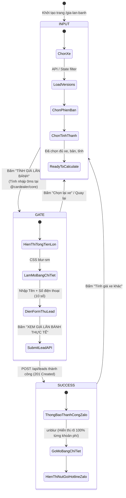
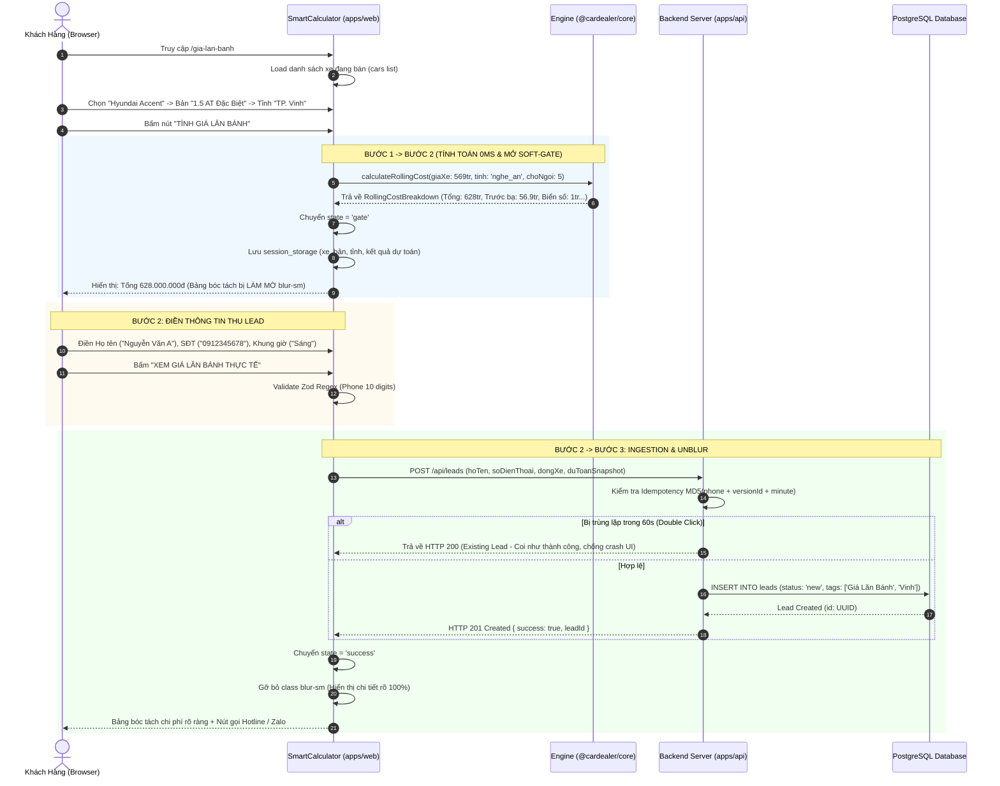
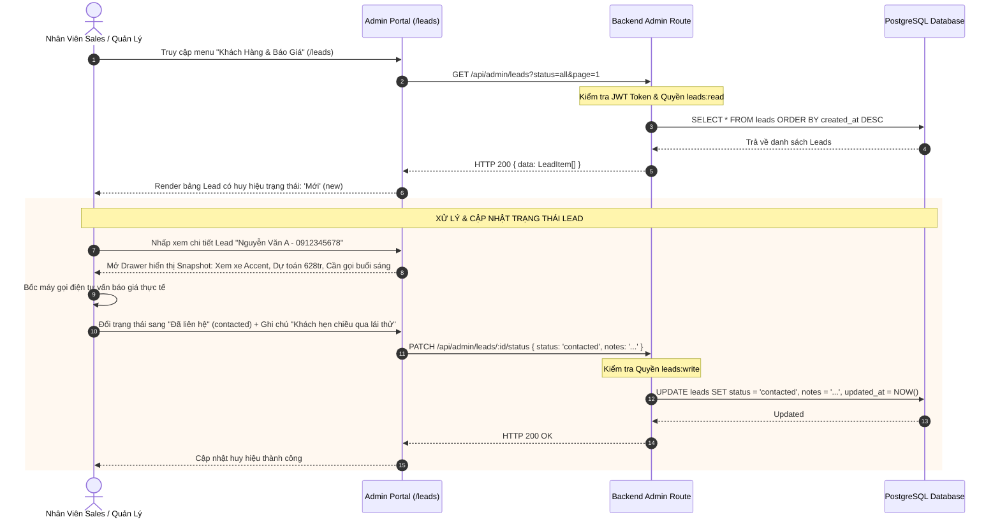

# 🔄 Thiết Kế Luồng Nghiệp Vụ & State Machine (Business Flow & State Transitions)

> **Mã Tính Năng:** `EPIC-PHASE-3-PRICING-LEAD`  
> **Tên Tính Năng:** Bộ Công Cụ Tài Chính & Phễu Thu Thập Khách Hàng (Pricing & Lead Engine)  
> **Phương Án Kiến Trúc Đã Chốt:** Option 1 (Client-First Soft-Gate Funnel + Light Ingestion Pipeline)  
> **Role Phụ Trách:** Logic Flow BA  
> **Tài liệu tham chiếu:** [`BACKLOG.md`](./BACKLOG.md), [`SOLUTION_OPTIONS.md`](./SOLUTION_OPTIONS.md), [`fe-cardealer/app/components/calculator/SmartCalculator.tsx`](file:///Users/nhatphan/Code/CarDealer/fe-cardealer/app/components/calculator/SmartCalculator.tsx)

---

## I. Tổng Quan Kiến Trúc State Machine Của SmartCalculator

Công cụ `SmartCalculator` hoạt động như một **Finite State Machine (FSM)** có trạng thái bền vững (State Persistence qua `sessionStorage`), điều phối trải nghiệm qua 3 giai đoạn:

---

## II. Bảng Ma Trận Chuyển Đổi Trạng Thái (State Transition Matrix)

| Trạng Thái Hiện Tại | Tác Vụ Người Dùng / Sự Kiện | Điều Kiện Kích Hoạt | Trạng Thái Đích | Hành Động Kèm Theo (Side Effects) |
| :--- | :--- | :--- | :--- | :--- |
| `input` | Thay đổi Dòng xe | Dropdown `dongXe` đổi giá trị | `input` | Lọc lại danh sách `availableVersions`, reset `phienBan = ''`, reset giá xe = 0. |
| `input` | Thay đổi Phiên bản | Dropdown `phienBan` đổi giá trị | `input` | Cập nhật `selectedVersionGia = giaNiemYet`. |
| `input` | Bấm nút "TÍNH GIÁ LĂN BÁNH" | `dongXe != ''` && `phienBan != ''` && `gia > 0` | **`gate`** | 1. Gọi `calculateRollingCost()` tính toán tức thì. 2. Lưu snapshot vào `sessionStorage`. 3. Cuộn mượt đến bảng tổng tiền. |
| `gate` | Nhập Họ tên & SĐT | Cú pháp SĐT bắt đầu `03/05/07/08/09` đủ 10 số | `gate` | Kích hoạt nút bấm đỏ "XEM GIÁ LĂN BÁNH THỰC TẾ". |
| `gate` | Bấm "XEM GIÁ LĂN BÁNH THỰC TẾ" | Form validate thành công | Đang gửi (`isLoading`) | Gọi `POST /api/leads` kèm snapshot dự toán. |
| `gate` | Gửi Lead Thành Công | Server trả HTTP 201 Created | **`success`** | 1. Chuyển state sang `success`. 2. Gỡ bỏ class `blur-sm` trên bảng chi tiết. 3. Hiển thị thông báo xanh lá + Hotline/Zalo. |
| `gate` | Gửi Lead Thất Bại (Spam / Lỗi mạng) | Server trả HTTP 429 hoặc lỗi mạng | `gate` | Hiển thị Toast thông báo lỗi, giữ nguyên form cho khách thử lại. |
| `success` | Bấm "Tính giá xe khác" | Click nút "Chọn Dòng Xe Khác" | **`input`** | Xóa snapshot trong `sessionStorage`, reset form về ban đầu. |
| `installment_input` | Kéo Slider % trả trước hoặc đổi kỳ hạn vay | User thay đổi giá trị slider/button | `installment_input` | Gọi `calculateInstallment()`, cập nhật số tiền vay và gốc + lãi (bảng chi tiết vẫn bị mờ `blur-sm`). |
| `installment_input` | Nhập Họ tên & SĐT (10 số) -> Bấm "XEM CHI TIẾT LỊCH TRẢ NỢ" | Form validate thành công | Đang gửi (`isLoading`) | Gọi `POST /api/leads` với `hinhThuc: 'Dự Toán Trả Góp'` kèm snapshot gói vay. |
| `installment_input` | Gửi Lead Trả Góp Thành Công | Server trả HTTP 201 Created | **`installment_success`** | 1. Mở khóa chi tiết bảng trả góp (`blur-none`). 2. Hiển thị banner xanh: "Chuyên viên tài chính sẽ liên lạc lại ngay trong ít phút!" 3. Mở nút gọi Hotline & chat Zalo tín dụng. |

---

## III. Sequence Diagram 1: Luồng Người Dùng Tính Giá & Nạp Lead (Storefront)

---

## IV. Sequence Diagram 2: Luồng Phân Phối & Quản Trị Lead Tại Showroom (Admin CRM)

---

## V. Cơ Chế Chống Mất Trạng Thái (F5 Page Reload Recovery)

Để bảo đảm **trải nghiệm 10/10 hoàn hảo** như đã thống nhất tại Sub-Gate 2.1:
1. **Lưu phiên nhẹ qua `sessionStorage`:**
   * Key: `cardealer_calculator_session`
   * Dữ liệu lưu: `{ dongXe, phienBan, tinhThanh, state, calculatedResult }`
2. **Khôi phục khi F5 (Mount Phase):**
   * Khi component `SmartCalculator` mount lần đầu, nó kiểm tra `sessionStorage`:
     * Nếu tìm thấy dữ liệu hợp lệ và `state === 'gate'`, nó tự động khôi phục giao diện màn hình Gate làm mờ ngay lập tức, không bắt khách phải chọn lại từ Dòng xe!
     * Khi khách submit xong sang `state === 'success'`, lưu trạng thái hoàn thành để khách refresh trang vẫn xem được bảng giá đã mở khóa.
     * Khi khách bấm "Tính giá xe khác", xóa sạch `sessionStorage`.
