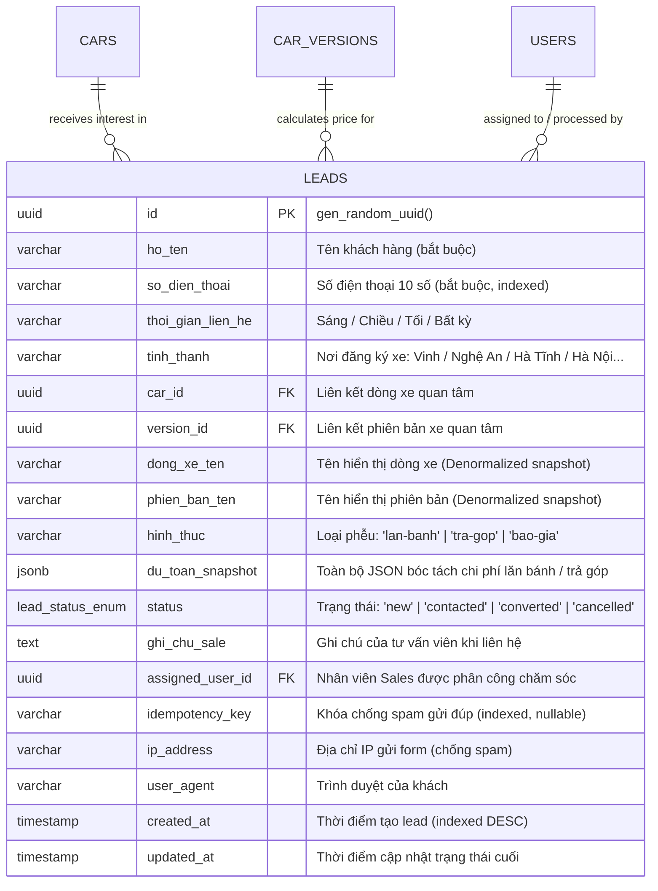

# 🗄️ Thiết Kế Cơ Sở Dữ Liệu & Khế Ước Dữ Liệu (Database Schema & Data Contracts)

> **Mã Tính Năng:** `EPIC-PHASE-3-PRICING-LEAD`  
> **Tên Tính Năng:** Bộ Công Cụ Tài Chính & Phễu Thu Thập Khách Hàng (Pricing & Lead Engine)  
> **Role Phụ Trách:** DB Schema Architect  
> **Tài liệu tham chiếu:** [`BACKLOG.md`](./BACKLOG.md), [`FLOW.md`](./FLOW.md), [`packages/database/src/schema/`](file:///Users/nhatphan/Code/CarDealer/cardealer/packages/database/src/schema)

---

## I. Mô Hình Thực Thể Cơ Sở Dữ Liệu: Bảng `leads`

Bảng `leads` được thiết kế để lưu trữ toàn diện thông tin khách hàng tiềm năng thu thập từ các phễu (SmartCalculator, Đăng ký lái thử, Báo giá nhanh, Trả góp), có liên kết khóa ngoại với catalog xe và snapshot dữ liệu dự toán tài chính.



---

## II. Đặc Tả Chi Tiết Drizzle ORM Schema (`packages/database/src/schema/leads.ts`)

```typescript
// 🧠 Mental Model: Quản trị thực thể Khách Hàng Tiềm Năng (Leads Engine).
// Lưu trữ toàn bộ dữ liệu thu nạp từ các phễu chuyển đổi (Giá Lăn Bánh, Trả Góp, Báo Giá Nhanh).
// Hỗ trợ snapshot JSONB để bảo tồn dự toán tài chính tại đúng thời điểm khách gửi form
// và index tối ưu cho bảng điều khiển Sales CRM Showroom.

import { pgTable, uuid, varchar, text, timestamp, jsonb, pgEnum, index } from 'drizzle-orm/pg-core';
import { relations } from 'drizzle-orm';
import { cars } from './cars';
import { carVersions } from './car_versions';
import { users } from './users';

// 1. Enum trạng thái Lead trong chu trình bán hàng Showroom
export const leadStatusEnum = pgEnum('lead_status', [
  'new',         // Mới tiếp nhận (chưa ai liên hệ)
  'contacted',   // Đã gọi điện tư vấn
  'converted',   // Đã chốt cọc / ký hợp đồng mua xe
  'cancelled',   // Hủy / Sai số / Khách không có nhu cầu
]);

// 2. Enum hình thức thu thập phễu
export const leadSourceEnum = pgEnum('lead_source_type', [
  'rolling_cost', // Tính giá lăn bánh (SmartCalculator)
  'installment',  // Dự toán trả góp
  'quick_quote',  // Nhận báo giá nhanh
  'test_drive',   // Đăng ký lái thử
]);

export const leads = pgTable(
  'leads',
  {
    id: uuid('id').primaryKey().defaultRandom(),
    hoTen: varchar('ho_ten', { length: 255 }).notNull(),
    soDienThoai: varchar('so_dien_thoai', { length: 20 }).notNull(),
    thoiGianLienHe: varchar('thoi_gian_lien_he', { length: 50 }).default('bat_ky'),
    tinhThanh: varchar('tinh_thanh', { length: 100 }),

    // Quan hệ dòng xe & phiên bản
    carId: uuid('car_id').references(() => cars.id, { onDelete: 'set null' }),
    versionId: uuid('version_id').references(() => carVersions.id, { onDelete: 'set null' }),

    // Denormalized text fields: Giúp giữ nguyên tên xe dù sau này xe có bị xóa/đổi tên
    dongXeTen: varchar('dong_xe_ten', { length: 255 }),
    phienBanTen: varchar('phien_ban_ten', { length: 255 }),

    // Phân loại phễu
    hinhThuc: varchar('hinh_thuc', { length: 100 }).default('Giá Lăn Bánh - Smart Calculator'),

    // Snapshot toàn bộ kết quả tính toán tại thời điểm khách gửi (tiền trước bạ, biển số, tiền vay...)
    duToanSnapshot: jsonb('du_toan_snapshot'),

    // Quản trị bán hàng CRM
    status: leadStatusEnum('status').default('new').notNull(),
    ghiChuSale: text('ghi_chu_sale'),
    assignedUserId: uuid('assigned_user_id').references(() => users.id, { onDelete: 'set null' }),

    // Kỹ thuật phòng vệ & chống spam
    idempotencyKey: varchar('idempotency_key', { length: 64 }),
    ipAddress: varchar('ip_address', { length: 45 }),
    userAgent: text('user_agent'),

    // Timestamps
    createdAt: timestamp('created_at', { withTimezone: true }).defaultNow().notNull(),
    updatedAt: timestamp('updated_at', { withTimezone: true }).defaultNow().notNull(),
  },
  (table) => ({
    // Indexes tối ưu hiệu năng lọc và tìm kiếm trên trang Admin CRM
    createdAtIndex: index('leads_created_at_idx').on(table.createdAt.desc()),
    statusIndex: index('leads_status_idx').on(table.status),
    soDienThoaiIndex: index('leads_so_dien_thoai_idx').on(table.soDienThoai),
    carIdIndex: index('leads_car_id_idx').on(table.carId),
    idempotencyIndex: index('leads_idempotency_idx').on(table.idempotencyKey),
  })
);

// 3. Định nghĩa quan hệ (Relations)
export const leadsRelations = relations(leads, ({ one }) => ({
  car: one(cars, {
    fields: [leads.carId],
    references: [cars.id],
  }),
  version: one(carVersions, {
    fields: [leads.versionId],
    references: [carVersions.id],
  }),
  assignedUser: one(users, {
    fields: [leads.assignedUserId],
    references: [users.id],
  }),
}));

export type LeadRow = typeof leads.$inferSelect;
export type NewLeadRow = typeof leads.$inferInsert;
```

---

## III. Khế Ước DTO & Zod Schemas (`packages/types/src/lead.ts`)

```typescript
// 🧠 Mental Model: Data Transfer Objects & Validation Schemas cho phân hệ Leads.
// Kiểm tra định dạng số điện thoại Việt Nam 10 chữ số bằng Regex (Zero-Cost),
// đảm bảo an toàn dữ liệu từ Storefront Client đến API Backend và Admin Dashboard.

import { z } from 'zod';

// Regex kiểm tra số điện thoại di động Việt Nam 10 số (Đầu số: 03, 05, 07, 08, 09)
export const VIETNAMESE_PHONE_REGEX = /^(03|05|07|08|09)\d{8}$/;

// Danh sách các số ảo/spam phổ biến cần chặn tự động (0 đồng)
export const DUMMY_PHONE_BLACKLIST = [
  '0900000000',
  '0911111111',
  '0922222222',
  '0933333333',
  '0944444444',
  '0955555555',
  '0966666666',
  '0977777777',
  '0988888888',
  '0999999999',
  '0912345678',
  '0987654321',
];

// 1. Schema gửi thông tin khách hàng từ Storefront (Public API)
export const CreateLeadSchema = z.object({
  hoTen: z
    .string()
    .trim()
    .min(2, 'Họ và tên phải có tối thiểu 2 ký tự')
    .max(100, 'Họ và tên không vượt quá 100 ký tự'),
  soDienThoai: z
    .string()
    .trim()
    .regex(VIETNAMESE_PHONE_REGEX, 'Số điện thoại không đúng định dạng nhà mạng Việt Nam (cần 10 chữ số)')
    .refine((val) => !DUMMY_PHONE_BLACKLIST.includes(val), {
      message: 'Số điện thoại này không hợp lệ, vui lòng nhập số thực tế để nhận báo giá',
    }),
  thoiGianLienHe: z.enum(['sang', 'chieu', 'toi', 'bat_ky']).default('bat_ky').optional(),
  tinhThanh: z.string().trim().max(100).optional(),
  carId: z.string().uuid('Mã dòng xe không hợp lệ').optional(),
  versionId: z.string().uuid('Mã phiên bản xe không hợp lệ').optional(),
  dongXeTen: z.string().trim().max(255).optional(),
  phienBanTen: z.string().trim().max(255).optional(),
  hinhThuc: z.string().trim().max(100).default('Giá Lăn Bánh - Smart Calculator'),
  duToanSnapshot: z.record(z.unknown()).optional(),
});

export type CreateLeadInput = z.infer<typeof CreateLeadSchema>;

// 2. Schema cập nhật trạng thái Lead cho Sales CRM (Admin API)
export const UpdateLeadStatusSchema = z.object({
  status: z.enum(['new', 'contacted', 'converted', 'cancelled']),
  ghiChuSale: z.string().trim().max(1000).optional(),
  assignedUserId: z.string().uuid().optional().nullable(),
});

export type UpdateLeadStatusInput = z.infer<typeof UpdateLeadStatusSchema>;

// 3. Schema dữ liệu Lead trả về (Lead Response DTO)
export const LeadResponseSchema = z.object({
  id: z.string().uuid(),
  hoTen: z.string(),
  soDienThoai: z.string(),
  thoiGianLienHe: z.string().nullable(),
  tinhThanh: z.string().nullable(),
  carId: z.string().uuid().nullable(),
  versionId: z.string().uuid().nullable(),
  dongXeTen: z.string().nullable(),
  phienBanTen: z.string().nullable(),
  hinhThuc: z.string().nullable(),
  duToanSnapshot: z.record(z.unknown()).nullable(),
  status: z.enum(['new', 'contacted', 'converted', 'cancelled']),
  ghiChuSale: z.string().nullable(),
  assignedUserId: z.string().uuid().nullable(),
  createdAt: z.date().or(z.string()),
  updatedAt: z.date().or(z.string()),
});

export type LeadResponse = z.infer<typeof LeadResponseSchema>;
```

---

## IV. Kế Hoạch Migration Phi Phá Hủy (Non-Destructive 4-Step DB Plan)

1. **Tính chất thay đổi:** 100% Additive (Chỉ tạo mới enum `lead_status`, `lead_source_type` và bảng `leads`; hoàn toàn không thay đổi hay làm gián đoạn các bảng `cars`, `car_versions`, `users` hiện hữu).
2. **Quy trình sinh Migration:**
   * Sử dụng lệnh tiêu chuẩn: `pnpm --filter @cardealer/database db:generate`
   * Drizzle Kit tự động sinh file `drizzle/0002_add_leads_table.sql` và cập nhật `_journal.json`.
3. **Thực thi:** Hướng dẫn developer tự chạy `pnpm db:migrate` trên terminal an toàn.
