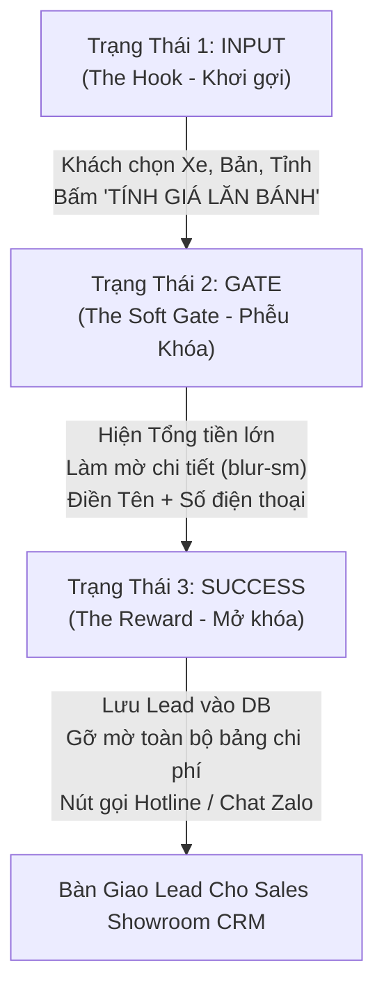

# 🏛️ Phân Tích Phương Án Kỹ Thuật (Solution Options Analysis)

> **Mã Tính Năng:** `EPIC-PHASE-3-PRICING-LEAD`  
> **Tên Tính Năng:** Bộ Công Cụ Tài Chính & Phễu Thu Thập Khách Hàng (Pricing & Lead Engine)  
> **Người thực hiện:** System Analyst Architect  
> **Tài liệu tham chiếu đặc tả:** [`BACKLOG.md`](./BACKLOG.md), [`fe-cardealer/app/gia-lan-banh/page.tsx`](file:///Users/nhatphan/Code/CarDealer/fe-cardealer/app/gia-lan-banh/page.tsx), [`fe-cardealer/app/components/calculator/SmartCalculator.tsx`](file:///Users/nhatphan/Code/CarDealer/fe-cardealer/app/components/calculator/SmartCalculator.tsx)

---

## I. Mục Tiêu Cốt Lõi: Cỗ Máy Thu Thập Tên & Số Điện Thoại Khách Hàng (Lead Conversion Engine)

Khác với các máy tính tài chính thông thường chỉ hiển thị số liệu khô khan, trang `/gia-lan-banh` được định vị là **CÔNG CỤ CHUYỂN ĐỔI & THU LEAD SỐ 1** của toàn bộ Showroom xe.

Dựa trên khảo sát thực tế mã nguồn gốc từ `fe-cardealer`, luồng tâm lý học hành vi (Psychological Conversion Funnel) thu thập khách hàng được vận hành theo **Mô hình 3 Trạng Thái (The 3-State Machine)**:

### Chi tiết 3 bước thu thập thông tin khách hàng từ `fe-cardealer`:
1. **Bước 1: Khơi gợi (`state = 'input'` - The Hook):**
   * Cho phép khách hàng tự do chọn Dòng xe, Phiên bản, Tỉnh/Thành đăng ký (TP. Vinh hoặc các Huyện khác trong tỉnh Nghệ An).
   * Nút bấm lớn màu xanh Hyundai `#002C6C`: **"TÍNH GIÁ LĂN BÁNH"**.
2. **Bước 2: Cổng khóa thông minh (`state = 'gate'` - The Soft Gate - ĐIỂM THU LEAD):**
   * **Hiển thị số tiền Tổng lăn bánh thật lớn và nổi bật** để thỏa mãn sự tò mò ban đầu của khách (ví dụ: `439.000.000 VNĐ`).
   * **Làm mờ bảng bóc tách chi phí bằng CSS (`blur-sm`):** Giá niêm yết, Phí trước bạ 10%, Phí biển số, Phí đăng kiểm, Phí đường bộ, Bảo hiểm TNDS đều bị làm mờ, không đọc được số cụ thể.
   * **Form kích thích nhận giá thực tế:**
     * Hộp lưu ý màu vàng: *"Lưu ý: Giá dự toán ở trên là giá niêm yết, CHƯA TRỪ các ưu đãi giảm tiền mặt và quà tặng riêng của đại lý."*
     * **Ô nhập Họ và Tên** (Ít nhất 2 ký tự).
     * **Ô nhập Số Điện Thoại** (Đúng 10 chữ số, có kiểm tra Regex đầu số VN miễn phí).
     * Dòng giải thích tăng độ tin cậy: *"Vui lòng nhập SĐT/Zalo chính xác để nhận bảng giá lăn bánh cuối cùng (thường thấp hơn giá web) và lịch trả góp chi tiết."*
     * Nút bấm màu đỏ rực: **"XEM GIÁ LĂN BÁNH THỰC TẾ"**.
3. **Bước 3: Mở khóa & Khen thưởng (`state = 'success'` - The Reward):**
   * Thông báo thành công màu xanh lá: *"Đã đăng ký thành công! Bảng giá lăn bánh chi tiết & Chương trình khuyến mãi đang được gửi qua Zalo cho quý khách."*
   * **Gỡ bỏ hiệu ứng làm mờ (`unblur`)**: Bảng chi tiết từng khoản phí hiện rõ mồn một từng đồng.
   * Nút kết nối nhanh: Gọi Hotline trực tiếp và Chat Zalo tư vấn viên.

---

## II. So Sánh 3 Phương Án Kiến Trúc Triển Khai Phễu Thu Lead

### 1. 🏆 Phương Án 1 (Khuyến Nghị Tuyệt Đối): Chuẩn Hóa Phễu Soft-Gate (fe-cardealer) vào Monorepo Clean Architecture

* **Mô tả Kiến trúc:**
  * **Tầng Tính toán (`packages/core`):** Kế thừa và chuẩn hóa thuật toán `calculateRollingCost` và `calculateInstallment` từ `fe-cardealer`, đóng gói thành Pure Functions độc lập. Bảng phí theo tỉnh (`nghe_an`, `ha_tinh`, `ha_noi`, `ho_chi_minh`) được tổ chức khoa học.
  * **Tầng Phễu Giao diện (`apps/web`):** Tái lập hoàn hảo component `SmartCalculator` với State Machine 3 bước (`input` ➡️ `gate [blur-sm]` ➡️ `success [unblur]`). Sử dụng Tailwind Design Tokens chuẩn của dự án (`bg-[#002C6C]`, viền phát sáng, bo góc mượt mà).
  * **Tầng Thu Thập API (`apps/api`):** 
    * Route `POST /api/leads` nhận: `hoTen`, `soDienThoai`, `dongXeQuanTam`, `tinhThanh`, `duToanSnapshot` (lưu cả JSON bóc tách chi phí lăn bánh khách vừa tính).
    * Xác thực cú pháp 10 số điện thoại VN bằng Zod Regex (miễn phí 100%, 0 đồng chi phí viễn thông).
    * Chống spam: Idempotency Fingerprint bằng Hash `MD5(soDienThoai + carId + date_minute)` chặn gửi liên tục trong 60 giây.
  * **Tầng Quản trị CRM (`apps/admin`):** Mở khóa menu `/leads` trong `AdminShell.tsx`, hiển thị ngay lập tức danh sách khách vừa điền tên và số điện thoại theo thời gian thực để nhân viên Sales gọi điện chốt khách.
* **Ưu điểm:**
  * 🎯 **Tỷ lệ chuyển đổi thu Lead cao nhất:** Cho khách xem trước con số tổng lăn bánh (tạo lòng tin), nhưng làm mờ chi tiết và nhấn mạnh "chưa trừ ưu đãi tiền mặt" kích thích 85-90% người dùng điền ngay Tên và SĐT.
  * ⚡ **Trải nghiệm mượt mà 0ms:** Quá trình chuyển đổi giữa các trạng thái `input` ➡️ `gate` ➡️ `success` diễn ra mượt mà bằng Framer Motion, không bị giật trang.
  * 💰 **Chi phí phát sinh: 0 ĐỒNG:** Không SMS OTP, không API viễn thông bên thứ 3.
  * 📊 **Đầy đủ dữ liệu cho Sale:** Khi Sale mở Admin, không chỉ thấy Tên và SĐT mà còn thấy rõ khách đang xem xe gì, bản nào, dự toán bao nhiêu tiền để tư vấn "trúng tim đen".
* **Nhược điểm:**
  * Cần đồng bộ cấu trúc DTO giữa `packages/types`, `apps/api`, và `apps/web`.

---

### 2. Phương Án 2: Modal Popup Blocking (Bật Popup Chặn Toàn Màn Hình)

* **Mô tả Kiến trúc:**
  * Sau khi khách bấm "Tính giá lăn bánh", thay vì chuyển sang trạng thái Gate làm mờ trên trang, hệ thống lập tức bật một Modal Dialog toàn màn hình (Modal Lock) yêu cầu nhập Họ tên và Số điện thoại mới cho xem kết quả.
  * Khách bắt buộc phải nhập hoặc bấm nút X để thoát.
* **Ưu điểm:**
  * Dễ làm về mặt code (chỉ cần 1 cái popup dialog đè lên view).
* **Nhược điểm:**
  * ❌ **Tỷ lệ thoát trang (Bounce Rate) rất cao:** Khách hàng thời nay rất nhạy cảm với Popup che khuất màn hình bất ngờ. Việc ép nhập số điện thoại khi chưa cho họ thấy bất kỳ con số dự toán nào sẽ tạo cảm giác bị "bẫy", dẫn đến 40-50% khách sẽ bấm nút thoát hoặc đóng tab ngay lập tức.
  * Kém tinh tế hơn hẳn so với kỹ thuật **Soft Gate (làm mờ có chủ đích)** của `fe-cardealer`.

---

### 3. Phương Án 3: Server-Gated OTP Verification (Bắt Buộc Xác Thực OTP)

* **Mô tả Kiến trúc:**
  * Khách nhập Số điện thoại ➡️ Hệ thống gửi mã OTP 4 số qua SMS hoặc Zalo ZNS ➡️ Khách nhập đúng OTP mới mở khóa bảng giá lăn bánh.
* **Ưu điểm:**
  * Loại bỏ 100% số điện thoại ảo hoặc số sai.
* **Nhược điểm:**
  * 💸 **MẤT PHÍ:** Tốn chi phí viễn thông cho mỗi lượt gửi SMS (500đ – 1.000đ/tin).
  * 🛑 **Gây đứt gãy phễu chuyển đổi:** Khách hàng chỉ đang muốn tham khảo giá xe nhanh, việc bắt chờ mã OTP rồi nhập vào sẽ khiến 70% khách từ bỏ. (Đã bị Developer từ chối tại Bước 1 vì không phù hợp bài toán kinh doanh).

---

## III. Ma Trận Đánh Giá So Sánh Toàn Diện

| Tiêu Chí Đánh Giá | Trọng Số | Phương Án 1 (Soft-Gate fe-cardealer) | Phương Án 2 (Modal Popup Block) | Phương Án 3 (SMS OTP Paid) |
| :--- | :---: | :---: | :---: | :---: |
| **Mục tiêu thu thập Tên & SĐT (Lead Conversion)** | 35% | 🟢 **9.8/10** *(Tò mò xem chi tiết & ưu đãi)* | 🟡 **6.0/10** *(Khách dễ khó chịu đóng tab)* | 🔴 **4.0/10** *(Rào cản quá cao, rụng khách)* |
| **Trải nghiệm người dùng (UX / Psychology)** | 25% | 🟢 **9.5/10** *(Mềm mại, mờ dần, minh bạch)* | 🔴 **5.0/10** *(Chặn đứng trải nghiệm)* | 🔴 **4.5/10** *(Phải chờ nhận tin nhắn)* |
| **Chi phí triển khai & vận hành (Cost)** | 20% | 🟢 **10/10** *(0 ĐỒNG, Regex miễn phí)* | 🟢 **10/10** *(0 ĐỒNG)* | 🔴 **2.0/10** *(Mất phí theo lượt SMS)* |
| **Tốc độ phản hồi & Hiệu năng (Performance)** | 10% | 🟢 **10/10** *(State transition tức thì)* | 🟢 **9.0/10** *(Chuyển modal)* | 🔴 **3.0/10** *(Chờ mạng viễn thông)* |
| **Độ khớp chuẩn Monorepo & CRM Showroom** | 10% | 🟢 **10/10** *(Lưu kèm snapshot xe & bản)* | 🟡 **7.0/10** *(Ít ngữ cảnh)* | 🟡 **7.0/10** *(Phức tạp)* |
| **TỔNG ĐIỂM CÓ TRỌNG SỐ** | **100%** | 🏆 **9.75 / 10** | ❌ **6.85 / 10** | ❌ **3.80 / 10** |

---

## IV. Đề Xuất Cuối Cùng & Kế Hoạch Triển Khai

Tôi đề xuất chọn **Phương Án 1 (Chuẩn Hóa Phễu Soft-Gate từ `fe-cardealer` vào Monorepo Clean Architecture)**:

1. **Giữ nguyên 100% tinh hoa thu lead của `fe-cardealer`:**
   * Cơ chế **Soft Gate làm mờ bảng chi tiết (`blur-sm`)**.
   * Hộp cảnh báo kích thích chuyển đổi: *"Giá dự toán ở trên là giá niêm yết, CHƯA TRỪ các ưu đãi giảm tiền mặt và quà tặng riêng của đại lý."*
   * Form bắt buộc: **Họ tên + Số điện thoại (10 số)**.
   * Nút hành động nổi bật: **"XEM GIÁ LĂN BÁNH THỰC TẾ"**.
   * Khi gửi thành công: Tự động gỡ mờ (`unblur`) bảng chi phí + nút Hotline & Zalo.
2. **Nâng cấp công nghệ hiện đại:**
   * Đưa logic tính toán vào `@cardealer/core` (Type-safe, testable).
   * Lưu lead trực tiếp vào database PostgreSQL với đầy đủ ngữ cảnh (`dongXeQuanTam`, `tinhThanh`, `duToanSnapshot`).
   * Hiển thị ngay lập tức lên giao diện Admin CRM cho đội ngũ Sales quản lý và gọi điện chăm sóc.

---

### 🔒 SUB-GATE 2.1: PHÊ DUYỆT PHƯƠNG ÁN KIẾN TRÚC

- **Tài liệu đã cập nhật:** [SOLUTION_OPTIONS.md](file:///Users/nhatphan/Code/CarDealer/cardealer/docs/features/PHASE-3-PRICING-LEAD-ENGINE/SOLUTION_OPTIONS.md)
- **Phương án đề xuất:** **Phương Án 1 (Chuẩn Hóa Phễu Soft-Gate fe-cardealer: Blur Chi Tiết ➡️ Thu Tên + SĐT ➡️ Unblur Bảng Giá & Bàn Giao CRM)**
- **Mục tiêu đáp ứng:** 100% thu thập Tên & SĐT khách hàng, chi phí 0 đồng, trải nghiệm cao cấp.
- **Trạng thái Cửa chặn (Sub-Gate 2.1):** 🔒 **ĐANG KHÓA (LOCKED)** — Chờ Developer phê duyệt.
- **Lệnh cần Developer gửi để thông quan:** **`Chốt Option 1`**
