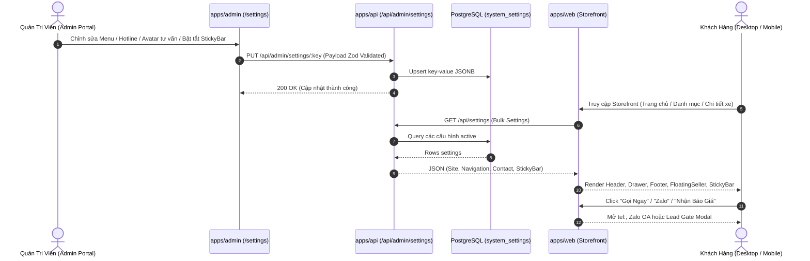

# 🎯 Feature Backlog: Khung Nền Tảng Storefront & Tiện Ích Chuyển Đổi Toàn Cục (Global Shell & Conversion Widgets)

## 1. Thông Tin Tổng Quan (Metadata)
* **Mã Tính Năng (Epic ID):** `EPIC-PHASE-4.1-STOREFRONT-SHELL-WIDGETS`
* **Mục tiêu Chiến lược:** Thiết lập khung sườn Layout chuẩn thương hiệu Hyundai toàn trang (Desktop/Mobile), đảm bảo mọi điểm chạm đều sẵn sàng kích hoạt hành vi liên hệ tư vấn (Hotline, Zalo, Lead Modal). Đặc biệt, **100% nội dung, liên kết và cấu hình đều quản trị và chỉnh sửa linh hoạt từ Admin CMS**.
* **Phạm vi Nền tảng (Target Platform):** Full-stack (`packages/types`, `packages/database`, `apps/api`, `apps/admin`, `apps/web`, `packages/ui`)
* **Cấp độ Thực thi (Execution Tier):** Tier 1 (Core Feature / Greenfield / Full 5 Phase Lifecycle & Strict Gates 1–5)
* **Trạng thái Môi trường:** 🟢 Pure Development (Local/Staging Monorepo)
* **Số lượng Lát cắt (Vertical Slices):** 4 Slices (`US-01`, `US-02`, `US-03`, `US-04`)
* **Tài liệu Tham Chiếu:**
  * Lộ trình tổng: [`docs/06-PHASED-IMPLEMENTATION-ROADMAP.md`](../../06-PHASED-IMPLEMENTATION-ROADMAP.md) (Phase 4.1)
  * Kiến trúc hệ thống: [`docs/SYSTEM_MAP.md`](../../SYSTEM_MAP.md)
  * Đặc tả UI/UX: [`docs/04-TINH-NANG-FRONTEND-VA-TRAI-NGHIEM-UI-UX.md`](../../04-TINH-NANG-FRONTEND-VA-TRAI-NGHIEM-UI-UX.md)
  * Schema Database & CMS: [`docs/02-DATABASE-SCHEMA-PAYLOAD-CMS.md`](../../02-DATABASE-SCHEMA-PAYLOAD-CMS.md)
  * Triển khai mẫu khảo cổ: `fe-cardealer/app/layout.tsx`, `fe-cardealer/app/components/Navbar.tsx`, `Footer.tsx`, `FloatingSeller.tsx`, `product/ProductStickyBar.tsx`

---

## 2. Ma trận Trạng thái Lát cắt Tính năng (Vertical Feature Slices Matrix)

| ID | User Story / Phạm Vi Lát Cắt | Nền Tảng / Layer | Target Files | Phương Pháp Kiểm Chứng (DoD) | Trạng Thái |
| :---: | :--- | :---: | :---: | :--- | :---: |
| **US-01** | **Contracts, System Settings Schemas & Public APIs** Mở rộng Zod Schemas (`Navigation`, `ContactSettings`, `SiteSettings`, `StickyBarSettings`), Seed dữ liệu mặc định và API endpoints `GET /api/settings/:key`, `GET /api/settings/bulk`. | Shared / BE (`packages/types`, `packages/database`, `apps/api`) | ~6 files | Type-check + Integration test API trả về đúng schema Zod (`exit 0`). | 🔄 IN PROGRESS |
| **US-02** | **Admin CMS Management for Global Shell & Widgets** Mở rộng `/admin/settings` thành các tabs trực quan: Showroom & Hotline, Menu điều hướng (Navigation Builder), Widget Chuyên viên nổi (`FloatingSeller`) và Thanh chốt đơn (`ProductStickyBar`). | FE Admin (`apps/admin`) | ~7 files | Form validation qua React Hook Form + Zod, lưu cấu hình thành công vào DB, có Toast phản hồi. | ⏸️ QUEUED |
| **US-03** | **Storefront Layout Shell, Dynamic Navbar & Mobile Drawer** Xây dựng Layout gốc (`RootLayout`), TopBar/Hotline banner, Header/Navbar đa cấp, Mobile Navigation Drawer mượt mà và Footer Đại lý 3S chuẩn SEO & Local Business. | FE Web (`apps/web`, `packages/ui`) | ~7 files | Visual QA (CLS = 0), Responsive Mobile/Desktop, Menu & hotline khớp 100% dữ liệu từ CMS. | ⏸️ QUEUED |
| **US-04** | **High-Conversion Global Widgets: FloatingSeller & ProductStickyBar** Widget chuyên viên tư vấn nổi góc màn hình (Avatar, trạng thái online, 1-click Gọi/Zalo/Messenger) và Thanh chốt đơn cố định chân màn hình (Desktop/Mobile) kích hoạt Lead Modal. | FE Web (`apps/web`, `packages/ui`) | ~6 files | E2E kiểm tra click Gọi (`tel:`), Chat Zalo, mở Lead Modal thành công trên cả Mobile & Desktop. | ⏸️ QUEUED |

---

## 3. Phân tích Khảo cổ & Ý đồ Nghiệp vụ (Codebase Archeology)

### 3.1. Tọa độ Module Liên Quan (System Map Alignment)
* **Khế ước Dữ liệu:** `packages/types/src/settings.ts` (Hiện đã có `SiteSettingsSchema`, `ContactSettingsSchema`, `EventBannerSchema`, `QuoteSettingsSchema` - cần chuẩn hóa và bổ sung `NavigationSchema`, `StickyBarSchema`).
* **Cơ sở Dữ liệu & Lưu trữ:**
  * Bảng `system_settings` (`packages/database/src/schema/system_settings.ts`) dạng Key-JSONB.
  * Hiện tại đã có key: `showroom_settings`.
  * Cần các key chuẩn: `site_settings`, `navigation_settings`, `contact_settings`, `sticky_bar_settings`.
* **Backend REST API:**
  * Public Endpoint: `apps/api/src/routes/catalog.ts` đã có `GET /api/settings/:key`. Cần bổ sung route lấy tổng hợp `GET /api/settings` (bulk) để Storefront fetch 1 request duy nhất giảm network overhead.
  * Admin Management Endpoints: `apps/api/src/routes/admin.ts` (`GET /api/admin/settings`, `PUT /api/admin/settings/:key`).
* **Admin Portal UI:**
  * `apps/admin/app/settings/page.tsx` hiện chỉ quản trị form phẳng 9 trường đơn giản của showroom.
  * Cần phân tab rõ ràng: *1. Thông tin Đại lý & Pháp lý*, *2. Menu Điều Hướng (Navigation)*, *3. Chuyên Viên Nổi (Floating Seller)*, *4. Thanh Chốt Đơn (Sticky Bar)*.
* **Storefront Client Web:**
  * `apps/web/app/layout.tsx` hiện chỉ có thẻ `<html>`, `<body>`, chưa có Header, Footer, Floating Widget hay Sticky Bar.
  * Cần fetch cấu hình từ API (Server Component) và truyền xuống các Client Components tương tác.

### 3.2. Khảo Cổ Bản Mẫu Tham Chiếu (`fe-cardealer`)
* `fe-cardealer/app/layout.tsx`: Sử dụng `Promise.all([getNavigation(), getSiteSettings(), getContactSettings()])` để fetch data song song tại Server Component.
* `fe-cardealer/app/components/Navbar.tsx`: Hỗ trợ Menu đa cấp (`headerLinks`), hiển thị hotline trên desktop, toggle hamburger drawer trên mobile.
* `fe-cardealer/app/components/Footer.tsx`: Cung cấp thông tin showroom, địa chỉ, bản đồ Google Map iframe, danh mục sản phẩm, giờ làm việc, icon BCT và social links.
* `fe-cardealer/app/components/FloatingSeller.tsx`: Hiệu ứng pulse sóng rung thu hút ánh nhìn, avatar nhân viên, nút gọi điện thoại nhanh và link mở Zalo tức thì.
* `fe-cardealer/app/components/product/ProductStickyBar.tsx`: Cố định chân màn hình, ẩn khi ở đầu trang và tự trượt lên (slide-up) khi cuộn qua vùng Hero, kèm nút Gọi và Nhận Báo Giá.

### 3.3. Sơ đồ Luồng Dữ liệu Toàn Cục (Mermaid Flow)

---

## 4. Đặc tả Yêu cầu Chức năng (Functional Requirements - FR)

* **FR-01 (Cấu hình Toàn cục Toàn diện từ Admin CMS):**
  * Quản trị viên Showroom được phân quyền (`system:write`) có thể chỉnh sửa:
    * **Brand & Đại lý:** Tên đại lý, hotline kinh doanh, hotline dịch vụ, email, địa chỉ showroom, mã nhúng Google Maps iframe, giờ mở cửa.
    * **Pháp lý & Chứng nhận:** Tên doanh nghiệp GPKD, số GPKD, copyright text, link chứng nhận Bộ Công Thương.
    * **Social Media:** Links Facebook Fanpage, Youtube Channel, TikTok Profile, Zalo OA.
    * **Navigation Builder:** Danh sách menu cấp 1 & cấp 2 (Tên nhãn, Đường dẫn, Mở tab mới, Thứ tự hiển thị, Bật/Tắt).
    * **Floating Seller Widget:** Bật/Tắt widget, Tên chuyên viên tư vấn, Avatar ảnh đại diện, Trạng thái online ("Đang trực tuyến" / "Nghỉ"), Hotline kích hoạt cuộc gọi, Link Zalo chat, Link Messenger Facebook.
    * **Product Sticky Bar:** Bật/Tắt toàn cục, Nhãn nút CTA (mặc định: "NHẬN BÁO GIÁ"), Hotline liên kết, Tiêu đề phụ (mặc định: "Hỗ trợ trả góp 85%").

* **FR-02 (Showroom Header & Navbar Chuẩn Thương Hiệu):**
  * Hiển thị Logo Hyundai Vinh chính hãng (hỗ trợ SVG/WebP tối ưu).
  * Menu điều hướng đa cấp linh hoạt (Dòng xe [Mega-menu dropdown], Bảng giá, Trả góp, Tin tức, Giới thiệu, Liên hệ).
  * Thanh tiện ích phụ (TopBar) hoặc vị trí nổi bật: Số điện thoại Hotline kinh doanh 24/7 nhấp nháy/hover nổi bật, nút CTA "Nhận Báo Giá" kích hoạt Modal Báo Giá.
  * Trạng thái dính (Sticky Header) khi cuộn trang, tự động thu nhỏ độ cao nhẹ để tối ưu không gian đọc.

* **FR-03 (Mobile Navigation Drawer Tối Ưu Trải Nghiệm Một Chạm):**
  * Nút Hamburger Menu mở Drawer trượt mượt mà từ cạnh phải/trái.
  * Hỗ trợ Accordion mở các menu con (Dòng xe).
  * Tích hợp sẵn 2 nút Call-To-Action to bản dưới đáy Drawer: "GỌI HOTLINE" và "CHAT ZALO" để khách hàng liên hệ nhanh không cần tìm kiếm.

* **FR-04 (Footer Đại Lý Chuẩn 3S & Local SEO):**
  * Cột 1: Thông tin Đại lý 3S Hyundai Vinh (Địa chỉ, Hotline, Email, Giờ làm việc, Chứng nhận BCT).
  * Cột 2: Danh mục Dòng xe nổi bật (Sedan, SUV, MPV, Xe điện) trỏ đến từng trang xe.
  * Cột 3: Dịch vụ & Hậu mãi (Bảng tính lăn bánh, Dự toán trả góp, Đăng ký lái thử, Bảo dưỡng chính hãng).
  * Cột 4: Bản đồ Showroom tương tác (Google Maps iframe) & Các kênh mạng xã hội.
  * Dòng chân trang: Bản quyền Copyright, Chính sách bảo mật & Điều khoản sử dụng.

* **FR-05 (Widget Chuyên Viên Nổi - `FloatingSeller`):**
  * Ghim cố định ở góc dưới bên phải màn hình (Desktop & Mobile).
  * Avatar tròn có chấm xanh nhấp nháy (Online pulse animation) tạo cảm giác có người thật đang trực hỗ trợ.
  * Khi click hoặc hover trên Desktop: Mở popup Card chuyên viên mini hiển thị lời chào, tên chuyên viên và 2 nút lựa chọn: "Gọi Trực Tiếp" (`tel:`) và "Chat Zalo Nhanh" (`https://zalo.me/...`).
  * Tự động điều chỉnh vị trí để không che khuất `ProductStickyBar` trên Mobile.

* **FR-06 (Thanh Chốt Đơn Cố Định Đáy Màn Hình - `ProductStickyBar`):**
  * Tự động xuất hiện mượt mà (Slide-up animation) khi người dùng cuộn vượt quá 300px hoặc qua phần Hero.
  * Hiển thị thông tin tóm tắt xe (khi ở trang chi tiết xe) hoặc thông điệp kích cầu chung (khi ở trang danh mục/trang chủ): Tên xe, Giá khởi điểm chỉ từ X triệu, nút "GỌI NGAY" và nút "NHẬN BÁO GIÁ" mở Modal Lead.
  * Đảm bảo Safe Area trên iPhone (Home indicator bar không che nút bấm).

---

## 5. Đặc tả Yêu cầu Phi Chức năng (Non-Functional Requirements - NFR)

* **NFR-01 (Hiệu Năng & Zero CLS):**
  * Header và Footer không bị nhảy layout (Cumulative Layout Shift = 0) trong quá trình tải trang.
  * Render Server-Side (RSC) cho Header/Footer với fallback defaults hợp lý để đảm bảo trang hiển thị ngay tức thì khi chưa có DB query.
* **NFR-02 (Mobile Responsiveness & Touch Target):**
  * Tất cả các nút bấm liên hệ trên Mobile (Hotline, Zalo, CTA) có chiều cao tối thiểu 44px (chuẩn Apple HIG / WCAG 2.1 AAA touch targets).
* **NFR-03 (Local SEO & Semantic Markup):**
  * Tích hợp Schema JSON-LD `AutoDealer` chứa tên, địa chỉ, hotline, giờ mở cửa, geo coordinates lấy trực tiếp từ cấu hình đại lý.
* **NFR-04 (Zero Arbitrary Styling & Design System):**
  * Áp dụng bảng màu nhận diện Hyundai: Navy `#002C6C`, Blue `#0072CE`, Slate backgrounds, sử dụng Design Tokens và Primitives từ `@cardealer/ui`.
* **NFR-05 (Resilient Error Handling):**
  * Nếu cơ sở dữ liệu `system_settings` rỗng hoặc API gặp sự cố, hệ thống tự động fallback về thông số mặc định (Default Showroom Info) mà không làm sập layout (zero white screen).

---

## 6. Ma trận 6 Lăng Kính Phản Biện (6 Strategic Lenses)

1. **Lăng kính Phân vùng Nền tảng (Platform Boundary):**
   * Tầng Types/Contracts (`packages/types`): Độc lập, không phụ thuộc UI, dùng Zod để serialize/validate cho cả API và Admin Form.
   * Tầng Server (`apps/api`): Cung cấp cả endpoint đơn lẻ `GET /api/settings/:key` và endpoint tổng hợp `GET /api/settings` (bulk) để Storefront tối ưu số lượng request.
   * Tầng Admin (`apps/admin`): Giao diện trực quan chia tab, có preview trực tiếp (Avatar preview, Navigation tree).
   * Tầng Storefront (`apps/web`): Server Components tải cấu hình ban đầu truyền vào Context/Props, các widget chuyển đổi là Client Components siêu nhẹ.

2. **Lăng kính Người dùng Cuối (End-User Value):**
   * Khách mua xe cần thông tin liên hệ ngay tại mọi thời điểm cuộn trang. FloatingSeller và StickyBar xóa bỏ rào cản tìm kiếm số điện thoại, đẩy tỷ lệ chuyển đổi cuộc gọi lên tối đa.
   * Nhân viên showroom có thể đổi số hotline trực ca, đổi nhân viên tư vấn trong 1 click từ Admin mà không cần nhờ developer sửa code.

3. **Lăng kính Xung đột Dữ liệu & Độc bản (Collision & Uniqueness):**
   * Sử dụng cơ chế Upsert trên bảng `system_settings` theo `key` duy nhất (`primaryKey`), đảm bảo không bao giờ bị nhân đôi dòng dữ liệu cấu hình.

4. **Lăng kính Trạng thái Rỗng & Fallbacks (Empty & Zero-state):**
   * Khi showroom mới khởi tạo chưa có cấu hình: Hệ thống áp dụng bộ Zod Schema Defaults (tên showroom, hotline mặc định, menu mặc định 5 mục). Giao diện luôn hiển thị đầy đủ, không bao giờ bị rỗng vỡ layout.

5. **Lăng kính Tải & Hiệu năng (Performance & Scale):**
   * Storefront áp dụng Next.js `unstable_cache` hoặc `fetch(..., { next: { tags: ['settings'] } })` để lưu cache cấu hình.
   * Khi Admin cập nhật cấu hình, gửi tín hiệu revalidate on-demand để Storefront cập nhật tức thì mà vẫn giữ tốc độ tải trang cache tĩnh siêu tốc (< 50ms TTFB).

6. **Lăng kính Rủi ro & Góc khuất (Edge Cases & Mobile Layout Clashing):**
   * *Rủi ro va chạm giữa `FloatingSeller` và `ProductStickyBar` trên màn hình Mobile hẹp:* Nếu cả hai cùng xuất hiện ở chân trang, FloatingSeller phải tự động đẩy lên phía trên StickyBar khoảng 64px để tránh đè lên nhau, gây kẹt thao tác của khách hàng.
   * *Mã nhúng Google Maps iframe:* Phải được sanitize chống XSS, chỉ chấp nhận URL hợp lệ từ `https://www.google.com/maps/embed...`.

---

## 7. Design Stack Kích hoạt cho Giai đoạn 2
* `system-analyst-architect` (Bắt buộc ở Bước 2.1: Lập `SOLUTION_OPTIONS.md`)
* `logic-flow-ba` (Bước 2.2: Luồng tương tác Storefront Shell, Mobile Drawer, FloatingSeller & Dynamic Revalidation)
* `db-schema-architect` (Bước 2.2: Đặc tả cấu trúc JSONB cho `system_settings` & Zod Schemas)
* `feature-spec-generator` (Bước 2.2: Đặc tả REST API contracts `GET /api/settings`, `PUT /api/admin/settings/:key`)
* `tailwind-ui-designer` (Bước 2.2: Wireframes ASCII, State Matrix và Responsive Tokens cho Header, Drawer, Footer, StickyBar, FloatingSeller)
