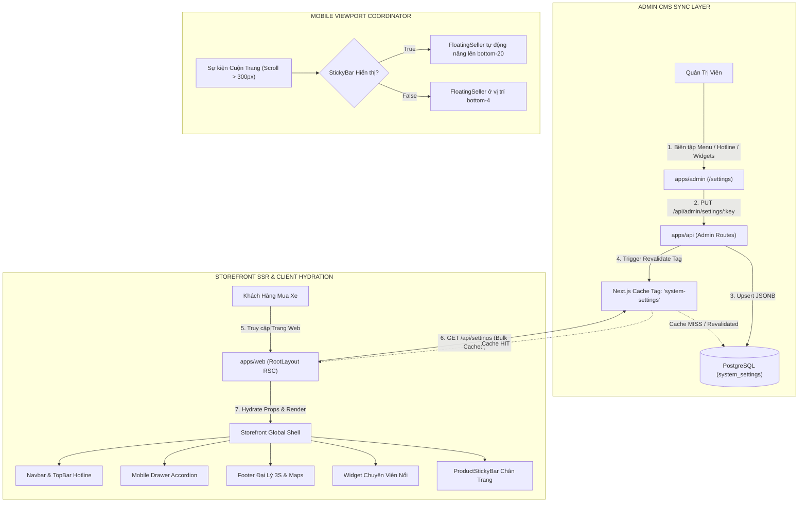
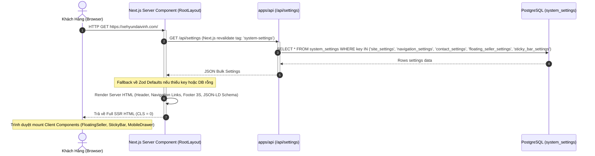
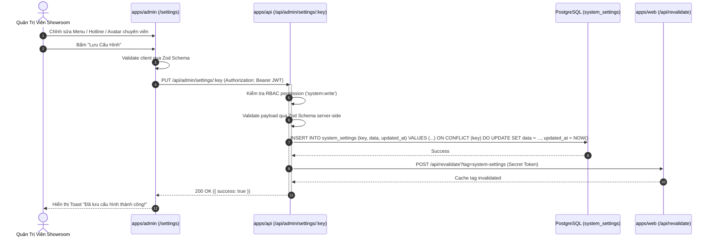
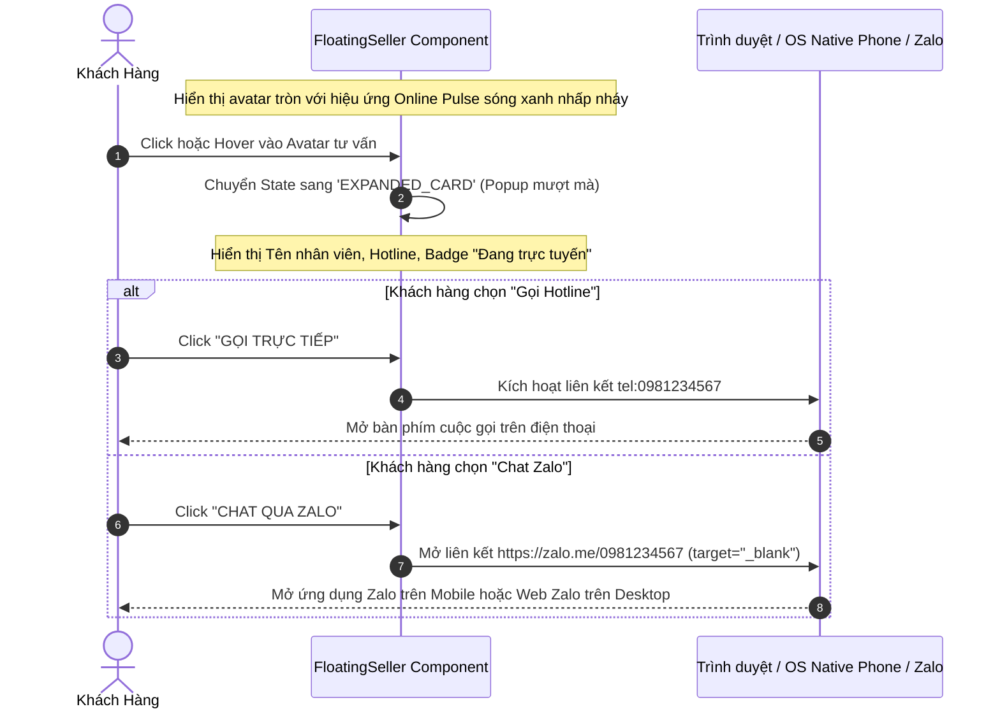
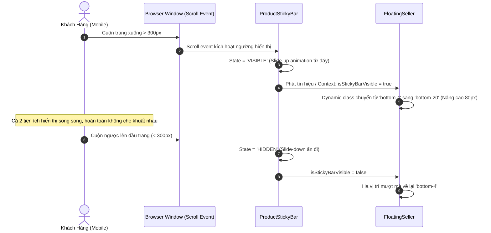
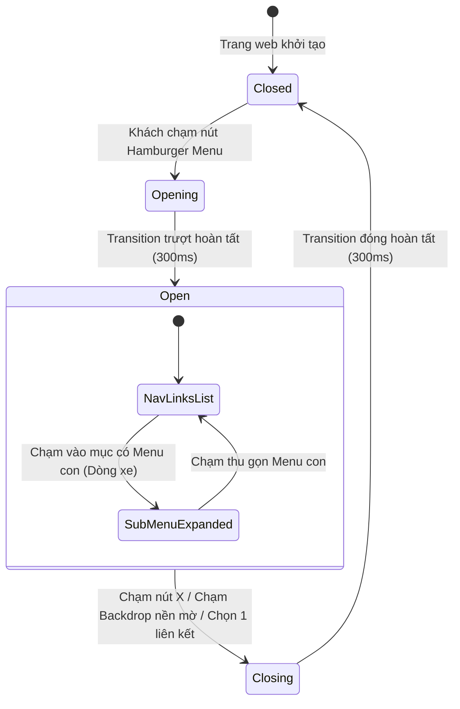
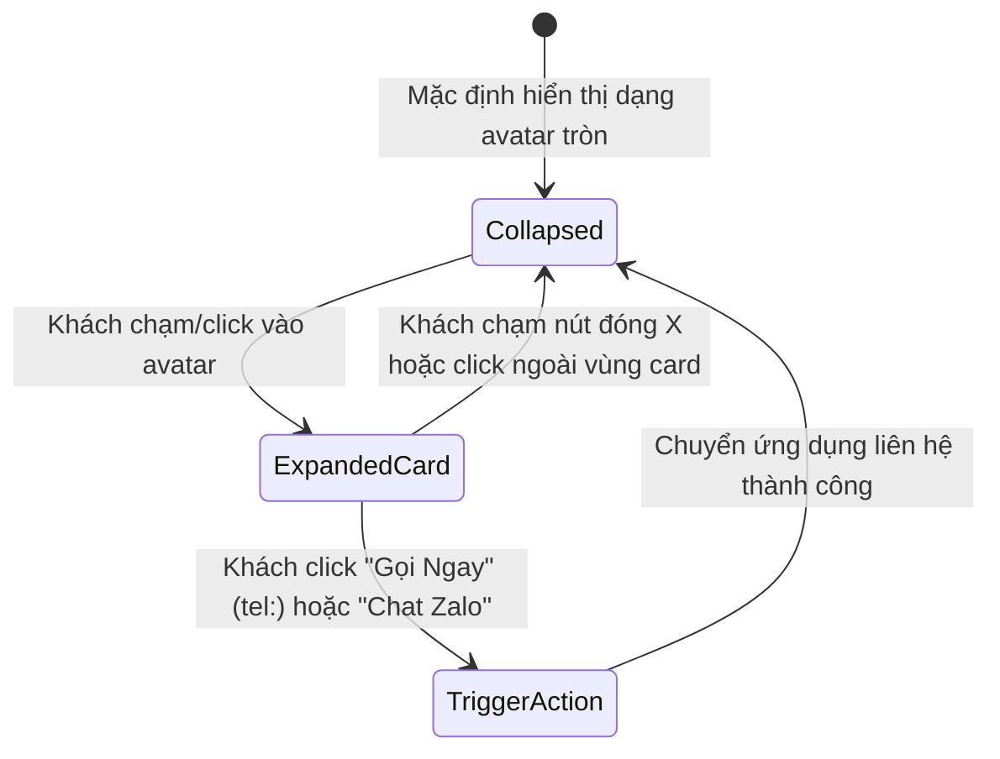
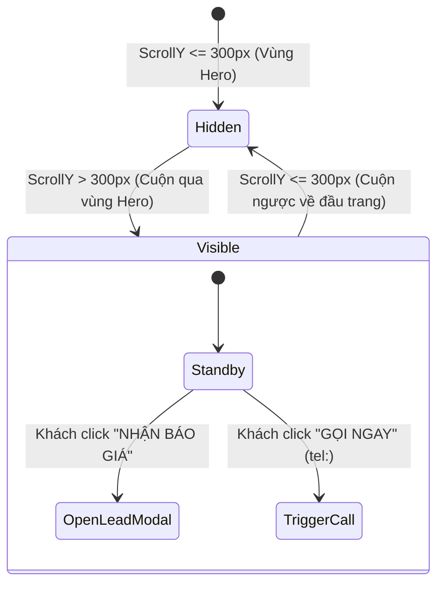

# 🔄 Logic & Interaction Flows: Khung Nền Tảng Storefront & Tiện Ích Chuyển Đổi Toàn Cục

## 1. Tổng Quan Kiến Trúc Luồng (System Flow Architecture)
Tài liệu này đặc tả toàn bộ luồng tương tác, luồng dữ liệu hai chiều giữa Storefront và Admin Portal, cũng như State Machine của các tiện ích chuyển đổi toàn cục (`Navbar`, `MobileDrawer`, `FloatingSeller`, `ProductStickyBar`) dựa trên **Option 2** đã được phê duyệt.

---

## 2. Các Sơ Đồ Trình Tự Nghiệp Vụ (Sequence Diagrams)

### 2.1. Luồng 1: Storefront SSR Layout Khởi Tạo & Hydration (Zero CLS)
Khách hàng truy cập bất kỳ trang nào (`/`, `/xe/[slug]`, `/gia-lan-banh`), `RootLayout` nạp song song toàn bộ cấu hình từ server, loại bỏ hoàn toàn độ trễ hiển thị và triệt tiêu CLS:

---

### 2.2. Luồng 2: Quản Trị Viên Cập Nhật Cấu Hình Từ Admin Portal & Revalidation Tức Thì
Khi Admin thay đổi số hotline, menu điều hướng hoặc đổi nhân viên trực tư vấn:

---

### 2.3. Luồng 3: Widget Chuyên Viên Nổi (`FloatingSeller`) & Phễu Chuyển Đổi Một Chạm
Tối ưu hóa hành vi click gọi điện thoại hoặc chat Zalo tức thì:

---

### 2.4. Luồng 4: Điều Phối Tránh Va Chạm Giao Diện Mobile (Viewport Coordinator)
Ngăn chặn xung đột giữa `FloatingSeller` và `ProductStickyBar` trên màn hình điện thoại:

---

## 3. Máy Trạng Thái (State Machines)

### 3.1. State Machine: Mobile Navigation Drawer

### 3.2. State Machine: FloatingSeller Widget

### 3.3. State Machine: ProductStickyBar

