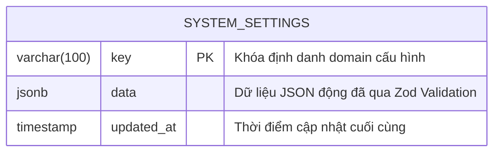

# 🗄️ Database & Data Contracts Schema: Khung Nền Tảng Storefront & Tiện Ích Chuyển Đổi Toàn Cục

## 1. Mô Hình Lưu Trữ Hệ Thống (Persistence Model)

Hệ thống lưu trữ cấu hình vận hành trên bảng `system_settings` trong cơ sở dữ liệu PostgreSQL (`packages/database/src/schema/system_settings.ts`). Mỗi cấu hình phân hệ được phân vùng theo một **Domain Key** duy nhất (`Primary Key`), lưu trữ payload động dưới định dạng `JSONB` có đánh index tự động.



---

## 2. Đặc Tả Chi Tiết 5 Domain Keys Cấu Hình

| Domain Key | Ý Nghĩa Nghiệp Vụ | Zod Schema Đại Diện | Môi Trường Tiêu Thụ |
| :--- | :--- | :--- | :--- |
| `site_settings` | Tên trang, SEO Meta, Favicon, Scripts GA/GTM, Tọa độ GPS | `SiteSettingsSchema` | Storefront (Head/Meta), Admin |
| `navigation_settings` | Menu điều hướng đa cấp, thứ tự hiển thị, huy hiệu | `NavigationSettingsSchema` | Header, Mobile Drawer |
| `contact_settings` | Thông tin Đại lý 3S, Hotline, Email, Bản đồ, Pháp lý, BCT | `ContactSettingsSchema` | TopBar, Footer, Trang Liên Hệ |
| `floating_seller_settings`| Tên chuyên viên, Hotline, Link Zalo, Avatar, Trạng thái trực tuyến | `FloatingSellerSettingsSchema`| Widget Chuyên Viên Nổi |
| `sticky_bar_settings` | Cấu hình thanh chốt đơn cố định chân trang, CTA nhãn, Hotline | `StickyBarSettingsSchema` | Thanh chốt đơn đáy trang |

---

## 3. Đặc Tả Khế Ước Dữ Liệu Type-Safe (`packages/types/src/settings.ts`)

### 3.1. Navigation Settings Schema (`navigation_settings`)
```typescript
import { z } from 'zod';

export const NavSubLinkSchema = z.object({
  id: z.string().uuid().default(() => crypto.randomUUID()),
  label: z.string().trim().min(1, 'Nhãn menu con không được để trống'),
  url: z.string().trim().min(1, 'Đường dẫn không được để trống'),
  newTab: z.boolean().default(false),
  badge: z.string().optional(), // VD: "Hot", "Mới", "Giảm 50%"
});
export type NavSubLink = z.infer<typeof NavSubLinkSchema>;

export const NavLinkSchema = z.object({
  id: z.string().uuid().default(() => crypto.randomUUID()),
  label: z.string().trim().min(1, 'Nhãn menu không được để trống'),
  url: z.string().trim().min(1, 'Đường dẫn không được để trống'),
  newTab: z.boolean().default(false),
  badge: z.string().optional(),
  order: z.number().int().default(0),
  subLinks: z.array(NavSubLinkSchema).default([]),
});
export type NavLink = z.infer<typeof NavLinkSchema>;

export const NavigationSettingsSchema = z.object({
  headerLinks: z.array(NavLinkSchema).default([
    {
      id: 'nav-cars',
      label: 'Dòng Xe',
      url: '/xe',
      newTab: false,
      order: 1,
      subLinks: [
        { id: 'sub-sedan', label: 'Sedan (Accent, Elantra)', url: '/xe?kieuDang=Sedan', newTab: false },
        { id: 'sub-suv', label: 'SUV (Creta, Tucson, Santa Fe)', url: '/xe?kieuDang=SUV', newTab: false },
        { id: 'sub-mpv', label: 'MPV (Custin, Stargazer)', url: '/xe?kieuDang=MPV', newTab: false },
      ],
    },
    { id: 'nav-price', label: 'Bảng Giá Xe', url: '/gia-xe-hyundai', newTab: false, order: 2, subLinks: [] },
    { id: 'nav-calc', label: 'Tính Lăn Bánh', url: '/gia-lan-banh', newTab: false, order: 3, subLinks: [] },
    { id: 'nav-install', label: 'Mua Trả Góp', url: '/tra-gop', newTab: false, order: 4, subLinks: [] },
    { id: 'nav-news', label: 'Tin Tức & Ưu Đãi', url: '/tin-tuc', newTab: false, order: 5, subLinks: [] },
    { id: 'nav-contact', label: 'Liên Hệ', url: '/lien-he', newTab: false, order: 6, subLinks: [] },
  ]),
});
export type NavigationSettings = z.infer<typeof NavigationSettingsSchema>;
```

---

### 3.2. Floating Seller Settings Schema (`floating_seller_settings`)
```typescript
export const FloatingSellerSettingsSchema = z.object({
  enabled: z.boolean().default(true),
  sellerName: z.string().trim().min(1, 'Tên chuyên viên không được để trống').default('Tuấn Hyundai'),
  sellerPhone: z.string().trim().min(1, 'Số hotline không được để trống').default('0981.234.567'),
  sellerZalo: z.string().trim().min(1, 'Link Zalo không được để trống').default('https://zalo.me/0981234567'),
  sellerMessenger: z.string().optional().default('https://m.me/xehyundaivinh'),
  sellerAvatar: z.string().default('/images/avatars/sale-tuan.webp'),
  statusText: z.string().default('Đang trực tuyến - Hỗ trợ 24/7'),
  isOnline: z.boolean().default(true),
  greetingMessage: z.string().default('Xin chào! Tôi có thể hỗ trợ báo giá lăn bánh hoặc tư vấn trả góp cho bạn ngay bây giờ.'),
});
export type FloatingSellerSettings = z.infer<typeof FloatingSellerSettingsSchema>;
```

---

### 3.3. Sticky Bar Settings Schema (`sticky_bar_settings`)
```typescript
export const StickyBarSettingsSchema = z.object({
  enabled: z.boolean().default(true),
  ctaText: z.string().trim().min(1, 'Nhãn nút CTA không được để trống').default('NHẬN BÁO GIÁ'),
  callText: z.string().trim().min(1, 'Nhãn nút Gọi không được để trống').default('GỌI NGAY'),
  hotline: z.string().trim().min(1, 'Số hotline không được để trống').default('0981.234.567'),
  subtitle: z.string().default('Hỗ trợ trả góp 85% • Giao xe tận nhà'),
  showOnDesktop: z.boolean().default(true),
  showOnMobile: z.boolean().default(true),
});
export type StickyBarSettings = z.infer<typeof StickyBarSettingsSchema>;
```

---

### 3.4. Contact & Showroom Settings Schema (`contact_settings`)
```typescript
export const ContactSettingsSchema = z.object({
  showroomName: z.string().default('Hyundai Vinh - Đại Lý Ủy Quyền Chính Hãng TC Motor'),
  diaChi: z.string().default('Km 3+500 Đại lộ Lê Nin, TP. Vinh, Tỉnh Nghệ An'),
  hotlineKinhDoanh: z.string().default('0981.234.567'),
  hotlineDichVu: z.string().default('0981.890.123'),
  zaloNumber: z.string().default('0981.234.567'),
  email: z.string().email().default('kinhdoanh@xehyundaivinh.com'),
  workingHours: z.string().default('08:00 - 18:00 (Thứ 2 - Chủ Nhật)'),
  googleMapsUrl: z.string().default('https://maps.google.com/?cid=123456789'),
  googleMapEmbed: z.string().optional().default('https://www.google.com/maps/embed?pb=!1m18!1m12!1m3!1d3779.8023!2d105.6813!3d18.6796!...'),
  socialMedia: z.object({
    facebookUrl: z.string().optional().default('https://facebook.com/hyundaivinh.official'),
    youtubeUrl: z.string().optional().default('https://youtube.com/@hyundaivinh'),
    tiktokUrl: z.string().optional().default('https://tiktok.com/@hyundaivinh'),
    zaloUrl: z.string().optional().default('https://zalo.me/0981234567'),
  }).default({}),
  legal: z.object({
    businessName: z.string().default('Công ty Cổ phần Ô tô Hyundai Vinh'),
    businessLicense: z.string().default('GPKD số: 2901234567 do Sở KH&ĐT Tỉnh Nghệ An cấp'),
    copyrightText: z.string().default('© 2025 XeHyundaiVinh. All rights reserved.'),
    bctCertificateUrl: z.string().optional().default('http://online.gov.vn/Home/WebDetails/12345'),
  }).default({}),
});
export type ContactSettings = z.infer<typeof ContactSettingsSchema>;
```

---

### 3.5. Bulk Settings Aggregator Schema (`BulkSettings`)
Đặc tả Payload phản hồi cho endpoint `GET /api/settings` trả về toàn bộ cấu hình để Storefront nạp 1 lần:
```typescript
export const BulkSettingsSchema = z.object({
  site: SiteSettingsSchema,
  navigation: NavigationSettingsSchema,
  contact: ContactSettingsSchema,
  floatingSeller: FloatingSellerSettingsSchema,
  stickyBar: StickyBarSettingsSchema,
});
export type BulkSettings = z.infer<typeof BulkSettingsSchema>;
```

---

## 4. Ma Trận Fallback An Toàn Tuyệt Đối (Zero Crash Guarantee)

Nếu một bản ghi trong bảng `system_settings` bị xóa nhầm, chưa từng được khởi tạo trong DB, hoặc JSONB bị hỏng:
* Hàm nạp cấu hình `getBulkSettings()` trên Server sử dụng phương thức `Schema.parse({})`.
* Cơ chế Zod Schema Default đảm bảo luôn trả về Object đầy đủ thuộc tính mặc định, **tuyệt đối không trả về `null` hoặc `undefined`**, ngăn chặn 100% lỗi runtime `TypeError: Cannot read properties of undefined` trên Storefront.
