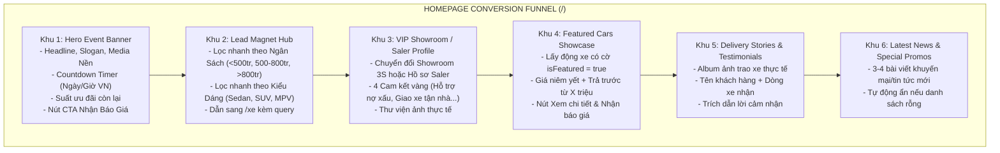

# 🎯 Feature Backlog: Trang Chủ Phễu Chuyển Đổi 6 Phân Khu (Homepage Conversion Funnel - `/`)

## 1. Thông Tin Tổng Quan (Metadata)
* **Mã Tính Năng (Epic ID):** `EPIC-PHASE-4.2-HOMEPAGE-FUNNEL`
* **Mục tiêu Chiến lược:** Xây dựng trang chủ định hướng chuyển đổi cao (High-Converting Landing Page) với phễu tâm lý 6 phân khu dẫn dắt khách hàng từ nhận biết ưu đãi, tìm xe theo ngân sách, củng cố niềm tin uy tín saler/đại lý, cho đến hành động để lại lead (Báo giá / Lái thử / Hotline / Zalo).
* **Phạm vi Nền tảng (Target Platform):** Full-stack (`packages/types`, `packages/database`, `apps/api`, `apps/admin`, `apps/web`, `packages/ui`)
* **Cấp độ Thực thi (Execution Tier):** Tier 1 (Core Architecture / High-Risk / Full 5 Phase Lifecycle & Strict Gates 1–5)
* **Trạng thái Môi trường:** 🟢 Pure Development (Local/Staging Monorepo)
* **Số lượng Lát cắt (Vertical Slices):** 4 Slices (`US-01`, `US-02`, `US-03`, `US-04`)
* **Tài liệu Tham Chiếu:**
  * Lộ trình tổng: [`docs/06-PHASED-IMPLEMENTATION-ROADMAP.md`](../../06-PHASED-IMPLEMENTATION-ROADMAP.md) (Phase 4.2)
  * Kiến trúc hệ thống: [`docs/SYSTEM_MAP.md`](../../SYSTEM_MAP.md)
  * Đặc tả UI/UX: [`docs/04-TINH-NANG-FRONTEND-VA-TRAI-NGHIEM-UI-UX.md`](../../04-TINH-NANG-FRONTEND-VA-TRAI-NGHIEM-UI-UX.md)
  * Triển khai mẫu khảo cổ: `fe-cardealer/app/page.tsx`, `fe-cardealer/app/components/home/`

---

## 2. Phân Tích Ý Đồ Nghiệp Vụ Qua 6 Lăng Kính (6 Business Intent Lenses)

### Lăng kính 1: Persona & Tâm lý khách hàng (Buyer Psychology)
* Khách hàng truy cập trang chủ ô tô thường có 3 nhóm tâm lý:
  1. *Khách hàng tò mò / Săn khuyến mãi:* Bị thu hút bởi banner sự kiện lớn, ưu đãi tháng, quà tặng phụ kiện, thời hạn ưu đãi gấp gáp (Khu 1 - Hero Countdown).
  2. *Khách hàng tìm xe theo khả năng tài chính:* Chưa chốt xe gì nhưng biết mình có sẵn bao nhiêu tiền (Ví dụ: có 600 triệu mua xe gì? Thích gầm cao SUV hay Sedan?). Cần công cụ lọc nhanh tức thì (Khu 2 - Lead Magnet Hub).
  3. *Khách hàng lo ngại rủi ro lừa đảo / giá ảo:* Cần xem hồ sơ thực tế của tư vấn viên, showroom bảo hành, ảnh bàn giao xe thật cho khách hàng trước đó để tin tưởng cọc xe (Khu 3 - Saler Profile & Khu 5 - Delivery Stories).

### Lăng kính 2: Dòng tiền & Chuyển đổi Lead (Conversion Flow & Economics)
* Mọi điểm chạm trên trang chủ đều dẫn về 3 hành động cụ thể:
  1. Gọi điện thoại tức thì (`tel:hotline`)
  2. Chat Zalo tư vấn 1-1 (`zalo.me/...`)
  3. Mở popup Báo Giá Nhanh (`LeadQuoteModal`) với nguồn lead gắn tag rõ ràng (`source: "homepage_hero"`, `source: "homepage_filter"`, `source: "homepage_featured"`).

### Lăng kính 3: Vận hành Thực tế của Saler Cá nhân (Single-Saler Operations)
* Saler không phải lúc nào cũng có sẵn đầy đủ 100% tài nguyên (chẳng hạn mới lập web chưa kịp viết bài tin tức, hoặc chưa kịp upload nhiều ảnh giao xe).
* Do đó, **100% cả 6 phân khu đều phải có công tắc Bật/Tắt (Toggle Visibility)** trong Admin Portal.
* Nếu khu nào bị tắt hoặc danh sách dữ liệu rỗng, Storefront sẽ tự động giấu đi một cách thanh lịch (*Graceful Degradation*), không bao giờ để lộ khoảng trắng hay báo lỗi.

### Lăng kính 4: Kiến trúc Kỹ thuật & Tốc độ (Core Web Vitals & Hydration)
* Trang chủ là "bộ mặt" của website, quyết định điểm SEO Google.
* Yêu cầu kỹ thuật khắt khe: FCP < 1.0s, LCP < 2.0s, CLS = 0.
* Sử dụng Server Components (RSC) cho các khối tĩnh/bán tĩnh (Showroom, Xe nổi bật) và Client Components có ranh giới hẹp cho các khối tương tác (Countdown Timer, Filter tabs, Delivery slider).
* Tối ưu ảnh qua `next/image` với định dạng WebP/AVIF và priority hợp lý ở vùng Hero.

### Lăng kính 5: An toàn & Khả năng chịu lỗi (Error Tolerance & Fallbacks)
* Nếu server API mất kết nối tạm thời hoặc setting JSON rỗng: Có bộ `DEFAULT_HOMEPAGE_SETTINGS` dự phòng an toàn.
* Countdown Timer hoạt động chuẩn xác theo múi giờ Việt Nam (`Asia/Ho_Chi_Minh`), tự động chuyển sang trạng thái "Ưu đãi đang tiếp diễn" khi hết hạn mà không gây lỗi NaN hay màn hình đỏ.

### Lăng kính 6: Khả năng mở rộng & Kế thừa (Future-Proofing)
* Bộ lọc nhanh ở Khu 2 liên kết mượt mà với trang Catalog `/xe` của Phase 4.3 qua URL Query Params (`/xe?segment=suv&price=500-800`).
* Nút "Xem chi tiết" ở Khu 4 dẫn thẳng tới `/xe/[slug]` của Phase 4.4.
* Khối tin tức ở Khu 6 thiết kế sẵn sàng nhận dữ liệu từ Module Content/Lexical ở Phase 5.

---

## 3. Ma trận Trạng thái Lát cắt Tính năng (Vertical Feature Slices Matrix)

| ID | User Story / Phạm Vi Lát Cắt | Nền Tảng / Layer | Target Files | Phương Pháp Kiểm Chứng (DoD) | Trạng Thái |
| :---: | :--- | :---: | :---: | :--- | :---: |
| **US-01** | **Contracts, Homepage Settings Schemas & API Integration** Định nghĩa Zod Schema `HomepageSettingsSchema` (gồm 6 zone configs + 6 toggles), seed data mặc định, API `GET /api/settings` & `PUT /api/admin/settings/homepage_settings`. | Shared / BE (`packages/types`, `packages/database`, `apps/api`) | ~5 files | Unit test Zod schema validation (100% pass) + API integration test trả về JSON hợp lệ. | 🔄 SẴN SÀNG |
| **US-02** | **Admin Portal Homepage Funnel Configurator** Giao diện quản trị `/admin/settings` bổ sung Tab "Trang Chủ", cho phép saler bật/tắt từng phân khu, đổi banner/video, chỉnh ngày giờ đếm ngược, số suất khuyến mãi, cấu hình cam kết cá nhân và album giao xe. | FE Admin (`apps/admin`) | ~6 files | Form React Hook Form + Zod, lưu thành công vào PostgreSQL, Toast phản hồi, reload giữ nguyên dữ liệu. | ⏸️ CHỜ |
| **US-03** | **Storefront Zones 1, 2, 3: Hero Banner, Lead Filter & Saler Profile** Xây dựng 3 phân khu đầu tiên: Banner sự kiện đếm ngược + Lead Magnet lọc nhanh xe theo ngân sách/kiểu dáng + Hồ sơ năng lực & 4 cam kết vàng của Saler (hoặc Showroom 3S). | FE Web (`apps/web`, `packages/ui`) | ~6 files | Visual QA, Countdown chạy chuẩn múi giờ, bấm lọc chuyển đúng query, CLS = 0. | ⏸️ CHỜ |
| **US-04** | **Storefront Zones 4, 5, 6: Featured Showcase, Stories & News** Lưới xe nổi bật (kèm giá trả trước & nút báo giá), Slider/Gallery bàn giao xe thực tế cho khách và Khối bài viết khuyến mãi mới nhất. Kiểm thử Graceful Degradation khi tắt phân khu. | FE Web (`apps/web`, `packages/ui`) | ~6 files | Visual QA, Slider chạy mượt trên Mobile/Desktop, ẩn mượt mà khi toggle OFF, Test runner `exit 0`. | ⏸️ CHỜ |

---

## 4. Đặc Tả Nghiệp Vụ Chi Tiết 6 Phân Khu (Zone Specifications)

---

## 5. Kế Hoạch Chuyển Tiếp Gate 1
* **Lệnh thông quan:** `"Confirm Step 1: Duyệt Backlog"`
* **Hành động tiếp theo sau khi thông quan:** Bước vào **Giai đoạn 2: Thiết kế Kiến trúc (Sub-Gate 2.1 - SOLUTION_OPTIONS.md)**.
