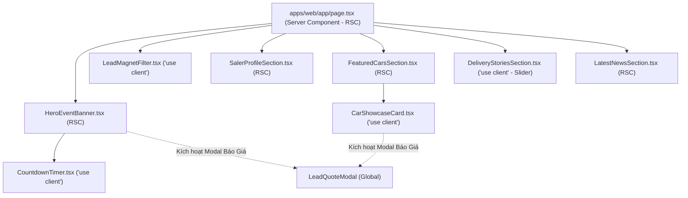

# 🧩 Frontend Integration Guide: Trang Chủ Phễu Chuyển Đổi 6 Phân Khu (Homepage Conversion Funnel)

## 1. Cây Thành Phần & Ranh Giới Server / Client (Component Tree Architecture)



---

## 2. Vị Trí Tập Tin & Cấu Trúc Thư Mục (Folder Structure)

```text
apps/web/
├── app/
│   └── page.tsx                                  # Root Homepage (RSC: Nạp song song settings + cars + news)
└── components/
    └── home/
        ├── HeroEventBanner.tsx                   # Phân khu 1 (RSC)
        ├── CountdownTimer.tsx                    # Client Island đếm ngược thời gian thực
        ├── LeadMagnetFilter.tsx                  # Phân khu 2: Lọc nhanh ngân sách & phân khúc
        ├── SalerProfileSection.tsx               # Phân khu 3: Hồ sơ Saler & 4 cam kết vàng
        ├── FeaturedCarsSection.tsx               # Phân khu 4: Lưới dòng xe bán chạy
        ├── CarShowcaseCard.tsx                   # Thẻ xe với nút Xem chi tiết & Nhận báo giá
        ├── DeliveryStoriesSection.tsx            # Phân khu 5: Slider ảnh khách nhận xe
        └── LatestNewsSection.tsx                 # Phân khu 6: Khối bài viết khuyến mãi

apps/admin/
└── app/
    └── settings/
        └── components/
            ├── HomepageFunnelSection.tsx         # Quản trị tổng thể 6 phân khu trang chủ
            ├── HeroBannerForm.tsx                # Form cấu hình Khu 1
            ├── LeadFilterForm.tsx                # Form cấu hình Khu 2
            ├── SalerShowroomForm.tsx             # Form cấu hình Khu 3
            ├── FeaturedCarsForm.tsx              # Form cấu hình Khu 4
            ├── DeliveryStoriesForm.tsx           # Form quản lý album ảnh giao xe Khu 5
            └── LatestPromotionsForm.tsx          # Form cấu hình Khu 6
```

---

## 3. Khế Ước Dữ Liệu (Props Contracts)

### 3.1. `HeroEventBanner.tsx`
```typescript
export interface HeroEventBannerProps {
  config: HeroBannerConfig;
  onOpenQuoteModal?: (source: string) => void;
}
```

### 3.2. `CountdownTimer.tsx` (Client Island)
```typescript
export interface CountdownTimerProps {
  targetDate: string; // ISO string GMT+7, vd: "2026-10-31T23:59:59+07:00"
  urgencyText: string;
}
```

### 3.3. `LeadMagnetFilter.tsx`
```typescript
export interface LeadMagnetFilterProps {
  config: LeadFilterConfig;
  totalCarsCount?: number;
}
```

### 3.4. `SalerProfileSection.tsx`
```typescript
export interface SalerProfileSectionProps {
  config: SalerShowroomConfig;
  contactHotline: string;
  zaloUrl: string;
}
```

### 3.5. `FeaturedCarsSection.tsx`
```typescript
export interface FeaturedCarsSectionProps {
  config: FeaturedCarsZoneConfig;
  cars: Car[];
}
```

### 3.6. `DeliveryStoriesSection.tsx`
```typescript
export interface DeliveryStoriesSectionProps {
  config: DeliveryStoriesZoneConfig;
}
```

### 3.7. `LatestNewsSection.tsx`
```typescript
export interface LatestNewsSectionProps {
  config: LatestPromotionsZoneConfig;
  posts: Array<{
    id: string;
    title: string;
    slug: string;
    summary: string;
    thumbnailUrl: string;
    publishedAt: string;
  }>;
}
```

---

## 4. Quy Tắc Tối Ưu Hiệu Năng & Core Web Vitals

1. **Largest Contentful Paint (LCP < 2.0s):**
   * Ảnh banner trong `HeroEventBanner.tsx` bắt buộc dùng component `next/image` với thuộc tính `priority={true}` và `fetchPriority="high"`.
   * Cung cấp thuộc tính `sizes="100vw"` cho ảnh hero toàn màn hình.

2. **Cumulative Layout Shift (CLS = 0):**
   * Tất cả thẻ chứa ảnh xe, ảnh đại diện saler, và ảnh banner đều được gán tỷ lệ khung hình cố định (`aspect-video`, `aspect-[16/9]`, `aspect-square`).
   * Khu vực Countdown Timer có chiều cao tối thiểu (`min-h-[72px]`) để khi script client mount xong không làm nảy nội dung bên dưới.

3. **Xử lý Graceful Degradation:**
   * Mọi component phân khu đều bắt đầu bằng câu lệnh điều kiện:
     ```typescript
     if (!config.enabled) return null;
     ```
   * Riêng các khối dữ liệu động (Khu 4, Khu 5, Khu 6):
     ```typescript
     if (!config.enabled || !items || items.length === 0) return null;
     ```
