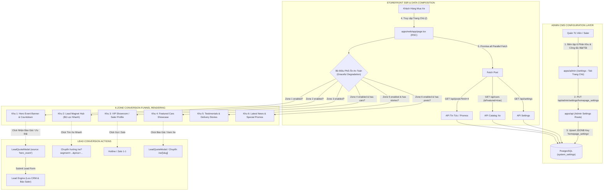
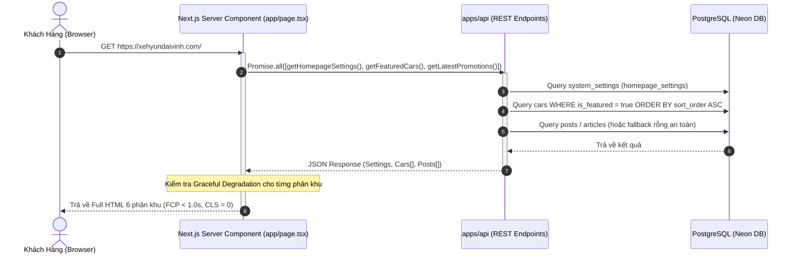
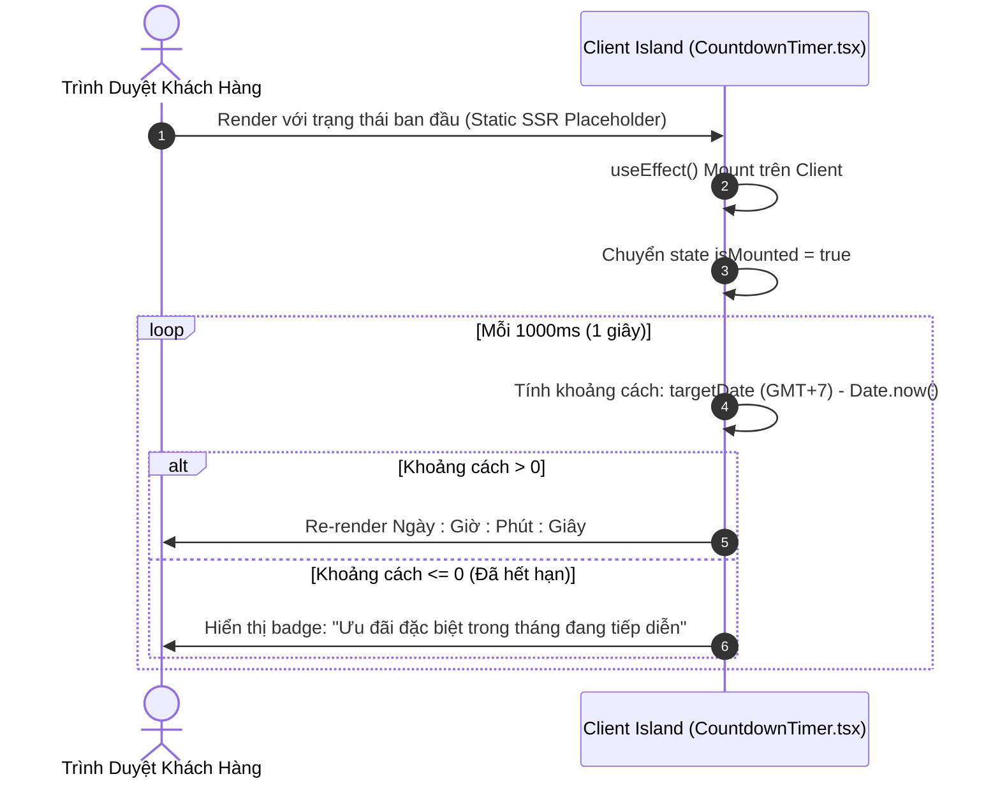
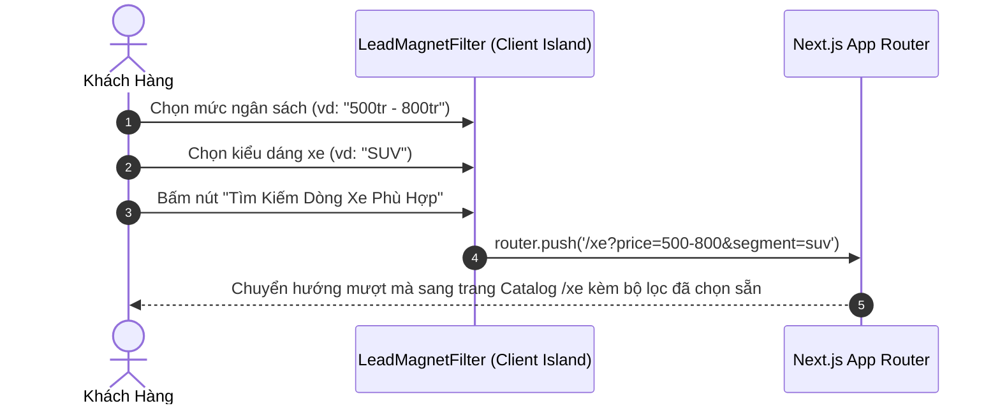
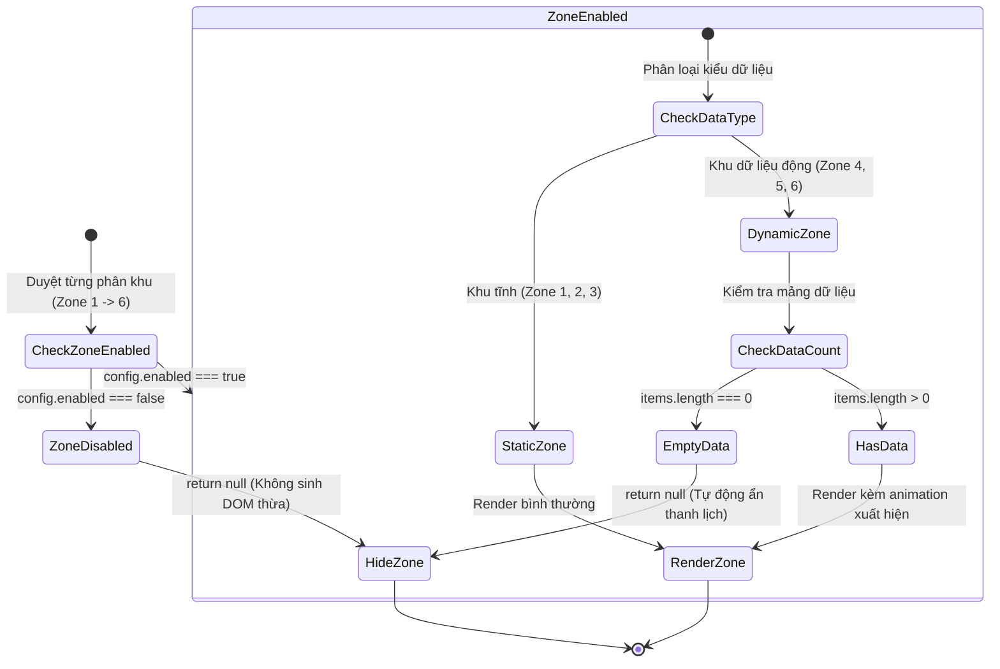
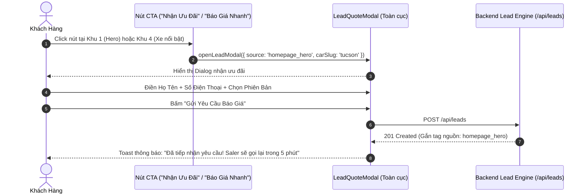

# 🔄 Logic & Interaction Flows: Trang Chủ Phễu Chuyển Đổi 6 Phân Khu (Homepage Conversion Funnel)

## 1. Tổng Quan Kiến Trúc Luồng (System Flow Architecture)
Tài liệu này đặc tả toàn bộ luồng tương tác, luồng dữ liệu hai chiều giữa Storefront và Admin Portal, cũng như State Machine điều phối 6 phân khu chuyển đổi trên trang chủ (`HeroBanner`, `LeadMagnetFilter`, `SalerProfileSection`, `FeaturedCarsSection`, `DeliveryStoriesSection`, `LatestNewsSection`) dựa trên **Option 2** đã được phê duyệt.

---

## 2. Các Sơ Đồ Trình Tự Nghiệp Vụ (Sequence Diagrams)

### 2.1. Luồng 1: Trang Chủ SSR Khởi Tạo & Nạp Dữ Liệu Song Song (Zero CLS)
Khách hàng truy cập `/`, Server Component `apps/web/app/page.tsx` nạp song song dữ liệu cấu hình và danh mục xe, render HTML hoàn chỉnh:

---

### 2.2. Luồng 2: Countdown Timer Lifecycle & Timezone-Safe Hydration (Khu 1)
Để ngăn chặn lỗi Hydration Mismatch (`Text content does not match server-rendered HTML`) do đồng hồ máy khách khác với server:

---

### 2.3. Luồng 3: Lead Magnet Hub - Tìm Kiếm Nhanh Theo Ngân Sách & Phân Khúc (Khu 2)
Giúp khách tìm xe phù hợp chỉ với 2 lần chạm:

---

### 2.4. Luồng 4: State Machine Điều Phối Ẩn An Toàn (Graceful Degradation Decision Tree)

---

### 2.5. Luồng 5: Kích Hoạt Lead Conversion Modal Từ Các Phân Khu
Mọi nút kêu gọi hành động trên trang chủ đều tích hợp mở `LeadQuoteModal` và truyền ngữ cảnh nguồn lead:

