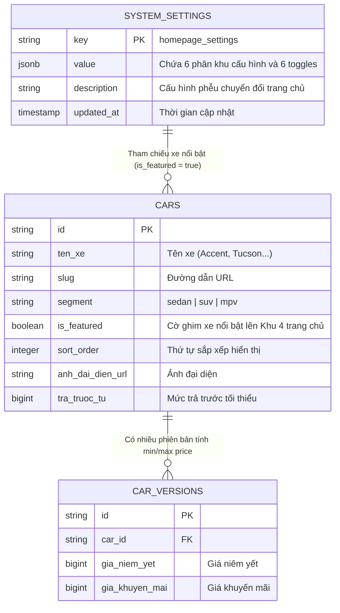

# 🗄️ Database & Contract Schemas: Trang Chủ Phễu Chuyển Đổi 6 Phân Khu (Homepage Conversion Funnel)

## 1. Bản Đồ Thực Thể & Quan Hệ Dữ Liệu (Entity Relationship Diagram)
Cấu hình phễu trang chủ được tổ chức dưới dạng Domain Key `homepage_settings` lưu trữ trong bảng `system_settings` (PostgreSQL JSONB), kết nối logic với bảng `cars` (Catalog sản phẩm):



---

## 2. Đặc Tả Zod Schemas Trong `packages/types/src/settings.ts`

### 2.1. Phân Khu 1: Hero Event Banner (`HeroBannerSchema`)
```typescript
export const HeroBannerSchema = z.object({
  enabled: z.boolean().default(true),
  headline: z.string().default('Đại Tiệc Ưu Đãi Ô Tô Hyundai Vinh'),
  subheadline: z.string().default('Hỗ trợ 50% - 100% lệ phí trước bạ, tặng gói phụ kiện chính hãng trị giá 30 triệu đồng'),
  mediaType: z.enum(['image', 'video']).default('image'),
  mediaUrl: z.string().default('/images/hero-banner.webp'),
  countdown: z.object({
    enabled: z.boolean().default(true),
    targetDate: z.string().default('2026-10-31T23:59:59+07:00'),
    urgencyText: z.string().default('Ưu đãi tháng vàng chỉ còn:'),
  }),
  remainingSlots: z.object({
    enabled: z.boolean().default(true),
    slotsCount: z.number().int().min(0).default(5),
    badgeText: z.string().default('Chỉ còn 5 suất ưu đãi đặc biệt trong tháng'),
  }),
  ctaButton: z.object({
    text: z.string().default('Nhận Báo Giá Lăn Bánh Ngay'),
    action: z.enum(['quote_modal', 'tel', 'url']).default('quote_modal'),
    href: z.string().default(''),
  }),
});
```

---

### 2.2. Phân Khu 2: Lead Magnet Hub (`LeadFilterSchema`)
```typescript
export const LeadFilterSchema = z.object({
  enabled: z.boolean().default(true),
  headline: z.string().default('Tìm Kiếm Nhanh Chiếc Xe Ưng Ý Của Bạn'),
  priceRanges: z.array(z.object({
    id: z.string(),
    label: z.string(), // vd: "Dưới 500 triệu", "500 - 800 triệu", "Trên 800 triệu"
    min: z.number().nullable(),
    max: z.number().nullable(),
  })).default([
    { id: 'under_500', label: 'Dưới 500 triệu', min: null, max: 500_000_000 },
    { id: '500_800', label: '500 - 800 triệu', min: 500_000_000, max: 800_000_000 },
    { id: 'above_800', label: 'Trên 800 triệu', min: 800_000_000, max: null },
  ]),
  bodyStyles: z.array(z.object({
    id: z.string(),
    label: z.string(), // "Sedan", "SUV / Crossover", "MPV 7 chỗ"
    segment: z.string(), // "sedan", "suv", "mpv"
  })).default([
    { id: 'sedan', label: 'Sedan Đô Thị', segment: 'sedan' },
    { id: 'suv', label: 'SUV / Crossover', segment: 'suv' },
    { id: 'mpv', label: 'MPV Đa Dụng', segment: 'mpv' },
  ]),
});
```

---

### 2.3. Phân Khu 3: VIP Showroom & Saler Profile (`SalerShowroomSchema`)
```typescript
export const CommitmentItemSchema = z.object({
  id: z.string(),
  title: z.string(),
  description: z.string(),
  icon: z.string(), // tên icon feather hoặc lucide
});

export const SalerShowroomSchema = z.object({
  enabled: z.boolean().default(true),
  mode: z.enum(['saler', 'showroom']).default('saler'),
  headline: z.string().default('Cam Kết Vàng Từ Chuyên Viên Tư Vấn'),
  subheadline: z.string().default('Đồng hành tận tâm cùng quý khách hàng trên mọi cung đường'),
  salerName: z.string().default('Nguyễn Văn Tuấn'),
  salerTitle: z.string().default('Tư Vấn Bán Hàng Cấp Cao - Hyundai Vinh'),
  avatarUrl: z.string().default('/images/saler-avatar.webp'),
  introStory: z.string().default('Với hơn 6 năm kinh nghiệm tư vấn xe ô tô, tôi cam kết mang đến giải pháp mua xe tối ưu chi phí và minh bạch nhất.'),
  commitments: z.array(CommitmentItemSchema).default([
    { id: 'c1', title: 'Hỗ Trợ Trả Góp 85%', description: 'Bao đậu hồ sơ vay khó, duyệt nhanh trong 24h, lãi suất ưu đãi đại lý.', icon: 'bank' },
    { id: 'c2', title: 'Giao Xe Tận Nhà Toàn Quốc', description: 'Hỗ trợ giao xe tận nơi bằng xe chuyên dụng theo yêu cầu ngày giờ tốt.', icon: 'truck' },
    { id: 'c3', title: 'Bảo Hành Chính Hãng 5 Năm', description: 'Áp dụng chính sách bảo hành toàn quốc tại tất cả đại lý 3S trên cả nước.', icon: 'shield' },
    { id: 'c4', title: 'Hỗ Trợ Thủ Tục 24/7', description: 'Đăng ký, đăng kiểm, bấm biển số, làm biển số đẹp và giao xe lăn bánh trọn gói.', icon: 'clock' },
  ]),
  galleryImages: z.array(z.string()).default([]),
});
```

---

### 2.4. Phân Khu 4: Featured Cars Showcase (`FeaturedCarsZoneSchema`)
```typescript
export const FeaturedCarsZoneSchema = z.object({
  enabled: z.boolean().default(true),
  headline: z.string().default('Các Dòng Xe Hyundai Bán Chạy Nhất'),
  subheadline: z.string().default('Ưu đãi lớn trong tháng, sẵn xe đủ màu giao ngay'),
  maxDisplay: z.number().int().min(1).max(12).default(6),
  viewAllText: z.string().default('Xem Toàn Bộ Bảng Giá Xe'),
  viewAllHref: z.string().default('/xe'),
});
```

---

### 2.5. Phân Khu 5: Delivery Stories & Testimonials (`DeliveryStoriesZoneSchema`)
```typescript
export const DeliveryStoryItemSchema = z.object({
  id: z.string(),
  customerName: z.string(), // "Anh Nam"
  location: z.string(), // "TP. Vinh, Nghệ An"
  carModel: z.string(), // "Hyundai Tucson 2.0 Xăng Đặc Biệt"
  imageUrl: z.string(), // Ảnh chụp thực tế trao xe
  quote: z.string(), // Lời nhận xét ngắn của khách
  deliveryDate: z.string(), // "Tháng 09/2026"
});

export const DeliveryStoriesZoneSchema = z.object({
  enabled: z.boolean().default(true),
  headline: z.string().default('Khoảnh Khắc Bàn Giao Xe Thực Tế'),
  subheadline: z.string().default('Hơn 500+ khách hàng đã tin tưởng lựa chọn mua xe cùng chúng tôi'),
  stories: z.array(DeliveryStoryItemSchema).default([]),
});
```

---

### 2.6. Phân Khu 6: Latest News & Special Promos (`LatestPromotionsZoneSchema`)
```typescript
export const LatestPromotionsZoneSchema = z.object({
  enabled: z.boolean().default(true),
  headline: z.string().default('Tin Tức Khuyến Mại & Sự Kiện'),
  subheadline: z.string().default('Cập nhật chính sách giá và chương trình ưu đãi mới nhất từ đại lý'),
  maxPosts: z.number().int().min(1).max(6).default(3),
  featuredPostIds: z.array(z.string()).default([]),
});
```

---

### 2.7. Schema Tổng Hợp: `HomepageSettingsSchema`
```typescript
export const HomepageSettingsSchema = z.object({
  heroBanner: HeroBannerSchema.default({}),
  leadFilter: LeadFilterSchema.default({}),
  salerShowroom: SalerShowroomSchema.default({}),
  featuredCars: FeaturedCarsZoneSchema.default({}),
  deliveryStories: DeliveryStoriesZoneSchema.default({}),
  latestPromotions: LatestPromotionsZoneSchema.default({}),
});

export type HomepageSettings = z.infer<typeof HomepageSettingsSchema>;
```

---

## 3. Giá Trị Khởi Tạo Mặc Định An Toàn (`DEFAULT_HOMEPAGE_SETTINGS`)
Đảm bảo hệ thống luôn hoạt động bình thường, không bao giờ crash kể cả khi cơ sở dữ liệu chưa có bản ghi:

```typescript
export const DEFAULT_HOMEPAGE_SETTINGS: HomepageSettings = HomepageSettingsSchema.parse({});
```
