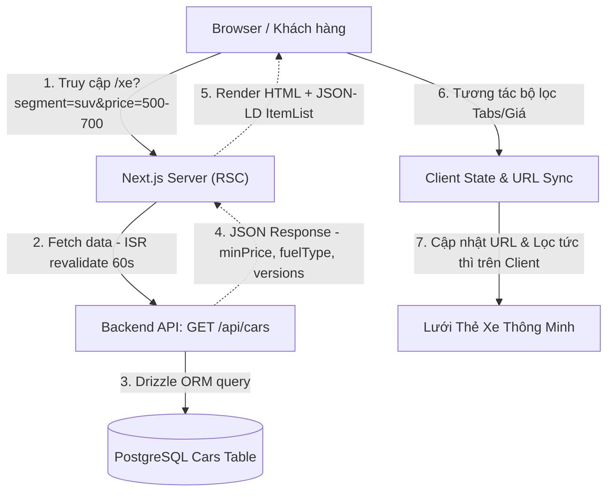

# 🎯 Feature Backlog: Trang Danh Mục Dòng Xe & Bộ Lọc Đa Chiều (Catalog & Filter Grid - `/xe`)

## 1. Thông Tin Tổng Quan (Metadata)
* **Mã Tính Năng (Epic ID):** `EPIC-PHASE-4.3-CATALOG-FILTER`
* **Mục tiêu Chiến lược:** Xây dựng trang danh mục sản phẩm `/xe` toàn diện, hiện đại, mang đẳng cấp showroom ô tô quốc tế; giúp khách hàng dễ dàng tra cứu, so sánh phân khúc (Sedan, SUV, MPV, Hatchback, EV) và ngân sách đầu tư; kích hoạt chuyển đổi tức thì tới trang dự toán lăn bánh `/gia-lan-banh?xe=[slug]` và trang chi tiết `/xe/[slug]`.
* **Phạm vi Nền tảng (Target Platform):** Full-stack (`packages/core`, `packages/types`, `packages/ui`, `apps/api`, `apps/web`)
* **Cấp độ Thực thi (Execution Tier):** Tier 1 (Core Architecture / High-Risk / Full 5 Phase Lifecycle & Strict Gates 1–5)
* **Trạng thái Môi trường:** 🟢 Pure Development (Local/Staging Monorepo)
* **Số lượng Lát cắt (Vertical Slices):** 4 Slices (`US-01`, `US-02`, `US-03`, `US-04`)
* **Tài liệu Tham Chiếu:**
  * Lộ trình tổng: [`docs/06-PHASED-IMPLEMENTATION-ROADMAP.md`](../../06-PHASED-IMPLEMENTATION-ROADMAP.md) (Dòng 212–228)
  * Kiến trúc hệ thống: [`docs/SYSTEM_MAP.md`](../../SYSTEM_MAP.md)
  * Đặc tả UI/UX: [`docs/04-TINH-NANG-FRONTEND-VA-TRAI-NGHIEM-UI-UX.md`](../../04-TINH-NANG-FRONTEND-VA-TRAI-NGHIEM-UI-UX.md)
  * Chuẩn SEO & Schema: [`docs/05-TECHNICAL-SEO-VA-SCHEMA-JSONLD.md`](../../05-TECHNICAL-SEO-VA-SCHEMA-JSONLD.md)

---

## 2. Phân Tích Khảo Cổ & Bối Cảnh Hiện Trạng (Codebase Archeology & Master Audit)

### 2.1. Điểm Kích Hoạt & Cổng Vào (Entry Points)
1. **Frontend Route:** `apps/web/app/xe/page.tsx` (Chưa khởi tạo, cần tạo mới theo kiến trúc Next.js App Router RSC + Client Islands).
2. **External Traffic / Internal Links:**
   * Navbar Header (`apps/web/components/layout/Navbar.tsx` & Mobile Drawer): Link `/xe` và dropdown menu phân khúc (`/xe?segment=sedan`, `/xe?segment=suv`, `/xe?segment=mpv`).
   * Phân khu 2 Trang Chủ (`LeadMagnetFilter.tsx`): Nút "Xem Các Dòng Xe Phù Hợp" điều hướng sang `/xe?segment=...&price=...`.
   * Banner/Footer links: Các link chuyển tiếp đến danh mục xe.
3. **Backend API:** `GET /api/cars` tại `apps/api/src/routes/catalog.ts`:
   * Hiện hỗ trợ query: `segment`, `isFeatured`, `limit`.
   * Đang trả về mảng xe đã publish kèm `minPrice`, `maxPrice`, `versions`.
   * *Khảo cổ phát hiện thiếu sót:* Endpoint hiện tại chưa trả về `fuelType` ở root object và chưa tính toán tổng hợp `seatCount` đại diện của dòng xe để thẻ xe hiển thị ngay mà không phải lặp mảng versions ở Client. Cần nâng cấp nhẹ và hoàn toàn tương thích ngược!

### 2.2. Dòng Chảy Dữ Liệu End-to-End (Data Wiring Flow)

### 2.3. Bán Kính Ảnh Hưởng (Blast Radius) & Tính An Toàn
* **Frontend:** Trang `/xe` độc lập, kế thừa `RootLayout` (`Navbar`, `Footer`, `FloatingSeller`, `LeadQuoteModal`). Không làm phá vỡ trang chủ `/` hay trang `/gia-lan-banh`.
* **Backend:** Bổ sung trường `fuelType` và `seatRange` trong response của `GET /api/cars` tuân thủ nguyên tắc *Non-Destructive Additive Mode* (chỉ bổ sung thuộc tính mới, không xóa hay đổi tên các trường hiện hữu).
* **SEO:** Trang danh mục `/xe` là trang trọng tâm bán hàng (SEO Priority 0.9), cần có thẻ Canonical chuẩn hóa (`https://domain/xe`) loại bỏ các query parameters thừa, ngăn ngừa lỗi Duplicate Content trên Google Search Console.

---

## 3. Phân Tích Ý Đồ Nghiệp Vụ Qua 6 Lăng Kính (6 Business Intent Lenses)

### 🔍 Lăng kính 0: Phân Vùng Nền Tảng & Đồng Bộ URL Query (Platform Boundary & URL State Sync)
* **Quy tắc 2 chiều (Bidirectional Sync):**
  * *Chiều đọc (Initial Load / Deep Link):* Khi khách mở link chia sẻ hoặc click từ Trang Chủ `/xe?segment=suv&price=700-1000`, bộ lọc tự động trích xuất params để active đúng Tab "SUV" và nút giá "700 - 1 tỷ", hiển thị kết quả ngay trong lần render đầu tiên (FCP tức thì, không giật lag).
  * *Chiều ghi (User Interaction):* Khi khách bấm chọn Tab hoặc chuyển mức giá, Client State cập nhật tức thì trong `< 50ms` và đồng bộ vào URL query params bằng `window.history.replaceState` hoặc `router.replace(..., { scroll: false })` để không gây gián đoạn cuộn trang và không phát sinh full page reload.
  * *Nút Back / Forward trình duyệt:* Lắng nghe sự kiện `popstate` để khôi phục chính xác bộ lọc khi người dùng bấm nút Quay lại của trình duyệt.

### 👤 Lăng kính 1: Persona & Tâm Lý Khách Hàng (Buyer Psychology & Fast Catalog UX)
* Khách hàng ô tô cần sự minh bạch và trực quan:
  * Không muốn đợi tải lại trang mỗi lần chọn một bộ lọc khác nhau. Tốc độ phản hồi phải đạt mức chớp mắt (< 50ms) nhờ cơ chế Client-side Filtering trên tập dữ liệu đã tải trước từ Server.
  * Phân loại phân khúc rõ ràng: `Tất cả`, `Sedan`, `SUV`, `MPV`, `Hatchback`, `Xe Điện (EV)` với icon/badge chuẩn nhận diện.
  * Phân loại mức giá thân thiện với tâm lý tài chính người Việt:
    * Dưới 500 triệu (Xe phân khúc A, phổ thông, mua lần đầu / chạy dịch vụ)
    * 500 - 700 triệu (Sedan B, Crossover đô thị gầm cao)
    * 700 triệu - 1 tỷ (SUV cỡ C, MPV gia đình tiện nghi)
    * Trên 1 tỷ (D-SUV, MPV cao cấp, Xe điện công nghệ mới)

### 💰 Lăng kính 2: Dòng Tiền & Cơ Chế Giá Đa Phiên Bản (Pricing Aggregation & Economics)
* Một dòng xe (ví dụ Hyundai Tucson) thường có từ 3 đến 4 phiên bản với khoảng giá trải rộng (ví dụ từ 769 triệu đến 919 triệu VNĐ).
* **Khoảng giá chuẩn:** Hiển thị `minPrice` - `maxPrice` (đã tính theo giá khuyến mãi nếu có, hoặc giá niêm yết). Nếu chỉ có 1 giá duy nhất: hiển thị gọn 1 mức giá.
* **Đòn bẩy trả góp:** Người mua xe ô tô Việt Nam quan tâm nhất đến số vốn tự có tối thiểu ban đầu. Card xe phải hiển thị nổi bật huy hiệu: `"Trả trước từ [X] triệu"` (lấy từ trường `traTruocTu` của xe hoặc ước tính 15–20% giá niêm yết thấp nhất).
* **Call to Action Kép (Dual CTA):**
  * Nút 1: `"Xem Chi Tiết"` ➡️ Chuyển hướng tới `/xe/[slug]`.
  * Nút 2: `"Dự Toán Lăn Bánh"` ➡️ Chuyển hướng trực tiếp tới `/gia-lan-banh?xe=[slug]` với xe được chọn sẵn trong bộ tính giá.

### 🚗 Lăng kính 3: Thẻ Xe Thông Minh & Điểm Neo Kỹ Thuật (Smart Car Card Component)
* Thẻ xe phải toát lên vẻ sang trọng của Showroom chính hãng:
  * Ảnh chụp góc 3/4 trước chuẩn showroom (tỷ lệ vàng 16:10 hoặc 16:9), có hiệu ứng hover zoom nhẹ (micro-animation).
  * Bộ 3 thông số then chốt (Quick Specs Pills):
    * Phân khúc (Segment badge: SUV, Sedan, MPV...)
    * Số chỗ ngồi (5 chỗ, 7 chỗ, 8 chỗ)
    * Loại nhiên liệu (Xăng, Dầu, Hybrid, Điện EV)
  * Huy hiệu ưu đãi (Promotion Ribbon): Nếu xe có `promotionSummary` (ví dụ: "Giảm 50% trước bạ + Tặng phụ kiện 20tr"), hiển thị thanh ruy-băng nổi bật không bị che lấp ảnh.

### 🌐 Lăng kính 4: SEO Kỹ Thuật & Google Merchant Standards (Technical SEO & Structured Data)
* Tuân thủ 100% tiêu chuẩn trong `docs/05-TECHNICAL-SEO-VA-SCHEMA-JSONLD.md`:
  * **Thẻ Meta & OpenGraph:** Title chuẩn SEO: `"Bảng Giá Xe Hyundai Mới Nhất 2026 | Danh Mục Xe & Ưu Đãi Đại Lý"`, Description hấp dẫn, OpenGraph banner showroom.
  * **Canonical URL:** Cố định tại `https://domain/xe` (tự động loại bỏ mọi query params lọc để bảo vệ PageRank).
  * **JSON-LD Schema ItemList:** Nhúng cấu trúc `ItemList` chứa danh sách toàn bộ các dòng xe, mỗi item liên kết với Schema `Product` / `Car` kèm `AggregateOffer` (lowPrice, highPrice, priceCurrency: 'VND', availability: 'https://schema.org/InStock').

### 🛡️ Lăng kính 5: Trạng Thái Biên, Bộ Lọc Rỗng & Phục Hồi (Zero-State & Edge Resilience)
* **Kịch bản không có xe phù hợp (Zero Matching Cars):**
  * Nếu khách chọn kết hợp bộ lọc không có xe nào (ví dụ: Sedan nhưng giá > 1 tỷ), giao diện hiển thị màn hình Empty State thân thiện kèm nút: `"Xóa bộ lọc & Xem tất cả xe"`.
* **Kịch bản mất mạng / Backend lỗi:**
  * Nếu API trả về mảng rỗng, giao diện hiển thị thông báo nhẹ nhàng kèm nút tải lại và Hotline hỗ trợ trực tiếp, không bao giờ crash màn hình trắng.
* **Đồng bộ với Header & Home Filter:**
  * Xử lý tương thích cả query kiểu `segment=suv` lẫn `kieuDang=SUV` (từ menu cũ) để khách bấm từ bất kỳ vị trí nào cũng hiển thị đúng kết quả.

---

## 4. Ma Trận Trạng Thái Lát Cắt Tính Năng (Vertical Feature Slices Matrix)

| ID | User Story / Phạm Vi Lát Cắt | Nền Tảng / Layer | Target Files | Phương Pháp Kiểm Chứng (DoD) | Trạng Thái |
| :---: | :--- | :---: | :---: | :--- | :---: |
| **US-01** | **Shared Core Data Contract & SEO Schemas Engine** Bổ sung hàm sinh JSON-LD `generateCatalogJsonLd` (Schema `ItemList` + `AggregateOffer`) tại `packages/core/src/seo/json-ld.ts`. Chuẩn hóa response `GET /api/cars` tại `apps/api/src/routes/catalog.ts` bổ sung `fuelType` và tính toán `seatCount` đại diện. | Shared / BE (`packages/core`, `apps/api`) | ~4 files | Unit test Zod & JSON-LD generator; API `/api/cars` trả về `fuelType`, `minPrice`, `maxPrice` đầy đủ. | 🔄 SẴN SÀNG |
| **US-02** | **Multi-Dimensional Filter Bar & Bidirectional URL State Engine** Tạo component `CatalogFilterBar` với Tabs phân khúc (`Tất cả`, `Sedan`, `SUV`, `MPV`, `Hatchback`, `EV`) và Mốc giá bấm nhanh (`Dưới 500tr`, `500 - 700tr`, `700 - 1 tỷ`, `Trên 1 tỷ`). Tạo custom hook đồng bộ 2 chiều URL Query Params không reload trang (< 50ms). | FE Web (`apps/web`, `packages/ui`) | ~4 files | Kiểm tra thao tác click tab/giá: URL thay đổi tức thì, kết quả lọc < 50ms, nút Back/Forward trình duyệt khôi phục bộ lọc chuẩn xác. | ⏸️ CHỜ |
| **US-03** | **Smart Car Card Component & Responsive Catalog Grid** Xây dựng component `SmartCarCard` chuyên biệt cho Catalog (ảnh chuẩn tỷ lệ, badge phân khúc, thông số chỗ ngồi/nhiên liệu, khoảng giá `minPrice` - `maxPrice`, trả trước tối thiểu, nút Xem Chi Tiết + Dự Toán Lăn Bánh). Xây dựng `CatalogGrid` với Zero-state phục hồi khi lọc không ra kết quả. | FE Web (`apps/web`, `packages/ui`) | ~4 files | Visual QA trên Desktop và Mobile; cả 2 nút hành động chuyển đúng route `/xe/[slug]` và `/gia-lan-banh?xe=[slug]`; Zero-state hoạt động mượt mà. | ⏸️ CHỜ |
| **US-04** | **Server Page Shell, Dynamic Metadata SEO & Integration Testing** Khởi tạo trang Server Component `apps/web/app/xe/page.tsx`, tích hợp Breadcrumbs (`Trang chủ > Danh mục xe`), SEO Metadata, nhúng JSON-LD Schema `ItemList`, kết nối toàn diện với `LeadQuoteModal` và Navbar. Chạy trọn vẹn kịch bản kiểm thử tự động Monorepo (`check-types`, `build`). | Full-stack Web (`apps/web`, `packages/core`) | ~4 files | `pnpm check-types` pass 100% không lỗi; Google Rich Results Test hợp lệ; tải trang FCP < 1.0s, CLS = 0. | ⏸️ CHỜ |

---

## 5. Danh Sách Design Stack Kích Hoạt Cho Giai Đoạn 2
* `system-analyst-architect` (Bắt buộc ở Bước 2.1: Phân tích 3 phương án kiến trúc tại `SOLUTION_OPTIONS.md`)
* `logic-flow-ba` (Bước 2.2: Lập sơ đồ tuần tự dòng dữ liệu và trạng thái URL tại `FLOW.md`)
* `feature-spec-generator` (Bước 2.2: Đặc tả hợp đồng API và SEO Contract tại `API_SPEC.md`)
* `tailwind-ui-designer` (Bước 2.2: Đặc tả Design System, Tokens, Smart Car Card Layout và Zero-State tại `UI_SPEC.md` & `FE_INTEGRATION_GUIDE.md`)

---

## 6. Kế Hoạch Chuyển Tiếp Gate 1
* **Lệnh thông quan:** `"Confirm Step 1: Duyệt Backlog"`
* **Hành động tiếp theo sau khi thông quan:** Bước vào **Giai đoạn 2: Thiết kế Kiến trúc (Sub-Gate 2.1 - Xuất bản `SOLUTION_OPTIONS.md`)**.
