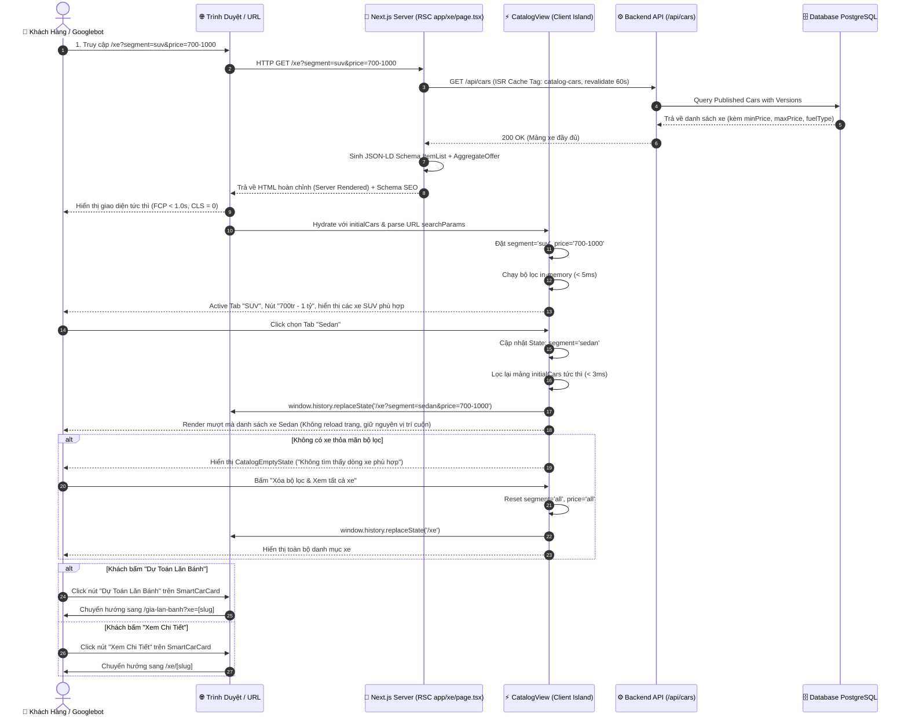
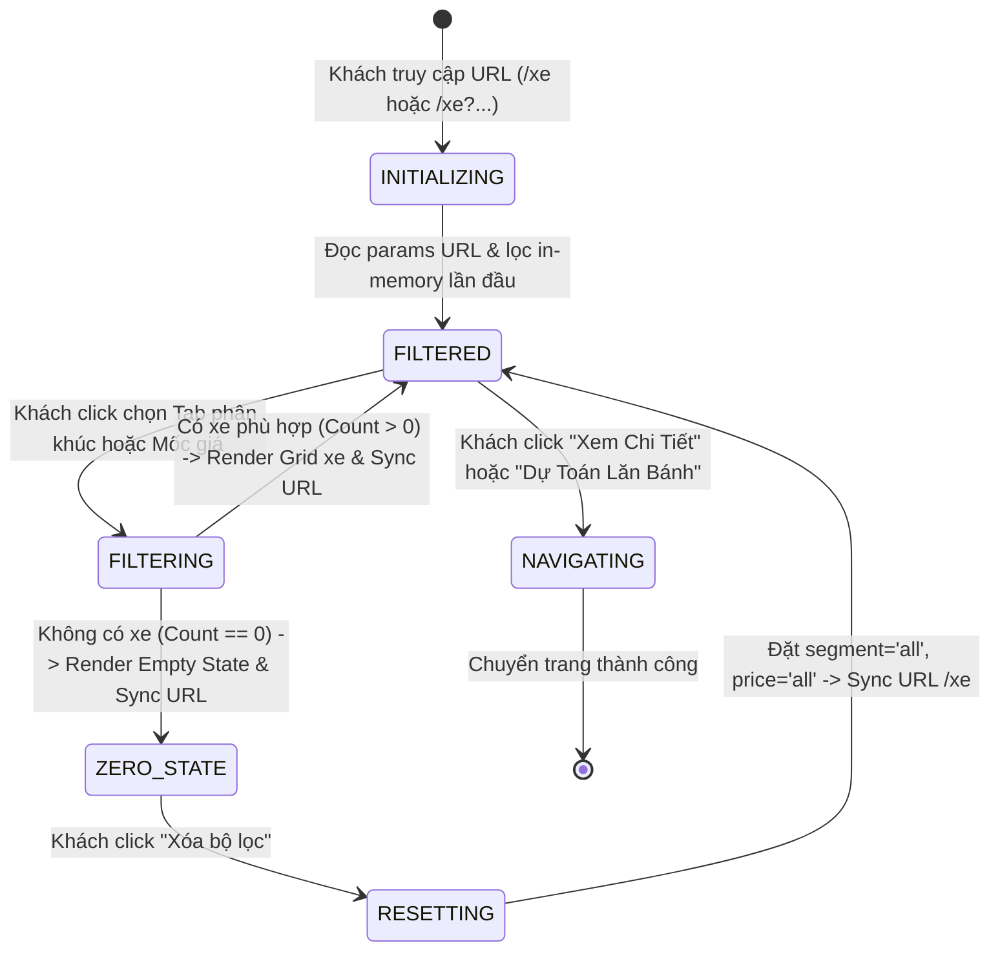

# 🔄 Technical Flow Specification: Trang Danh Mục Dòng Xe & Bộ Lọc Đa Chiều (`/xe`)

## 1. Sequence Diagram Đa Tầng (End-to-End Sequence)

---

## 2. Sơ Đồ Trạng Thái Thực Thể Bộ Lọc (State Machine Diagram)

---

## 3. Bảng Giải Phẫu Từng Bước (Step Anatomy Table)

| Bước # | Tác nhân | Hành động | Dữ liệu Đầu Vào | Logic Xử Lý & Quy Tắc Nghiệp Vụ | Kết Quả Đầu Ra | Xử Lý Ngoại Lệ & Phục Hồi |
| :---: | :--- | :--- | :--- | :--- | :--- | :--- |
| **1** | User / Crawler | Truy cập `/xe` | URL string + search params | Next.js Server nhận request, kích hoạt hàm nạp dữ liệu `getCarsList()` với ISR Cache 60 giây. | HTML Server Shell + JSON-LD Schema `ItemList` | Nếu Backend API lỗi, trả về mảng `[]`, hiển thị khung thông báo thân thiện. |
| **2** | ClientIsland | Khởi tạo State | `initialCars`, `useSearchParams()` | Đọc query params: map `kieuDang` (nếu có) sang `segment`, validate mốc giá hợp lệ. Chạy hàm lọc `filterCars()`. | State khởi tạo: `segment`, `priceRange`, `filteredCars` | Nếu query param chứa giá trị rác, fallback về giá trị `'all'`. |
| **3** | User | Chọn Phân Khúc | Click Tab Segment (`sedan`, `suv`, `mpv`, `ev`, `all`) | Kiểm tra nếu tab đang chọn trùng với tab hiện tại thì giữ nguyên; nếu khác thì cập nhật state `selectedSegment`. | Lưới xe cập nhật tức thì `< 5ms`. Cập nhật URL qua `replaceState`. | Animation fade/slide mượt mà, không giật màn hình. |
| **4** | User | Chọn Mốc Giá | Click Mốc Giá (`under-500`, `500-700`, `700-1000`, `over-1000`, `all`) | So sánh khoảng giá của xe (`minPrice <= max` VÀ `maxPrice >= min`) để đảm bảo không bỏ sót dòng xe có phiên bản nằm trong khoảng. | Lưới xe cập nhật tức thì `< 5ms`. Cập nhật URL qua `replaceState`. | Nếu không có xe nào, chuyển sang Bước 5. |
| **5** | ClientIsland | Hiển thị Zero-State | Mảng lọc rỗng `filteredCars.length === 0` | Hiển thị hình minh họa, thông điệp nhắc nhở và nút hành động nhanh: *"Xóa bộ lọc"*. | Render component `CatalogEmptyState` | Người dùng bấm xóa bộ lọc ➡️ phục hồi danh mục xe 100%. |
| **6** | User | Bấm "Dự Toán Lăn Bánh" | Click CTA button | Lấy `car.slug`, kích hoạt chuyển trang tới `/gia-lan-banh?xe=${car.slug}` | Trình duyệt chuyển sang bộ tính lăn bánh với xe đã chọn sẵn | Mở tab mới hoặc điều hướng cùng tab mượt mà. |
| **7** | User | Bấm "Xem Chi Tiết" | Click CTA button / Card Link | Lấy `car.slug`, chuyển hướng tới `/xe/${car.slug}` | Trình duyệt chuyển tới trang thông số chi tiết dòng xe | Lưu lại vị trí scroll khi quay lại qua browser cache. |
