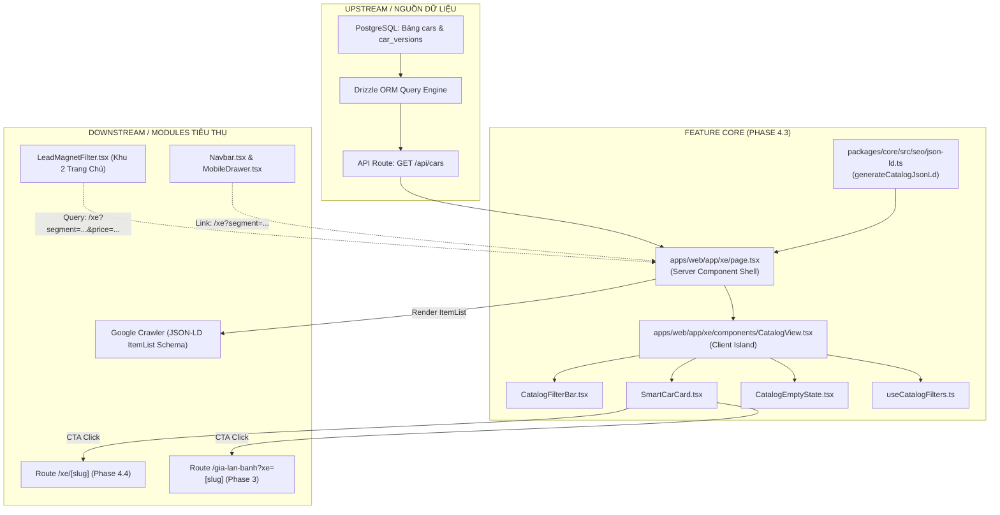

# 🛡️ Risk Audit & Dependency Analysis: Trang Danh Mục Dòng Xe & Bộ Lọc Đa Chiều (`/xe`)

## 1. Đồ Thị Phụ Thuộc (Dependency Graph) & Bán Kính Ảnh Hưởng (Blast Radius)

### Đánh Giá Bán Kính Ảnh Hưởng (Blast Radius):
* **Phạm vi cô lập:** Trang `/xe` hoạt động hoàn toàn độc lập theo route riêng biệt.
* **Mức độ rủi ro hệ thống:** **Thấp đến Trung bình (Low to Medium)** do không thực hiện thao tác ghi Database (Read-only), không chỉnh sửa Auth/Session, không phá vỡ hợp đồng API hiện có.
* **Vùng tiếp giáp cần kiểm soát:** Khả năng nhận diện tham số URL từ `LeadMagnetFilter` và `Navbar` (cần hỗ trợ cả `kieuDang` và `segment`).

---

## 2. Ma Trận Rủi Ro Chi Tiết R1 - R17 (The R1-R17 Risk Matrix)

| Nhóm Nguy Cơ | Mã | Tên Rủi Ro | Mức Độ | Đánh Giá Tác Động Trong Phase 4.3 | Chiến Lược Phòng Vệ Bắt Buộc (Mitigation) |
| :--- | :---: | :--- | :---: | :--- | :--- |
| **A. Hiệu Năng & Tài Nguyên** | **R1** | N+1 Queries & Database Locking | 🟡 Low | API gọi `findMany` kèm `with: { versions: true }`. Do lượng xe chỉ từ 10–30 xe, không có nguy cơ N+1. | Duy trì 1 query Drizzle duy nhất với eager loading versions. |
| | **R2** | Memory Leak & Unbounded Collections | 🟡 Low | Mảng xe Client-Side lưu trong memory có kích thước cố định (< 30 items, ~20KB). | Không lưu cache thừa, giải phóng hook listeners khi unmount. |
| | **R3** | Payload Size & IO Bottleneck | 🟡 Low | JSON response trả về thông tin cơ bản của xe và phiên bản, dung lượng nhẹ. | Loại bỏ các trường văn bản dài không cần thiết (`moTaChung`, `contentBlocks`) khỏi `GET /api/cars`. |
| **B. Bảo Mật & Toàn Vẹn** | **R4** | Injection & Sanitization (XSS) | 🟠 Medium | Query param trên URL (`?segment=...&price=...`) có thể bị chèn mã độc. | Dùng whitelist enum (`validSegments`, `validPrices`) để sanitize triệt để; không bao giờ dùng `dangerouslySetInnerHTML` cho query params. |
| | **R5** | Broken Object-Level Authorization (IDOR) | 🟢 None | Danh mục xe là thông tin công khai (Public Catalog), không có dữ liệu riêng tư. | Không áp dụng. |
| | **R6** | Data Leak & Secret Exposure | 🟢 None | Không chứa PII hay bí mật hệ thống. Chỉ hiển thị thông tin xe `published`. | API backend chỉ filter xe có `status === 'published'`. |
| | **R7** | Mass Assignment & DTO Pollution | 🟢 None | Tính năng hoàn toàn là Read-only, không có form Mutation ghi vào DB. | Không áp dụng. |
| | **R8** | SSRF & Token Leakage | 🟢 None | Không thực hiện gọi HTTP ra URL bên ngoài người dùng nhập. | Không áp dụng. |
| | **R9** | Unsafe Archive / Zip Bomb | 🟢 None | Không có tính năng upload hay giải nén file. | Không áp dụng. |
| | **R10** | GenAI Vulnerabilities | 🟢 None | Phase 4.3 chưa tích hợp AI Bot tư vấn. | Không áp dụng. |
| **C. Thực Thi & Vận Hành** | **R11** | Hardcode & Magic Values | 🟠 Medium | Mức giá lọc (`500_000_000`, `700_000_000`...) có thể bị rải rác trong code. | Khai báo tập trung hằng số `CATALOG_PRICE_RANGES` và `CATALOG_SEGMENTS` trong file types dùng chung. |
| | **R12** | Convention & Architectural Drift | 🟡 Low | Trộn lẫn giữa `export default` và `export const`, tự ý viết CSS inline thô. | 100% Named Exports, 100% sử dụng `@cardealer/ui` primitives và Tailwind tokens. |
| | **R13** | Race Condition & Concurrency | 🟡 Low | Người dùng bấm chuyển Tab liên tục nhiều lần trong 1 giây. | Lọc in-memory thuần túy (sync execution) triệt tiêu hoàn toàn race condition mạng. |
| | **R14** | Unhandled Exceptions & Crash | 🟠 Medium | Backend ngắt kết nối tạm thời hoặc mảng versions rỗng gây lỗi `Math.min()`. | Bọc try-catch phòng thủ, kiểm tra `versions.length > 0` trước khi tính `minPrice`, fallback giao diện an toàn. |
| | **R15** | Transactional Atomicity | 🟢 None | Không ghi dữ liệu vào CSDL. | Không áp dụng. |
| | **R16** | Breaking Contract & Query Mismatch | 🟠 Medium | Khách hàng bấm từ menu Navbar cũ (`?kieuDang=SUV`) hoặc link quảng cáo cũ. | Hook `useCatalogFilters` map tự động `kieuDang` ➡️ `segment`, chuẩn hóa chữ thường (case-insensitive). |
| | **R17** | Supply Chain & Dependencies | 🟡 Low | Không cài đặt thêm bất kỳ thư viện npm bên ngoài nào mới. | Tận dụng 100% stack hiện có (`lucide-react`, `@cardealer/ui`, Next.js 15). |

---

## 3. Các Chỉ Dẫn Phòng Vệ Trọng Yếu Cho Phase 4 (Implementation Guardrails)

1. **Phòng vệ R4 (XSS qua URL Params):**
   * Mọi giá trị lấy từ `searchParams` (`segment`, `price`) bắt buộc phải đối chiếu với mảng Whitelist:
     * `validSegments = ['all', 'sedan', 'suv', 'mpv', 'hatchback', 'ev']`
     * `validPrices = ['all', 'under-500', '500-700', '700-1000', 'over-1000']`
   * Nếu giá trị không nằm trong Whitelist ➡️ lập tức ép về `'all'`.
2. **Phòng vệ R14 (Math.min trên mảng rỗng):**
   * Khi tính `minPrice` và `maxPrice`, nếu xe chưa có phiên bản nào, bắt buộc trả về `0` và hiển thị nhãn `"Liên hệ đại lý"`, tuyệt đối không để xảy ra lỗi `Infinity` hay `NaN`.
3. **Phòng vệ R16 (SEO Canonical Protection):**
   * Đặt thẻ `metadata.alternates.canonical: '/xe'` cố định để mọi URL có query lọc (như `/xe?segment=suv&price=500-700`) đều trỏ về trang gốc, ngăn Google phạt lỗi Duplicate Content.
