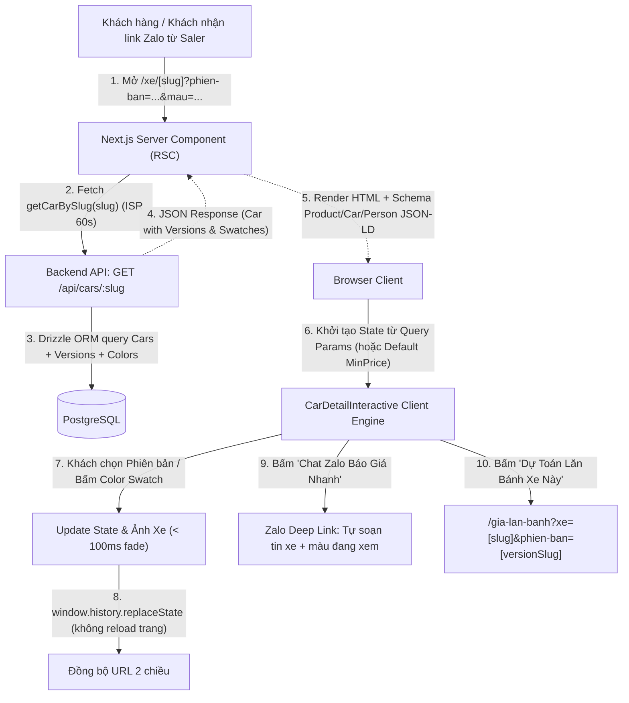

# 🎯 Feature Backlog: Trang Chi Tiết Dòng Xe Chuẩn Hóa & Đổi Màu Động (Dynamic Car Experience & Deep Linking - `/xe/[carSlug]`)

## 1. Thông Tin Tổng Quan (Metadata)
* **Mã Tính Năng (Epic ID):** `EPIC-PHASE-4.4-CAR-DETAIL-EXPERIENCE`
* **Định Vị Nền Tảng (Core Persona & Positioning):** **Website Cá Nhân Của Chuyên Viên Tư Vấn Bán Hàng Xuất Sắc (Automotive Top Sales Consultant)** — Không phải website công ty/tập đoàn cứng nhắc. Tối đa hóa tính gần gũi, xây dựng niềm tin cá nhân (Personal Branding), tốc độ phản hồi chớp mắt và chuyển đổi khách hàng trực tiếp qua Zalo / Hotline cá nhân.
* **Mục tiêu Chiến lược:** Xây dựng cỗ máy bán hàng tương tác cao cấp nhất cho Saler, hợp nhất tất cả phiên bản và màu sắc trên một URL duy nhất (`/xe/[carSlug]?phien-ban=[versionSlug]&mau=[colorSlug]`), biến mỗi trang xe thành một "Showroom Di Động Cá Nhân" giúp Saler dễ dàng chốt deal, gửi link cấu hình nhanh cho khách qua Zalo/Facebook và bứt phá tỷ lệ chuyển đổi form/cuộc gọi.
* **Phạm vi Nền tảng (Target Platform):** Full-stack (`packages/types`, `packages/core`, `apps/api`, `apps/web`, `packages/ui`)
* **Cấp độ Thực thi (Execution Tier):** Tier 1 (Core Architecture / High-Risk / Full 5 Phase Lifecycle & Strict Gates 1–5)
* **Trạng thái Môi trường:** 🟢 Pure Development (Local/Staging Monorepo)
* **Số lượng Lát cắt (Vertical Slices):** 4 Slices (`US-01`, `US-02`, `US-03`, `US-04`)
* **Tài liệu Tham Chiếu:**
  * Lộ trình tổng: [`docs/06-PHASED-IMPLEMENTATION-ROADMAP.md`](../../06-PHASED-IMPLEMENTATION-ROADMAP.md) (Dòng 232–250)
  * Kiến trúc hệ thống: [`docs/SYSTEM_MAP.md`](../../SYSTEM_MAP.md)
  * Đặc tả UI/UX: [`docs/04-TINH-NANG-FRONTEND-VA-TRAI-NGHIEM-UI-UX.md`](../../04-TINH-NANG-FRONTEND-VA-TRAI-NGHIEM-UI-UX.md) (Mục 2, Mục 5, Mục 6)
  * Chuẩn SEO & Schema: [`docs/05-TECHNICAL-SEO-VA-SCHEMA-JSONLD.md`](../../05-TECHNICAL-SEO-VA-SCHEMA-JSONLD.md) (Mục 1, Mục 2.1)

---

## 2. Phân Tích Khảo Cổ & Bối Cảnh Hiện Trạng (Codebase Archeology & Master Audit)

### 2.1. Điểm Kích Hoạt & Cổng Vào (Entry Points)
1. **Frontend Route:** `apps/web/app/xe/[carSlug]/page.tsx` (Chưa khởi tạo, cần tạo mới theo kiến trúc Next.js App Router RSC + Interactive Client Islands).
2. **External Traffic & Deep Links:**
   - Link trực tiếp từ chiến dịch quảng cáo cá nhân (Google Ads, Facebook Ads cá nhân, TikTok xe): `/xe/tucson-2025?phien-ban=dac-biet&mau=do-do`.
   - Link do chính Saler gửi tin nhắn Zalo tư vấn khách hàng: Khách hỏi xe nào, màu nào ➡️ Saler copy link gửi ngay, mở ra đúng phiên bản và màu sơn ngoại thất đó kèm số điện thoại của Saler.
3. **Backend API:** `GET /api/cars/:slug` tại `apps/api/src/routes/catalog.ts`:
   - Đã có truy vấn Drizzle ORM lấy xe theo `slug` và `status = 'published'`, kèm relation `versions` và `versionColors.color`.
   - *Khảo cổ phát hiện điểm cần chuẩn hóa:*
     - Cần format response trả về kiểu phẳng, đồng bộ dữ liệu `colors` của từng phiên bản theo đúng `CarVersionSchema` (`packages/types`), bao gồm: `colorId`, `tenMau`, `hexCode`, `isTwoTone`, `secondaryHexCode`, `anhXeTheoMauUrl`, `isDefault`.
     - Bổ sung Service Client `carsService.getCarBySlug(slug)` tại `apps/web/services/cars.service.ts` với cache ISR (`revalidate: 60s`, tag `car-detail-[slug]`).

### 2.2. Dòng Chảy Dữ Liệu End-to-End (Data Wiring Flow)

### 2.3. Bán Kính Ảnh Hưởng (Blast Radius) & Tính An Toàn
* **Frontend:** Trang `/xe/[carSlug]` nằm trong nhánh route độc lập, không làm ảnh hưởng `/xe` hay `/`.
* **Backend:** Chuẩn hóa format response của `GET /api/cars/:slug` tuân thủ nguyên tắc *Non-Destructive Additive Mode*, đảm bảo Admin và Web đều đọc an toàn.
* **SEO & Thương Hiệu:** Đặt thẻ Canonical cố định về `/xe/[carSlug]` chống Duplicate Content; bổ sung Disclaimer minh bạch: website cá nhân của Tư vấn bán hàng chính hãng, không gây hiểu nhầm với cổng thông tin tập đoàn.

---

## 3. Khảo Sát & Chuẩn Hóa Theo 3 Góc Nhìn: Saler Cá Nhân, Chuyên Gia SEO & Chuyên Gia UX/UI

### 💼 3.1. Góc Nhìn Chuyên Viên Tư Vấn Bán Hàng Ô Tô (Automotive Sales Consultant Architecture)

Khách hàng mua ô tô tại Việt Nam **mua vì niềm tin vào người bán (Saler)** nhiều hơn là một pháp nhân công ty vô danh. Trang chi tiết xe phải đóng vai trò là một **Vũ Khí Bán Hàng Trực Tiếp** của Saler:

#### 1. Xây Dựng Niềm Tin Tuyệt Đối (Personal Trust & Credibility Anchor):
* **Huy hiệu Tư Vấn Viên Chính Hãng (Verified Consultant Badge):**
  - Chân dung Saler chuyên nghiệp kèm chức danh: *"Em [Tên Saler] - Phụ trách kinh doanh ô tô chính hãng"*.
  - Các cam kết đắt giá từ Saler:
    - 🛡️ *"Cam kết giá lăn bánh cạnh tranh nhất khu vực Nghệ An & Hà Tĩnh"*.
    - 🚗 *"Hỗ trợ lái thử tận nhà miễn phí 24/7 (kể cả Thứ 7, Chủ Nhật)"*.
    - 🏦 *"Bao đậu hồ sơ vay trả góp 85%, xử lý nợ xấu nhóm nhẹ, duyệt hồ sơ trong 4 giờ"*.
    - 🎁 *"Gói quà tặng phụ kiện chính hãng độc quyền từ cá nhân Em [Tên Saler]"*.
    - ⏱️ *"Giao xe tận nhà bằng xe chuyên dùng đúng ngày giờ hoàng đạo"*.

#### 2. Kích Hoạt Kênh Liên Lạc Tức Thì Qua Zalo (1-Tap Smart Zalo Deep Linking):
* **Nút "Chat Zalo Với Em [Tên Saler]" Tích Hợp Thông Minh:**
  - Nút Zalo xuất hiện ngay cạnh các nút hành động chính (Hero Section, Bảng chọn màu, Bảng giá, Sticky Bottom Bar).
  - **Cơ chế tự động soạn nội dung tin nhắn theo ngữ cảnh (Contextual Message Generator):**
    Khi khách bấm nút Zalo, ứng dụng tự động mở khung chat với Saler kèm sẵn nội dung:
    > *"Chào em [Tên Saler], anh/chị đang xem dòng xe **Hyundai [Tên Xe]** phiên bản **[Tên Phiên Bản]**, màu **[Tên Màu Sơn]**. Em gửi bảng tính giá lăn bánh tốt nhất và ưu đãi tiền mặt cho anh/chị nhé!"*
    *(Khách chỉ cần bấm Gửi ➡️ Saler nhận ngay đầy đủ thông tin dòng xe, phiên bản, màu sắc mà khách đang quan tâm mà không cần hỏi lại từ đầu!)*

#### 3. Bộ Công Cụ Hỗ Trợ Saler Gửi Khách Hàng (Salesperson Power Toolkit):
* **Nút "Copy Link Báo Giá Cấu Hình Này" (Quick Share for Saler):**
  - Saler đang tư vấn khách qua Zalo/Điện thoại có thể chọn nhanh Phiên bản và Màu sắc trên web, bấm nút *"Sao chép liên kết cấu hình"* để gửi thẳng cho khách. Khách mở link ra xem đúng chiếc xe với màu sơn và thông số mà Saler vừa tư vấn.
* **Nút "Đăng Ký Lái Thử Tận Nhà":**
  - Đánh trúng tâm lý ngại đi lại của khách hàng gia đình và doanh nhân bận rộn. Form thu gọn chỉ gồm: Tên + SĐT + Địa chỉ nhận xe lái thử.

#### 4. Minh Bạch Pháp Lý & Tôn Trọng Thương Hiệu (Compliance Disclaimer):
* Dòng thông báo chân trang lịch sự và chuyên nghiệp:
  > *"Website thông tin cá nhân của Chuyên viên tư vấn bán hàng [Tên Saler] - Hỗ trợ khách hàng tìm hiểu và mua xe Hyundai chính hãng tại Nghệ An & Hà Tĩnh. Không phải website đại diện pháp lý chính thức của TC Motor."*

---

### 💎 3.2. Góc Nhìn Chuyên Gia Technical SEO & Local Search

1. **Quy Tắc Canonicalization Cố Định (Zero Duplicate Content):**
   * Mọi URL có query parameters (`/xe/[carSlug]?phien-ban=...&mau=...&utm_source=...`) đều có thẻ canonical trỏ về URL gốc sạch:
     $$\text{Canonical URL} = \text{https://domain/xe/[carSlug]}$$
2. **Dữ Liệu Có Cấu Trúc Kết Hợp `Person` + `Product` + `Car` + `AutoDealer`:**
   * Schema `Product` & `Car` với `AggregateOffer` (lowPrice, highPrice, VND, InStock).
   * Schema `Person` (JobTitle: "Chuyên viên tư vấn bán hàng ô tô", Name: "[Tên Saler]", Telephone, WorksFor: Showroom địa phương).
   * Schema `hasMerchantReturnPolicy` (kiểm tra xe 7 ngày), `warranty` (bảo hành 5 năm / 100.000 km), `BreadcrumbList`, và `FAQPage`.
3. **Chiếm Lĩnh Từ Khóa Ngách Local & Ý Định Mua Cao (High-Intent Local Search):**
   * Tối ưu cho các cụm từ khóa khách hàng tìm kiếm khi muốn gặp người bán trực tiếp:
     - *"Số điện thoại nhân viên bán xe Hyundai [Tên Xe] tại Nghệ An / Hà Tĩnh"*
     - *"Tư vấn mua xe Hyundai [Tên Xe] trả góp giá tốt"*
     - *"Bảng giá xe Hyundai [Tên Xe] lăn bánh đại lý ưu đãi nhất"*
4. **Core Web Vitals Tối Thượng:**
   * LCP < 1.5s (Hero Image priority), CLS = 0 (khung ảnh cố định tỷ lệ aspect), INP < 100ms (Background Image Preloading).

---

### 🎨 3.3. Góc Nhìn Chuyên Gia Trải Nghiệm & Thiết Kế Giao Diện (Automotive UX/UI Specialist)

1. **Không Khí Showroom Cá Nhân Đẳng Cấp (Personal Luxury Studio):**
   * Kết hợp hài hòa giữa sự sang trọng của xe hơi (Studio stage lighting, bóng gầm xe thực tế, ảnh xe sắc nét) và sự ấm áp, tin cậy của Saler phụ trách (Chân dung Saler, badge cam kết, hotline nổi bật).
2. **Bảng Chọn Màu Ngoại Thất Xúc Giác (Tactile Color Swatches):**
   * Chấm tròn mô phỏng màu sơn thực tế (Metallic, Two-Tone nóc đen), tooltip tên màu tiếng Việt chuẩn (`Trắng Ngọc Trai`, `Đỏ Mận`, `Đen Cát`...).
   * Hiệu ứng cross-fade mượt mà (< 100ms), không giật màn hình, tự động pre-cache ảnh màu vào memory.
3. **Bộ Chọn Phiên Bản & Biến Hình Thông Số (Instant Spec Morphing):**
   * Thẻ chọn phiên bản hiển thị giá niêm yết, số tiền trả trước ước tính, tự động lọc lại bảng màu khả dụng theo từng bản.
   * Bảng thông số 5 nhóm kỹ thuật kèm công tắc *"Chỉ xem điểm khác biệt"* (Highlight Differences Toggle).
4. **Thư Viện Ảnh (Photo Gallery & Fullscreen Lightbox):**
   * Lưới ảnh phân loại (Ngoại thất, Nội thất, Khoang lái) kèm modal phóng to toàn màn hình hỗ trợ bàn phím (`Esc`, `ArrowLeft`, `ArrowRight`) và cảm ứng vuốt.
5. **Kiến Trúc Neo Giữ Chuyển Đổi Kép Định Hướng Saler (Saler Conversion Anchoring):**
   * **Desktop Sticky Sub-Header:** Ảnh xe, phiên bản đang xem, giá xe, nút gọi Hotline cá nhân và nút Chat Zalo.
   * **Mobile Sticky Bottom Bar (`ProductStickyBar`):**
     - Nút 1: Gọi điện trực tiếp cho Saler (`tel:...`) kèm hiệu ứng phát sáng nhẹ.
     - Nút 2: Nút Chat Zalo mở app với tin nhắn tự soạn sẵn.
     - Nút 3: Nút *"Nhận Báo Giá Nhanh"* mở `LeadQuoteModal` toàn cục.
   * **Widget Tính Trả Góp Nhanh (Quick Loan Teaser):** Kéo thử mức trả trước và số năm vay tính ra tiền góp tháng ngay trên trang.

---

## 4. Phân Tích Ý Đồ Nghiệp Vụ Qua 6 Lăng Kính (6 Business Intent Lenses)

### 🔍 Lăng kính 0: Phân Vùng Nền Tảng & Đồng Bộ URL Query 2 Chiều (Bidirectional Deep Linking)
* **Chiều Đọc:** Mở link chia sẻ từ Saler (`/xe/tucson-2025?phien-ban=dac-biet&mau=do-do`), trang tự động kích hoạt bản "Đặc biệt" và màu sơn "Đỏ Đô" kèm ảnh xe chính xác mà khách không cần thao tác lại.
* **Chiều Ghi:** Click đổi màu hoặc phiên bản, State cập nhật trong `< 50ms`, đồng bộ URL bằng `window.history.replaceState` không reload trang. Nút Back/Forward khôi phục state chuẩn xác.

### 👤 Lăng kính 1: Persona & Tâm Lý Khách Mua Xe (Buyer Psychology & Consultant Bonding)
* Khách mua xe muốn biết rõ ai là người tư vấn cho mình: Giao diện làm nổi bật Saler phụ trách với phong thái chuyên nghiệp, nhiệt tình, tạo tâm lý thoải mái khi bấm gọi hoặc chat Zalo để thương lượng giá.

### 💰 Lăng kính 2: Dòng Tiền & Tích Hợp Chuyển Đổi Liền Mạch (Financial Funnel Integration)
* Thông tin giá rõ ràng: Giá niêm yết, giá khuyến mãi, số tiền trả trước tối thiểu (`traTruocTu`).
* **CTAs Hành Động:**
  - Nút *"Tính Giá Lăn Bánh Xe Này"*: Dẫn trực tiếp sang `/gia-lan-banh?xe=[carSlug]&phien-ban=[versionSlug]`.
  - Nút *"Chat Zalo Nhận Báo Giá Lăn Bánh Tốt Nhất"*: Mở app Zalo kèm tin nhắn soạn sẵn.
  - Nút *"Đăng Ký Lái Thử Tận Nhà"*: Đặt lịch lái thử xe tận nơi.

### 🚗 Lăng kính 3: Thư Viện Ảnh (Photo Gallery & Lightbox) & Bảng Thông Số Động
* Thư viện ảnh showroom đa góc kèm Lightbox toàn màn hình.
* Bảng thông số kỹ thuật động theo phiên bản với nút gạt xem điểm khác biệt.

### 🌐 Lăng kính 4: SEO Kỹ Thuật, Rich Snippets & Sticky TOC (Technical SEO & Engagement)
* Canonical URL cố định về `/xe/[carSlug]`.
* JSON-LD Schema đa tầng (`Product`, `Car`, `AggregateOffer`, `Person`, `hasMerchantReturnPolicy`, `warranty`, `BreadcrumbList`, `FAQPage`).
* Sticky TOC bám dính khi đọc bài đánh giá xe, bắt scrollspy bằng `IntersectionObserver`.

### 🛡️ Lăng kính 5: Trạng Thái Biên, Xe Không Tồn Tại & Ngoại Biên (Resilience & Edge Cases)
* **Kịch bản Xe Không Tồn Tại (404):** Giao diện 404 thân thiện gợi ý liên hệ trực tiếp Saler để hỏi dòng xe mong muốn hoặc quay lại `/xe`.
* **Kịch bản Query Sai:** Tự động fallback về phiên bản và màu hợp lệ đầu tiên, không bao giờ crash màn hình trắng.

---

## 5. Ma Trận Trạng Thái Lát Cắt Tính Năng (Vertical Feature Slices Matrix)

| ID | User Story / Phạm Vi Lát Cắt | Nền Tảng / Layer | Target Files | Phương Pháp Kiểm Chứng (DoD) | Trạng Thái |
| :---: | :--- | :---: | :---: | :--- | :---: |
| **US-01** | **Core Data Contract, API Endpoint & Comprehensive SEO Schema Engine** - Chuẩn hóa endpoint `GET /api/cars/:slug` trả về đầy đủ versions, flattened colors swatches, specGroups, boSuuTapAnh. - Mở rộng hàm sinh JSON-LD `generateCarJsonLd` (`Product`, `Car`, `AggregateOffer`, `Warranty`, `ReturnPolicy`, `Person` Consultant) tại `packages/core`. - Bổ sung hàm `carsService.getCarBySlug(slug)` tại `apps/web`. | Shared / BE / Core (`packages/types`, `packages/core`, `apps/api`, `apps/web`) | ~4 files | API `/api/cars/:slug` trả về 200 OK với đúng schema; hàm `generateCarJsonLd` sinh cấu trúc JSON-LD hợp lệ đạt chuẩn Google Rich Results Test; unit test/validation test pass 100%. | 🔄 SẴN SÀNG |
| **US-02** | **Interactive Car Hero, Tactile Color Swatches & 2-Way Deep Linking Engine** - `CarHeroExperience`: Studio Stage, ảnh xe lớn với LCP priority (`fetchPriority="high"`), preloading ảnh màu ngầm trong memory, hiệu ứng đổi màu mượt mà (< 100ms fade, CLS = 0). - `ColorSwatches`: Các nút tròn màu thực tế (two-tone, metallic) với tooltip tiếng Việt, active ring. - `VersionSelector`: Selector chuyển đổi phiên bản cập nhật giá, tiền trả trước, và danh sách màu khả dụng. - Nút *"Sao chép liên kết cấu hình"* cho Saler gửi nhanh cho khách qua Zalo/Facebook. - Đồng bộ 2 chiều URL Query Parameters (`?phien-ban=...&mau=...`) không reload trang. | FE Web (`apps/web`, `packages/ui`) | ~4 files | Click đổi màu / phiên bản: ảnh chuyển tức thì không giật layout, URL đổi đúng params; sao chép link dán vào tab mới mở đúng cấu hình đã chọn; Back/Forward khôi phục state. | ⏸️ CHỜ |
| **US-03** | **Dynamic Specs Table with Highlight Differences, Media Gallery Lightbox & Sticky TOC** - `DynamicSpecsTable`: Bảng thông số kỹ thuật 5 nhóm, tính năng gạt "Chỉ xem điểm khác biệt" giữa các phiên bản. - `CarGalleryLightbox`: Thư viện ảnh phân loại kèm modal zoom toàn màn hình hỗ trợ phím mũi tên và touch swipe. - `CarReviewWithTOC`: Khu vực bài viết đánh giá kèm Sticky TOC cuộn mượt và scrollspy highlight. | FE Web (`apps/web`, `packages/ui`) | ~4 files | Chuyển phiên bản thông số cập nhật tương ứng; nút gạt khác biệt hoạt động chuẩn xác; click ảnh mở Lightbox full màn hình; cuộn bài đánh giá TOC sáng đèn đúng vị trí. | ⏸️ CHỜ |
| **US-04** | **Personal Consultant Hero Badge, Smart Zalo Deep Link, Sticky Bar & Verification** - `ConsultantTrustCard`: Thẻ tư vấn viên với ảnh Saler, hotline, cam kết dịch vụ và nút Đăng ký lái thử tận nhà. - Smart Zalo CTA: Click mở Zalo kèm tin nhắn soạn sẵn theo xe, phiên bản và màu đang xem. - `ProductStickyBar` (Mobile bottom) và Sticky Sub-Header (Desktop) neo giữ cuộc gọi và chat Zalo. - Lắp ráp hoàn chỉnh Server Page `apps/web/app/xe/[carSlug]/page.tsx` (RSC + ISR, dynamic metadata, canonical url cố định, schema JSON-LD, Breadcrumbs, Error/404 handling). - Chạy kiểm thử toàn diện Monorepo (`check-types`, `build`). | Full-stack Web (`apps/web`) | ~5 files | `pnpm check-types` pass 100%; SEO Canonical hợp lệ không dính query params; click Zalo mở app đúng nội dung xe/màu; kiểm tra luồng từ chi tiết xe sang tính giá lăn bánh hoạt động chuẩn xác. | ⏸️ CHỜ |

---

## 6. Danh Sách Design Stack Kích Hoạt Cho Giai Đoạn 2
* `system-analyst-architect` (Bắt buộc ở Bước 2.1: Phân tích các phương án kiến trúc State Management, Caching, Image Preloading Strategy, Zalo Deep Linking Contextual Generator tại `SOLUTION_OPTIONS.md`)
* `logic-flow-ba` (Bước 2.2: Lập sơ đồ tuần tự dòng dữ liệu, Deep Linking, Popstate Listener, Zalo Message Dispatch và State Transitions tại `FLOW.md`)
* `feature-spec-generator` (Bước 2.2: Đặc tả hợp đồng API và Contract DTOs tại `API_SPEC.md`)
* `tailwind-ui-designer` (Bước 2.2: Đặc tả Design System, Luxury Studio Car Stage, Tactile Color Swatches, Consultant Trust Card, Lightbox Modal, Dynamic Specs Layout tại `UI_SPEC.md` & `FE_INTEGRATION_GUIDE.md`)

---

## 7. Kế Hoạch Chuyển Tiếp Gate 1
* **Lệnh thông quan:** `"Confirm Step 1: Duyệt Backlog"`
* **Hành động tiếp theo sau khi thông quan:** Bước vào **Giai đoạn 2: Thiết kế Kiến trúc (Sub-Gate 2.1 - Xuất bản `SOLUTION_OPTIONS.md`)**.
