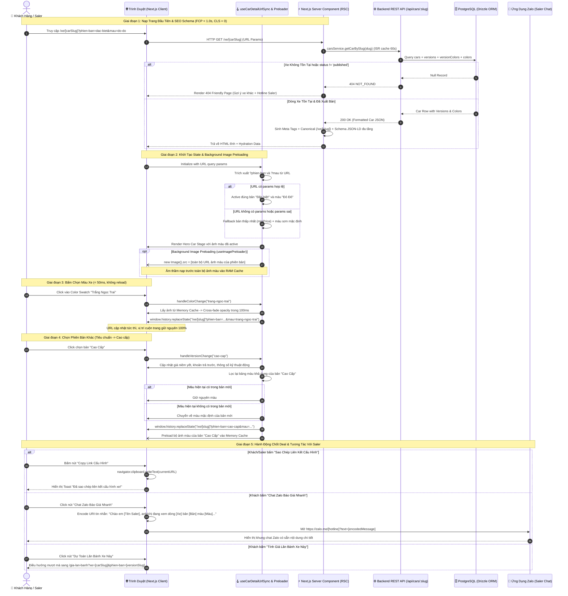
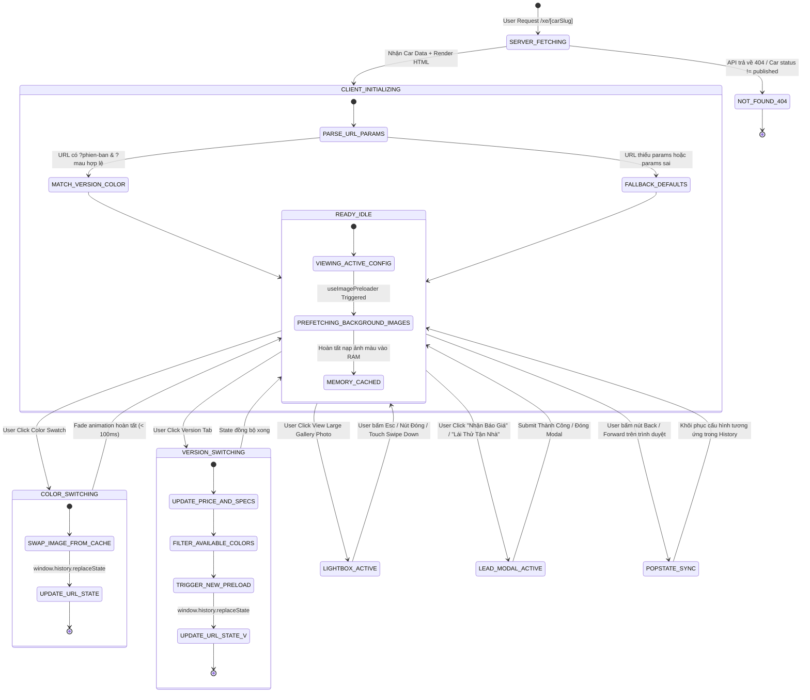

# 🔄 Technical Flow Specification: Trang Chi Tiết Dòng Xe Chuẩn Hóa & Đổi Màu Động (`/xe/[carSlug]`)

> **Mã Epic:** `EPIC-PHASE-4.4-CAR-DETAIL-EXPERIENCE`  
> **Giai đoạn:** Giai đoạn 2 — Bước 2.2: Thiết Kế Chi Tiết (Detailed Design Specification)  
> **Role phụ trách:** `logic-flow-ba`  
> **Phương án kiến trúc đã chốt:** **Option B (Modular Clean Architecture & Memory Preloader)**  
> **Định vị dự án:** Website Bán Hàng Cá Nhân Của Chuyên Viên Tư Vấn Ô Tô (Automotive Sales Consultant)

---

## 1. Sequence Diagram Đa Tầng (End-to-End Interaction Flow)

Sơ đồ tuần tự mô hình hóa toàn diện tương tác dữ liệu từ lúc người dùng mở trang xe (trực tiếp hoặc qua link chia sẻ Zalo của Saler), thực hiện tương tác đổi màu, chuyển phiên bản, đồng bộ URL 2 chiều, kích hoạt Lightbox ảnh, cho đến khi gửi yêu cầu báo giá hoặc chat Zalo với Saler:

---

## 2. Sơ Đồ Trạng Thái Thực Thể (State Machine Diagram)

Mô hình hóa toàn bộ vòng đời trạng thái của cỗ máy tương tác `CarDetailEngine` tại màn hình chi tiết xe:

---

## 3. Bảng Giải Phẫu Từng Bước (Step Anatomy Table)

Bảng giải phẫu chi tiết 8 bước tương tác cốt lõi trên trang xe chi tiết theo chuẩn 7 cột:

| Bước # | Tác nhân | Hành động | Payload Input | Logic Xử lý & Rules | Output & DB State | Failure Mode & Recovery |
| :---: | :--- | :--- | :--- | :--- | :--- | :--- |
| **1** | Web Crawler / Khách | Request Route `/xe/[carSlug]` | `carSlug: string`, `searchParams: URLSearchParams` | 1. Gọi `carsService.getCarBySlug(carSlug)` với ISR revalidate 60s. 2. Kiểm tra `car.status === 'published'`. 3. Sinh Canonical URL sạch không query params. 4. Sinh JSON-LD đa tầng. | HTML tĩnh chứa SEO Tags + Dữ liệu xe đầy đủ. Không ghi DB. | 404 Not Found nếu slug sai hoặc xe chưa xuất bản ➡️ Render Error State thân thiện gợi ý xe khác + Hotline. |
| **2** | Client Hook | Khởi tạo State ban đầu | Query Params: `phien-ban`, `mau` | 1. Duyệt tìm phiên bản khớp slug trong `car.versions`. 2. Nếu không có: chọn bản có `minPrice`. 3. Duyệt tìm màu khớp slug trong `version.colors`. 4. Nếu không có: chọn màu `isDefault = true` hoặc màu đầu tiên. | State ban đầu chuẩn xác được nạp vào View; không kích hoạt reload. | Params rác (`?mau=123xyz`) ➡️ Tự động fallback về cấu hình an toàn, không báo lỗi người dùng. |
| **3** | Background Engine | Preload ảnh các màu | `colors: VersionColor[]` | Duyệt mảng `colors`, với mỗi `anhXeTheoMauUrl` hợp lệ, khởi tạo `const img = new Image(); img.src = url;`. | Toàn bộ ảnh màu của phiên bản lưu trong Browser Memory Buffer. | Ảnh lỗi URL 404 ➡️ Bỏ qua ảnh hỏng, khi click màu sẽ fallback ảnh đại diện chính của xe. |
| **4** | Khách / Saler | Click chọn Color Swatch | `colorId: string` hoặc `colorSlug: string` | 1. Tìm thông tin màu trong `currentVersion.colors`. 2. Đặt `selectedColor = color`. 3. Chuyển ảnh góc lớn sang `anhXeTheoMauUrl` với hiệu ứng fade. 4. Gọi `window.history.replaceState` cập nhật `mau=[slug]`. | URL thanh địa chỉ cập nhật tức thì; Ảnh xe hiển thị đúng màu sơn thực tế. | Trình duyệt không hỗ trợ history API ➡️ Cập nhật state UI bình thường mà không ghi URL. |
| **5** | Khách / Saler | Click chọn Phiên Bản | `versionSlug: string` | 1. Tìm `newVersion` theo slug. 2. Cập nhật `selectedVersion = newVersion`. 3. Kiểm tra xem màu hiện tại có nằm trong bảng màu của `newVersion` không. Nếu không, chuyển sang màu mặc định của bản mới. 4. Cập nhật URL: `phien-ban=[slug]&mau=[colorSlug]`. 5. Kích hoạt preload ảnh của bản mới. | Bảng giá, số tiền trả trước, bảng thông số kỹ thuật tự động đổi theo phiên bản mới. | Phiên bản không có màu nào ➡️ Fallback hiển thị ảnh đại diện `anhDaiDienUrl` của phiên bản/xe. |
| **6** | Saler | Bấm "Sao chép liên kết cấu hình" | `window.location.href` | 1. Lấy full URL hiện tại. 2. Gọi `navigator.clipboard.writeText(url)`. 3. Kích hoạt thông báo Toast thành công: *"Đã sao chép liên kết xe [Tên Xe] bản [Tên Bản] màu [Màu]!"*. | URL trong clipboard sẵn sàng để Saler paste vào Zalo gửi cho khách. | Trình duyệt chặn clipboard API ➡️ Hiển thị prompt dialog chứa text URL để người dùng Ctrl+C thủ công. |
| **7** | Khách Hàng | Bấm "Chat Zalo Báo Giá Nhanh" | `hotline`, `carName`, `versionName`, `colorName` | 1. Soạn template tin nhắn tiếng Việt có dấu rõ ràng. 2. `encodeURIComponent(message)`. 3. Mở tab mới: `https://zalo.me/[hotline]?text=[encoded]`. | Ứng dụng Zalo được kích hoạt trên điện thoại/máy tính với tin nhắn soạn sẵn. | Thiết bị chưa cài Zalo ➡️ Mở Zalo Web hoặc hiển thị dialog số điện thoại trực tiếp để gọi. |
| **8** | Khách Hàng | Bấm "Dự Toán Lăn Bánh Xe Này" | `carSlug`, `versionSlug` | Chuyển hướng người dùng sang route: `/gia-lan-banh?xe=${carSlug}&phien-ban=${versionSlug}`. | Trang Dự toán mở ra với dropdown Dòng xe và Phiên bản được chọn sẵn 100%. | Không tìm thấy route ➡️ Fallback mở `LeadQuoteModal` nhận báo giá ngay tại chỗ. |

---

## 4. Cơ Chế Xử Lý Lỗi Biên (Edge Scenarios & Fail-Safe Protocol)

1. **Khách bấm nút Back/Forward của trình duyệt (Popstate Event):**
   * Hook `useCarDetailUrlSync` đăng ký listener `window.addEventListener('popstate', onPopState)`.
   * Khi người dùng bấm Quay lại, hàm tự động bóc tách URL hiện hành và khôi phục đúng phiên bản + màu sơn đã duyệt trước đó mà không gây gián đoạn luồng duyệt.
2. **Kịch bản mất mạng khi đang xem trang:**
   * Do toàn bộ dữ liệu xe và thông số đã được Server nạp sẵn (RSC Hydration) và ảnh màu đã được preload vào RAM, khách hàng vẫn có thể chuyển đổi phiên bản và đổi màu xe mượt mà ngay cả khi thiết bị mất kết nối internet tạm thời.
3. **Màn hình cực nhỏ (iPhone SE / 320px–375px):**
   * Thanh selector phiên bản và swatches màu tự động co giãn và cho phép vuốt ngang (horizontal touch scrollable) với chỉ thị thanh trượt mảnh, đảm bảo không bao giờ vỡ giao diện.
