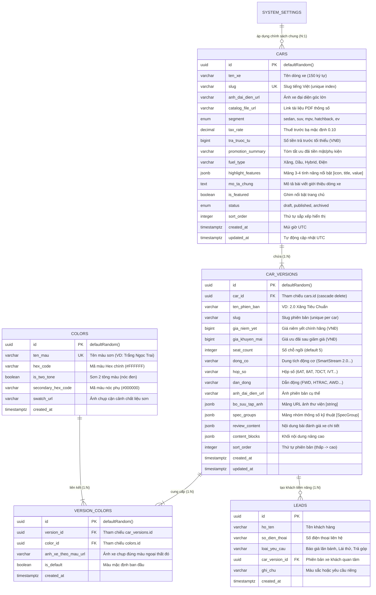

# 🗄️ Database Schema & Data Contract Specification: Trang Chi Tiết Dòng Xe (`/xe/[carSlug]`)

> **Mã Epic:** `EPIC-PHASE-4.4-CAR-DETAIL-EXPERIENCE`  
> **Giai đoạn:** Giai đoạn 2 — Bước 2.2: Thiết Kế Chi Tiết (Detailed Design Specification)  
> **Role phụ trách:** `db-schema-architect`  
> **Phương án kiến trúc đã chốt:** **Option B (Modular Clean Architecture & Memory Preloader)**  
> **Nguyên tắc môi trường:** Non-Destructive Additive Mode (Bảo tồn 100% database hiện hữu, tương thích ngược tuyệt đối)

---

## 1. Sơ Đồ Thực Thể Quan Hệ (Entity Relationship Diagram - ERD)



---

## 2. Đặc Tả Drizzle ORM Schema Hiện Hành (`packages/database`)

Các bảng CSDL đã được xây dựng chuẩn mực tại `packages/database/src/schema/`. Không cần chạy migration DDL thêm cột mới nào trong Phase 4.4, chỉ cần duy trì toàn vẹn dữ liệu:

```typescript
// packages/database/src/schema/cars.ts
export const cars = pgTable('cars', {
  id: uuid('id').defaultRandom().primaryKey(),
  tenXe: varchar('ten_xe', { length: 150 }).notNull(),
  slug: varchar('slug', { length: 150 }).notNull().unique(),
  anhDaiDienUrl: varchar('anh_dai_dien_url', { length: 500 }).notNull(),
  catalogFileUrl: varchar('catalog_file_url', { length: 500 }),
  segment: carSegmentEnum('segment').default('suv').notNull(),
  taxRate: decimal('tax_rate', { precision: 4, scale: 2 }).default('0.10').notNull(),
  traTruocTu: bigint('tra_truoc_tu', { mode: 'number' }),
  promotionSummary: varchar('promotion_summary', { length: 255 }),
  fuelType: varchar('fuel_type', { length: 50 }),
  highlightFeatures: jsonb('highlight_features').$type<HighlightFeature[]>(),
  moTaChung: text('mo_ta_chung'),
  isFeatured: boolean('is_featured').default(false).notNull(),
  status: carStatusEnum('status').default('draft').notNull(),
  sortOrder: integer('sort_order').default(0).notNull(),
  createdAt: timestamp('created_at', { withTimezone: true }).defaultNow().notNull(),
  updatedAt: timestamp('updated_at', { withTimezone: true }).defaultNow().notNull().$onUpdate(() => new Date()),
}, (table) => [
  index('cars_slug_idx').on(table.slug),
  index('cars_segment_status_idx').on(table.segment, table.status),
]);

// packages/database/src/schema/car_versions.ts
export const carVersions = pgTable('car_versions', {
  id: uuid('id').defaultRandom().primaryKey(),
  carId: uuid('car_id').notNull().references(() => cars.id, { onDelete: 'cascade' }),
  tenPhienBan: varchar('ten_phien_ban', { length: 150 }).notNull(),
  slug: varchar('slug', { length: 150 }).notNull(),
  giaNiemYet: bigint('gia_niem_yet', { mode: 'number' }).notNull(),
  giaKhuyenMai: bigint('gia_khuyen_mai', { mode: 'number' }),
  seatCount: integer('seat_count').default(5).notNull(),
  dongCo: varchar('dong_co', { length: 100 }),
  hopSo: varchar('hop_so', { length: 100 }),
  danDong: varchar('dan_dong', { length: 100 }),
  anhDaiDienUrl: varchar('anh_dai_dien_url', { length: 500 }),
  boSuuTapAnh: jsonb('bo_suu_tap_anh').$type<string[]>().default([]),
  specGroups: jsonb('spec_groups').$type<SpecGroup[]>().default([]),
  reviewContent: jsonb('review_content'),
  contentBlocks: jsonb('content_blocks'),
  sortOrder: integer('sort_order').default(0).notNull(),
  createdAt: timestamp('created_at', { withTimezone: true }).defaultNow().notNull(),
  updatedAt: timestamp('updated_at', { withTimezone: true }).defaultNow().notNull().$onUpdate(() => new Date()),
}, (table) => [
  index('car_versions_car_id_idx').on(table.carId),
  uniqueIndex('car_versions_car_slug_idx').on(table.carId, table.slug),
]);

// packages/database/src/schema/colors.ts
export const versionColors = pgTable('version_colors', {
  id: uuid('id').defaultRandom().primaryKey(),
  versionId: uuid('version_id').notNull().references(() => carVersions.id, { onDelete: 'cascade' }),
  colorId: uuid('color_id').notNull().references(() => colors.id, { onDelete: 'cascade' }),
  anhXeTheoMauUrl: varchar('anh_xe_theo_mau_url', { length: 500 }),
  isDefault: boolean('is_default').default(false).notNull(),
  createdAt: timestamp('created_at', { withTimezone: true }).defaultNow().notNull(),
}, (table) => [
  uniqueIndex('unique_version_color_idx').on(table.versionId, table.colorId),
  index('version_colors_version_id_idx').on(table.versionId),
]);
```

---

## 3. Đặc Tả DTO Data Contracts & Zod Schemas (`packages/types`)

Hợp đồng dữ liệu trao đổi giữa Backend API và Frontend Client được chuẩn hóa 100% bằng Zod:

```typescript
// packages/types/src/car.ts
import { z } from 'zod';

export const SpecItemSchema = z.object({
  label: z.string(),
  value: z.string(),
});
export type SpecItem = z.infer<typeof SpecItemSchema>;

export const SpecGroupSchema = z.object({
  groupName: z.string(),
  specs: z.array(SpecItemSchema),
});
export type SpecGroup = z.infer<typeof SpecGroupSchema>;

export const VersionColorSchema = z.object({
  colorId: z.string(),
  tenMau: z.string(),
  slug: z.string(), // Slug tiếng Việt không dấu (VD: "trang-ngoc-trai", "do-man")
  hexCode: z.string(),
  isTwoTone: z.boolean().default(false),
  secondaryHexCode: z.string().optional().nullable(),
  anhXeTheoMauUrl: z.string().optional().nullable(),
  isDefault: z.boolean().default(false),
});
export type VersionColor = z.infer<typeof VersionColorSchema>;

export const CarDetailVersionSchema = z.object({
  id: z.string(),
  carId: z.string(),
  tenPhienBan: z.string(),
  slug: z.string(),
  giaNiemYet: z.number().positive(),
  giaKhuyenMai: z.number().positive().optional().nullable(),
  seatCount: z.number().default(5),
  dongCo: z.string().optional().nullable(),
  hopSo: z.string().optional().nullable(),
  danDong: z.string().optional().nullable(),
  anhDaiDienUrl: z.string().optional().nullable(),
  boSuuTapAnh: z.array(z.string()).default([]),
  specGroups: z.array(SpecGroupSchema).default([]),
  reviewContent: z.unknown().optional().nullable(),
  contentBlocks: z.unknown().optional().nullable(),
  sortOrder: z.number().default(0),
  colors: z.array(VersionColorSchema).default([]),
});
export type CarDetailVersion = z.infer<typeof CarDetailVersionSchema>;

export const CarDetailSchema = z.object({
  id: z.string(),
  tenXe: z.string(),
  slug: z.string(),
  anhDaiDienUrl: z.string(),
  catalogFileUrl: z.string().optional().nullable(),
  segment: z.enum(['sedan', 'suv', 'mpv', 'hatchback', 'ev']),
  taxRate: z.coerce.number().default(0.1),
  traTruocTu: z.number().optional().nullable(),
  promotionSummary: z.string().optional().nullable(),
  fuelType: z.string().optional().nullable(),
  highlightFeatures: z.array(z.object({
    icon: z.string(),
    title: z.string(),
    value: z.string(),
  })).default([]),
  moTaChung: z.string().optional().nullable(),
  isFeatured: z.boolean().default(false),
  status: z.enum(['draft', 'published', 'archived']).default('published'),
  sortOrder: z.number().default(0),
  minPrice: z.number(),
  maxPrice: z.number(),
  versions: z.array(CarDetailVersionSchema).default([]),
});
export type CarDetail = z.infer<typeof CarDetailSchema>;
```

---

## 4. Ma Trận Chuyển Trạng Thái Thực Thể (State Transition Matrix)

### 4.1. Vòng Đời Xuất Bản Xe (Car Publishing Lifecycle)
| Trạng thái Hiện tại | Trạng thái Kế tiếp Hợp lệ | Sự kiện / Trigger | Quyền Hạn | Tác Động Storefront (`/xe/[carSlug]`) |
| :--- | :--- | :--- | :--- | :--- |
| `draft` | `published` | Admin bấm "Xuất bản dòng xe" | Admin, Manager | Xe bắt đầu xuất hiện công khai trên web, Googlebot được phép lập chỉ mục |
| `published` | `draft` | Admin bấm "Gỡ về bản nháp" | Admin, Manager | Trang `/xe/[slug]` lập tức trả về 404, loại khỏi sitemap và SEO index |
| `published` | `archived` | Dòng xe ngừng sản xuất / kinh doanh | Admin | Chuyển trạng thái lưu trữ nội bộ, không hiển thị trên danh mục bán hàng |

### 4.2. Ma Trận Tương Tác State Client Engine (`CarDetailInteractive`)
| State Hiện Tại | Action / Event | State Tiếp Theo | Điều Kiện Ràng Buộc (Guard Condition) |
| :--- | :--- | :--- | :--- |
| `DEFAULT_VIEW` | Click Color Swatch | `COLOR_UPDATED` | Màu thuộc danh sách màu khả dụng của phiên bản hiện tại |
| `DEFAULT_VIEW` | Click Version Tab | `VERSION_UPDATED` | Phiên bản khác với phiên bản đang chọn |
| `VERSION_UPDATED` | Auto-detect Color | `COLOR_SYNCED` | Nếu màu cũ không có trong bản mới ➡️ lấy `isDefault` |
| Bất kỳ | Click Thumbnail Ảnh | `LIGHTBOX_OPEN` | URL ảnh hợp lệ, modal mount vào DOM |
| `LIGHTBOX_OPEN` | Nhấn phím Escape / Nút Đóng | `DEFAULT_VIEW` | Unmount modal, trả lại quyền cuộn trang (`overflow: auto`) |
| Bất kỳ | Click "Nhận Báo Giá" / "Lái Thử" | `LEAD_MODAL_OPEN` | Truyền `carSlug`, `versionSlug`, `colorName` vào Modal context |

---

## 5. Chính Sách Database Không Gián Đoạn (Zero-Downtime Migration Policy)
* **Trạng thái:** Toàn bộ bảng Drizzle ORM (`cars`, `car_versions`, `colors`, `version_colors`) đã tồn tại trên PostgreSQL.
* **Quy tắc an toàn:**
  * ❌ Tuyệt đối **KHÔNG chạy lệnh DDL DROP COLUMN hay RENAME COLUMN**.
  * ❌ Không thay đổi kiểu dữ liệu của các cột `gia_niem_yet`, `gia_khuyen_mai`.
  * ✅ **Non-Destructive Additive Mode:** Chỉ chuyển đổi và định dạng lại mảng `versionColors` lồng nhau thành `colors` phẳng ở tầng Service Backend trước khi trả về JSON cho Web, đảm bảo tương thích ngược 100% cho Admin Portal và Web Client.
