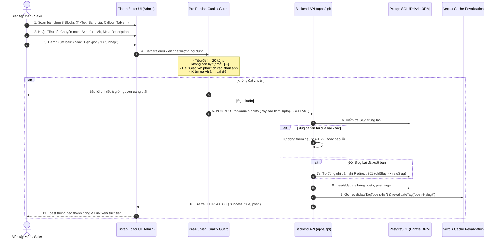
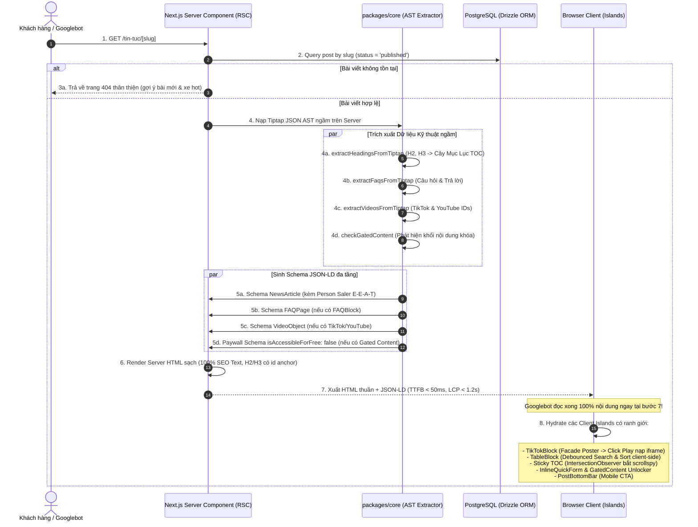
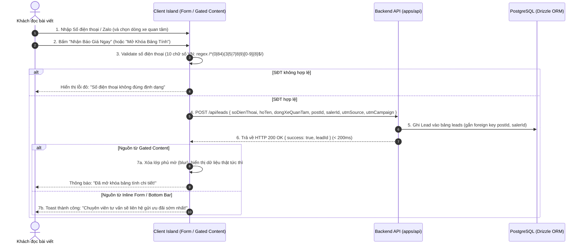
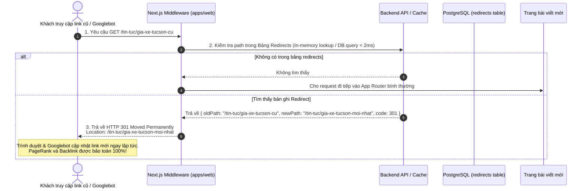
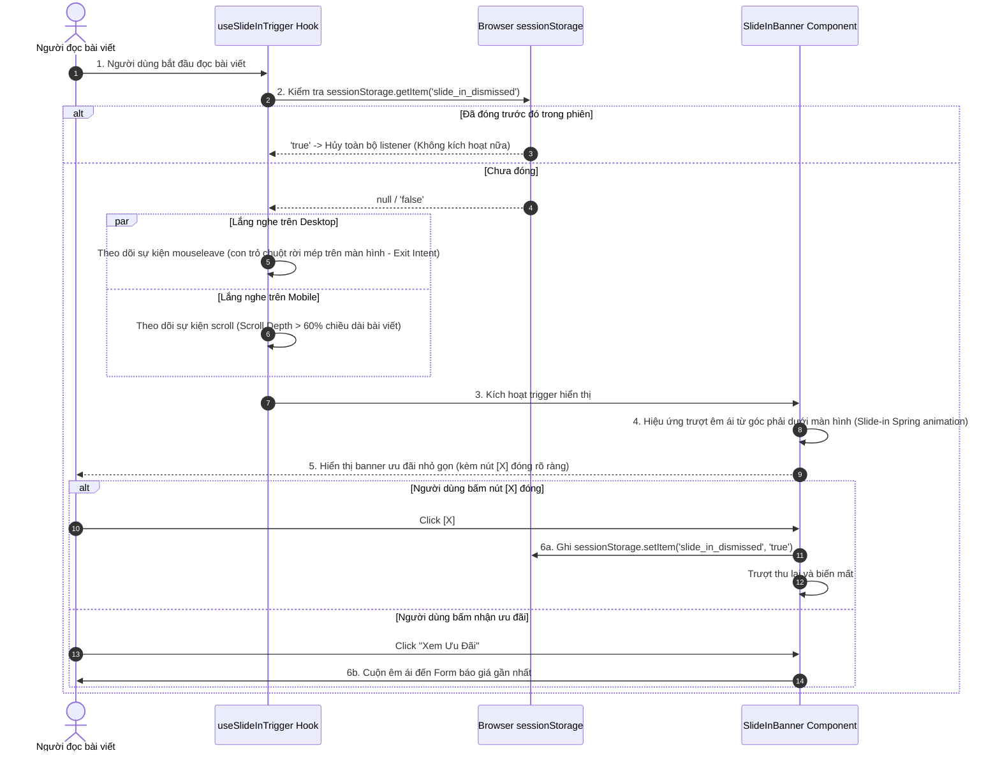

# 🔄 Detailed Logic & Sequence Flows: Hệ Thống Tin Tức, Content Blocks & Inbound Marketing (Tiptap Engine)

> **Mã Epic:** `EPIC-PHASE-5-CONTENT-TIPTAP-INBOUND`  
> **Giai đoạn:** Giai đoạn 2 — Bước 2.2 (Gate 2: Thiết Kế Kiến Trúc Chi Tiết)  
> **Role phụ trách:** `logic-flow-ba`  
> **Tài liệu tham chiếu:** [`BACKLOG.md`](./BACKLOG.md), [`SOLUTION_OPTIONS.md`](./SOLUTION_OPTIONS.md), [`docs/SYSTEM_MAP.md`](../../SYSTEM_MAP.md)  
> **Trạng thái Môi trường:** 🟢 Pure Development  

---

## 1. Sơ Đồ Tuần Tự Biên Tập & Xuất Bản Bài Viết (Admin Editorial Flow)

Quy trình biên tập nội dung trên Admin Portal sử dụng **Tiptap Editor (`@tiptap/react`)** với các React Component NodeViews:

---

## 2. Sơ Đồ Tuần Tự Server-First Storefront Rendering (RSC & SEO Engine)

Luồng kết xuất trang chi tiết bài viết `/tin-tuc/[slug]` trên `apps/web` bằng **Next.js Server Component (RSC)** kết hợp bộ bóc tách Tiptap AST tại `packages/core`:

---

## 3. Sơ Đồ Tuần Tự Thu Thập Inbound Lead & Mở Khóa Gated Content

Luồng tiếp nhận khách hàng điền số điện thoại nhận báo giá hoặc mở khóa bảng tính ưu đãi lăn bánh:

---

## 4. Sơ Đồ Tuần Tự Động Cơ 301 Redirect Engine (Bảo Toàn PageRank)

Quy trình tự động hóa chuyển hướng khi biên tập viên thay đổi đường dẫn URL bài viết:

---

## 5. Sơ Đồ Tuần Tự Kích Hoạt Slide-in Banner (Popup Trượt Góc Tinh Tế)

Cơ chế kích hoạt thông minh không làm phiền người đọc:

