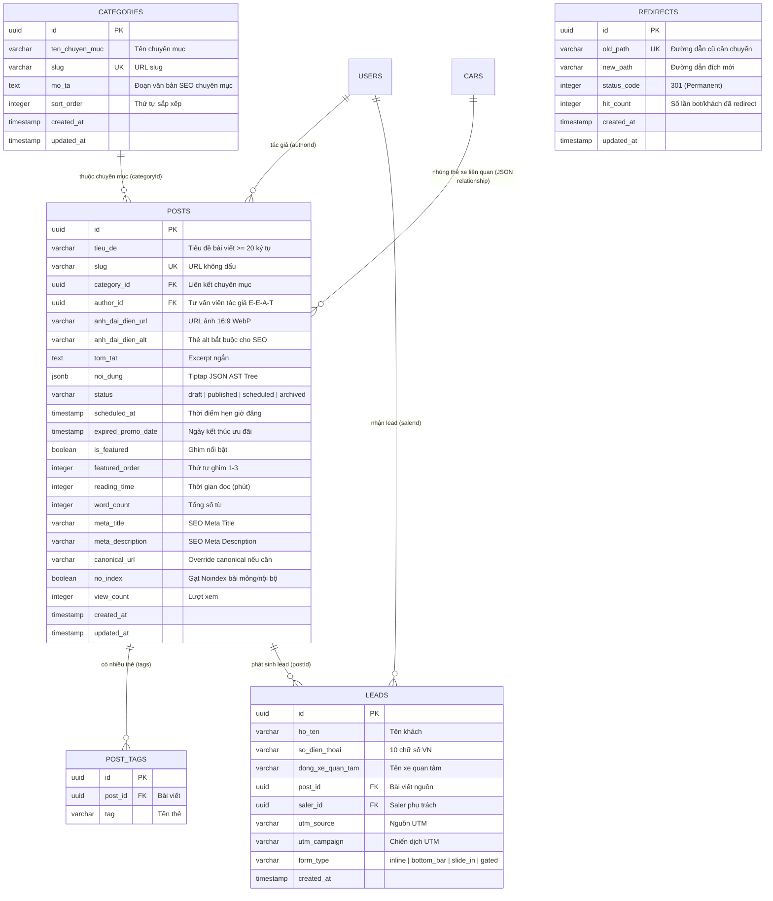

# 🗄️ Database & Data Contracts Specification: Hệ Thống Tin Tức & Inbound Marketing (Tiptap Engine)

> **Mã Epic:** `EPIC-PHASE-5-CONTENT-TIPTAP-INBOUND`  
> **Giai đoạn:** Giai đoạn 2 — Bước 2.2 (Gate 2: Thiết Kế Kiến Trúc Chi Tiết)  
> **Role phụ trách:** `db-schema-architect`  
> **Tài liệu tham chiếu:** [`BACKLOG.md`](./BACKLOG.md), [`SOLUTION_OPTIONS.md`](./SOLUTION_OPTIONS.md), [`packages/database/src/schema/`](../../../packages/database/src/schema/)  
> **Trạng thái Môi trường:** 🟢 Pure Development  

---

## 1. Sơ Đồ Quan Hệ Thực Thể (Entity Relationship Diagram - ERD)



---

## 2. Đặc Tả Drizzle ORM Schema (`packages/database`)

### 2.1. Bảng Chuyên Mục (`packages/database/src/schema/categories.ts`)
```typescript
import { pgTable, uuid, varchar, text, integer, timestamp, index } from 'drizzle-orm/pg-core';

export const categories = pgTable('categories', {
  id: uuid('id').defaultRandom().primaryKey(),
  tenChuyenMuc: varchar('ten_chuyen_muc', { length: 150 }).notNull(),
  slug: varchar('slug', { length: 150 }).notNull().unique(),
  moTa: text('mo_ta'), // Văn bản giàu từ khóa xuất hiện ở đầu trang danh mục
  sortOrder: integer('sort_order').default(0).notNull(),
  createdAt: timestamp('created_at', { withTimezone: true }).defaultNow().notNull(),
  updatedAt: timestamp('updated_at', { withTimezone: true }).defaultNow().notNull().$onUpdate(() => new Date()),
}, (table) => [
  index('categories_slug_idx').on(table.slug),
  index('categories_sort_idx').on(table.sortOrder),
]);

export type CategoryRow = typeof categories.$inferSelect;
export type NewCategoryRow = typeof categories.$inferInsert;
```

### 2.2. Bảng Bài Viết (`packages/database/src/schema/posts.ts`)
```typescript
import { pgTable, uuid, varchar, text, integer, boolean, timestamp, jsonb, pgEnum, index } from 'drizzle-orm/pg-core';
import { categories } from './categories';
import { users } from './users';

export const postStatusEnum = pgEnum('post_status', ['draft', 'published', 'scheduled', 'archived']);

export const posts = pgTable('posts', {
  id: uuid('id').defaultRandom().primaryKey(),
  tieuDe: varchar('tieu_de', { length: 255 }).notNull(),
  slug: varchar('slug', { length: 255 }).notNull().unique(),
  categoryId: uuid('category_id').notNull().references(() => categories.id, { onDelete: 'restrict' }),
  authorId: uuid('author_id').references(() => users.id, { onDelete: 'set null' }),
  anhDaiDienUrl: varchar('anh_dai_dien_url', { length: 500 }).notNull(),
  anhDaiDienAlt: varchar('anh_dai_dien_alt', { length: 255 }).notNull(),
  tomTat: text('tom_tat'),
  noiDung: jsonb('noi_dung').notNull(), // Tiptap JSON AST Tree
  status: postStatusEnum('status').default('draft').notNull(),
  scheduledAt: timestamp('scheduled_at', { withTimezone: true }),
  expiredPromoDate: timestamp('expired_promo_date', { withTimezone: true }), // Ngày hết hạn khuyến mãi
  isFeatured: boolean('is_featured').default(false).notNull(),
  featuredOrder: integer('featured_order').default(0).notNull(), // 1, 2, 3
  readingTime: integer('reading_time').default(1).notNull(), // Phút đọc
  wordCount: integer('word_count').default(0).notNull(),
  metaTitle: varchar('meta_title', { length: 255 }),
  metaDescription: varchar('meta_description', { length: 500 }),
  canonicalUrl: varchar('canonical_url', { length: 500 }),
  noIndex: boolean('no_index').default(false).notNull(),
  previewToken: varchar('preview_token', { length: 64 }), // Token xem trước bí mật
  viewCount: integer('view_count').default(0).notNull(),
  createdAt: timestamp('created_at', { withTimezone: true }).defaultNow().notNull(),
  updatedAt: timestamp('updated_at', { withTimezone: true }).defaultNow().notNull().$onUpdate(() => new Date()),
}, (table) => [
  index('posts_slug_idx').on(table.slug),
  index('posts_status_scheduled_idx').on(table.status, table.scheduledAt),
  index('posts_category_status_idx').on(table.categoryId, table.status),
  index('posts_featured_idx').on(table.isFeatured, table.featuredOrder),
  index('posts_author_idx').on(table.authorId),
]);

export type PostRow = typeof posts.$inferSelect;
export type NewPostRow = typeof posts.$inferInsert;
```

### 2.3. Bảng Redirects 301 (`packages/database/src/schema/redirects.ts`)
```typescript
import { pgTable, uuid, varchar, integer, timestamp, uniqueIndex } from 'drizzle-orm/pg-core';

export const redirects = pgTable('redirects', {
  id: uuid('id').defaultRandom().primaryKey(),
  oldPath: varchar('old_path', { length: 500 }).notNull(),
  newPath: varchar('new_path', { length: 500 }).notNull(),
  statusCode: integer('status_code').default(301).notNull(),
  hitCount: integer('hit_count').default(0).notNull(),
  createdAt: timestamp('created_at', { withTimezone: true }).defaultNow().notNull(),
  updatedAt: timestamp('updated_at', { withTimezone: true }).defaultNow().notNull().$onUpdate(() => new Date()),
}, (table) => [
  uniqueIndex('redirects_old_path_uidx').on(table.oldPath),
]);

export type RedirectRow = typeof redirects.$inferSelect;
export type NewRedirectRow = typeof redirects.$inferInsert;
```

### 2.4. Mở Rộng Bảng Leads (`packages/database/src/schema/leads.ts`)
Bổ sung các trường liên kết nguồn bài viết và marketing:
* `postId`: `uuid('post_id').references(() => posts.id, { onDelete: 'set null' })`
* `salerId`: `uuid('saler_id').references(() => users.id, { onDelete: 'set null' })`
* `formType`: `varchar('form_type', { length: 50 }).default('inline')` (`inline`, `bottom_bar`, `slide_in`, `gated`)
* `utmSource`: `varchar('utm_source', { length: 100 })`
* `utmCampaign`: `varchar('utm_campaign', { length: 100 })`

---

## 3. Hợp Đồng Dữ Liệu Zod Schemas (`packages/types`)

Định nghĩa kiểu dữ liệu chặt chẽ cho 8 Blocks Tinh Hoa và Inbound Forms tại `packages/types/src/content-blocks.ts`:

### 3.1. Schemas Cho 8 Content Blocks Tinh Hoa
```typescript
import { z } from 'zod';

// 1. CalloutBlock
export const CalloutBlockAttrsSchema = z.object({
  type: z.enum(['info', 'warning', 'success', 'note']).default('info'),
  title: z.string().optional().nullable(),
  content: z.string().min(1, 'Nội dung ghi chú không được để trống'),
});
export type CalloutBlockAttrs = z.infer<typeof CalloutBlockAttrsSchema>;

// 2. FeatureGridBlock
export const FeatureItemSchema = z.object({
  title: z.string().min(1),
  description: z.string().optional().nullable(),
  imageUrl: z.string().url().optional().nullable(),
});
export const FeatureGridBlockAttrsSchema = z.object({
  columns: z.enum(['2', '3', '4']).default('3'),
  features: z.array(FeatureItemSchema).min(1, 'Cần ít nhất 1 tính năng'),
});
export type FeatureGridBlockAttrs = z.infer<typeof FeatureGridBlockAttrsSchema>;

// 3. TableBlock (Thông minh: Có toggle Search & Export)
export const TableCellSchema = z.object({
  content: z.string(),
  isHeader: z.boolean().default(false),
});
export const TableRowSchema = z.object({
  cells: z.array(TableCellSchema),
});
export const TableBlockAttrsSchema = z.object({
  caption: z.string().optional().nullable(),
  enableSearch: z.boolean().default(false),
  enableExport: z.boolean().default(false),
  rows: z.array(TableRowSchema).min(1),
});
export type TableBlockAttrs = z.infer<typeof TableBlockAttrsSchema>;

// 4. RelatedCarBlock
export const RelatedCarBlockAttrsSchema = z.object({
  carId: z.string().uuid(),
  carSlug: z.string(),
  tenXe: z.string(),
  anhDaiDienUrl: z.string().url(),
  giaNiemYetTu: z.number().nonnegative(),
  seatCount: z.number().default(5),
  fuelType: z.string().optional().nullable(),
});
export type RelatedCarBlockAttrs = z.infer<typeof RelatedCarBlockAttrsSchema>;

// 5. PriceTableBlock
export const PriceTableBlockAttrsSchema = z.object({
  carId: z.string().uuid(),
  headline: z.string().optional().nullable(),
  showNote: z.boolean().default(true),
});
export type PriceTableBlockAttrs = z.infer<typeof PriceTableBlockAttrsSchema>;

// 6. YoutubeBlock
export const YoutubeBlockAttrsSchema = z.object({
  videoUrl: z.string().url('URL video không hợp lệ'),
  videoId: z.string().min(1, 'Không trích xuất được video ID'),
  caption: z.string().optional().nullable(),
});
export type YoutubeBlockAttrs = z.infer<typeof YoutubeBlockAttrsSchema>;

// 7. TikTokBlock (Facade & Autoplay & No Scrollbar)
export const TikTokBlockAttrsSchema = z.object({
  videoUrl: z.string().url('URL TikTok không hợp lệ'),
  videoId: z.string().min(1),
  title: z.string().min(1, 'Tiêu đề video bắt buộc cho SEO'),
  posterImageUrl: z.string().url('Ảnh bìa video bắt buộc để tối ưu tốc độ'),
});
export type TikTokBlockAttrs = z.infer<typeof TikTokBlockAttrsSchema>;

// 8. GalleryBlock
export const GalleryImageSchema = z.object({
  url: z.string().url(),
  alt: z.string().default('Hình ảnh xe Hyundai'),
  caption: z.string().optional().nullable(),
});
export const GalleryBlockAttrsSchema = z.object({
  style: z.enum(['grid', 'slider']).default('slider'),
  images: z.array(GalleryImageSchema).min(1, 'Cần ít nhất 1 ảnh trong thư viện'),
});
export type GalleryBlockAttrs = z.infer<typeof GalleryBlockAttrsSchema>;

// * FAQBlock
export const FAQQuestionSchema = z.object({
  question: z.string().min(1, 'Câu hỏi không được để trống'),
  answer: z.string().min(1, 'Câu trả lời không được để trống'),
});
export const FAQBlockAttrsSchema = z.object({
  title: z.string().default('Câu hỏi thường gặp'),
  questions: z.array(FAQQuestionSchema).min(1, 'Cần ít nhất 1 câu hỏi'),
});
export type FAQBlockAttrs = z.infer<typeof FAQBlockAttrsSchema>;
```

### 3.2. Schemas Cho Khối Inbound Lead
```typescript
export const InlineQuickFormAttrsSchema = z.object({
  headline: z.string().default('Nhận Ưu Đãi & Báo Giá Lăn Bánh'),
  buttonText: z.string().default('Nhận Báo Giá Ngay'),
  carSlug: z.string().optional().nullable(),
});

export const GatedContentAttrsSchema = z.object({
  rewardTitle: z.string().default('Bảng Dự Toán Chi Phí Lăn Bánh Chi Tiết Từng Huyện'),
  gatedHtml: z.string().min(1, 'Nội dung khóa không được để trống'),
});
```

---

## 4. Đặc Tả DTOs Quản Lý Bài Viết (`packages/types/src/post.ts`)

```typescript
export const CreatePostInputSchema = z.object({
  tieuDe: z.string().min(20, 'Tiêu đề bài viết phải có ít nhất 20 ký tự').max(255),
  slug: z.string().min(3).max(255),
  categoryId: z.string().uuid('Chuyên mục bắt buộc'),
  authorId: z.string().uuid().optional().nullable(),
  anhDaiDienUrl: z.string().url('Ảnh đại diện bắt buộc'),
  anhDaiDienAlt: z.string().min(5, 'Thẻ Alt ảnh đại diện bắt buộc cho SEO'),
  tomTat: z.string().max(500).optional().nullable(),
  noiDung: z.record(z.unknown()), // Tiptap JSON Tree
  status: z.enum(['draft', 'published', 'scheduled', 'archived']).default('draft'),
  scheduledAt: z.string().datetime().optional().nullable(),
  expiredPromoDate: z.string().datetime().optional().nullable(),
  isFeatured: z.boolean().default(false),
  featuredOrder: z.number().int().min(0).max(3).default(0),
  metaTitle: z.string().max(255).optional().nullable(),
  metaDescription: z.string().max(500).optional().nullable(),
  canonicalUrl: z.string().url().optional().nullable(),
  noIndex: z.boolean().default(false),
});

export type CreatePostInput = z.infer<typeof CreatePostInputSchema>;
```
