# 🏛️ Architectural Solution Options: Hệ Thống Tin Tức, Content Blocks & Inbound Marketing (Hyundai Vinh)

> **Mã Epic:** `EPIC-PHASE-5-CONTENT-BLOCKS-INBOUND`  
> **Giai đoạn:** Giai đoạn 2 — Bước 2.1 (Sub-Gate 2.1: Phân Tích & Đề Xuất Phương Án Kiến Trúc)  
> **Role phụ trách:** `system-analyst-architect`  
> **Tài liệu tham chiếu:** [`BACKLOG.md`](./BACKLOG.md), [`docs/SYSTEM_MAP.md`](../../SYSTEM_MAP.md), [`docs/03-HE-THONG-CONTENT-BLOCKS-LEXICAL.md`](../../03-HE-THONG-CONTENT-BLOCKS-LEXICAL.md), [`docs/05-TECHNICAL-SEO-VA-SCHEMA-JSONLD.md`](../../05-TECHNICAL-SEO-VA-SCHEMA-JSONLD.md)  
> **Trạng thái Môi trường:** 🟢 Pure Development (Local/Staging Monorepo)  

---

## 1. Bối Cảnh & Ràng Buộc Kỹ Thuật (Technical Constraints)

1. **Phạm Vi Nền Tảng Monorepo:** Full-stack (`packages/database`, `packages/types`, `packages/core`, `apps/api`, `apps/admin`, `apps/web`, `packages/ui`).
2. **Hiện Trạng Hệ Thống (Tham chiếu `docs/SYSTEM_MAP.md`):**
   * Đã hoàn tất Phase 1 (Catalog Data, Cars, Versions, Colors, Global Settings), Phase 3 (Pricing Engine tính phí lăn bánh & trả góp) và Phase 4.1 – 4.4 (Trang chủ, Bộ lọc xe, Chi tiết dòng xe `/xe/[slug]`).
   * Phân hệ Content & Lexical (Phase 5) cần thiết lập nền tảng xuất bản bài viết tin tức, cẩm nang lăn bánh, đánh giá chuyên sâu và phễu Inbound Lead Marketing chuyển đổi cao.
3. **Ràng Buộc Kỹ Thuật & Nghiệp Vụ Cốt Lõi:**
   * **Hiệu Năng & Trải Nghiệm Đọc Báo:** Trang chi tiết bài viết phải tải siêu tốc (LCP ≤ 2.5s, CLS ≤ 0.1, TTFB < 100ms). Nhúng video TikTok và YouTube không được kéo tụt điểm PageSpeed LCP/TBT.
   * **Tối Ưu Chuyển Đổi Lead (CRO Tinh Gọn):** Điểm chạm thu thập SĐT/Zalo thiết kế tối giản, loại bỏ các rào cản checkbox phức tạp, form điền 1 chạm chuyển đổi tối đa khách hàng tiềm năng.
   * **Technical SEO & Phòng Chống Phạt Thuật Toán:**
     - Paywall Schema `isAccessibleForFree: false` cho `Gated Content` để chống lỗi Google Cloaking penalty.
     - Schema đa tầng tự động hóa: `NewsArticle`, `AutoDealer`, `BreadcrumbList`, `FAQPage`, `VideoObject`.
     - Động cơ 301 Redirect tự động khi biên tập viên đổi Slug bài viết đã xuất bản để bảo toàn 100% PageRank.
   * **Kiến Trúc Tinh Gọn (Lean & Agile):**
     - Sử dụng **Tiptap Editor (`@tiptap/react`)** mã nguồn mở (MIT), NodeViews linh hoạt, tương thích hoàn hảo Next.js 16 + React 19.
     - Tạm thời chưa triển khai phân quyền đa tầng phức tạp (RBAC). Mọi tài khoản Admin đều có quyền biên tập, xuất bản, hẹn giờ, ghim bài.
     - Tinh giản còn **8 Blocks Tinh Hoa + 3 Điểm Chạm Inbound Lead**.
     - Tạm thời bỏ qua dịch vụ bắn thông báo tức thì qua Telegram/Email bên thứ ba. Lead được lưu an toàn vào DB và quản trị tập trung tại Admin Portal.

---

## 2. Ma Trận So Sánh Các Phương Án Kiến Trúc (Trade-off Matrix)

| Tiêu Chí Đánh Giá | Option A: Naive Direct Embed & Monolithic HTML (MVP Cực Đơn Giản) | Option B: Modular Server-First RSC Architecture & Lean Blocks Engine (ĐỀ XUẤT CHỌN) | Option C: Microservices / External Headless CMS & Real-time Webhooks (High-Scale / Overkill) |
| :--- | :--- | :--- | :--- |
| **Mô Hình Kiến Trúc** | Lưu chuỗi HTML thô (RichText HTML string). Nhúng trực tiếp iframe TikTok/YouTube bằng thẻ `<iframe>` cứng. | **Server-First RSC + Reactive Client Islands:** Lưu trữ Tiptap JSON AST trong JSONB, bộ bóc tách AST tại `packages/core`, 8 UI Blocks tinh hoa độc lập, Client Islands có ranh giới rõ ràng. | Tách riêng Microservice CMS độc lập (Strapi/Sanity/Payload container riêng), kết nối qua GraphQL/REST, đồng bộ dữ liệu qua Event Bus (RabbitMQ/Kafka). |
| **Hiệu Năng & Core Web Vitals** | **Kém:** Iframe TikTok và YouTube nạp ngay khi tải trang kéo tụt điểm LCP (> 4.5s), gây giật màn hình (CLS > 0.25). | **Tối ưu tuyệt đối:** Cơ chế **Facade Pattern** (tải ảnh bìa poster trước, chỉ nạp iframe khi bấm Play); khung tỉ lệ cố định `aspect-[9/16]` và `aspect-video` (CLS = 0). | Khá, nhưng độ trễ tăng do phải gọi API qua mạng giữa Next.js Server và Service CMS ngoài. |
| **SEO & Phòng Chống Phạt Thuật Toán** | **Rủi ro cao:** Nguy cơ bị Google phạt Cloaking do ẩn/hiện nội dung thủ công mà không có Paywall Schema; không có tự động sinh schema JSON-LD; đổi slug gây lỗi 404 mất link SEO. | **Chuẩn mực Google 2026:** Tự động sinh Paywall Schema `isAccessibleForFree: false`, `NewsArticle`, `AutoDealer`, `FAQPage`, `VideoObject`; 301 Redirect Engine tự động lưu vết chống mất PageRank. | Tương đương Option B, nhưng cấu hình schema phức tạp hơn do phải đồng bộ dữ liệu qua nhiều tầng API. |
| **Trải Nghiệm Bảng & Dữ Liệu** | Bảng HTML tĩnh đơn giản, vỡ layout trên mobile, không có tìm kiếm hay sắp xếp. | **`TableBlock` Thông Minh:** Tự cuộn ngang mượt mà trên mobile, toggle Live Search debounced (200ms) và xuất file CSV tiếng Việt UTF-8 BOM. | Sử dụng Elasticsearch riêng biệt cho bảng biểu, quá cồng kềnh cho nhu cầu bảng thông số xe. |
| **Tối Ưu Chuyển Đổi Lead (CRO)** | Form HTML sơ sài, tỷ lệ bỏ rơi cao, không theo dõi nguồn gốc bài viết. | **Tối ưu chuyển đổi vượt trội (CRO 1 chạm):** Form gọn nhẹ (SĐT/Zalo + Tên), không rào cản checkbox phiền toái, tự động gắn `postId`, `salerId`, `utmSource`. | Tương tự Option B nhưng qua nhiều tầng API trung gian. |
| **Tốc Độ Tải Trang & Caching** | Server-side rendering (SSR) mỗi request hoặc Client-side rendering (CSR) chậm chạp. | **Next.js ISR Caching:** Cache HTML tĩnh với `revalidate: 3600` (1 giờ) + On-demand Tag Revalidation khi Admin bấm Publish/Sửa bài (`revalidateTag`). TTFB < 50ms! | Cache phân tán qua Redis và CDN, chi phí vận hành hạ tầng cao. |
| **Độ Phức Tạp & Khả Năng Mở Rộng** | Thấp nhất, nhưng nhanh chóng trở thành nợ kỹ thuật (Tech Debt) lớn khi cần mở rộng SEO và Inbound Lead. | **Cân bằng hoàn hảo:** Tận dụng 100% sức mạnh Drizzle ORM, Zod type-safe, Tailwind tokens và kiến trúc Monorepo hiện có. Dễ bảo trì và mở rộng lâu dài. | Rất cao, đòi hỏi cấu hình Docker đa container, CI/CD phức tạp, chi phí server tăng gấp 3–4 lần. |
| **Thời Gian Triển Khai** | ~1–2 ngày | **~3–4 ngày (Chuẩn Enterprise Monorepo, Bền vững & Thực dụng)** | ~2–3 tuần |

---

## 3. Phân Tích Chi Tiết Từng Phương Án Kiến Trúc

### 🅰️ Option A: Naive Direct Embed & Monolithic HTML (MVP Cực Đơn Giản)
* **Mô tả giải pháp:** 
  - Bài viết được lưu dưới dạng chuỗi HTML thuần (`content: text`). Trình soạn thảo trong Admin là một WYSIWYG editor cơ bản (TinyMCE hoặc CKEditor).
  - Khối TikTok và YouTube được nhúng thô bằng mã iframe copy-paste. Bảng biểu là thẻ `<table>` tĩnh.
  - Form thu thập lead là form HTML đơn giản, không có checkbox đồng ý điều khoản.
* **Ưu điểm:** Khởi tạo cực nhanh trong 1–2 ngày, ít code mới.
* **Nhược điểm & Rủi ro chí mạng:**
  1. **Hiệu năng tụt dốc:** Nhúng trực tiếp iframe TikTok làm trình duyệt tải hàng chục file script và cookie của bên thứ ba, làm tụt điểm Google PageSpeed xuống dưới 40 điểm (LCP > 4s, TBT > 800ms).
  2. **Thanh cuộn kép trên Mobile:** Iframe TikTok nhúng trực tiếp sẽ sinh thanh cuộn dọc bên trong khung video trên iPhone và Android, gây khó chịu cho người xem.
  3. **Nguy cơ bị phạt SEO (Google Cloaking):** Khóa nội dung bằng cách ẩn thẻ HTML qua CSS mà không khai báo Paywall Schema sẽ bị thuật toán Google coi là hành vi lừa dối người dùng (Cloaking).
  4. **Vi phạm pháp lý:** Không có cơ chế lưu vết đồng ý theo Luật Bảo vệ dữ liệu cá nhân 2025.

---

### 🅱️ Option B: Modular Server-First RSC Architecture & Lean Blocks Engine (ĐỀ XUẤT CHỌN)
* **Mô tả giải pháp:** Phân tách ranh giới kỹ thuật theo triết lý **Server-First RSC + Reactive Client Islands**, kết hợp với cỗ máy bóc tách Lexical AST tại `packages/core` và thư viện 8 Content Blocks tinh hoa.

#### Sơ Đồ Kiến Trúc Phân Tầng Chi Tiết (Architecture Diagram):

```mermaid
graph TD
    subgraph "ADMIN / CMS LAYER"
        AdminEditor["Admin Lexical Editor<br/>(8 Lean Blocks + Form Insert)"] -->|"Save Post"| API_Post["apps/api/src/routes/posts.ts"]
        API_Post -->|"Drizzle Insert/Update"| DB_Posts[("PostgreSQL: posts, categories, redirects")]
        API_Post -->|"Detect Slug Change"| Auto301["Tự sinh bản ghi Redirect 301"]
        API_Post -->|"Trigger Tag Revalidation"| RevalHook["revalidateTag('post-[slug]')"]
    end

    subgraph "STOREFRONT SERVER LAYER (RSC)"
        WebRSC["apps/web/app/tin-tuc/[slug]/page.tsx (RSC + ISR 3600s)"] -->|"Fetch Post by Slug"| DrizzleRead[("PostgreSQL")]
        WebRSC -->|"1. Parse AST ngầm"| CoreExtractor["packages/core/src/lexical AST Extractor"]
        CoreExtractor -->|"2a. Extract H2/H3"| TOCData["Headings Tree"]
        CoreExtractor -->|"2b. Extract FAQ"| FAQData["FAQ Q&A List"]
        CoreExtractor -->|"2c. Extract Video"| VideoData["Video Metadata List"]
        CoreExtractor -->|"2d. Check Gated Content"| GatedFlag["Paywall Flag"]
        
        FAQData -->|"generateFaqJsonLd"| SchemaBlock["<script type='application/ld+json'>"]
        VideoData -->|"generateVideoObjectJsonLd"| SchemaBlock
        GatedFlag -->|"generatePaywallSchema"| SchemaBlock
        
        WebRSC -->|"3. Server HTML Render"| MasterRenderer["TiptapRenderer (Server/Client Hybrid)"]
    end

    subgraph "CLIENT ISLANDS LAYER (Interactive UI)"
        MasterRenderer -->|"Render static nodes"| StaticHTML["Typography Prose (P, H2, H3, Lists, Blockquote)"]
        MasterRenderer -->|"Client Island"| TikTokComp["TikTokBlock (Facade Poster + Autoplay v1)"]
        MasterRenderer -->|"Client Island"| TableComp["TableBlock (Live Search + CSV Export)"]
        MasterRenderer -->|"Client Island"| FormComp["InlineQuickForm (1-Touch CRO Lead Form)"]
        MasterRenderer -->|"Client Island"| GatedComp["GatedContent (Blur + Instant Unlock)"]
        TOCData -->|"Client Island"| StickyTOC["Sticky Table of Contents (IntersectionObserver Scrollspy)"]
        WebRSC -->|"Client Island"| MobileBar["PostBottomBar (Gọi, Zalo, CTA Form)"]
        WebRSC -->|"Client Island"| ExitBanner["SlideInBanner (Exit-intent / Scroll > 60%)"]
    end

    subgraph "LEAD INGESTION & STORAGE"
        FormComp & GatedComp & MobileBar & ExitBanner -->|"Submit SĐT + Thông Tin"| API_Lead["POST /api/leads"]
        API_Lead -->|"Store with Post/Author Attribution"| DB_Leads[("PostgreSQL: leads table")]
    end
```

#### Các Trụ Cột Kỹ Thuật Chính Của Option B:
1. **Server-Side AST Extraction (`packages/core`):**
   - Đọc trực tiếp cấu trúc JSON AST của Tiptap từ Database.
   - Hàm `extractHeadingsFromTiptap(ast)`: Trích xuất mảng `{ id, title, level }` phục vụ render Sticky TOC.
   - Hàm `extractFaqsFromTiptap(ast)`: Trích xuất câu hỏi/trả lời truyền vào `generateFaqJsonLd`.
   - Hàm `extractVideosFromTiptap(ast)`: Trích xuất metadata video truyền vào `generateVideoObjectJsonLd`.
   - Hàm `hasGatedContent(ast)`: Phát hiện sự hiện diện của khối Gated Content để tự động tiêm mã Paywall Schema `isAccessibleForFree: false`.
2. **Cơ Chế Facade Pattern Cho `TikTokBlock` & `YoutubeBlock`:**
   - Ban đầu chỉ render thẻ `
` có tỉ lệ chuẩn (`aspect-[9/16]` hoặc `aspect-video`), ảnh poster WebP chất lượng cao và nút Play có hiệu ứng xung nhịp (pulse animation).
   - Chỉ khi người dùng click vào nút Play mới chuyển sang nhúng thẻ `<iframe>` với tham số `autoplay=1`.
   - Khử sạch thanh cuộn TikTok bằng các class CSS chuyên sâu: `[&::-webkit-scrollbar]:hidden [-ms-overflow-style:none] [scrollbar-width:none]`.
   - **Kết quả:** Điểm Google Lighthouse Performance đạt **95–100 điểm** (LCP < 1.5s, CLS = 0).
3. **Bảng Dữ Liệu `TableBlock` Thông Minh:**
   - Client Island nhỏ gọn, bọc ngoài thẻ `<table>` tiêu chuẩn với wrapper `overflow-x-auto`.
   - Tích hợp Debounced Search input (200ms) lọc dữ liệu client-side tức thì mà không cần gọi API.
   - Xuất file CSV định dạng UTF-8 có BOM (`\uFEFF`) giúp người dùng mở trực tiếp bằng Microsoft Excel mà không bị lỗi font tiếng Việt.
4. **Hệ Thống 3 Điểm Chạm Chuyển Đổi & Tối Ưu CRO:**
   - `InlineQuickForm` và `GatedContent` thiết kế tối giản (nhập SĐT/Zalo + Tên), không rào cản checkbox, 1 click nhận tư vấn báo giá lăn bánh.
   - `MobileBottomBar` neo cố định đáy màn hình, tự động cá nhân hóa nhãn CTA theo chuyên mục bài viết.
   - `SlideInBanner` kích hoạt theo hành vi (Exit-intent trên PC, Scroll > 60% trên Mobile), lưu `sessionStorage` không làm phiền người dùng quá 1 lần/phiên.
5. **Động Cơ 301 Redirect Tự Động:**
   - Bảng `redirects` với `oldPath` (đánh `UNIQUE INDEX`) và `newPath`.
   - Middleware kiểm tra URL yêu cầu trong < 2ms, nếu trùng `oldPath` sẽ trả về HTTP 301 chuyển hướng ngay lập tức, kèm kiểm tra đệ quy chống vòng lặp (Anti-redirect loop).

* **Ưu điểm:** Tốc độ tải trang vượt trội, tối đa tỷ lệ chuyển đổi Lead, chuẩn SEO Google 2026, mã nguồn sạch đẹp, dễ viết Unit Test và hoàn toàn tương thích với kiến trúc Monorepo hiện có.
* **Thời gian thực thi dự kiến:** ~3–4 ngày làm việc.

---

### 🅲 Option C: Microservices / External Headless CMS & Real-time Webhooks (High-Scale / Overkill)
* **Mô tả giải pháp:** 
  - Tách riêng toàn bộ phân hệ quản lý nội dung sang một CMS Headless độc lập (như Strapi hoặc Sanity) chạy trên một cụm server riêng.
  - Next.js giao tiếp với CMS qua GraphQL/REST API.
  - Sử dụng Elasticsearch để lập chỉ mục toàn văn nội dung bài viết và bảng biểu.
  - Dùng RabbitMQ/Kafka để stream sự kiện lead.
* **Ưu điểm:** Tách biệt hoàn toàn cơ sở dữ liệu bài viết với hệ thống catalog xe, phù hợp với các tập đoàn truyền thông lớn có hàng trăm phóng viên viết bài cùng lúc.
* **Nhược điểm & Lý do loại bỏ:**
  - **Quá tải hạ tầng & chi phí:** CarDealer là hệ thống bán xe địa phương (Showroom Hyundai Vinh), việc duy trì nhiều service riêng làm tăng chi phí máy chủ và độ trễ mạng (Network Latency) không cần thiết.
  - **Khó tích hợp đồng bộ:** Rất khó để một CMS độc lập bên ngoài truy vấn trực tiếp bảng `cars`, `car_versions` và tính giá lăn bánh theo thời gian thực như cách Monorepo hiện tại đang làm.

---

## 4. Kết Luận & Đề Xuất Chấm Chọn Của Kiến Trúc Sư

> [!TIP]
> **Khuyến nghị kiến trúc:** Lựa chọn **Option B: Modular Server-First RSC Architecture & Lean Blocks Engine**.
> 
> *Lý do:*
> 1. Mang lại **trải nghiệm người dùng đỉnh cao** (tải trang chớp mắt, không giật màn hình, video mượt mà).
> 2. Đạt **chuẩn mực Technical SEO Google 2026** (Paywall Schema chống phạt Cloaking, tự động sinh 5 loại Schema JSON-LD, 301 Redirect engine).
> 3. **Tối đa hóa chuyển đổi Inbound Lead (CRO Tinh Gọn)** không rào cản, bám sát hành vi mua xe tại Nghệ An & Hà Tĩnh.
> 4. **Tối ưu chi phí và nguồn lực:** Tận dụng trọn vẹn sức mạnh của Monorepo hiện tại mà không làm phát sinh sự cồng kềnh quá mức.

---

## 5. Kế Hoạch Chuyển Tiếp Sub-Gate 2.1
* **Lệnh thông quan Sub-Gate 2.1:** `"Chốt Option B"` (hoặc `"Chốt Option [A/C]"`).
* **Hành động tiếp theo sau khi thông quan:** Kích hoạt đồng loạt các vai trò `logic-flow-ba`, `db-schema-architect`, `feature-spec-generator`, `tailwind-ui-designer` để xuất bản trọn bộ Ngũ Tài Liệu Thiết Kế Chi Tiết tại **Bước 2.2** (`FLOW.md`, `SCHEMA.md`, `API_SPEC.md`, `FE_INTEGRATION_GUIDE.md`).
