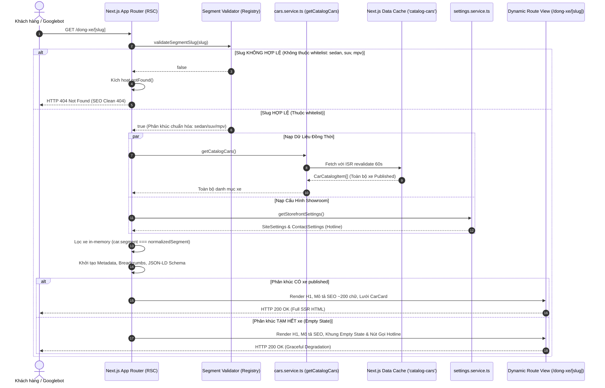
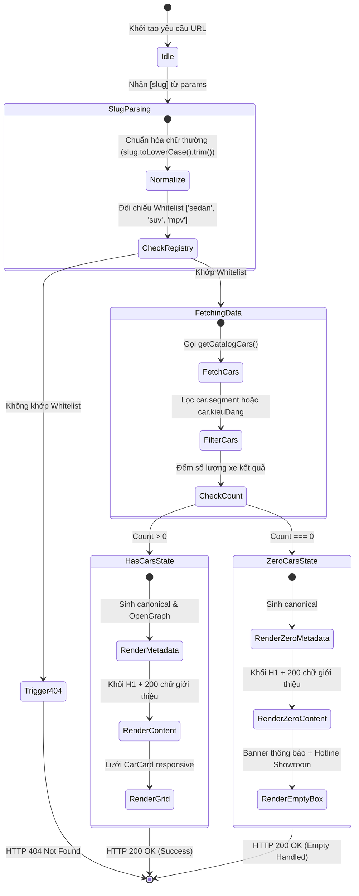
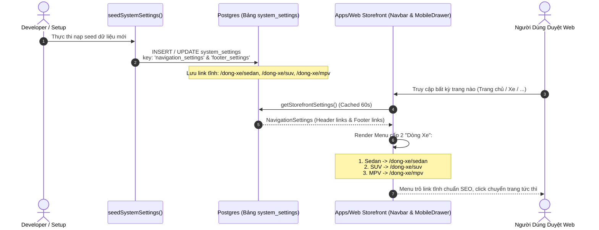

# 🔄 Đặc Tả Luồng Xử Lý Nghiệp Vụ (Logic Flow & State Machine)

> **Feature:** Cấu Trúc Routing Tĩnh & Kiến Trúc Menu (URL Architecture) — `ROUTING-URL-ARCHITECTURE`  
> **Skill Phụ Trách:** `@logic-flow-ba`  
> **Căn cứ:** [BACKLOG.md](file:///Users/nhatphan/Code/CarDealer/cardealer/docs/features/ROUTING-URL-ARCHITECTURE/BACKLOG.md), [SOLUTION_OPTIONS.md](file:///Users/nhatphan/Code/CarDealer/cardealer/docs/features/ROUTING-URL-ARCHITECTURE/SOLUTION_OPTIONS.md)  
> **Phạm vi đã chốt:** Nạp dữ liệu qua `getCatalogCars()` + In-Memory Filter; Bỏ qua 301 Redirect ở môi trường Dev Sandbox.

---

## 1. Sequence Diagram: Luồng Tải Trang Dynamic Route `/dong-xe/[slug]`

---

## 2. State Machine: Vòng Đời Phân Giải Slug & Trạng Thái Giao Diện

---

## 3. Sequence Diagram: Đồng Bộ Dữ Liệu Navigation & Footer Settings

---

## 4. Ma Trận Xử Lý Các Tình Huống Biên (Edge Cases & Resilience Matrix)

| STT | Tình huống biên (Edge Case) | Hành vi mong muốn (Expected Behavior) | Cơ chế kỹ thuật phòng vệ |
| :---: | :--- | :--- | :--- |
| **E-01** | Slug có ký tự hoa/thường: `/dong-xe/SUV` hoặc `/dong-xe/Sedan` | Tự động chuyển về chữ thường và nạp đúng dữ liệu phân khúc tương ứng. | Sử dụng `slug.toLowerCase()` trước khi validate và render canonical lowercase. |
| **E-02** | Slug rác hoặc injection: `/dong-xe/xe-dua`, `/dong-xe/123`, `/dong-xe/' OR 1=1` | Không truy vấn bừa bãi, ngắt luồng ngay và trả về trang 404 chuẩn SEO. | Whitelist cứng: `['sedan', 'suv', 'mpv']`. Nếu không khớp ➡️ gọi `notFound()` từ `next/navigation`. |
| **E-03** | Phân khúc chưa có xe published (ví dụ phân khúc MPV tạm hết xe) | Trang vẫn hiển thị tiêu đề `<h1>` và đoạn văn SEO E-E-A-T đầy đủ, hiển thị Empty State sang trọng kèm hotline tư vấn. | Không để trang bị trắng layout hay crash 500. Render Component `CatalogEmptyState`. |
| **E-04** | API Backend (`apps/api`) tạm thời timeout hoặc chập chờn | Server Component bắt lỗi bằng `try/catch`, render giao diện thông báo nhẹ nhàng với nút "Thử lại", không vỡ toàn bộ layout chính. | Bọc logic fetch trong block `try/catch` với fallback state an toàn. |
| **E-05** | Cache Settings cũ trong DB chưa được cập nhật | Settings mặc định trong code (`packages/types/src/settings.ts`) tự động làm fallback nếu DB trả về link cũ. | Schema Zod có `default()` chuẩn link tĩnh mới. |
