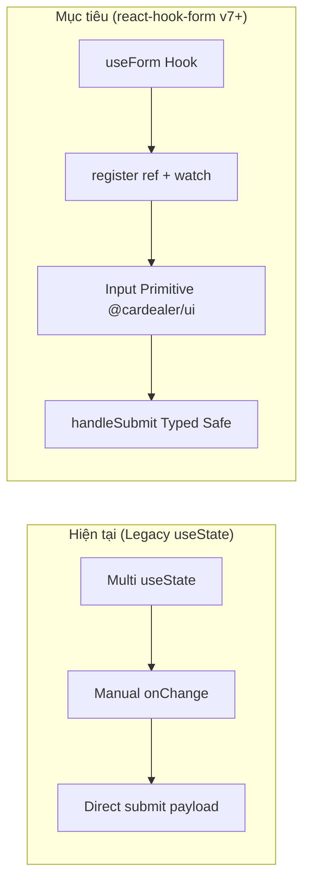

# 🎯 Feature Backlog: Chuẩn Hoá Toàn Bộ Form Hệ Thống Sang `react-hook-form`

## 1. Thông tin Tổng quan
* **Mục tiêu Chiến lược:** Tái cấu trúc và chuẩn hoá toàn bộ các form nhập liệu trong hệ thống Admin (`@cardealer/admin`) sang thư viện công nghiệp `react-hook-form`. Loại bỏ hoàn toàn các `useState` phân tán, tối ưu re-render performance, type-safety và quản lý validation rules đồng bộ qua UI Primitives (`@cardealer/ui`).
* **Phạm vi Nền tảng (Target Platform):** Frontend Web (`apps/admin`, kết nối UI Primitives tại `packages/ui`).
* **Cấp độ Thực thi (Execution Tier):** **Tier 2 (Medium-Risk / Sub-feature & Component Refactor)** — Chạy Phase 1 + Sub-Gate 2.1 (Backlog & Options) ➡️ Phase 4 (Code Execution & Dual Verification) ➡️ Phase 5 (Independent Review Gate 5).
* **Trạng thái Môi trường:** 🟢 Pure Development (Chưa lên Production, môi trường Dev Node 24).

---

## 2. Ma trận Trạng thái User Stories (Lifecycle Status Matrix)

| ID | User Story / Sub-Feature | Layer / Platform | Status | Current Gate | Impacted Files |
| :---: | :--- | :---: | :---: | :---: | :--- |
| **US-01** | Cài đặt package `react-hook-form` mới nhất tương thích Node 24 & React 19 vào `@cardealer/admin` | FE Infra | ✅ COMPLETED | Gate 4 Passed | `apps/admin/package.json` |
| **US-02** | Chuyển đổi [CarFormModal.tsx](file:///Users/nhatphan/Code/CarDealer/cardealer/apps/admin/app/cars/components/CarFormModal.tsx) sang `useForm<CarFormData>` kèm live currency formatting & auto-slug generator | FE Admin UI | ✅ COMPLETED | Gate 4 Passed | `apps/admin/app/cars/components/CarFormModal.tsx` |
| **US-03** | Chuyển đổi [ColorFormModal.tsx](file:///Users/nhatphan/Code/CarDealer/cardealer/apps/admin/app/colors/components/ColorFormModal.tsx) sang `useForm<ColorFormData>` kèm live color swatch preview | FE Admin UI | ✅ COMPLETED | Gate 4 Passed | `apps/admin/app/colors/components/ColorFormModal.tsx` |
| **US-04** | Chuyển đổi [login/page.tsx](file:///Users/nhatphan/Code/CarDealer/cardealer/apps/admin/app/login/page.tsx) sang `useForm<LoginFormData>` với email/password validations | FE Admin UI | ✅ COMPLETED | Gate 4 Passed | `apps/admin/app/login/page.tsx` |
| **US-05** | Chuyển đổi [settings/page.tsx](file:///Users/nhatphan/Code/CarDealer/cardealer/apps/admin/app/settings/page.tsx) gom 9+ fields đại lý vào `useForm<SettingsFormData>` | FE Admin UI | ✅ COMPLETED | Gate 4 Passed | `apps/admin/app/settings/page.tsx` |
| **US-06** | Kiểm chứng kiểm thử tự động TypeScript (`tsc --noEmit`) và đối soát UI Conformance Primitives | QA / Verification | ✅ COMPLETED | Gate 4 Passed | Toàn bộ các views trên |

---

## 3. Phân tích Khảo cổ & Ý đồ Nghiệp vụ (Codebase Archeology)
* **Tọa độ Module liên quan:**
  - `apps/admin/app/cars/components/CarFormModal.tsx`
  - `apps/admin/app/colors/components/ColorFormModal.tsx`
  - `apps/admin/app/login/page.tsx`
  - `apps/admin/app/settings/page.tsx`
  - `packages/ui/src/input.tsx` (Shared UI Primitive đã hỗ trợ `forwardRef`, `error`, `helperText`)
* **Sơ đồ Luồng Chuyển đổi Form State:**

* **Lưu ý & Điểm chốt Biên (Watch-outs):**
  1. `Input` component trong `@cardealer/ui` đã có `React.forwardRef<HTMLInputElement, InputProps>`, tương thích 100% với `{...register('fieldName')}` mà không cần bọc qua `Controller`.
  2. Các select dropdown và live swatch/preview sử dụng `watch()` hoặc `Controller` khi cần thiết.
  3. Giá tiền VNĐ hiển thị preview thời gian thực cần `watch('giaKhoiDiem')`.

---

## 4. Design Stack Kích hoạt cho Giai đoạn Tiếp Theo
* `system-analyst-architect` (Bắt buộc ở Bước 2.1: Xuất bản `SOLUTION_OPTIONS.md` tại Sub-Gate 2.1).
* `tailwind-ui-designer` (Bảo đảm Shared UI Primitives & Design Tokens Conformance).
